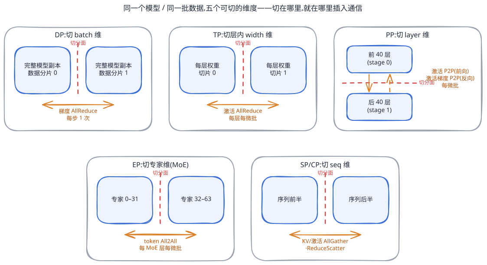
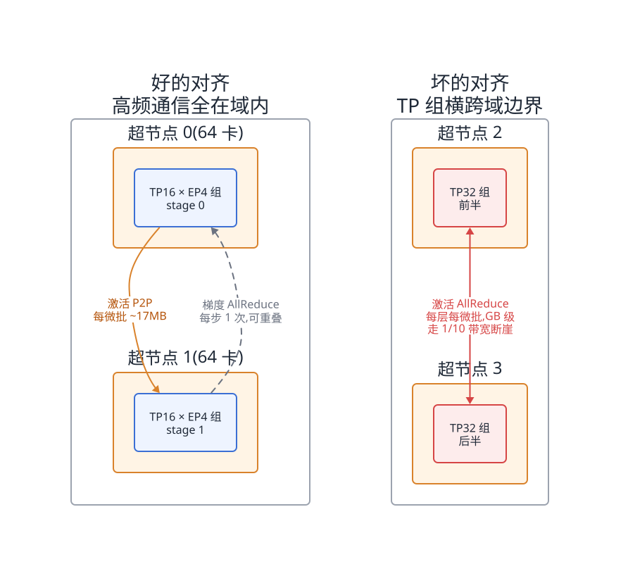
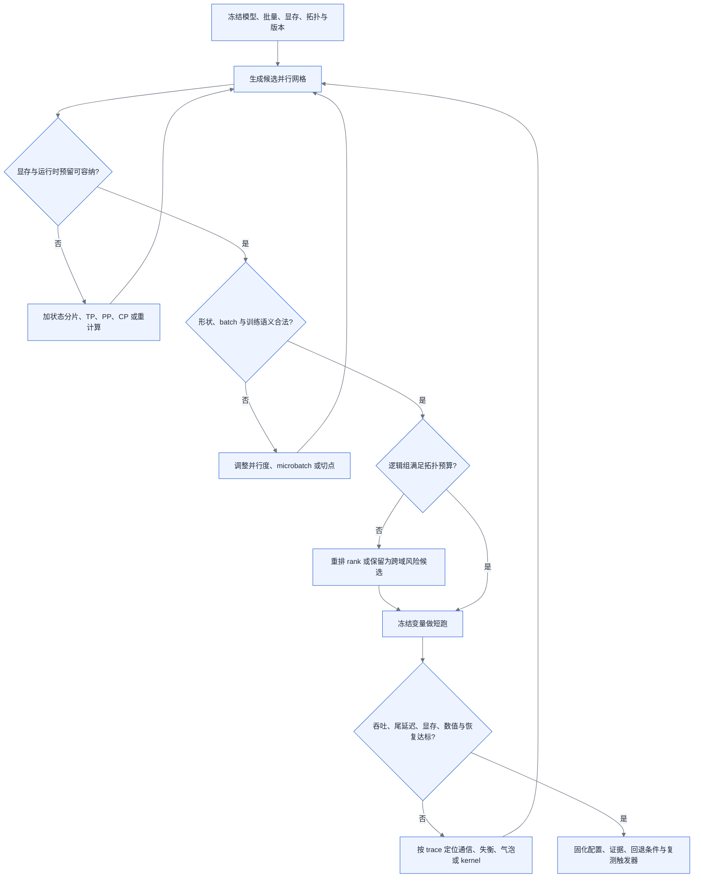

# 第 16 章 并行策略

<ChapterContext
  track="主线 A 的前向、反向与梯度同步"
  question="模型、批量和拓扑都已冻结时，怎样先排除不可行并行组合，再用端到端证据选择剩余方案？"
  upstream="第 6 章形状与资源账；第 7 章互联域；第 14 章分片状态保存；第 15 章训练执行过程"
  downstream="第 17 章显存机制；第 18 章训练运行时；第 20 章容错；第 29 章训练监控"
  inputs="模型结构、精度、序列与批量、每卡可规划显存、并行域拓扑、框架版本、collective trace、stage 时间线"
  outputs="候选并行网格、可行性过滤表、通信账、拓扑映射、短跑对照方案与回退条件"
/>

## 16.1 链路定位

并行策略决定模型状态和计算落在哪些 rank，也决定前向、反向和优化器步骤之间传什么、传几次、走哪一级链路。它不是模型名称对应的一组固定参数，而是“模型形状 × 批量语义 × 显存预算 × 软件实现 × 物理拓扑”的联合解。

本章的顺序是：冻结约束，生成候选，按容量与合法性过滤，映射到拓扑，最后短跑实测。DP、TP、PP、EP、SP/CP 只是可用切分轴，不是选型起点。

## 16.2 依赖声明

[§6.2](../第一部分-基础与心智模型/第06章-模型结构的定量分析.md#62-参数量与资源换算核心) 提供参数、激活与 FLOPs 的入口，[§7.4.2](../第一部分-基础与心智模型/第07章-互联与集合通信.md#742-集合通信原语四个动词与它们的通信量) 提供 collective 的通信量模型，[§14.4](../第三部分-数据底座/第14章-存储与Checkpoint-IO.md#144-原理与量化模型) 说明分片网格如何进入 checkpoint，[§17.4](./第17章-显存与训练侧精度机制.md#174-原理与量化模型) 处理状态分片、重计算与 offload。

框架能力是带版本的输入。PyTorch `DeviceMesh` 用 N 维数组表达设备布局，流水线包提供多种 schedule；Megatron Core 则把 TP、PP、CP、EP 与 DP 组合为并行网格。参见 [PyTorch DeviceMesh](https://docs.pytorch.org/docs/stable/distributed.html#devicemesh)、[PyTorch pipelining](https://docs.pytorch.org/docs/stable/distributed.pipelining.html) 与 [Megatron Core 并行策略指南](https://docs.nvidia.com/megatron-core/developer-guide/latest/user-guide/parallelism-guide.html)。本章只使用这些稳定概念，不把某一版本的参数名当作通用接口。

## 16.3 问题场景:同样 256 张卡,吞吐差三倍

<CaseMeta
  type="capacity-example"
  data-nature="卡数、模型规模和候选网格为合成输入；不包含真实吞吐、MFU 或厂商性能数据"
  scope="256 卡、每个高速互联域 8 卡的 70B 稠密模型候选筛选"
  assumptions="两组实验冻结模型提交、精度、序列分布、全局 batch、重计算与软件版本；只改变并行网格及 rank 放置"
  reproducible="visuals/data/ch16-feasible-region.csv；目标环境仍需采集 collective trace 与逐 stage 时间线"
/>

候选 A 使用 TP=16、PP=2、DP=8，候选 B 使用 TP=8、PP=4、DP=8。二者都使用 256 卡，也可能都通过静态显存检查，但在“高速域 8 卡”的假设下，A 的 TP 组必然跨域，B 可以让 TP 组完整落在域内。这个事实只能证明 A 触发了拓扑风险，不能直接推出“三倍吞吐差”或某个 MFU。

<EvidencePanel
  title="拓扑冲突是可检验假设，不是性能判决"
  conclusion="先验证 rank 映射和 TP collective 是否跨域；再冻结其他变量做 A/B 短跑，比较稳态 token/s、step-time 分位数、通信暴露时间、峰值显存与 loss。"
  source="capacity-example；§16.4.5"
>

- 已知：TP=16 超过单个 8 卡高速域，至少一个 TP 组跨域。
- 必须补采：实际进程组、消息大小与次数、链路路径、计算—通信重叠、各 stage 时长。
- 暂不能断言：跨域一定是唯一瓶颈，也不能从设备忙碌率反推出有效模型吞吐。

</EvidencePanel>

真正的教训是：同样的并行度在不同拓扑上不是同一个实验。配置文件必须与 rank 映射、互联域定义和性能证据一起版本化。

## 16.4 原理与量化模型

### 16.4.1 五种切分维度:同一个模型的五种切法

先写六类硬约束，再谈切法：

1. 容量：静态状态、激活、临时 buffer 与运行时预留之和不超过每卡可规划显存。
2. 形状：attention 头、KV 头、hidden/FFN 维、专家数、层数和序列分块满足目标 kernel 与框架的整除规则。
3. 批量：全局 batch、每 DP 副本 microbatch 数、梯度累积与 pipeline schedule 彼此一致。
4. 拓扑：每个进程组能映射到声明的高速域；跨域例外必须进入通信模型和短跑验证。
5. 语义：随机数、归一化、路由、loss scaling、参数共享与 optimizer 分组不因切分改变训练语义。
6. 运维：checkpoint 能保存和重映射该网格，失败后的 spare、重启与缩扩容路径明确。

通过这些门禁后，切分轴才有意义：DP 切 batch；TP 切层内张量；PP 切层；EP 切专家；狭义 SP 切 TP 组内特定激活，CP 切整个序列上下文。切开的位置决定必须恢复的数据依赖，但 collective 类型和次数由具体图变换决定。

<!-- source: diagrams/sources/ch16-parallelism-cuts.excalidraw -->

图 16-1:切分轴决定依赖边界；图中通信原语是常见实现示意，最终以目标框架生成的进程组和 trace 为准。

### 16.4.2 通信量与显存收益:每种策略的账

通信核算分三层，不能混算：payload 字节是数据量；`α + bytes / B` 是单次链路模型；step time 是调度、竞争和重叠后的端到端观测。

对于一个大小为 `G` 字节、`d` 个 rank 的 ring AllReduce，每 rank 收发 payload 近似为：

> `V_ring ≈ 2 × (d - 1) / d × G`

它是特定算法的字节账，不是耗时。DP 若在每步对未分片梯度做一次 ring AllReduce，可以把 `G` 代入；bucket 化、ReduceScatter/AllGather、分层 collective 和状态分片都会改变事件序列。

其他轴统一按 trace 清单求和：

> `V_axis = Σ_j count_j × payload_j × algorithm_factor_j`

其中 `j` 是计算图里的一个通信边界。TP 记录每个张量变换产生的 AllReduce、ReduceScatter 或 AllGather；PP 记录每个 microbatch 穿越 stage 边界的激活与梯度；EP 记录实际 routed token（含 top-k 复制、padding 或变长元数据）的 dispatch/combine；CP 记录 attention 所需 KV 交换；SP 则记录目标实现对复制激活的分片与恢复。不要预先假定“每层固定四次”或“总字节一定不变”。

<BookFigure
  id="ch16-parallelism-evidence-matrix"
  src="../visuals/generated/ch16/parallelism-evidence-matrix.svg"
  alt="DP、TP、PP、EP 与 CP 五种并行轴分别列出切分对象、主要通信载荷、发生频率和必须采集的放置证据"
  title="图 16-2  并行轴的通信账必须落到可观测事件"
  caption="公式负责预估 payload，目标图和 trace 负责确认次数、算法、并发与关键路径。"
  source="编辑矩阵；visuals/data/ch16-parallelism-evidence-matrix.csv"
  license="CC BY 4.0"
  width="wide"
/>

显存收益也不能只写“除以并行度”。权重、梯度、optimizer state、保存激活、临时聚合 buffer 分栏计算；某一轴只缩减其实际分片的对象。比如 EP 缩减本 rank 持有的专家参数，但共享参数仍按其 DP 组同步；CP 可缩减部分序列激活，却不自动分片权重。计算方法接 [§17.4.1](./第17章-显存与训练侧精度机制.md#1741-显存账本先算清楚再谈优化)。

### 16.4.3 流水线气泡:量化与调度算法

对 `p` 个等时 stage、`m` 个 microbatch、忽略通信与调度开销的 GPipe 式全前向—全反向时间线，气泡占比为：

> `bubble_ideal = (p - 1) / (m + p - 1)`

这是理想平衡模型，不是所有 schedule 的精确公式。1F1B 改变激活驻留与执行顺序，interleaved schedule 又加入虚拟 stage 和更多 P2P；不等长 stage、embedding/loss、共享参数和跨域边界会让实测曲线高于理想线。Megatron Core 的 pipeline 包明确区分非交错和交错 schedule，见 [官方 API](https://docs.nvidia.com/megatron-core/developer-guide/latest/api-guide/core/pipeline_parallel.html)。

<BookFigure
  id="ch16-pipeline-bubble"
  src="../visuals/generated/ch16/pipeline-bubble.svg"
  alt="四个等时流水线 stage 下，理想气泡率随 microbatch 从一增至三十二而下降，旁边列出实际测量还需加入的失衡和通信项"
  title="图 16-3  增加 microbatch 只会压低理想灌入排空气泡"
  caption="该曲线采用 p=4 的理想 GPipe 假设；生产选型使用逐 stage 时间线和目标 schedule 的稳态测量。"
  source="公式生成；visuals/data/ch16-pipeline-bubble.csv"
  license="CC BY 4.0"
  width="wide"
/>

工程上先用理想式排除明显不合适的 `(p,m)`，再测三个量：最长 stage 的计算时间、每个 P2P 边界的暴露时间、各 stage 在一次 step 内的空闲比例。若增加 `m` 后气泡不再下降，瓶颈通常已经转为 stage 失衡、显存、通信或调度开销。

### 16.4.4 组合与搜索空间:先切什么、后切什么

候选可写成 `(t,p,d,e,c,m,b)`，但总卡数关系必须服从目标框架的 mesh 定义；EP 有时从数据并行子域派生，不能无条件套用 `N=t×p×d×e×c`。搜索程序应直接调用框架的合法性检查或复现其进程组规则。

建议的过滤顺序是：

1. 用模型状态和单 microbatch 峰值过滤 OOM 组合。
2. 用结构与 kernel 规则过滤不可整除组合。
3. 用全局 batch 等式过滤训练语义不一致组合。
4. 用 rank 映射过滤不符合拓扑预算的组合。
5. 对剩余组合做短跑，记录 p50/p95 step time、有效 token/s、峰值显存、通信暴露时间和数值一致性。

<BookFigure
  id="ch16-feasible-region"
  src="../visuals/generated/ch16/feasible-region.svg"
  alt="四个合成并行候选依次通过显存、整除、批量和拓扑门禁，只有通过全部门禁者进入短跑测量，失败项显示其最早淘汰原因"
  title="图 16-4  可行域先过滤，性能排序后实测"
  caption="门禁字段可机械验证；归一化 step time 仅是工作表占位，不能充当任何平台基准。"
  source="合成容量示例；visuals/data/ch16-feasible-region.csv"
  license="CC BY 4.0"
  width="wide"
/>

端到端时间不应由若干“理论效率”相乘得到。可用于初筛的形式是：

> `T_step = schedule(compute_stage_i, communication_event_j, overlap, contention)`

其中 `schedule()` 必须保留事件依赖和最长 stage；短跑则用真实 `T_step` 替换模型。MFU 是结果指标，不应再次乘进同一个 step-time 推导。

### 16.4.5 超节点如何改写并行选型【本章重点】

先把物理拓扑定义成可验证的域：域内 rank 集合、可用路径、单向/双向带宽、延迟、并发 collective 争用和故障边界。然后把每个逻辑进程组映射到物理域。

<!-- source: diagrams/sources/ch16-domain-alignment.excalidraw -->

图 16-5:高频、细粒度通信组优先落在高速域内，低频或可重叠的组再向外扩展；这是候选排序规则，不是永远禁止跨域的铁律。

TP、EP、CP 通常比 PP 边界更频繁，因而更需要靠近；但消息大小、collective 算法、计算粒度与重叠共同决定关键路径。若容量迫使 TP 跨域，可以保留该候选，但必须显式记录跨域字节、短消息次数和暴露时间，并与“增大 PP、状态分片或重计算”的候选做受控对照。

超节点扩大了高速域，也可能扩大共同失效范围。并行映射需同时输出 checkpoint 分片、spare 粒度和重启范围，不能只优化无故障吞吐。

### 16.4.6 变长与异构负载下的并行

序列 padding 浪费可直接从一个 batch 的真实长度计算：

> `padding_fraction = 1 - Σ length_i / (batch_size × max_length)`

它没有跨数据集通用的百分比。长度分桶与 packing 能减少浪费，但 packing 必须验证 attention mask、位置编码、样本边界、loss 归一化与数据恢复语义；动态形状还可能改变编译缓存和 kernel 选择。

MoE 的 EP 负载以最忙 rank 决定。记录每专家 token 数、dispatch/combine 字节、capacity/padding、丢弃或 dropless 策略以及分位时延，不能用平均 token 数代替 makespan。Megatron Core 对 CP 的说明也表明 attention 需要跨序列分块交换 KV，具体可用 P2P、AllGather 或其他实现，见 [Context Parallel 官方说明](https://docs.nvidia.com/megatron-core/developer-guide/latest/user-guide/features/context_parallel.html)。

多模态模型应按 trace 寻找视觉编码、投影、语言主干和 loss 中的最长段，再决定是否拆 stage 或复制子模块；“某模态天然做 DP”不是通用规则。

### 16.4.7 并行原语在各框架中的映射

框架比较采用版本化清单，不做永久排名：

| 检查面 | 需要冻结 | 验收证据 |
|---|---|---|
| 网格 | 框架/插件版本、mesh 维名、rank 顺序 | 每 rank 的坐标与进程组清单 |
| 图变换 | TP/SP/CP/EP plan、参数共享规则 | 分片后参数形状、forward/backward collective trace |
| 流水线 | stage 切点、schedule、microbatch | 逐 stage 时间线、激活峰值、数值对照 |
| 状态 | optimizer 分组、state dict API | 保存、重映射恢复、续训 loss |
| 编译与 kernel | 精度、shape bucket、融合开关 | 编译缓存、fallback、kernel 与端到端短跑 |

PyTorch 的 `DeviceMesh`/DTensor 适合表达 N 维布局和 placement，pipelining 包负责 stage 与 schedule；Megatron Core 提供集成的 TP/PP/CP/EP/DP 组合。两者都仍需目标模型代码、目标版本和目标拓扑验证，API 名称相似不代表通信图等价。

### 16.4.8 完整选型算例

沿用 §16.3 的 256 卡容量示例，工作表按以下顺序填写：

1. 冻结 70B 模型提交、精度、序列长度分布、全局 batch、8 卡高速域、软件版本和每卡可规划显存。
2. 生成 TP/PP/DP 候选；本例至少保留 TP8/PP4/DP8 与 TP16/PP2/DP8，不预判胜者。
3. 逐项验证显存、头数/hidden/层数整除、batch 等式和 rank 映射。TP16 跨域被标为“拓扑风险”，而不是自动判死刑。
4. 对存活组合运行相同 warm-up 与稳态窗口，采集 token/s、p50/p95 step、峰值显存、每类 collective 暴露时间、stage 空闲率与 loss。
5. 用多次重复的置信区间排序；若差异小于噪声，优先选择恢复路径更简单、版本支持更稳定的组合。

该算例不从峰值带宽推导精确 MFU，也不把 kernel 效率、气泡和通信比例直接相乘，因为这些量可能重叠或共享分母。容量模型负责缩小实验空间，性能结论由受控短跑给出。

## 16.5 方案对比与失效边界

| 候选方向 | 主要解决的问题 | 首要代价 | 失效信号 | 下一候选 |
|---|---|---|---|---|
| DP / 状态分片主导 | 模型计算图可在单 rank 执行，需扩 batch 或分状态 | 梯度/参数通信、全局 batch 约束 | 大 bucket 暴露、batch 超预算 | 加 TP/PP 或调整分片策略 |
| 域内 TP + DP | 单层张量或激活过大 | 每层通信、形状整除 | TP 通信上关键路径、kernel 变碎 | 降 TP，加 PP/CP/重计算 |
| PP + TP + DP | 深模型状态需分 stage | 气泡、stage 失衡、P2P | 某 stage 长尾或空闲率高 | 重切层、换 schedule 或减 PP |
| EP 组合 | 专家参数和专家计算需分布 | AllToAll 与路由倾斜 | 最忙专家持续决定 makespan | 调路由/容量、重映射 EP 组 |
| CP 组合 | 长序列激活或 attention 不可容纳 | KV 交换、mask 与负载均衡 | CP 通信暴露或 rank 计算失衡 | 调 CP、重计算、序列分桶 |

任何方案在以下条件变化后都需重新搜索：模型结构、序列分布、全局 batch、卡型/显存、互联域、框架或 collective 版本、checkpoint 恢复目标。并行参数不是一次生成后永久复用的资产。

## 16.6 大数据对照

可迁移的是“先分区约束、再执行计划、最后以运行统计修正成本模型”的方法。不可直接迁移的是失衡代价：批处理 shuffle 的慢分区常影响一个 stage，而同步训练中的一个慢 rank 可能延长所有 rank 的 step。

数据倾斜诊断可迁移为专家 token、序列长度与 stage 时间的分布；数据本地性可迁移为逻辑进程组与物理互联域的对齐；查询计划回归可迁移为版本升级前后的并行短跑基线。但训练还必须增加数值一致性、显存峰值、collective 顺序与 checkpoint 重映射验证。

## 16.7 选型决策树

图 16-6:并行选型从可机械验证的门禁进入短跑，再按 trace 回到候选空间，而不是从模型规模直接查一组固定并行度。

<ChapterDeliverables :items="[
  '一份带模型、批量、显存、拓扑和软件版本的约束清单',
  '一张逐候选记录显存、整除、batch、拓扑与拒绝原因的可行域表',
  '一份由计算图或 trace 生成的 collective 事件账，而非固定次数口诀',
  '一组冻结变量的短跑结果：token/s、step 分位数、峰值显存、通信暴露、stage 空闲与 loss',
  '一份生产配置包：rank 映射、checkpoint/restore 证据、回退条件和复测触发器'
]" />
