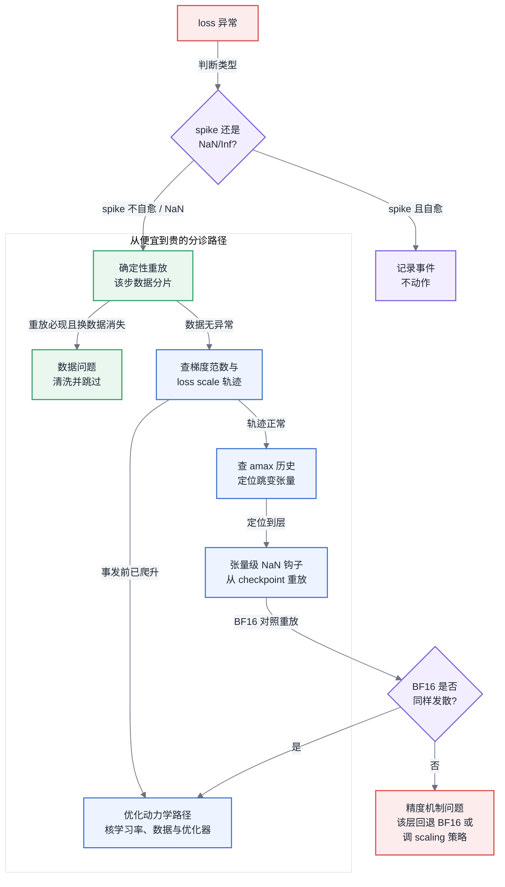
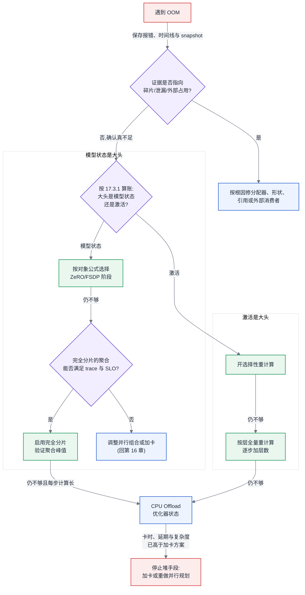

# 第 17 章 显存与训练侧精度机制

<ChapterContext
  track="主线 A 的前向、反向、梯度同步与优化器更新"
  question="训练 OOM 或数值发散时，如何先用证据定位对象，再选择分片、重计算、offload 或精度回退？"
  upstream="第 5 章分配器与 profiling；第 6 章显存账本；第 16 章并行组合"
  downstream="第 18 章运行时实现；第 20 章稳定性；第 29 章训练监控"
  inputs="allocated/reserved 时间线、分配器快照、模型状态账、激活估算、梯度范数与 amax/scaling 轨迹"
  outputs="OOM 根因记录、显存手段收益代价表、数值异常重放证据与止损条件"
/>

## 17.1 先把 OOM 与 NaN 分成两张证据单

模型能否装进给定的卡是容量问题，低精度训练能否稳定推进是数值问题。两者都会让任务失败，却使用不同证据：OOM 看显存时间线、分配器状态和发生阶段；NaN/Inf 看数据重放、梯度轨迹、amax/scaling 与首个异常张量。没有证据就叠加优化开关，会同时改变显存布局、通信和数值路径，使根因更难复现。

本章建立在三条前置结论之上:[§3.1](../第一部分-基础与心智模型/第03章-人工智能与大模型基础.md#31-神经网络与训练三阶段) 已经说明反向传播为什么必须保留前向的激活值(这是激活值显存的来源,也是重计算能省显存的原因);[§3.2](../第一部分-基础与心智模型/第03章-人工智能与大模型基础.md#32-优化器与超参的-infra-含义) 已经给出优化器状态的每参数字节数账本(这是 ZeRO 分片的对象);[§4.3](../第一部分-基础与心智模型/第04章-硬件第一性原理、架构范式与数值精度.md#43-数值格式与精度全书唯一定义处) 已经定义了数值格式谱系与精度记法。本章不重述这三者,只在它们之上回答两个训练侧的问题:**显存不够时按什么顺序上什么手段、各付出多少吞吐代价;低精度训练出了数值问题时按什么顺序排查**。

## 17.2 第 3000 步只留下一个 NaN

<CaseMeta
  type="synthetic-case"
  data-nature="步数、模型规模、loss、MFU 与梯度范数均为构造诊断缺口的合成数据，不代表生产事故或 FP8 基准"
  scope="32B 稠密模型、128 卡、FP8 混合精度预训练的数值异常分诊"
  assumptions="checkpoint 位于第 2800 步；数据可按 step 重放，但事故前未记录张量级 amax/scaling 与首个 NaN"
  reproducible="本节为证据清单示例；诊断顺序见 §17.3.7"
/>

合成任务在前 2999 步记录到有限 loss；第 3000 步变为 NaN，任务仍继续运行。最近 checkpoint 在第 2800 步，但日志没有保存该步的数据分片标识、amax/scaling 历史或首个异常张量。此时既不能断言是 FP8 溢出，也不能归因到数据或硬件；直接全量回退 BF16 只改变了执行路径，没有形成根因证据。

<EvidencePanel
  title="现有证据不足以定责"
  conclusion="先从 checkpoint 固定数据与配置重放，补采梯度范数、amax/scaling 和首个异常张量；BF16 对照只能区分是否与低精度路径相关，不能直接映射组织责任。"
  source="synthetic-case；§17.3.7"
>

- 已知：第 3000 步开始输出 NaN，最近 checkpoint 为第 2800 步。
- 缺失：事发 batch 标识、各层 amax/scaling、首个 Inf/NaN、各 rank 一致性。
- 暂不能排除：数据异常、优化动力学、低精度 scaling、并行/算子错误或硬件异常。

</EvidencePanel>

## 17.3 原理与量化模型

### 17.3.1 显存账本:先算清楚,再谈优化

所有显存优化手段针对的都是 [§6.2](../第一部分-基础与心智模型/第06章-模型结构的定量分析.md#62-参数量与资源换算核心) 显存三分中的前两块:**模型状态**(参数 + 梯度 + 优化器状态)和**激活值**。用 N 表示模型总参数量、n 表示数据并行度(与第 2 章符号表一致),按 [§3.2](../第一部分-基础与心智模型/第03章-人工智能与大模型基础.md#32-优化器与超参的-infra-含义) 的账本,BF16 混合精度 + Adam 下模型状态为每参数 16 字节:

$$M_{\text{模型状态}} = \underbrace{2N}_{\text{BF16 参数}} + \underbrace{2N}_{\text{BF16 梯度}} + \underbrace{12N}_{\text{FP32 master 权重 + 动量 + 方差}}$$

激活值显存与参数无关,与 batch、序列长度、隐层维度成正比。对标准 Transformer,每层激活值约为(s 为序列长度,b 为 micro batch,h 为隐层维度,a 为注意力头数):

$$M_{\text{激活/层}} \approx s \cdot b \cdot h \cdot \left(34 + 5\frac{a \cdot s}{h}\right) \text{ 字节}$$

括号里第二项来自注意力分数矩阵,随序列长度平方增长——这就是长序列训练中激活值反超模型状态成为显存大头的原因。**任何显存优化决策的第一步都是把这两块分别算出来**:如果大头是模型状态,该上 ZeRO;如果大头是激活值,该上重计算;算都不算就堆手段,是本章要反对的第一件事。

### 17.3.2 ZeRO 三阶段:分片的对象决定代价

ZeRO(Zero Redundancy Optimizer)的核心观察是:数据并行的 n 个副本中,模型状态是完全冗余的。三个阶段按分片对象递进,n 为数据并行度:

| 阶段 | 分片对象 | 每卡模型状态 | 理想通信变化 | 必须实测的边界 |
|---|---|---|---|---|
| ZeRO-1 | 优化器状态(12N) | 4N + 12N/n | reduce-scatter + all-gather 可替代 all-reduce，payload 同量级 | 优化器更新、通信实现与重叠 |
| ZeRO-2 | + 梯度(2N) | 2N + 14N/n | payload 同量级，改变梯度释放与更新时机 | bucket、峰值临时缓冲与重叠 |
| ZeRO-3 | + 参数(2N) | 16N/n | 前向与反向按模块 all-gather 参数，反向 reduce-scatter 梯度 | wrap 粒度、预取、拓扑、micro-batch 调度 |

> 延伸阅图:Rajbhandari et al., "ZeRO: Memory Optimizations Toward Training Trillion Parameter Models"(arXiv:[1910.02054](https://arxiv.org/abs/1910.02054))图 1 —— 三阶段显存分区原图,按参数/梯度/优化器状态三色标出每个阶段各卡实际持有的分片,上表"每卡模型状态"一列的三个公式就是对该图逐块相加的结果。

<BookFigure
  id="ch17-zero-state-sharding"
  src="../visuals/generated/ch17/zero-state-sharding.svg"
  alt="在数据并行度八下，DDP、ZeRO-1、ZeRO-2 和 ZeRO-3 逐步分片优化器状态、梯度和权重，单卡每参数静态字节数依次下降"
  title="图 17-1  ZeRO 阶段按对象消除静态冗余"
  caption="ZeRO 阶段只改变静态状态的冗余，激活、临时聚合峰值和运行时余量仍需单独计算。"
  source="容量示例；visuals/data/ch17-zero-state-sharding.csv"
  license="CC BY 4.0"
  width="wide"
/>

图中的 DP=8 只是把公式落到同一尺度。它先作用于 TP/PP 已切好的本地参数；换数据并行度时，重新计算分母即可。

三条工程结论:

1. **ZeRO-1 先消除最大的冗余项。** 在理想 payload 口径下，它用 reduce-scatter 与 all-gather 重排原有 all-reduce；实际吞吐仍受 bucket、优化器实现和重叠影响。n=64 的容量示例中，32B 模型的优化器状态从每副本 384 GB 降为每卡 6 GB，但这只是未叠加 TP/PP 前的静态账。
2. **ZeRO-2 再分梯度。** 它的新增容量收益最多是本地梯度项 $2N(1-1/n)$ ，是否值得作为默认配置取决于梯度峰值、通信缓冲和框架的释放时机，而不是只看总 payload。
3. **ZeRO-3 开始改变参数生命周期。** 参数在模块执行前聚合、执行后按策略重新分片，因此峰值显存还受 wrap 粒度、预取窗口与 `limit_all_gathers` 一类速率控制影响。通信能否隐藏必须在目标拓扑和目标 micro-batch 下量测。

"1.5 倍"这个系数值得拆开算一遍。以每卡通信的数据元素量、按参数量 N 归一:

| 方案 | 梯度归约 | 参数 all-gather(前向) | 参数 all-gather(反向) | 每步通信量系数 |
|---|---|---|---|---|
| 朴素数据并行 | all-reduce ≈ 2N | 无 | 无 | 2N |
| ZeRO-1/2 | reduce-scatter N,更新后参数 all-gather N | 无 | 无 | 2N |
| ZeRO-3 | reduce-scatter N | N | N | 3N |

在忽略集合通信系数、bucket 与重叠的 payload 模型里，朴素 all-reduce 可拆成 reduce-scatter 与 all-gather，各记约 N；ZeRO-1/2 仍约为 2N。若 ZeRO-3/FSDP 在前向后重新分片，反向需要再次聚合参数，简化 payload 约为 3N，即朴素方案的 1.5 倍。这个系数适合做预算初筛，不是墙钟时间倍率；真实时间取决于通信次数、模块粒度和计算重叠。

**与其他并行组合时,先分清分片对象的归属**。ZeRO/FSDP 沿数据并行维分片，TP 沿张量内部维切参数，两者可作用在正交维度。PP 已经把参数按层切成 stage，完全分片仍可继续作用于各 stage 内的数据并行副本；它们不是机制互斥。关键约束是运行时能否共同管理 stage、参数聚合与 micro-batch 调度，以及多次执行是否放大 all-gather 次数。PyTorch 的 pipeline 文档明确把 FSDP 列为可组合技术，同时也指出权重 all-gather 可能难以被计算隐藏；因此 PP+完全分片应由 trace 验证，而不是被一条禁配规则提前排除（[PyTorch Pipeline Parallelism](https://docs.pytorch.org/docs/stable/distributed.pipelining.html)）。

ZeRO 阶段不是等级越高越好。先用本地参数量和 DP 度数计算静态收益，再把聚合次数、wrap 粒度和目标链路带宽放进 trace；平台默认值也应来自经过验证的任务模板，而不是跨模型统一指定。

### 17.3.3 激活重计算:用算力换显存的三档粒度

[§3.1](../第一部分-基础与心智模型/第03章-人工智能与大模型基础.md#31-神经网络与训练三阶段) 已经说明激活值必须保留到反向传播使用。重计算(activation recomputation / checkpointing)的思路是:前向时只存一部分"检查点"激活,反向时从最近的检查点重新算出中间激活。粒度从粗到细三档:

| 粒度 | 激活显存变化 | 额外计算 | 机制 |
|---|---|---|---|
| 全量重计算(full) | 接近公式三的完全重计算档，具体取决于边界张量 | 理论上最多重跑一次前向，训练 FLOPs 系数可由 6 推向 8 | 每层边界存检查点，反向时恢复中间激活 |
| 选择性重计算(selective) | 只删除被选中的高字节/低重算成本张量 | 由被选算子的 FLOPs 决定 | 优先重算归约、逐元素与未融合的注意力中间量 |
| 按层重计算(per-layer) | 随覆盖层数和层形状变化 | 随覆盖层的前向 FLOPs 变化 | 只对指定层使用完全或选择性策略 |

<BookFigure
  id="ch17-recompute-exchange"
  src="../visuals/generated/ch17/recompute-exchange.svg"
  alt="不重计算、选择性重计算和完全重计算三个示意点沿着计算量增加、激活显存下降的方向排列"
  title="图 17-2  重计算沿曲线交换激活显存与计算量"
  caption="重计算的交换方向稳定，具体落点取决于算子、序列形状和框架实现，必须通过目标任务实测。"
  source="归一化容量示例；visuals/data/ch17-recompute-exchange.csv"
  license="CC BY 4.0"
  width="wide"
/>

选择性重计算要比较两个独立维度：输出激活字节数与重算 FLOPs。优先丢弃“字节多、重算相对便宜”的中间量，再逐层扩大覆盖；若目标算子已经通过融合避免物化该中间量，重复配置不会得到同样收益。完全重计算的理论上限可由第 6 章的 $6N$ 拆解得到：额外重跑一次 $2N$ 前向时，训练计算系数由 6 增至 8；墙钟吞吐变化还受通信和 I/O 占比影响，不能直接写成固定 33%。

对象可以按“该算子输出激活字节数 ÷ 重算 FLOPs”排序，但名单会随融合、注意力实现和编译图变化。未融合的 softmax、归一化和逐元素激活常处于高比值一侧；大矩阵乘输出通常重算更贵。最终选择应以目标图的 saved-tensor 清单和单步 profile 为准，不能沿用另一套框架的固定白名单。

FlashAttention 类实现会改变重计算基线：分块前向不物化完整的 $s\times s$ 分数矩阵，反向再恢复必要的局部统计。此时框架层选择性重计算不能再次省掉同一份完整矩阵，剩余收益来自其他 saved tensors。评估前应先确认实际 attention kernel、编译融合与 saved-tensor 列表，否则会重复计算一项已经由算子消除的显存。

### 17.3.4 Offload:救命稻草与自欺欺人的分界线

CPU/NVMe Offload 把优化器状态(或参数、激活)放到主机内存或 NVMe 盘上,优化器更新时再搬回来或直接在 CPU 上算。它的收益边界可以用一个比值判断:

<CaseMeta
  type="capacity-example"
  data-nature="32B、64 路分片、25 GB/s 链路和 3 秒 step 均为演示 F21 的可替换输入，不代表具体设备基准"
  scope="优化器状态 CPU offload 与参数逐层预取的纸面初筛"
  assumptions="忽略 NUMA、协议、并发流量和预取实现；有效带宽必须由目标节点实测"
  reproducible="附录 B F21；本节公式与内联输入"
/>

$$R = \frac{\text{每步需要搬运的字节数} \div \text{PCIe 有效带宽}}{\text{每步纯计算时间}}$$

$R$ 远小于 1 时，搬运有机会被计算隐藏；接近或超过 1 时，链路等待进入关键路径。容量示例取有效带宽 25 GB/s：32B 模型的 384 GB 优化器状态经 64 路理想分片后为 6 GB/卡，单向搬运约 0.24 秒；若纯计算段为 3 秒，则单向 $R\approx0.08$ ，若每步需要往返则约 0.16。纯计算段只有 0.5 秒时，同一搬运已与计算同量级。NVMe 路径使用相同公式，只需替换为实测有效带宽和真实读写次数。

上面的 R 是整步口径，适合先判断每 optimizer step 访问一次的状态。实际实现可能在 CPU 上更新、传输梯度或参数分片，也可能引入多次搬运，因此分子必须从 trace 统计，不能固定写成 $12N/n$ 。参数 offload 则需要逐层预取，判断式变为：

$$\frac{\text{单层参数字节数}}{\text{PCIe 有效带宽}} \le \text{单层计算时间}$$

沿用容量输入，若模型约 60 层、每层约 0.5B 参数，BF16 参数约 1 GB；25 GB/s 下理想预取时间约 40 ms。只有目标层计算时间、预取深度和可用缓冲能覆盖这段传输时，参数 offload 才可能不暴露等待。这里不能代填“通常几毫秒”得出普遍结论，应直接在 timeline 上检查预取是否晚于消费点。

offload 的决策记录至少写清搬运对象、每步访问次数、有效带宽、可重叠窗口和 host/NVMe 容量。对象访问越频繁、计算窗口越短，越难隐藏传输；“任务能启动”与“吞吐可接受”必须分别验收。

### 17.3.5 混合精度机制:master weights 与 scaling 的层次

混合精度训练(mixed precision training)的机制核心不是"用了低精度格式",而是**三个精度层次的分工**(格式本身见 [§4.3](../第一部分-基础与心智模型/第04章-硬件第一性原理、架构范式与数值精度.md#43-数值格式与精度全书唯一定义处)):

1. **计算用低精度**:矩阵乘的输入输出用 BF16/FP16/FP8,吃满硬件的低精度算力。
2. **累加用高精度**:矩阵乘内部的累加器用 FP32,梯度的跨卡归约通常用 FP32 或 BF16——低精度累加大量小数会系统性地丢失尾部。
3. **权重更新用高精度**:保留一份 FP32 的 master weights。原因是可计算的:学习率 $10^{-4}$ 乘以量级 $10^{-1}$ 的梯度,更新量在 $10^{-5}$ 量级,而 BF16 尾数只有 7 位、在 1.0 附近的分辨率约 0.008——更新量远小于分辨率,直接在 BF16 权重上累加等于没更新。关键在于这个丢失是**逐步累积的**:浮点加法在更新量小于分辨率一半时会把结果舍回原值,权重原地不动,下一步的小更新又被同样吞掉——数千步的更新不是"各损失一点",而是**全部**丢失,训练表现为 loss 提前平台化。这不是欠拟合,是舍入误差在系统性地吃掉更新;而它最阴险的地方是没有任何报错,只有收敛曲线不对劲。master weights 用 FP32 的 23 位尾数(分辨率约 $10^{-7}$)承接累加,就是为了让 $10^{-5}$ 量级的更新能被逐步积攒起来,每步再把 FP32 权重舍到 BF16 用于计算——舍入只发生在"读"的一侧,不发生在"累积"的一侧。

**Loss scaling** 主要用于缓解 FP16 的小梯度下溢：先放大 loss 与梯度，更新前再缩回。常见动态策略在发现 Inf/NaN 时跳过更新并降低因子，在连续有限步后再尝试提高；具体窗口与倍率属于框架配置。BF16 与 FP32 具有相同指数位宽，动态范围远大于 FP16，因此常规训练通常不需要 loss scaling，但仍可能遇到极小值下溢、溢出或其他舍入问题，不能把“无需 scaling”写成“不会下溢”。

**Scaling 的粒度谱系**:loss scaling 使用全局因子；per-tensor scaling 为每个张量维护因子；per-block scaling 再细分到张量内部的小块。粒度变细通常能更贴近局部分布，但会增加 scaling 元数据、统计与算子支持要求。采用 current、delayed 还是块级策略，要以目标硬件和训练库实际支持为边界。

### 17.3.6 亚 8 比特训练的工程门槛:FP8 与更低

FP8 可能提高受支持矩阵乘的峰值吞吐，但端到端收益还受非矩阵算子、通信、scaling 和数据搬运占比限制。它不是一次 dtype 替换，而是一组需要共同验证的工程条件。本节以 FP8 为主展开——它是当前工程化最成熟的一档——但下述门槛对整个**亚 8 比特谱系**(FP8、FP4、MX 系块缩放格式,谱系定义见 [§4.3](../第一部分-基础与心智模型/第04章-硬件第一性原理、架构范式与数值精度.md#43-数值格式与精度全书唯一定义处))同样成立,且位宽越低、每一条都更苛刻。

**候选低精度区域**:Transformer 层内受目标硬件与训练库支持的大矩阵乘，例如 QKV、注意力输出与 FFN 投影。先用 profile 确认它们的时间占比，才能估计端到端上限。

**哪些必须留高精度**:

- Embedding 与输出 LM head:词表维度的动态范围大,且输出 logits 的精度直接影响 loss 的数值质量;
- LayerNorm/RMSNorm、softmax、残差连接:归约与指数运算对精度敏感,FLOPs 占比又低,降了没收益只有风险;
- 梯度的跨卡归约与累加:BF16 或 FP32;
- master weights 与优化器状态:FP32([§3.2](../第一部分-基础与心智模型/第03章-人工智能与大模型基础.md#32-优化器与超参的-infra-含义) 账本不变——**FP8 省的是激活和计算,不省优化器状态**,这是常见的显存预期误判);
- 对首尾层或异常层做 BF16 回退是可验证的候选策略，不应预设固定层数；依据是该层的 amax、溢出计数与 BF16 对照结果。

**格式分工**:E4M3 与 E5M2 的位宽定义见 [§4.3](../第一部分-基础与心智模型/第04章-硬件第一性原理、架构范式与数值精度.md#43-数值格式与精度全书唯一定义处)。常见 recipe 会让需要更多尾数的前向张量使用 E4M3，让需要更大动态范围的梯度使用 E5M2，但具体映射由训练库、硬件能力和张量统计共同决定。溢出方向只能帮助缩小排查范围，不能单凭“前向/反向”直接归因。

**Scaling 因子更新策略**:current scaling 使用当前张量统计，delayed scaling 使用历史统计或窗口；前者可能增加归约、同步或融合复杂度，后者对分布突变存在滞后。per-block 方案缩小统计范围，但会增加元数据与实现约束。上线门禁应记录 recipe、amax/scaling 轨迹、饱和/溢出计数和异常层，并通过固定 checkpoint 与数据的 BF16 对照确定可接受范围。

FP8 是否值得采用应由同模型、同 batch 语义下的端到端吞吐、收敛对照和运维成本共同决定。没有张量级统计、确定性重放和逐层精度回退能力时，平台还不具备把 FP8 结果写进生产 SLO 的证据条件。

往更低走:FP4/MX 系训练把 scaling 的粒度从张量级压到块级(块缩放是 MX 格式的定义性特征),对 amax 统计、缩放因子存储与 kernel 支持的要求又上一个台阶,硬件代际门槛也更硬;工程判据不变——**每降一档位宽,重新走一遍本节全部检查项,并以同口径收敛对照为准入证据**。平台侧的正确姿态是把"精度档位"做成可回退的配置维度(BF16 ↔ FP8 ↔ 更低),而不是绑死在某一档上:本节的门槛清单按档位参数化后长期有效,具体哪一档可用,由当期硬件、kernel 生态与任务的收敛证据共同决定。

### 17.3.7 数值发散的排查路径

回到开篇场景。先区分可恢复的 loss spike 与已经污染参数/优化器状态的 NaN/Inf；若异常在 optimizer step 前被检测并跳过，未必需要回退，否则应从最近未污染 checkpoint 恢复。排查按低成本证据到高成本重放推进：

1. **固定数据与执行配置**:用 step 号反查该步数据分片(这要求第 13 章的确定性重放能力)，同时冻结并行度、随机种子、代码和 kernel 配置。先确认同一输入与执行路径能否复现，再检查超长样本、异常 token 分布与损坏分片。
2. **查 loss scaling / 梯度范数轨迹**:FP16 下看动态 loss scale 是否在事发前持续下调(说明溢出频发);所有精度下看梯度范数是否在事发前若干步已经开始爬升——爬升说明是优化动力学问题(学习率、warmup、数据分布突变),不是精度问题。
3. **查 amax 历史与 scaling 因子**(FP8 特有):定位哪个张量的 amax 先跳变。跳变在前向激活,多半是数据或模型问题;跳变在梯度,多半是 scaling 策略跟不上。
4. **张量级溯源**:从 checkpoint 重放,注册 NaN 检测钩子,定位第一个产生 NaN 的算子。NaN 的产生点未必是病根(NaN 会沿计算图传播,也会沿集合通信跨卡传播——一张卡的 NaN 经过 all-reduce 后全体中毒),但它给出病根的上界位置。
5. **对照实验缩小路径**:同一 checkpoint、同一数据与并行配置，用 BF16 重放。两种精度都异常，说明根因位于共享的数据、优化、并行、算子或硬件路径；只有 FP8 异常，才把范围缩到 FP8 recipe、相关 kernel 或硬件低精度路径。对照结果用于划定技术路径，不直接等同于组织责任。

**loss spike 的正交开关法。** 常见候选包括数据分片、精度 recipe、并行/框架配置以及硬件路径。坏数据通常与输入绑定；精度问题可能伴随 amax、溢出计数或 scaling 轨迹异常；并行问题可能随进程组或拓扑变化，并表现为副本间参数/梯度统计分歧；硬件路径还需结合设备健康与确定性重算。固定其他变量、每次只翻转一个开关，记录异常是否复现。它不是“最多三次必收敛”的算法，未控制的随机性、kernel 非确定性和硬件异常都可能破坏正交假设。

处置动作对应三档:spike 且自愈——记录不动作;spike 不自愈——回退最近 checkpoint 并跳过该段数据;NaN——回退,并按上述顺序定位后决定是修数据、调 scaling 策略,还是对个别层做精度回退(把出问题的层升回 BF16,而不是全模型回退——全模型回退是排查失败的代价,不是排查的起点)。

图 17-3:数值发散诊断流程。BF16 对照重放用于区分共享路径与低精度特有路径；checkpoint、确定性数据重放和逐层精度开关必须在事故前准备好。

### 17.3.8 显存 OOM 的系统性排查

OOM 取证至少包含请求块大小、allocated、reserved、设备空闲量、调用栈和发生阶段。`reserved−allocated` 只能说明缓存分配器当前持有未被活跃张量使用的块，不能单独证明碎片；还要看块布局、请求是否大于任一可用连续块，以及时间线是否随形状抖动恶化（[PyTorch CUDA memory snapshot](https://docs.pytorch.org/docs/stable/torch_cuda_memory.html)）。

<EvidencePanel
  title="OOM 的三个可区分信号"
  conclusion="固定 GB 阈值不能替代分配器快照；只有模型状态和激活真超限才进入 ZeRO/重计算路线。"
  source="§5.2.1；runbooks/rb-06-oom-fragmentation.md"
>

- 基线过高：初始化后 allocated 已接近容量，先核模型状态与框架外占用。
- step 峰值触顶：前向爬升、反向或临时缓冲到峰值，先核激活与 bucket。
- reserved 与 inactive split 持续扩大：结合失败请求块和 snapshot 判断碎片。

</EvidencePanel>

排查顺序:

1. **先区分外部占用、真不足与碎片**:对照框架统计和设备统计；检查 snapshot 中 active、inactive split 与 segment 布局。变长序列可增加碎片风险，但可扩展段、分桶或 packing 是否有效仍需复现验证。
2. **把发生时机当线索而非结论**:启动期 OOM 可能来自模型状态、初始化峰值、编译工作区或框架外占用；反向期常见激活、梯度或通信临时峰值；长时间后出现则检查泄漏、碎片和输入形状漂移。每个分支都要用账本与时间线确认。
3. **抓显存时间线**:用分配器快照与 [§5.4](../第一部分-基础与心智模型/第05章-CUDA、CANN与加速器软件栈.md#54-profiling-方法论全书唯一定义处) 的 profiling 方法抓一个 step，把峰值拆为模型状态基线、激活爬坡和短时毛刺。再按分配调用栈判断毛刺来自通信 buffer、临时工作区、重计算前向还是异常输入，分别调整对应对象。

未完成第 1 步就叠加 ZeRO-3 或 offload，会同时改变布局与执行时间，使原始 OOM 更难复现。先保存现场，再针对已确认的模型状态、激活、碎片、泄漏、毛刺或外部占用采取不同动作。

## 17.4 方案对比:显存不够的三条路线

确认属于模型状态或激活真不足后，再比较三条路线；碎片、泄漏与外部占用不进入这张表。

**路线一:分片模型状态。** 收益按 17.3.2 的对象公式计算；DP 度数越小，可消除的副本冗余越少。ZeRO-1/2 的 payload 在简化模型中与 DDP 同量级，但墙钟代价仍取决于实现。完全分片增加参数聚合，对 wrap、预取、拓扑和 PP 调度敏感；PP 与完全分片可以组合，是否值得由目标运行时 trace 决定。

**路线二:重计算激活。** 它不减少静态模型状态，因此先确认激活是峰值大头。选择性与按层重计算的实际落点取决于 saved tensors 和融合算子；完全重计算的理论计算系数可由 6 推向 8，但墙钟代价需实测。

**路线三:Offload 到较慢层级。** 用 17.3.4 的 $R$ 与逐层预取不等式判断。短计算窗口、频繁访问和共享 host 链路都会使等待暴露；NVMe 同样替换真实带宽、访问次数和队列竞争后再算，不能按介质名称预先判断可用性。

还有第零选项：回到第 16 章调整 TP/PP/DP/CP 或增加卡数。

止损点不是统一的 30%，而是“节省的卡成本”与“吞吐下降造成的新增卡时、延期和复杂度”相交的位置；决策记录要写明复核触发条件。

## 17.5 大数据对照:内存溢出排查方法论的迁移

显存 OOM 与 JVM 内存问题都需要先保存现场、区分持有者与分配器，再改变容量参数；可迁移的是证据纪律，不是阈值和运行时机制。

Spark 侧先区分堆内、堆外与 GC，再用 heap dump 找持有者；训练侧对应为对照设备统计与框架统计、抓 memory snapshot、核显存账本。调小 micro-batch 可以验证激活敏感性，调整序列形状可以验证碎片/毛刺，但测试变量与全局 batch 语义必须记录。

不能迁移的是 GC 前兆、时间尺度和扩容方式。缓存分配器不会提供 JVM Full GC 那样的挣扎阶段；训练峰值常发生在 step 内的特定算子或通信窗口；HBM 容量也不能通过调大进程参数获得。因而 GPU 侧必须主动采集 step 级时间线，并把换卡、加卡或改变并行策略纳入容量决策。

数值排查还能复用“最小复现 + 固定输入回放”。训练侧需要把 checkpoint、数据分片、随机种子、并行配置、kernel 与精度 recipe 一起冻结，才能解释翻转某个变量后的差异。

## 17.6 选型决策树:显存不够,按什么顺序上手段

图 17-4:显存不足的升级顺序。入口先保存证据并排除碎片、泄漏和外部占用；出口按卡时、延期与复杂度比较加卡方案，不使用统一吞吐阈值。

## 17.7 名词解释

| 术语 | 释义 | 详见 |
|---|---|---|
| ZeRO-1/2/3 | 按对象递进的数据并行分片:先分优化器状态(12N),再分梯度(2N),最后连参数(2N)也分——显存收益换通信与生命周期复杂度 | §17.3.2 |
| FSDP(Fully Sharded Data Parallel) | PyTorch 的完全分片实现:前向按模块 all-gather 参数、用完释放、反向再聚合;wrap 粒度与预取决定峰值 | §17.3.2 |
| wrap 粒度 | 完全分片按哪一级模块做聚合/释放的划分;粒度越细峰值越低、通信次数越多 | §17.3.2 |
| 激活重计算(三档粒度) | 完全(边界外全丢,系数 6→8)、选择性(只丢"字节多、重算便宜"的张量)、按层(指定层生效)——激活显存与算力的交换档位 | §17.3.3 |
| saved tensors | 反向所需、前向实际保存的张量集合;选择性重计算的对象名单以它为准,随融合与编译变化 | §17.3.3 |
| Offload | 把优化器状态/参数/激活转移到 CPU 内存或 NVMe;可行性由搬运时间与计算时间之比 R 判定 | §17.3.4 |
| master weights(主权重) | 混合精度训练保留的 FP32 权重副本:小于 BF16 分辨率的更新量靠它逐步积攒,否则更新被舍入吞掉、loss 提前平台化 | §17.3.5 |
| loss scaling | FP16 训练把 loss 与梯度放大以避开下溢、更新前缩回的机制;BF16 因指数位与 FP32 对齐通常不需要 | §17.3.5 |
| amax / scaling 因子 | FP8 训练按张量统计的最大绝对值及由此推出的缩放系数;其历史轨迹是数值异常排查的一级证据 | §17.3.6 |
| current / delayed scaling | FP8 缩放因子取当前张量统计 vs 历史窗口统计:前者贵在同步,后者对分布突变有滞后 | §17.3.6 |
| loss spike / NaN | 损失突刺(可能自愈)与数值溢出(不可自愈、会沿计算图与集合通信传播);处置档位完全不同 | §17.3.7 |
| 确定性重放 | 固定数据分片、种子、并行配置与 kernel 后复现某一步的能力;数值分诊的前提设施,事故后补建不及 | §17.3.7 |
| memory snapshot | PyTorch 分配器的分配历史与块布局快照;判定碎片、泄漏、毛刺的第一手证据 | §17.3.8 |
| BF16 对照重放 | 同 checkpoint 同数据换精度重跑:两种精度都发散指向共享路径,只有 FP8 发散才缩到低精度特有路径 | §17.3.7 |

---

<ChapterDeliverables :items="[
  '保存 OOM 的请求块、allocated/reserved、设备空闲量、调用栈、发生阶段与 memory snapshot，并归入真不足、碎片、泄漏、毛刺或外部占用',
  '按本地参数量和 DP 度数计算 ZeRO/FSDP 各阶段静态状态，再用 trace 验证参数聚合与峰值临时缓冲',
  '从 saved tensors 与 profile 选择重计算对象，用实测激活峰值和 step 时间画出目标任务的显存—计算交换点',
  '固定 checkpoint、数据、随机种子、并行与 kernel 配置重放数值异常，用 BF16 对照区分共享路径和低精度特有路径',
  '形成包含节省显存、增加卡时、延期、复杂度与复核触发条件的显存优化决策记录'
]" />
