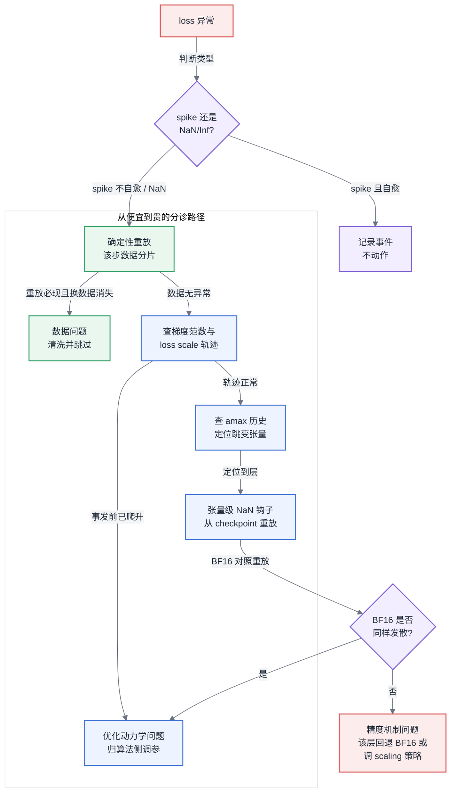
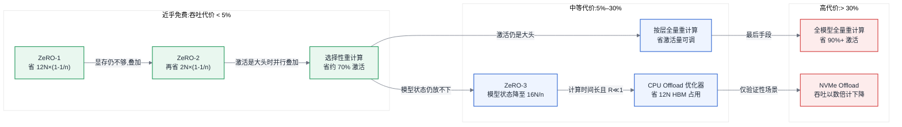
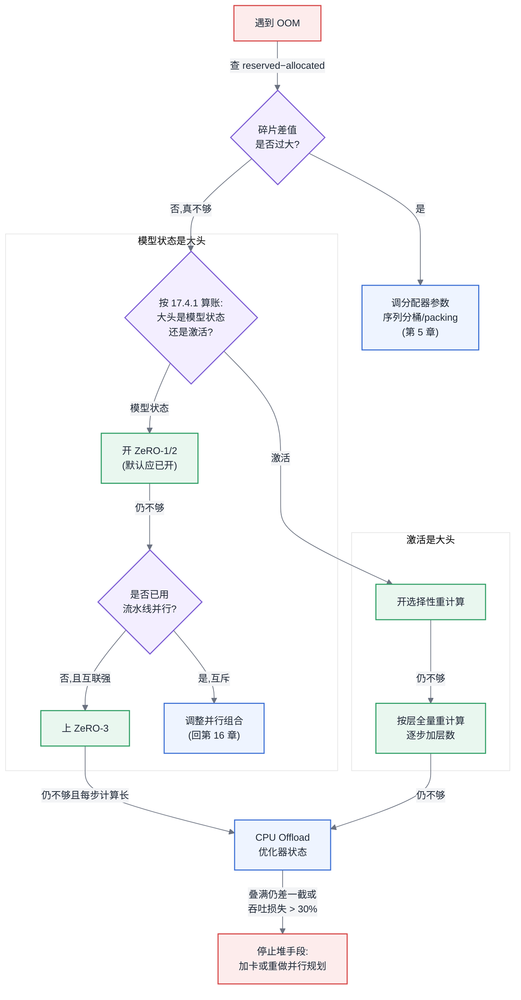

# 第 17 章 显存与训练侧精度机制

## 17.1 链路定位

本章位于"一次训练任务的生命周期"(主线 A)中**任务已经启动、并行策略已经选定之后**的那一段:模型能不能塞进给定的卡、塞进去之后数值能不能稳定地收敛——前者是显存机制的问题,后者是训练侧精度机制的问题,两者共同决定这次训练任务是"跑得起来"还是"跑到一半死掉"。

## 17.2 依赖声明

本章建立在三条前置结论之上:[§3.1](../第一部分-基础与心智模型/第03章-人工智能与大模型基础.md#31-神经网络与训练三阶段) 已经说明反向传播为什么必须保留前向的激活值(这是激活值显存的来源,也是重计算能省显存的原因);[§3.2](../第一部分-基础与心智模型/第03章-人工智能与大模型基础.md#32-优化器与超参的-infra-含义) 已经给出优化器状态的每参数字节数账本(这是 ZeRO 分片的对象);[§4.3](../第一部分-基础与心智模型/第04章-硬件第一性原理、架构范式与数值精度.md#43-数值格式与精度全书唯一定义处) 已经定义了数值格式谱系与精度记法。本章不重述这三者,只在它们之上回答两个训练侧的问题:**显存不够时按什么顺序上什么手段、各付出多少吞吐代价;低精度训练出了数值问题时按什么顺序排查**。

## 17.3 问题场景:第 3000 步的 NaN

一个 32B 稠密模型在 128 张卡上做 FP8 混合精度预训练。前 2999 步一切正常:loss 从 11.2 平滑降到 6.8,MFU 稳定在 41%,梯度范数(gradient norm)在 1.5 附近小幅波动。第 3000 步,loss 突然变成 NaN,任务没有崩溃——它继续跑,每一步都输出 NaN,烧了 40 分钟卡时才被值班同学发现并手动杀掉。

负责的平台工程师开始排查,立刻陷入三重困惑。第一,**没有现场**:NaN 出现的那一步,任何中间张量都没有留下来,日志里只有最终的 loss 值,他不知道 NaN 是从哪一层的哪个张量先产生的——是 FP8 矩阵乘溢出、是 loss scaling 因子失控,还是某个 batch 里混进了脏数据。第二,**回退不知道退到哪**:最近的 checkpoint 在第 2800 步,但如果病根是数据,从 2800 步重放会在 3000 步再死一次;如果病根是 FP8 的 scaling 因子更新策略,重放多少次都会死在同一个地方。第三,**归因不知道找谁**:算法同事说"我们在 BF16 上跑过小规模验证,收敛没问题,是你们平台的 FP8 配置有毛病";平台这边则怀疑是数据管道漏了清洗。双方都拿不出证据,只能各退一步:先回退到 BF16 重跑,代价是吞吐掉 30%,这次训练的预算直接超支。

这个场景里真正缺的不是某个工具,而是一条**事先约定好的数值发散排查路径**和一套**低成本的数值监控埋点**。本章后半部分就是要把这条路径写出来;而前半部分要先解决一个更基础的问题——这个 32B 模型当初是靠哪些显存手段塞进 128 张卡的,每个手段各付出了多少吞吐,因为显存手段的选择直接决定了数值问题出现时你有多少排查空间。

## 17.4 原理与量化模型

### 17.4.1 显存账本:先算清楚,再谈优化

所有显存优化手段针对的都是 [§6.2](../第一部分-基础与心智模型/第06章-模型结构的定量分析.md#62-参数量与资源换算核心) 显存三分中的前两块:**模型状态**(参数 + 梯度 + 优化器状态)和**激活值**。用 N 表示模型总参数量、n 表示数据并行度(与第 2 章符号表一致),按 [§3.2](../第一部分-基础与心智模型/第03章-人工智能与大模型基础.md#32-优化器与超参的-infra-含义) 的账本,BF16 混合精度 + Adam 下模型状态为每参数 16 字节:

$$M_{\text{模型状态}} = \underbrace{2N}_{\text{BF16 参数}} + \underbrace{2N}_{\text{BF16 梯度}} + \underbrace{12N}_{\text{FP32 master 权重 + 动量 + 方差}}$$

激活值显存与参数无关,与 batch、序列长度、隐层维度成正比。对标准 Transformer,每层激活值约为(s 为序列长度,b 为 micro batch,h 为隐层维度,a 为注意力头数):

$$M_{\text{激活/层}} \approx s \cdot b \cdot h \cdot \left(34 + 5\frac{a \cdot s}{h}\right) \text{ 字节}$$

括号里第二项来自注意力分数矩阵,随序列长度平方增长——这就是长序列训练中激活值反超模型状态成为显存大头的原因。**任何显存优化决策的第一步都是把这两块分别算出来**:如果大头是模型状态,该上 ZeRO;如果大头是激活值,该上重计算;算都不算就堆手段,是本章要反对的第一件事。

### 17.4.2 ZeRO 三阶段:分片的对象决定代价

ZeRO(Zero Redundancy Optimizer)的核心观察是:数据并行的 n 个副本中,模型状态是完全冗余的。三个阶段按分片对象递进,n 为数据并行度:

| 阶段 | 分片对象 | 每卡模型状态 | 额外通信 | 典型吞吐代价 |
|---|---|---|---|---|
| ZeRO-1 | 优化器状态(12N) | 4N + 12N/n | 无新增(reduce-scatter + all-gather 替代 all-reduce,总量不变) | < 5% |
| ZeRO-2 | + 梯度(2N) | 2N + 14N/n | 同上,梯度分片释放时机提前 | < 5% |
| ZeRO-3 | + 参数(2N) | 16N/n | 前向、反向各多一次参数 all-gather,通信量约 1.5 倍 | 10%–30%,互联越弱越高 |

> 延伸阅图:Rajbhandari et al., "ZeRO: Memory Optimizations Toward Training Trillion Parameter Models"(arXiv:[1910.02054](https://arxiv.org/abs/1910.02054))图 1 —— 三阶段显存分区原图,按参数/梯度/优化器状态三色标出每个阶段各卡实际持有的分片,上表"每卡模型状态"一列的三个公式就是对该图逐块相加的结果。

三条工程结论:

1. **ZeRO-1 近乎免费**。集合通信总量与朴素数据并行相同,只是把 all-reduce 拆成了 reduce-scatter + all-gather。n=64 时优化器状态从 12N 降到 0.19N,一个 32B 模型每卡省下约 380 GB。任何数据并行度 ≥ 8 的训练不开 ZeRO-1,基本可以判定为配置失误。
2. **ZeRO-2 的收益随并行度递增但绝对值有限**,它省的是 2N 的梯度,与 ZeRO-1 一起开几乎不增加代价,通常作为默认组合。
3. **ZeRO-3 是质变**:参数本身被分了,每次前向和反向都要按需 all-gather 参数再释放。这 1.5 倍通信量能否被计算掩盖,取决于互联带宽与每层计算量之比——在 NVLink 域内通常掩盖得住(代价 10% 上下),跨节点走 RDMA 网络时可能付出 30% 甚至更多。**ZeRO-3 与流水线并行(见第 16 章)在机制上互斥**:流水线要求参数常驻本 stage,ZeRO-3 要求参数按需聚合,两者叠加时谁管参数生命周期会冲突,这是第 18 章框架组合冲突的一个典型来源。

"1.5 倍"这个系数值得拆开算一遍。以每卡通信的数据元素量、按参数量 N 归一:

| 方案 | 梯度归约 | 参数 all-gather(前向) | 参数 all-gather(反向) | 每步通信量系数 |
|---|---|---|---|---|
| 朴素数据并行 | all-reduce ≈ 2N | 无 | 无 | 2N |
| ZeRO-1/2 | reduce-scatter N,更新后参数 all-gather N | 无 | 无 | 2N |
| ZeRO-3 | reduce-scatter N | N | N | 3N |

朴素数据并行的 all-reduce 本身就等价于一次 reduce-scatter 加一次 all-gather(各约 N),所以 ZeRO-1/2 只是把这两个半段拆开、中间插入分片的优化器更新,总量分毫未增——"近乎免费"是算术事实,不是营销话术。ZeRO-3 的增量恰好是反向那次参数 all-gather:前向聚合过的参数为了省显存已经释放,反向要用只能再聚合一次,3N/2N = 1.5 倍由此而来。

**与其他并行组合时,先分清分片对象的归属**。ZeRO 的一切分片都沿数据并行维度进行;张量并行(TP)沿张量内部维度切参数,两者作用在正交的维度上——TP 组内每卡持有参数的 1/t,这 1/t 在 n 个数据并行副本间仍然冗余,ZeRO 分的就是这份冗余,所以 ZeRO 与 TP 组合在机制上干净。流水线并行(PP)则不同:它已经把参数按层切成 p 段,每个 stage 只持有 N/p,ZeRO-3 能再省的绝对量被压到很小;而代价端恰好反向放大——PP 依赖大量 micro batch 填满流水线,ZeRO-3 的参数 all-gather 在**每个** micro batch 的前向与反向都要各来一次,通信次数被 micro batch 数成倍放大。收益被 p 除、代价被 micro batch 数乘,这就是 ZeRO-3 与 PP 组合常不划算的算术原因;工程上通行的搭配是 PP 管参数与梯度的归属、ZeRO-1 只分优化器状态——优化器状态不参与前反向,分它不与流水线的参数生命周期发生任何冲突。

所以这对做平台的人意味着什么:ZeRO 阶段的选择不是"越高越好",而是**沿着"分片对象的字节数 × 并行度收益"与"新增通信量 ÷ 互联带宽"两条曲线找交点**——ZeRO-1/2 应当是平台默认值,ZeRO-3 是需要拿互联拓扑来论证的选项。

### 17.4.3 激活重计算:用算力换显存的三档粒度

[§3.1](../第一部分-基础与心智模型/第03章-人工智能与大模型基础.md#31-神经网络与训练三阶段) 已经说明激活值必须保留到反向传播使用。重计算(activation recomputation / checkpointing)的思路是:前向时只存一部分"检查点"激活,反向时从最近的检查点重新算出中间激活。粒度从粗到细三档:

| 粒度 | 省激活显存 | 吞吐代价 | 机制 |
|---|---|---|---|
| 全量重计算(full) | 约 90%+(只存各层输入) | 30%–36%(重跑整个前向,前向约占总 FLOPs 的 1/3) | 每层边界存一个检查点 |
| 选择性重计算(selective) | 约 70% | 3%–5% | 只丢弃并重算注意力分数矩阵等"占显存大、重算便宜"的部分 |
| 按层重计算(per-layer) | 可调,介于两者之间 | 与重算层数成正比 | 只对指定的 k 层做全量重算 |

选择性重计算是三档中收益/代价比最悬殊的一档,原因在 17.4.1 的公式里:注意力分数矩阵贡献了括号中随 s 平方增长的那一项,占长序列下激活显存的大头,但它的重算只是一次矩阵乘加 softmax,FLOPs 占比极小。**"占显存多"和"重算贵"是两个独立维度,选择性重计算专挑"占得多、算得贱"的张量下手**——这也是 FlashAttention 类算子在机制上内置的做法(它根本不物化分数矩阵)。工程顺序因此是固定的:先开选择性重算,不够再对部分层升级到全量,全模型全量重算是最后手段,因为 33% 的吞吐代价约等于把集群规模打了七五折。

对象怎么选,可以写成一个可排序的判据:**该算子输出激活的字节数 ÷ 重算它所需的 FLOPs**,比值越高越优先丢弃。按这个判据排出来的名单高度稳定:attention softmax(输出 s² 量级的激活,重算只是逐元素指数加一次归一化)、LayerNorm/RMSNorm(输出 s·b·h,重算是一次均值方差归约)、GeLU/SiLU 等激活函数(同尺寸输出,重算是纯逐元素运算)——这几类合计贡献了激活显存的大半,重算 FLOPs 却不到前向总量的 5%。名单的另一端是大矩阵乘的输出:它们"占得多、也算得贵",丢弃它们就等于滑向全量重算的代价区,不属于选择性重算的射程。

还有一个 2026 年评估重算收益时最常见的误算:**FlashAttention 已经改变了基线**。FA 在前向就分块计算、不物化 s×s 的分数矩阵,反向按块重算 softmax——等于把"选择性重算注意力矩阵"内置进了算子本身。因此在注意力已经 FA 化的模型里,17.4.1 公式中随 s² 增长的那一项从一开始就不存在,框架层再开选择性重算,能省的只剩 LayerNorm、GeLU 这些小头,收益从"约 70%"缩水到 20%–30%。评估重算方案前先确认注意力算子是否已 FA 化,否则显存收益会高估一大截,而为此付出的工程改动就白做了。

### 17.4.4 Offload:救命稻草与自欺欺人的分界线

CPU/NVMe Offload 把优化器状态(或参数、激活)放到主机内存或 NVMe 盘上,优化器更新时再搬回来或直接在 CPU 上算。它的收益边界可以用一个比值判断:

$$R = \frac{\text{每步需要搬运的字节数} \div \text{PCIe 有效带宽}}{\text{每步纯计算时间}}$$

R ≪ 1 时,搬运被计算掩盖,offload 近似免费;R 接近或超过 1 时,训练变成"PCIe 搬运为主、GPU 计算为辅",这就是自欺欺人。量化地看:主机侧 PCIe x16 链路的有效带宽在 25 GB/s 量级(具体数值随代际变化,方法不变),一个 32B 模型的优化器状态 384 GB,若按 ZeRO-1 分到 64 卡后每卡 6 GB,单向搬运约 0.25 秒;如果这张卡每步计算时间是 3 秒(大 batch、长序列),R ≈ 0.17,offload 是救命稻草;如果每步只有 0.5 秒(小模型微调、短序列),R ≈ 1,吞吐直接腰斩。NVMe offload 再把带宽降一个量级(单盘 5–7 GB/s),只适合"参数远超显存、且能接受吞吐以数倍计下降"的极端场景——例如用少量卡对超大模型做低频率的继续预训练验证。

上面的 R 是"整步"口径,它默认被搬运对象每步只需搬一次——这恰好只对优化器状态成立,所以**优化器状态 offload 与参数 offload 是两个不同的收益模型,不能用同一个判据**。优化器状态每步只在 optimizer step 被访问一次:要么把分片后的 12N/n 搬回 GPU 更新,要么干脆在 CPU 上完成更新、只回传更新后的参数分片(2N/n,搬运量再降六倍),而且这次搬运可以与下一步的前反向计算整体重叠——整步口径的 R 判据直接适用。参数 offload 则是"每层一次、必须按层重叠"的模型:每层的参数要在轮到该层计算之前预取回显存,前向一遍、反向一遍,可行性判定不再是整步的 R,而是逐层的不等式:

$$\frac{\text{单层参数字节数}}{\text{PCIe 有效带宽}} \le \text{单层计算时间}$$

代入 32B 算例:模型约 60 层、每层约 0.5B 参数,BF16 下约 1 GB,25 GB/s 有效带宽下预取一层要 40 ms;而一层的前向计算通常只有几毫秒到十几毫秒——不等式差了几倍到一个数量级,预取永远追不上计算,GPU 大部分时间在等 PCIe。这就是参数 offload 在生产训练中几乎必然失效、优化器状态 offload 却常常成立的结构性原因:**前者的判定式按层卡、后者按步卡,约束松紧差了两个数量级**。

判断规则一句话:**offload 适合"每步计算时间长、被搬运对象每步只碰一次"的负载(优化器状态正是如此,每步只在 optimizer step 碰一次);不适合每步都要多次访问的对象(参数、激活)**。把参数 offload 到 NVMe 还宣称"单卡训练 175B",在演示上成立,在生产吞吐账本上几乎从不成立。

### 17.4.5 混合精度机制:master weights 与 scaling 的层次

混合精度训练(mixed precision training)的机制核心不是"用了低精度格式",而是**三个精度层次的分工**(格式本身见 [§4.3](../第一部分-基础与心智模型/第04章-硬件第一性原理、架构范式与数值精度.md#43-数值格式与精度全书唯一定义处)):

1. **计算用低精度**:矩阵乘的输入输出用 BF16/FP16/FP8,吃满硬件的低精度算力。
2. **累加用高精度**:矩阵乘内部的累加器用 FP32,梯度的跨卡归约通常用 FP32 或 BF16——低精度累加大量小数会系统性地丢失尾部。
3. **权重更新用高精度**:保留一份 FP32 的 master weights。原因是可计算的:学习率 1e-4 乘以量级 1e-1 的梯度,更新量在 1e-5 量级,而 BF16 尾数只有 7 位、在 1.0 附近的分辨率约 0.008——更新量远小于分辨率,直接在 BF16 权重上累加等于没更新。关键在于这个丢失是**逐步累积的**:浮点加法在更新量小于分辨率一半时会把结果舍回原值,权重原地不动,下一步的小更新又被同样吞掉——数千步的更新不是"各损失一点",而是**全部**丢失,训练表现为 loss 提前平台化。这不是欠拟合,是舍入误差在系统性地吃掉更新;而它最阴险的地方是没有任何报错,只有收敛曲线不对劲。master weights 用 FP32 的 23 位尾数(分辨率约 1e-7)承接累加,就是为了让 1e-5 量级的更新能被逐步积攒起来,每步再把 FP32 权重舍到 BF16 用于计算——舍入只发生在"读"的一侧,不发生在"累积"的一侧。

**Loss scaling** 是 FP16 特有的补丁:FP16 只有 5 位指数,小梯度会下溢成零,于是把 loss 乘上一个大因子(如 2^16)让梯度整体抬升到可表示范围,更新前再除回来。动态 loss scaling 是一个只有两条转移的状态机:任一梯度出现 Inf/NaN → 跳过该步的参数更新、因子减半;连续 W 步(典型量级为千步)无溢出 → 因子加倍。因子轨迹因此呈锯齿形——缓慢爬升、瞬间腰斩,而这条轨迹本身就是免费的健康信号:因子长期停在低位,说明模型的数值状态本身就差;因子每隔几十步就腰斩一次,说明大量训练步在被静默跳过,有效吞吐在无人察觉地流失。BF16 指数位与 FP32 相同、动态范围一致,小梯度不会下溢,loss scaling 整套机制(以及它的跳步损失和这条需要盯的轨迹)通常可以整个省掉——这是 2026 年 BF16 成为训练默认格式的机制原因,也是排查数值问题时少一个变量的工程原因。

**Scaling 的粒度谱系**(这是通向 FP8 的关键台阶):loss scaling 是全局一个因子;per-tensor scaling 给每个张量一个独立因子,按该张量的 amax(绝对值最大值)动态确定,FP8 训练普遍采用"delayed scaling"——用最近若干步的 amax 历史预测本步因子,避免额外一遍统计;per-block scaling 把粒度进一步细到张量内的小块(如每 32 个元素一个因子,即 MX 类格式的做法),用于对付同一张量内动态范围差异过大的情形。**粒度越细,可用动态范围越大、数值越稳,但因子本身的存储与计算开销越高,且对算子和硬件的支持要求越高**。

### 17.4.6 FP8 训练的工程门槛

FP8 把矩阵乘吞吐再翻一倍,但它不是"把 dtype 换成 fp8"这么一个开关,而是一组必须同时满足的工程条件:

**哪些能降**:Transformer 层内的大矩阵乘——QKV 投影、注意力输出投影、FFN 两个线性层。这些占了总 FLOPs 的 90% 以上,是 FP8 收益的全部来源。

**哪些必须留高精度**:

- Embedding 与输出 LM head:词表维度的动态范围大,且输出 logits 的精度直接影响 loss 的数值质量;
- LayerNorm/RMSNorm、softmax、残差连接:归约与指数运算对精度敏感,FLOPs 占比又低,降了没收益只有风险;
- 梯度的跨卡归约与累加:BF16 或 FP32;
- master weights 与优化器状态:FP32([§3.2](../第一部分-基础与心智模型/第03章-人工智能与大模型基础.md#32-优化器与超参的-infra-含义) 账本不变——**FP8 省的是激活和计算,不省优化器状态**,这是常见的显存预期误判);
- 通常还保留首尾各若干层为 BF16:靠近输入的层直接承接 embedding 输出、数值分布尚未被归一化层"驯化";最后一层的输出直接进 loss,量化误差没有任何后续层去平均化,会原样进入梯度并被反向放大——首尾层是量化误差"没有缓冲带"的两端。

**格式分工**:FP8 有两个变体(格式定义见 [§4.3](../第一部分-基础与心智模型/第04章-硬件第一性原理、架构范式与数值精度.md#43-数值格式与精度全书唯一定义处)):E4M3(4 位指数、3 位尾数)与 E5M2(5 位指数、2 位尾数),分工由张量的统计形态决定。前向的权重与激活分布相对集中、动态范围窄,稀缺的是分辨率,用尾数多的 E4M3;反向的梯度跨层、跨步横跨多个数量级,稀缺的是覆盖范围,用指数多的 E5M2。这与 FP16 时代"小梯度下溢"是同一个问题在格式层面的解法——与其像 loss scaling 那样把梯度整体抬升去凑窄格式,不如直接给梯度一个指数位更多的格式。理解了这个分工,就能理解 FP8 的溢出报警为什么要分方向看:前向 E4M3 溢出多半指向数据或模型,反向 E5M2 溢出多半指向 scaling 策略。

**Scaling 因子更新策略**:两条路线。just-in-time scaling(也叫 current scaling)在量化前先对当前张量统计一遍 amax、再定因子——因子永远精确、原理上不会溢出,代价是这遍统计要么多读一次张量(带宽开销),要么把量化 kernel 拆成两段;delayed scaling 用最近若干步的 amax 历史窗口(如最近 1024 步)推算本步因子,省掉当步统计,代价是分布突变时因子跟不上——窗口太短则因子抖动、太长则跟不上分布漂移;当某步实际 amax 超出因子覆盖范围时发生溢出,该 tensor 出现 Inf。取舍本质是**用确定性换带宽**:梯度这类突变高发的张量值得付 just-in-time 的统计开销,权重这类逐步缓变的张量用 delayed 足够;而 per-block 细粒度格式因为块小、amax 统计能融合进量化 kernel 顺路完成,天然就是 just-in-time 的——这也是细粒度 scaling 数值更稳的另一半原因。**amax 历史是 FP8 训练最重要的监控信号**:它的突然跳变几乎总是先于 loss 异常出现,把它接进监控系统(第 29 章)是 FP8 上生产的前置条件,而不是可选项。

**一条门槛判断**:FP8 的收益约为 BF16 基线的 1.2–1.4 倍吞吐,代价是上述全部工程投入加上数值风险。训练规模不到千卡·月量级、或团队没有能力做张量级数值监控的,这笔投入通常不划算——先把 BF16 + 选择性重算 + ZeRO 的组合做扎实,比抢 FP8 更省钱。

### 17.4.7 数值发散的排查路径

回到 17.3 的场景。数值异常分两类,处置完全不同:**loss spike**(突刺后自行恢复或可恢复)和 **NaN/Inf**(不可恢复,必须回退)。排查顺序如下,原则是**从便宜的检查到贵的检查**:

1. **先查数据**(最便宜、命中率最高):用 step 号反查该步消费的数据分片(这要求数据管道具备确定性重放能力,见第 13 章),检查是否有超长样本、异常 token 分布、损坏分片。数据问题的特征是:重放同一数据必现、换数据即消失。
2. **查 loss scaling / 梯度范数轨迹**:FP16 下看动态 loss scale 是否在事发前持续下调(说明溢出频发);所有精度下看梯度范数是否在事发前若干步已经开始爬升——爬升说明是优化动力学问题(学习率、warmup、数据分布突变),不是精度问题。
3. **查 amax 历史与 scaling 因子**(FP8 特有):定位哪个张量的 amax 先跳变。跳变在前向激活,多半是数据或模型问题;跳变在梯度,多半是 scaling 策略跟不上。
4. **张量级溯源**:从 checkpoint 重放,注册 NaN 检测钩子,定位第一个产生 NaN 的算子。NaN 的产生点未必是病根(NaN 会沿计算图传播,也会沿集合通信跨卡传播——一张卡的 NaN 经过 all-reduce 后全体中毒),但它给出病根的上界位置。
5. **对照实验定责**:同一 checkpoint、同一数据,BF16 重放一段。BF16 也炸,是数据或优化动力学问题,归算法与数据侧;BF16 不炸、FP8 炸,是精度机制问题,归平台侧。**这一步就是 17.3 场景中平台与算法互相甩锅的仲裁机制**——它成立的前提是 checkpoint、数据重放、精度开关三者都是平台预先建好的能力。

**loss spike 的三类典型来源与二分定位法**。上面的五步是通用顺序,针对 spike 还可以更快:spike 的病根几乎总落在三类里,各有可区分的特征信号。其一,**坏数据**:spike 与特定 step 强绑定,确定性重放必现、跳过该数据分片即消失;梯度范数在事发步呈单步脉冲式跳升,事前没有任何爬坡。其二,**精度机制**:有前兆——amax 或梯度范数在事发前数十到数百步缓慢爬升,loss scale 或 scaling 因子的轨迹先于 loss 异常;换 BF16 重放同一段则消失。其三,**并行/框架 bug**(错误的梯度归约分组、流水线 stage 边界的激活错配、ZeRO 分片错位等):最隐蔽,特征是与并行配置绑定——数据与精度不变、只改并行度或拓扑(如 n 从 64 改 32)时,spike 的位置或形态跟着变,而前两类来源在这个操作下应当纹丝不动;另一个强信号是本该逐位一致的各数据并行副本之间,参数或梯度范数出现分歧。三类来源恰好对应三个正交的开关(数据分片、精度、并行配置),二分定位法就建立在这个正交性上:**固定其中两个、每次只翻转第三个重放一段,一次实验排除一类来源**,最多三次收敛。它成立的前提仍是 17.3 强调的那条:确定性重放能力——没有它,每次"重放"本身结果就不同,翻转开关得到的差异无法归因,二分无从谈起。

处置动作对应三档:spike 且自愈——记录不动作;spike 不自愈——回退最近 checkpoint 并跳过该段数据;NaN——回退,并按上述顺序定位后决定是修数据、调 scaling 策略,还是对个别层做精度回退(把出问题的层升回 BF16,而不是全模型回退——全模型回退是排查失败的代价,不是排查的起点)。

图 17-1:数值发散诊断流程。**BF16 对照重放是平台与算法之间的定责仲裁点,而它成立的前提——checkpoint、确定性数据重放、逐层精度开关——都必须在事故发生之前就建好。**

### 17.4.8 显存 OOM 的系统性排查

OOM 报错信息里最有价值的是两个数字的差:**reserved(分配器持有)与 allocated(张量实际占用)**。排查顺序:

1. **先判断是真不够还是碎片**:reserved 远大于 allocated(如差出 10 GB 以上)且报错发生在训练中后期,大概率是 [§5.2](../第一部分-基础与心智模型/第05章-CUDA、CANN与加速器软件栈.md#52-运行时的共性问题) 讲过的分配器碎片问题——变长序列是主要诱因,处置是开启可扩展段(expandable segments)或对序列做分桶/packing(见第 16 章),而不是急着上显存优化。
2. **看 OOM 发生的时机**:启动即 OOM,是模型状态放不下,按 17.4.1 的公式核对账本,上 ZeRO;跑了几步后在反向时 OOM,是激活峰值问题,上重计算或调小 micro batch;跑了很久才 OOM,查碎片和显存泄漏(常见泄漏源:在训练循环里持有对 loss 张量的 Python 引用做累计统计,导致整张计算图不能释放)。
3. **抓显存时间线**:用分配器的快照工具([§5.4](../第一部分-基础与心智模型/第05章-CUDA、CANN与加速器软件栈.md#54-profiling-方法论全书唯一定义处) profiling 方法论)抓一个 step 的显存曲线,把峰值拆解到"模型状态基线 + 激活爬坡 + 峰值毛刺",毛刺通常来自临时缓冲(集合通信 buffer、重计算的临时前向),这部分靠调 bucket 大小而不是靠大手段。

**没有做过第 1 步就开始堆 ZeRO-3 和 offload,是 OOM 排查中最常见的浪费**——为碎片问题付出 30% 吞吐代价,而真正的修复只需要一个分配器参数。

## 17.5 方案对比:显存不够的三条路线

面对"模型塞不进当前卡数",有三条路线,各有明确的失效边界:

**路线一:分片路线(ZeRO 系列)**。把冗余的模型状态摊到数据并行组里。收益随并行度线性增长,ZeRO-1/2 代价近零。**失效边界**:其一,数据并行度小(n ≤ 4)时分母太小,摊薄有限;其二,ZeRO-3 依赖高带宽互联,跨节点弱互联下 1.5 倍通信量掩盖不住,吞吐损失可达 30%+;其三,与流水线并行机制冲突,已用流水线并行的训练不能叠 ZeRO-3。

**路线二:重计算路线**。用算力换激活显存。选择性重算收益/代价比极高。**失效边界**:它只省激活值,对"模型状态就放不下"的场景(启动即 OOM)完全无效;全量重算的 33% 吞吐代价在算力紧张(MFU 已是瓶颈)的训练里等于变相裁掉四分之一集群,当集群规模是硬约束、工期不是时才可接受。

**路线三:Offload 路线**。用 PCIe/NVMe 带宽换 HBM 容量。**失效边界**:由 17.4.4 的比值 R 决定——每步计算时间短的负载(小 batch 微调、短序列)R 接近 1,吞吐腰斩;被 offload 对象每步访问多次(参数、激活)时几乎必然失效;NVMe offload 只在"接受数倍吞吐下降换取任务能跑"的验证性场景成立,不是生产训练方案。

三条路线之外还有一个常被遗忘的第零选项:**换并行策略或加卡**(回到第 16 章重新做并行组合)。当上述手段叠满仍差一大截、或叠加后吞吐损失超过 30% 时,继续在显存优化里打转的总成本已经超过加卡——显存优化是在给定卡数下逼近可行域边界的手段,不是替代容量规划的魔法。

图 17-2:显存优化技术的收益代价矩阵。**免费区的三项(ZeRO-1/2 + 选择性重计算)应当是平台的默认配置,而红色高代价区的每一项都需要单独论证——先把免费的收益吃干净,再谈付出吞吐的手段。**

## 17.6 大数据对照:内存溢出排查方法论的迁移

显存 OOM 排查与 JVM 时代的内存排查在方法论上是同源的,大约一半经验可以直接搬,另一半会误导你。

**直接复用的部分**是排查的分层框架。当年排查 Spark executor OOM 的纪律——先区分堆内不足与堆外(off-heap)不足,先看 GC 日志判断是真不够还是碎片/停顿,再 heap dump 定位持有者,最后才调 `spark.executor.memory`——一一对应到今天:先区分 allocated 不足与 reserved-allocated 差值过大(碎片),先看分配器统计再抓 memory snapshot 定位持有者,最后才动 ZeRO 与重计算。"**不 dump 不调参**"这条纪律原样成立:当年多少 Spark 集群靠盲目调大 executor 内存掩盖数据倾斜,今天就有多少训练任务靠盲目上 ZeRO-3 掩盖分配器碎片。同样直接复用的还有"用换资源上限的方式做二分定位"(当年调小 heap 逼出问题,今天调小 micro batch 隔离激活项)。

**失效的部分**有三处,原因都指向 GPU 显存与 JVM 堆的机制差异。第一,**没有 GC 兜底**:JVM 的 OOM 前有 Full GC 挣扎,给你 GC 日志这个免费的黑匣子;显存分配是显式的,OOM 是瞬时的,没有"垃圾回收压力上升"这个前兆信号,所以监控必须自己埋(显存水位、碎片率),不能指望运行时替你留现场。第二,**峰值形态不同**:JVM 堆占用是缓慢爬升的锯齿,显存占用是每个 step 内部的确定性脉冲(前向爬坡、反向释放),排查的时间尺度从"小时级趋势"变成"step 内时间线",工具从趋势监控换成单 step 快照。第三,**"加内存"这条退路变贵了三个数量级**:当年 executor 内存不够,加钱扩容是常规操作;今天 HBM 容量焊死在卡上,"加显存"等于换卡或加卡,这是显存优化技术在 AI 时代成为一个独立工程领域、而"调大堆"在大数据时代只是一个配置项的根本原因。

数值排查侧也有一条可迁移的经验:当年 Flink 作业疑难问题的"最小可复现 + 确定性重放"纪律(savepoint + 固定输入回放),对应今天的 checkpoint + 确定性数据重放 + 对照精度重跑。差别在于当年重放是为了逻辑正确性,今天重放还要仲裁数值精度责任——所以重放机制必须精确到"第 3000 步消费了哪个数据分片",这个要求比大数据时代苛刻得多。

## 17.7 选型决策树:显存不够,按什么顺序上手段

图 17-3:显存不够时的手段升级顺序。**入口永远是"先排碎片、再算账本",出口是一条止损线——当优化手段的累计吞吐损失超过 30%,继续优化的成本已经超过加卡,该回到容量规划而不是继续压榨。**

---

**读完本章,你应当能**:在给定卡数下用显存账本算出某个模型"塞不塞得进",列出为塞进去而启用的每项技术各省多少显存、各付出百分之几的吞吐;能对一次低精度训练的 loss spike 或 NaN,按"数据 → 梯度轨迹 → amax/scaling → 张量溯源 → BF16 对照仲裁"的顺序完成诊断并给出定责证据;能对一次 OOM 先判定碎片还是真不足,再给出按序升级的处置方案和停止堆手段的止损点。
