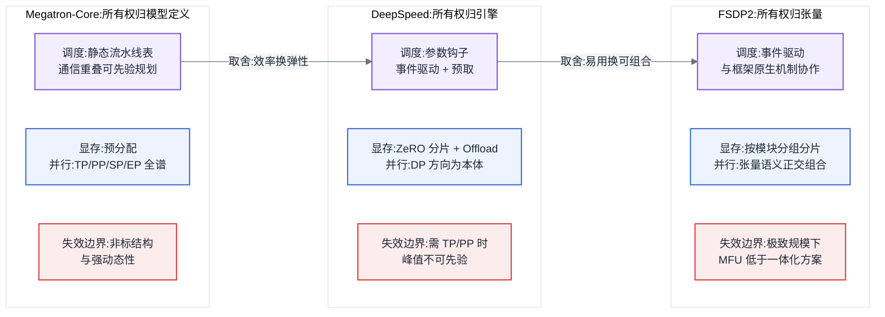
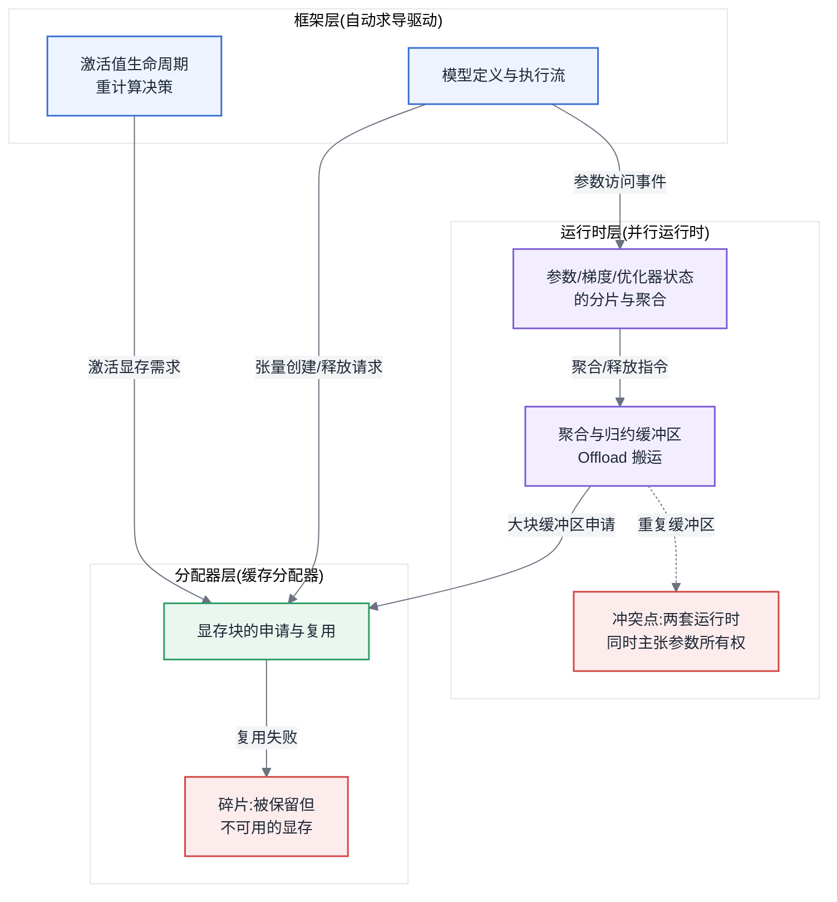
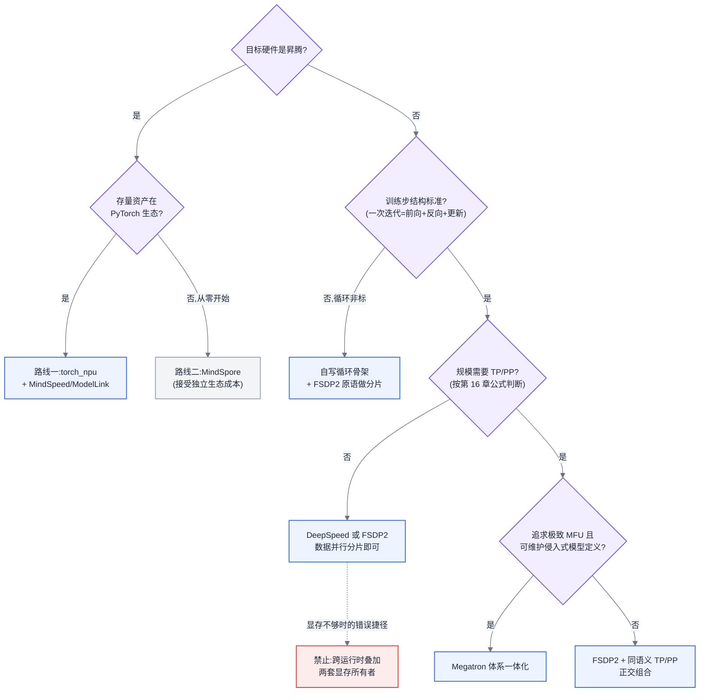

# 第 18 章 并行运行时剖析

## 18.1 链路定位

在"一次训练任务的生命周期"(主线 A)中,本章位于前向 → 反向 → 梯度同步 → 优化器更新这一核心执行段:并行运行时(parallel runtime)就是把第 16 章选出的并行组合和第 17 章的显存机制真正落成进程、通信组与显存布局的那一层软件。

## 18.2 依赖声明

本章建立在两条结论之上:第 16 章"并行策略的收益与代价可以用通信量和显存公式先算后选",以及第 17 章"ZeRO 分片、重计算、Offload 各自有明确的收益边界"。本章回答的是:这些策略与机制,交给哪个运行时去执行,以及它们叠加时谁说了算。

## 18.3 问题场景:两个显存优化叠加,反而 OOM

一个平台团队在 32 张 64 GB 加速卡上训练一个约 30B 参数的稠密模型。第一版方案用张量并行 TP=8 加流水线并行 PP=2,单卡显存峰值约 52 GB,能跑,但团队想给序列长度留余量。工程师查了资料,决定"双保险":在已有 TP/PP 切分之上,再打开另一套运行时提供的 ZeRO-3 参数分片,同时开启它自带的优化器 CPU Offload——按第 17 章的公式,两项各自都应该省下十几 GB。

结果第一个迭代还没跑完就 OOM。更换启动顺序、调小 micro batch,现象依旧,而且 OOM 的位置在反向传播中段,报错栈里既有框架的算子,也有运行时的分片钩子(hook),还有分配器的碎片告警。工程师的困惑很具体:两项技术单独开都省显存,为什么叠加后峰值反而从 52 GB 涨到超过 64 GB?

事后剖析发现了三层原因。第一,ZeRO-3 假设自己持有完整参数的分片权,但 TP 已经把参数按维度切开,两套切分逻辑互不知情,ZeRO-3 在前向前 all-gather 出来的是"完整的 TP 分片",在部分实现路径下产生了冗余的聚合缓冲区;第二,CPU Offload 要求优化器状态在 CPU 内存上驻留,但 TP 组内的梯度归约仍在卡上完成,归约缓冲区与 all-gather 缓冲区在反向中段同时活跃,峰值叠加;第三,两套运行时各自向分配器申请了常驻缓冲池,碎片率从 6% 涨到 21%。三个因素没有一个是"bug",全部是两套显存管理机制在互不知情的情况下各自正确地工作的结果。

这就是本章要解决的问题:运行时不是功能列表,而是一套对显存和通信的**所有权假设**。不理解这套假设,叠加优化就是叠加事故。

## 18.4 原理与量化模型:五维剖析框架

评估任何训练运行时,本书固定使用五个维度:**调度策略、显存管理、并行支持、扩展点、失效边界**。前四维回答"它怎么工作",第五维回答"它什么时候不工作"。之所以固定维度,是因为运行时之间的功能矩阵每半年就变一次,而机制层面的设计取舍多年不变——按机制选型,结论的保质期远长于按功能选型。

先给一个统摄性的判断:三个主流运行时的根本分歧在于**显存与通信的所有权归谁**。

- **Megatron-Core** 的答案是"归模型定义":并行切分写进模型结构本身,运行时对每一层的显存与通信有全局静态规划。
- **DeepSpeed** 的答案是"归引擎":用户保留自己的模型定义,引擎在外层接管参数、梯度、优化器状态的生命周期。
- **FSDP2** 的答案是"归张量":分片语义下沉为张量本身的属性(按 DTensor 语义组织),框架原生机制(如自动求导、编译)能看见分片,而不是被包装层挡在外面。

### 18.4.1 Megatron-Core:静态规划者

**调度策略**:以流水线调度为核心,1F1B 及其交错变体(interleaved schedule)在启动时静态确定,每个 micro batch 的前向/反向顺序、每个 stage 的气泡位置在第一个迭代前就完全可预测。这种静态性是它效率的来源:通信可以精确地与计算重叠,因为调度器知道每一步接下来是什么。

**显存管理**:同样是静态的。激活值显存按调度表预分配,重计算粒度按层配置,几乎不依赖运行期的动态决策。代价是弹性差:任何改变形状的因素(变长序列、动态图分支)都会破坏预分配假设。

**并行支持**:TP/PP/SP/EP/CP 的完整组合是它的主场,尤其是 TP 与 SP 的算子级融合——这要求并行逻辑侵入模型定义,也正因如此,只有按它的模块规范写的模型才能享受全部收益。

**扩展点**:扩展方式是"实现它的模块接口",即把你的层写成它认识的并行模块。扩展成本高,但换来的是新层自动获得全套并行与调度能力。

**失效边界**:模型结构偏离 Transformer 主干越远,改造成本越高;动态性(变长、条件分支、动态路由之外的结构变化)越强,静态规划的前提越不成立。团队若没有能力维护一份侵入式的模型定义,不要选它。

### 18.4.2 DeepSpeed:运行期接管者

**调度策略**:不接管前向/反向的执行顺序(这仍由框架的自动求导驱动),而是在参数访问路径上插入钩子:前向即将用到某参数时 all-gather,用完即释放,反向对称。调度是**事件驱动**的,由执行流触发,而非静态表驱动。它可以做预取(prefetch),但预取的正确性依赖对执行顺序的运行期观测。

**显存管理**:核心资产是 ZeRO 三阶段(原理见第 17 章)加多级 Offload。它维护自己的连续缓冲池以对抗碎片,这意味着它假设自己是显存的主要管理者——本章问题场景中的冲突正源于这个假设被打破。

**并行支持**:数据并行方向的分片是本体;TP/PP 能力存在但历史上依赖与外部实现的集成,组合矩阵中经过重度验证的路径远少于理论路径。

**扩展点**:配置驱动,大多数能力通过配置开关组合,不要求改模型定义。上手成本低是它长期流行的原因,但配置组合爆炸也意味着"没人验证过你这套组合"的概率不低。

**失效边界**:当模型大到数据并行方向的分片不足以支撑(单层本身放不下、或 all-gather 通信在慢互联上成为主导开销)时,必须引入 TP/PP,而这恰恰离开了它的主场。另一条边界是可观测性:事件驱动的钩子机制使显存峰值难以先验计算,问题只能靠 profiling 事后归因(方法见 [§5.4](../第一部分-基础与心智模型/第05章-CUDA、CANN与加速器软件栈.md#54-profiling-方法论全书唯一定义处))。

### 18.4.3 FSDP2:框架原生派

**调度策略**:与 DeepSpeed 同为"前向 all-gather、用后释放、反向重聚"的事件驱动模式,但实现位置不同:分片不靠外部钩子包装,而是张量原生携带分片信息。这使得编译器、自动求导、二阶优化器等框架原生机制能与分片正确交互——包装层方案在这些交互点上历史遗留问题最多。

**显存管理**:按参数分组(以模块为粒度)做分片与聚合,聚合缓冲区的生命周期与模块边界对齐,行为可预测性介于 Megatron 的全静态与 DeepSpeed 的全动态之间。它不自带 Offload 的完整体系,显存不够时的答案是"配合重计算与更细的分组",而不是"再开一个开关"。

**并行支持**:自身只做参数分片这一件事,但因为分片语义是张量级的,它可以与同一语义体系下的 TP/PP 实现**按维度正交组合**——组合的正确性由张量语义保证,而不是由两套运行时的君子协定保证。这是它与"DeepSpeed 叠 Megatron"式组合的本质区别。

**扩展点**:扩展点就是框架本身:你写的是普通模型代码,分片是加在其上的正交属性。定制训练循环、接入自定义优化器、与编译栈协作,都不需要穿透一个引擎包装层。

**失效边界**:极致规模与极致 MFU 不是它的目标——没有 Megatron 那种算子级的 TP/SP 融合与静态流水线调度,在数千卡稠密大模型预训练这个场景下,它组合出来的方案通常比 Megatron 一体化方案低若干个百分点的 MFU,而这个规模下几个百分点就是数百万元的电费与卡时。

### 18.4.4 五维对照

图 18-1:三个运行时的五维机制对照。三者的真正分歧不在功能多少,而在显存与通信的所有权归模型定义、归引擎还是归张量——所有权决定了它能与什么组合、在哪里失效。

### 18.4.5 组合边界:叠加后谁管显存

组合规则可以压缩成三条,每条都能从"所有权"推出:

**第一条:同一资源只能有一个所有者。** 参数的分片权、优化器状态的驻留位置、聚合缓冲区的生命周期,每一项只能由一套机制管理。ZeRO-3 与 FSDP 互斥(同抢参数分片权);DeepSpeed 的 Offload 与另一套运行时的重计算可以共存(管的是不同资源);两套运行时各自的常驻缓冲池叠加,即使逻辑上不冲突,碎片也会吃掉收益。问题场景中的 OOM,本质是参数所有权被 TP 和 ZeRO-3 同时主张。

**第二条:叠加后的显存峰值必须重新计算,不能用单项收益相减。** 事件驱动机制的峰值出现在"聚合缓冲区 + 梯度归约缓冲区 + 激活值"同时活跃的时刻,估算式为:

峰值 ≈ 分片后常驻显存 + max(各时刻活跃的临时缓冲区之和) + 碎片保留

其中第二项在叠加两套机制后往往不减反增,因为两套机制的"临时缓冲区活跃窗口"未必错开。凡是给不出这个式子中第二项估计的组合,视为未验证组合。

**第三条:验证过的组合路径优先于理论可行的组合路径。** Megatron 体系内 TP+PP+SP+分片式数据并行是重度验证路径;FSDP2 与同语义 TP/PP 的正交组合是框架保证路径;跨运行时的"DeepSpeed 管显存 + 别家管并行"属于自担风险路径——能跑通,但每次任一侧演进都要重新验证。

图 18-2:显存管理的三层职责边界。框架管激活值,运行时管参数三态,分配器管物理块——OOM 排查先问"这块显存归谁管",冲突几乎都发生在两套运行时同时向分配器主张大块缓冲区的时刻。

### 18.4.6 昇腾训练路径

在昇腾(Ascend)体系上训练,首先要分清的是两条**框架路线**,其次才是其上的运行时。

**路线一:PyTorch + torch_npu。** 通过设备插件把昇腾卡接入 PyTorch 生态,模型代码、并行运行时、周边工具基本沿用 GPU 生态的形态。**MindSpeed** 的定位是这条路线上的并行运行时适配层:把 Megatron 系的并行与调度机制在昇腾上实现并做亲和优化;**ModelLink(及其后续形态)** 则是其上的模型工程层,提供主流开源模型的适配好的训练配方。用第 16 章的语言说:MindSpeed 负责"并行策略在这块卡上跑得起来、跑得快",ModelLink 负责"你不用自己写这份并行配置"。

**路线二:MindSpore。** 独立框架,整图下沉与编译优化是其架构立足点(架构范式的资源含义见 [§4.2.1](../第一部分-基础与心智模型/第04章-硬件第一性原理、架构范式与数值精度.md#421-四类范式真正的差异在编译器)),并行策略可以由编译器基于代价模型半自动推导。它对昇腾硬件特性的利用上限更高,但生态是独立的:模型定义、算子扩展、调试工具链、社区积累全部另起一套。

两条路线的取舍可以量化成一个迁移成本判断:

- 存量资产在 PyTorch 生态(模型代码、训练配方、团队技能、周边工具),且模型是主流 Transformer 结构 → 路线一。迁移成本主要是算子覆盖度验证与性能调优,精度对齐方法见第 12 章。
- 从零开始、深度绑定昇腾、追求编译器级优化上限,且能接受独立生态的学习与维护成本 → 路线二。
- 最容易被低估的成本不是首次迁移,而是**持续跟随**:路线一要跟随 PyTorch 生态的演进节奏并等待适配;路线二要跟随一个较小生态的演进节奏。评估时按第 12 章的口径把"每年跟随投入"计入总成本,而不是只算一次性迁移。

对做平台的人,这意味着:昇腾训练路径的选型是框架路线选型,不是运行时选型——先定路线,运行时的候选集就自动确定了。

### 18.4.7 何时该自己写训练循环

判断标准只有一条:**当你的训练逻辑与运行时的调度假设冲突,且冲突点不在任何运行时的扩展点上时,才自己写;否则不写。**

展开说:自定义损失、自定义数据流、自定义评估——这些都在扩展点上,不构成自写理由。构成理由的是这类情况:训练步的结构本身非标准(如强化学习后训练中生成与训练交替、多模型交互),运行时的"一个迭代 = 前向 + 反向 + 更新"假设不成立。此时自写的不是并行逻辑——分片、通信、混合精度仍应复用运行时或框架原语(FSDP2 的张量级语义在这里优势明显)——自写的只是**循环骨架**。自己实现参数分片或流水线调度的团队,几乎都在半年内重新发明了一个更差的运行时。

## 18.5 方案对比

三个候选方案,各自的失效边界前文已逐一给出,此处收拢成选型结论:

**方案一:Megatron 体系一体化**(含昇腾上的 MindSpeed 路径)。适用于数百卡以上、标准 Transformer 主干、追求 MFU 上限的预训练。失效边界:模型结构非标、团队无力维护侵入式模型定义、任务以中小规模微调为主——在这些条件下,它的静态规划优势兑现不了,维护成本却照付。

**方案二:DeepSpeed 引擎接管**。适用于希望不改模型定义、以数据并行分片 + Offload 解决"塞得下"问题的中等规模训练。失效边界:必须引入 TP/PP 的规模、需要先验估算显存峰值的场景、以及与其他运行时叠加的场景——它的引擎所有权假设在组合中最容易被打破,本章问题场景即为实例。

**方案三:FSDP2 + 框架原生组合**。适用于研究性训练、后训练、需要深度定制循环、以及希望组合正确性由张量语义而非集成测试保证的团队。失效边界:数千卡稠密预训练的极致 MFU 竞赛——差的那几个百分点在该规模下是真金白银。

一个不合格但常见的第四方案值得点名:**"都装上,遇到问题再关"**。运行时不是功能插件,每装一套就引入一套所有权假设,叠加的默认结果不是功能并集,而是假设冲突。2026 年还把运行时当功能清单来选的团队,踩的都是本章问题场景这类坑。

## 18.6 大数据对照:计算引擎选型方法论的迁移

当年选 MapReduce、Spark 还是 Flink,成熟团队的方法论从来不是比功能矩阵,而是比**执行模型假设**:MapReduce 假设每个阶段落盘、故障粒度是单 task;Spark 假设数据集常驻内存、血缘(lineage)可重算;Flink 假设流水线常驻、状态由快照保护。选型就是问"我的负载符合哪套假设":迭代式负载放 MapReduce 上不是慢一点而是慢一个数量级,因为违背了它的落盘假设;超大 shuffle 放早期 Spark 上会打爆它的内存假设。

这套方法论**直接复用**到训练运行时选型:Megatron 的静态规划假设对应 Flink 的常驻流水线,DeepSpeed 的引擎接管对应 Spark 把内存管理从用户手里收走,"按假设选而非按功能选"的判断路径原样成立。同样复用的还有一条教训:当年 Hive on MapReduce 迁 Spark,最痛的不是引擎本身而是周边生态的重新验证——今天换训练运行时,checkpoint 格式、监控接入、容错路径(第 20 章)的重新验证同样是成本大头。

但有两条经验**失效**。第一,大数据引擎之间有 SQL 这一层稳定的语义隔离,换引擎可以不换业务代码;训练运行时没有等价的隔离层,Megatron 的模型定义就是侵入的,换运行时常常等于改模型代码——这也是"运行时选型要在项目早期锁定"的原因,它比大数据引擎选型更难回头。第二,大数据引擎可以在同一集群共存、按作业选用;训练运行时的冲突发生在**单个任务内部**的显存与通信所有权上,"共存"不是部署问题而是正确性问题,这在大数据时代没有对应物。

## 18.7 选型决策树

图 18-3:训练运行时选型决策树。先定硬件路线,再看循环结构,再按第 16 章公式判断是否需要 TP/PP——显存不够时的答案是沿着树重新走一遍,而不是在现有方案上再叠一套运行时。

走这棵树时的三个提醒:第一,"规模需要 TP/PP"必须用第 16 章的通信量与显存公式算出来,不能凭卡数拍;第二,落在任何一个终点后,回到 [§18.4.5](#1845-组合边界叠加后谁管显存) 的三条组合规则校验你打算叠加的每一项显存机制;第三,决策树的输出应写进项目早期的架构决策记录——如 [§18.6](#186-大数据对照计算引擎选型方法论的迁移) 所述,这个选型比大数据引擎选型更难回头。

---

读完本章,你应当能:按调度策略、显存管理、并行支持、扩展点、失效边界五个维度剖析任何一个训练运行时,而不依赖功能矩阵;对一个给定的显存机制叠加方案,指出参数、优化器状态与缓冲区各自的所有者并估算叠加后的峰值,判断该组合是验证过的路径还是自担风险的路径;为昇腾场景在两条框架路线之间给出含持续跟随成本的选型结论;并对"是否自己写训练循环"给出基于调度假设冲突的明确判断。
