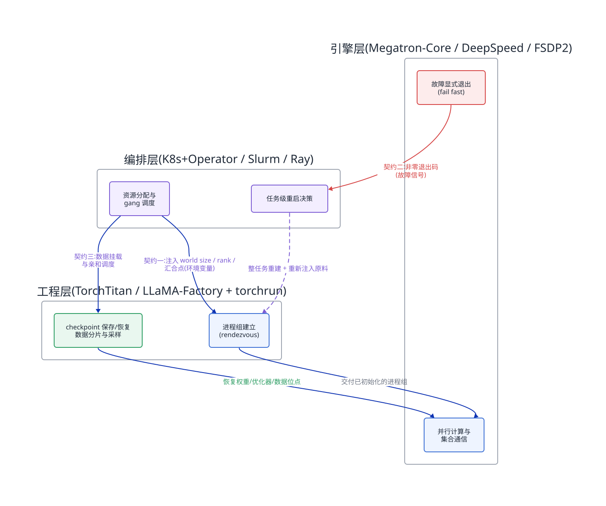
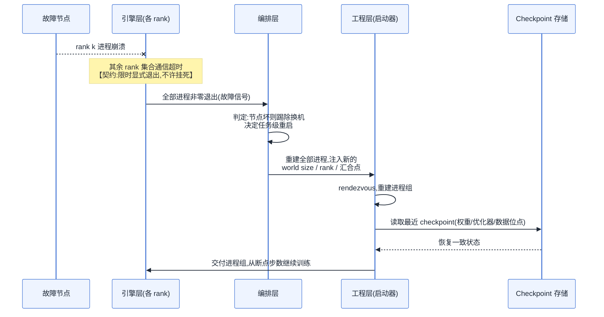
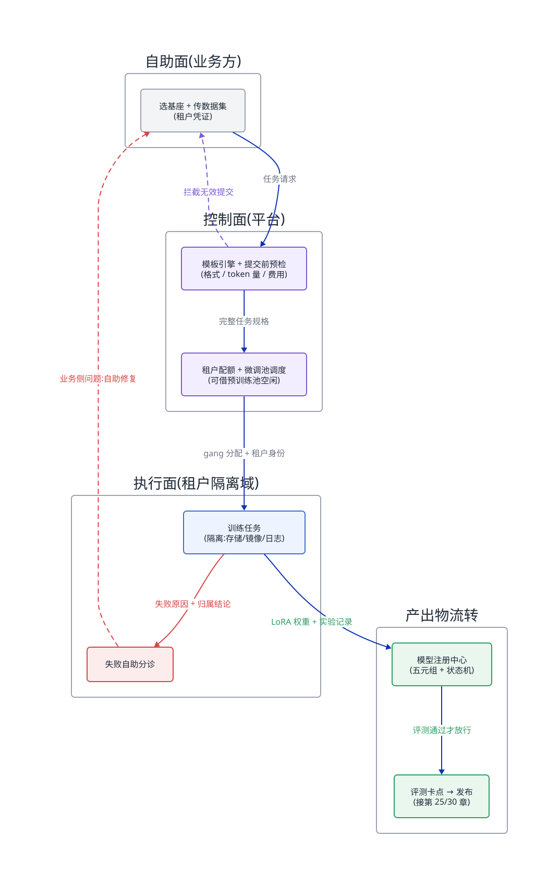
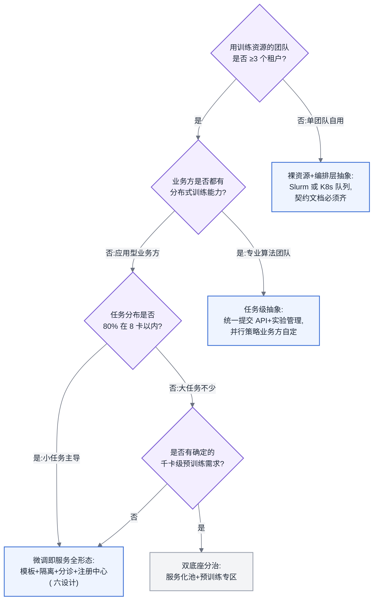

# 第 19 章 训练工程层与编排

## 链路定位与依赖声明

**链路定位**:本章位于主线 A(一次训练任务的生命周期)的最外圈——在数据读取、前反向、梯度同步、checkpoint 这条执行链路之上,回答"这条链路由谁拉起、由谁看护、失败了由谁重启"的问题。前三章讲的是任务跑起来之后发生什么,本章讲的是任务如何被组织成平台上可管理的对象。

**依赖声明**:本章建立在第 18 章的结论之上——并行运行时(Megatron-Core、DeepSpeed、FSDP2)只负责单个任务内部的计算与通信效率,它们默认进程已经被正确拉起、环境已经就绪;这个"默认"由谁兑现,正是本章要补上的缺口。同时,第 16 章的并行组合选型结果,会在本章 [§19.5](#195-微调即服务的平台形态本章最有价值的部分) 中被封装成模板参数。

## 问题场景:被微调任务淹没的平台组

某中型公司的 AI 平台组,三个人,管着 128 张卡。年初业务侧立项了七个大模型应用,每个业务组都要微调自己的模型。平台组最初的做法很朴素:业务方在群里提需求,平台同学手工写一份训练配置、分配几张卡、拉起任务、盯着日志。

三个月后局面失控。队列里常年积压 40+ 个微调任务,平均等待 26 小时;其中 70% 的任务只需要 2–4 卡、跑 3–8 小时,却和一个占 64 卡、要跑两周的继续预训练任务挤在同一个队列里。工单系统里堆着 200 多个故障单,内容高度重复:"任务 OOM 了帮我看看""loss 是 NaN 是不是平台问题""数据集路径读不到"。平台组统计过,这些工单里真正属于平台故障的不到 15%,其余都是业务方配置问题——但每一单都要平台介入,因为业务方既看不到自己任务的日志,也不知道 OOM 该调哪个参数。更糟的是出过一次数据事故:两个业务组的训练数据挂载在同一个共享目录下,A 组的同学误用了 B 组的客服对话数据微调,直到模型上线后回答里冒出 B 组的业务话术才被发现。

平台负责人复盘时说了一句话:"我们把 128 张卡管成了 128 个需要人肉伺候的宠物。"问题不在卡不够,而在平台只建到了"能跑"这一层,没有建到"业务方自己能跑"这一层。这中间差的东西——职责契约、模板、隔离、自助诊断——就是本章的内容。

## 原理与量化模型

### 19.1 工程层:训练框架谱系与适用规模

第 2 章的框架三层地图(见 [§0.4](../ai-infra-book-outline.md#04-框架处置原则))把训练侧栈分为三层:**引擎层**(并行运行时,第 18 章)、**工程层**(训练框架,本节)、**编排层**(集群调度,[§19.2](#192-编排层三种血统三种分工))。工程层的职责是把"模型 + 数据 + 并行策略 + 训练循环"组装成一个可执行的任务,它向下调用引擎层的并行原语,向上暴露配置接口给编排层和用户。

工程层项目可以按"目标规模 × 抽象程度"分成两族:

**大规模预训练族**,以 TorchTitan 为代表。它的定位是 PyTorch 原生的大规模训练参考实现:直接组合 FSDP2、张量并行、流水线并行等原生原语,不引入额外的运行时抽象。它假设用户理解并行策略、愿意读代码改代码,换来的是与 PyTorch 主线同步演进、没有版本锁死。适用规模是数百卡到数千卡的预训练或深度定制的后训练。它的反面是:如果你只想跑一个 LoRA 微调,TorchTitan 给你的自由度全是负担。

**微调工作台族**,以 LLaMA-Factory、Axolotl 为代表。它们的定位是"配置文件驱动的微调工作台":一份 YAML 声明基座模型、数据集格式、训练方法(SFT / LoRA / DPO,概念见 [§3.6](../第一部分-基础与心智模型/第03章-人工智能与大模型基础.md#36-训练范式全景)),框架负责把这些翻译成引擎层调用。适用规模是单机到小几十卡。它们的失效边界非常清晰:**当你需要的并行策略超出框架预置的组合时,配置文件抽象就会漏(leaky abstraction)**——你开始在 YAML 里塞越来越多的透传参数,最后不如直接写代码。经验判断:超过 32 卡、或需要流水线并行、或需要自定义训练循环(如 RL,见第 21 章),就不要再留在这一族里硬撑。

给平台方的量化判断依据:统计你平台上任务的规模分布。行业内微调平台的典型分布是——**80% 以上的任务在 8 卡以内,95% 在 32 卡以内**。这意味着工程层的选型不是"选一个",而是"两族都要接":微调工作台族覆盖长尾的海量小任务,大规模族覆盖头部的少数大任务。试图用一个框架统一两端,是这一层最常见的架构错误。

**所以这对做平台的人意味着什么**:工程层不是平台要"统一"的对象,而是平台要"接入"的对象。平台的接口应该定义在工程层之下(容器镜像 + 启动命令 + 资源规格),而不是绑死某个框架的配置格式——框架两年换一代,平台接口不能跟着换。

### 19.2 编排层:三种血统,三种分工

编排层负责回答:这个任务用哪些节点、什么时候跑、挂了谁管。三个主流选择来自三种血统,它们的差异不是功能列表的差异,而是**世界观**的差异。

**Slurm**:HPC 血统。世界观是"集群是一台大机器,任务是批处理作业"。它的强项是 gang scheduling(帮派调度)是原生语义——一个 512 卡任务要么 512 卡同时拿到,要么整体排队,绝不会拿到一半资源干等;拓扑感知分配也是原生的。弱项是它对"服务"没有概念:没有容器化的原生支持(需要额外组件)、没有多租户的 API 化管理、没有与在线服务共池的能力。失效边界:**当你的集群需要训练与推理混部、需要给业务方暴露 API 而非 SSH 时,Slurm 的运维成本会陡增**。

**Kubernetes + Kubeflow(Training Operator)**:云原生血统。世界观是"一切皆资源对象,任务是一种自定义资源(CRD)"。强项是多租户、配额、镜像分发、与在线服务统一底座——这些正是 [§19.5](#195-微调即服务的平台形态本章最有价值的部分) 微调平台需要的全部基建。弱项是 K8s 调度器天生是为无状态服务设计的,gang scheduling、拓扑感知都要靠附加调度器(Volcano、Kueue 等)补齐,补齐的成熟度决定了你的大任务体验。失效边界:**千卡级同步训练任务对拓扑对齐的要求(见第 16 章并行与域边界对齐)超出附加调度器能力时,你会发现自己在用 K8s 重新发明 Slurm**。

**Ray Train**:计算框架血统。世界观是"任务是一个分布式应用,Ray 是它的运行时"。它其实横跨了工程层和编排层:向下可以跑在 K8s 或裸机上,向上给用户 Python 原生的分布式 API。强项是异构工作流——RL 训练里 rollout 与 train 的资源潮汐(第 21 章)、数据预处理与训练的流水线拼接,这类"一个任务内部有多种角色"的场景是 Ray 的主场。失效边界:**纯粹的同步大规模预训练用 Ray 是负资产**——它的调度灵活性在这里没有用武之地,却引入了一层额外的控制面故障域。

分工结论可以量化成一个判断:数一下你的任务里 **"单任务内部只有一种角色(所有进程做同样的事)"的占比**。占比接近 100%(纯预训练/纯微调),Slurm 或 K8s 二选一,选择依据是"是否需要与在线服务共池、是否需要 API 化多租户";存在多角色任务(RL、在线数据生成),在 K8s 之上叠加 Ray,让 Ray 管任务内编排、K8s 管任务间调度。

**所以这对做平台的人意味着什么**:编排层选型的第一问不是"哪个功能强",而是"我的平台最终形态是批处理集群还是多租户服务"。开篇问题场景里的平台注定要走向微调即服务,那么答案在选型之前就已确定:K8s 底座,大任务体验靠附加调度器补,补不齐的千卡任务单独划一个 Slurm 分区——两套并存不丢人,用一套硬扛两种负载才是事故源头。

### 19.3 三层接口契约【本章核心】

三层各自选完,真正的问题才开始:**层与层之间的职责由谁兑现**。这一层所有的生产事故——重启风暴、进程组挂死、数据重复训练——根源都不是某一层的 bug,而是职责真空:每一层都以为是别人在管。

三层契约必须逐条写清。下面是本书给出的契约基线,以及**每一条越界后会发生什么**。

**契约一:进程组的建立归工程层,进程组的"原料"归编排层。**

分布式训练的进程组(process group)初始化需要三样东西:世界大小(world size)、每个进程的全局序号(rank)、汇合点地址(rendezvous endpoint)。契约是:编排层负责把这三样东西以环境变量或配置注入到每个容器/进程,**保证在进程启动前就绪且全局一致**;工程层(通常经由 torchrun 这类启动器)负责用这些原料完成 rendezvous 和进程组初始化;引擎层只在拿到已建好的进程组之后开始工作。

越界的后果:如果编排层不只注入原料、还试图自己管理 rank 分配的动态变化(比如故障后复用旧 rank 拉新进程),而工程层的启动器同时也在做弹性 rendezvous,两边会各自维护一份成员视图——结果是新进程带着旧 rank 加入,集合通信的拓扑映射错乱,任务不报错但梯度同步的结果是错的,属于最难排查的静默错误(第 20 章)。反过来,如果编排层认为 rendezvous 是工程层的事而不保证网络可达性(比如汇合点 service 晚于训练 pod 就绪),任务会在初始化阶段随机性挂死,表现为"重试几次就好了"的幽灵问题。

**契约二:重启的决策归编排层,重启的可行性归工程层,失败的暴露归引擎层。**

一次训练进程崩溃后,恢复链路跨越三层,每层只做自己那一段:引擎层的责任是**快速、显式地死**——集合通信超时后不许挂着,必须让进程以非零退出码终止,把故障暴露出去;编排层的责任是感知进程/节点失败,决定"原地重启还是换节点重调度",并重新兑现契约一(注入新的进程组原料);工程层的责任是让重启后的进程**能从 checkpoint 恢复到一致状态**——包括模型权重、优化器状态(见 [§3.2](../第一部分-基础与心智模型/第03章-人工智能与大模型基础.md#32-优化器与超参的-infra-含义))、数据读取位置、随机数状态。

越界的后果最典型的有两个。其一,引擎层不肯死:某个 rank 挂了,其余 rank 卡在集合通信里等默认超时(可长达半小时以上),编排层看到的是"进程都活着",不触发任何恢复——千卡任务就这样空烧半小时,这是有效训练时间(第 20 章)最隐蔽的杀手。其二,编排层越权替工程层做恢复:只重启挂掉的那一个 pod,而不重启整个任务。同步训练是全局同步的(第 1 章),单个进程无法单独重新加入一个非弹性的进程组,结果是新 pod 反复 CrashLoopBackOff,其余进程继续挂死等待。正确的语义是**任务级重启**:编排层要理解"训练任务是一个原子单位",这正是 Training Operator / Volcano 这类组件存在的理由,也是拿原生 Deployment 语义跑训练必然翻车的原因。

**契约三:数据分发的切分逻辑归工程层,数据的可达与位置归编排层与数据底座。**

哪个 rank 读哪个分片、epoch 边界如何洗牌、断点续训后从哪个样本继续——这些是训练语义的一部分,必须归工程层(dataloader 的分布式采样器),因为只有它知道 world size 和当前步数。编排层的责任止步于:保证每个节点能以约定路径访问数据(挂载、缓存预热,见第三部分),并把数据位置信息传给调度决策(数据亲和)。

越界的后果:编排层如果替工程层做数据切分(比如按节点预先物理拆分数据集),那么任何一次变卡数续训(第 20 章)都会导致切分与新的 world size 不匹配——轻则部分数据永远读不到,重则部分数据被重复训练多个 epoch,而 loss 曲线上几乎看不出来,直到评测(见 [§3.7](../第一部分-基础与心智模型/第03章-人工智能与大模型基础.md#37-评测与-benchmark-的基本概念))才暴露。工程层如果反过来假设数据在本地盘而编排层实际给的是远程挂载,IO 会成为整条链路的瓶颈(主线 A 第一段),且两边都认为"不是我的问题"。

图 19-1:三层职责边界图。每条跨层边就是一条契约——平台设计的工作量不在框内,而在把每条边写成谁兑现、何时兑现的书面约定。
<!-- source: diagrams/sources/ch19-layer-contracts.d2 -->

重启责任链值得单独画出时序,因为它是三条契约中最容易出职责真空的一条:

图 19-2:一次训练任务的重启责任链。恢复耗时 = 检测(引擎层超时设置)+ 重调度(编排层)+ 状态恢复(工程层),三段分属三层,任何一层没人认领,整条链就断在那一段。

**多角色作业:契约二的边界在移动。** 上面三条契约默认作业内只有一种角色——所有进程做同样的事。第 21 章的 RL 训练打破了这个默认:一个作业里同时存在训练进程、rollout 采样进程、奖励评分服务,各角色的资源画像、失败语义、启动依赖都不同。编排层对这种形态的正确建模,是把整组角色收进**一个生命周期单元**(第 9 章的多角色作业控制器),每个角色映射为单元内的一个子作业模板,并在角色级声明策略:采样进程挂了可以单独补齐,训练进程挂了要整组回滚到 checkpoint,奖励服务先于采样启动——成功与失败的判定都提升到作业级表达。这让契约二的边界发生一次移动:过去"重启的决策归编排层"意味着平台要写代码实现判定逻辑;有了作业级策略后,**工程层的职责变成声明策略(哪种角色的哪类失败对应重启、续训还是判死),编排层的职责收窄为忠实执行声明**。移动之后的越界形态也随之更新:工程层不写声明、指望编排层默认行为兜底,得到的是"任何失败都整组重建"的粗粒度恢复,采样进程一次普通退出就让整个 RL 作业回滚;编排层不认作业级声明、仍按单 Pod 语义自行处置,则回到前文 CrashLoopBackOff 的老事故。策略声明本身应当进入模板([§19.5](#195-微调即服务的平台形态本章最有价值的部分)),和并行策略一样属于"资源侧平台全责"的部分。

**所以这对做平台的人意味着什么**:平台上线训练服务之前,把这三条契约写成文档,并做一次"杀进程演练":随机杀掉一个 rank,秒表计时看任务多久恢复到继续训练。演练暴露的每一分钟空转,都能对应到某条契约的某个真空。

### 19.4 实验管理与超参搜索的基础设施支撑

实验管理系统(MLflow、W&B 一类)在平台视角下不是"记日志的工具",而是**训练任务的元数据库**:一次运行 = 代码版本 + 数据集版本 + 配置 + 指标曲线 + 产出物指针。平台要提供的基础设施支撑只有三条,但每条都要做实:

第一,**采集免配置**:指标上报的 SDK 与后端接入应内置在平台的任务模板里,业务方零配置获得记录。凡是要业务方自己接的采集,覆盖率不会超过一半,而覆盖率不到 100% 的实验库,在做归因和复现时等于没有。第二,**产出物指针而非产出物本体**:实验系统只存 checkpoint 与模型的存储路径和校验和,本体放对象存储(第三部分)——把几 GB 的权重塞进实验系统是常见的把它拖垮的方式。第三,**与调度打通的并发闸门**:超参搜索(hyperparameter search)对平台的真实压力不是算法(网格、贝叶斯还是早停策略,那是算法侧的事),而是它会**成倍放大任务提交量**——一次搜索 = 几十个短任务并发。平台必须支持"搜索组"这一级的配额与优先级:组内任务共享一个配额上限、可被单个命令整组取消、早停信号能真正杀死任务并释放卡。没有这一层,一次失控的搜索能把 开篇问题场景里的队列再堵上一天。

**所以这对做平台的人意味着什么**:实验管理的平台工作量 90% 在"接入路径"而不在"系统本身"。选哪个实验系统是小决策,把它嵌进模板做到零配置采集,才是决定它有没有用的大决策。

### 19.5 微调即服务的平台形态【本章最有价值的部分】

第 21 章讲微调作为技术,本节讲微调作为服务(Fine-tuning as a Service)。这是开篇问题场景那个平台组的出路:把"平台同学人肉伺候每个任务"改造成"业务方自助、平台管水电"。下面按可落地的顺序给出六个设计决策。

**设计一:承认调度诉求相反,物理分池。**

微调负载的画像与预训练完全对立:任务小(2–8 卡为主)、突发强(业务上线前扎堆提交)、生命周期短(小时级)、可抢占性好(重跑代价低)。预训练负载则是长时独占、绝不可抢占、gang 调度刚需。**这两种负载放进同一个队列,任何调度算法都救不了**——小任务被大任务的独占饿死,或大任务被小任务碎片化到永远凑不齐整机。

落地做法是分池 + 单向借用:微调池按峰值突发容量规划,采用配额(quota)+ 抢占式借用——每个业务方有保底配额,空闲时可超用其他组的份额,配额所有者提交任务时按 LIFO 抢占借用者。预训练池整机粒度独占分配。借用只允许单向:微调任务可以借预训练池的空闲期(如两次大任务之间的窗口),且必须可被秒级驱逐;预训练任务不允许反向进入微调池,因为它一进来就是数天级独占,微调池的突发弹性就没了。量化规划依据:微调池容量 = 日常均值负载 ÷ 目标利用率(建议 0.6,留突发余量),排队 SLO 定在"P90 等待 < 30 分钟"——超过这个数,业务方就会开始绕过平台私占资源,自助体系随之瓦解。

**设计二:三条路径的租户隔离,一条都不能少。**

开篇问题场景的数据事故说明,隔离不是合规要求,是事故预防。要隔离的是三条路径,漏掉任何一条,前两条的隔离都会被穿透:

- **存储路径**:每个业务方(租户)一个独立的存储空间(bucket / 子目录 + 独立凭证),训练容器以租户身份挂载,平台侧没有跨租户的通配挂载点。数据集在提交任务时以租户内路径引用,平台校验路径归属。
- **镜像路径**:业务方可以带自定义镜像(装自己的依赖),但镜像仓库按租户划分命名空间,且平台基础镜像与租户镜像分层——租户改不了基础层里的采集与安全组件。镜像是最容易被忽视的穿透面:一个能挂任意 hostPath 的自定义镜像,等于拥有全部数据。
- **日志与指标路径**:训练日志里会打印数据样本(排查数据格式问题时几乎必然打印)。日志系统必须按租户隔离查询权限,否则存储隔离做得再好,B 组的数据还是会从 A 组可见的日志里流出去。

**设计三:模板化——"选个基座 + 传个数据集就能跑"。**

模板是把第 16–18 章的专业知识封装成产品的动作。一个模板 = 基座模型 × 训练方法 × 资源档位的组合,内部固化:并行策略(该基座在该卡数下的最优组合,第 16 章的选型结论)、显存配置(ZeRO 阶段、重计算开关,第 17 章)、超参默认值与允许业务方修改的白名单、数据格式的校验规则。

关键设计判断是**暴露多少参数**。原则:业务方可改的只有影响"效果"的参数(学习率、epoch、LoRA rank 等算法侧超参,分工见 [§3.2](../第一部分-基础与心智模型/第03章-人工智能与大模型基础.md#32-优化器与超参的-infra-含义) 超参三分),不可改的是影响"能不能跑"的参数(并行、显存、批大小的资源侧部分)。理由用越界后果说明:把并行策略开放给业务方,平台就要为每一种业务方自选的错误组合提供 OOM 排障支持——开篇问题场景的工单堆积正是这么来的;反过来平台把学习率也锁死,业务方效果不达标时只能回来找平台,自助又失效了。**边界就划在"资源侧平台全责、算法侧业务方全责",越界一步,对应侧的工单就会流向不该处理它的一方。**

模板还必须内置**提交前预检**:数据格式校验、token 量统计(见 [§3.3](../第一部分-基础与心智模型/第03章-人工智能与大模型基础.md#33-从-nlp-到-llm) 口径)、据此估算训练时长与费用并在提交前展示。预检拦下的每一个错误,都是一张不会被创建的工单。

**设计四:产出物管理——几百个 LoRA 的注册与流转。**

微调平台运行半年后的真实局面是:几百个 LoRA 权重散落在存储里,没人说得清哪个在线上、哪个能删。解法是把产出物纳入模型注册中心(model registry)管理,每个产出物记录五元组:基座模型及版本、训练数据集版本、训练配置指针(接 [§19.4](#194-实验管理与超参搜索的基础设施支撑) 的实验记录)、评测结果、生命周期状态。生命周期用状态机管理:已产出 → 已评测 → 已发布 → 已下线,状态迁移设卡点——**未通过评测集跑分的权重不允许进入"已发布"**,这是平台少数应该强硬的地方,因为一个没评测的模型上线后的事故,最终都会算成平台事故。发布动作对接第 25 章的多 LoRA 部署与第 30 章的上线流程;基座模型升级时,注册中心要能反查"哪些在线 LoRA 挂在旧基座上",这是几百个产出物规模下人脑无法维护的关键查询。

**设计五:成本归属——计费口径就是行为引导。**

两种口径的差别不在财务上,在它引导业务方做什么:

- **按卡时计费**:业务方为占用的资源付费,无论利用率。引导的行为是"少占卡、快释放"——业务方会主动选小资源档、及时删任务;副作用是业务方倾向把卡数压到最低,任务时长拉长,整体吞吐反而可能下降。
- **按 token 计费**(训练消耗的 token 量 × 单价):业务方为有效工作量付费,平台承担效率风险。引导的行为是"多做实验、不心疼资源"——有利于业务创新;但平台必须自己保证模板效率,因为业务方跑得再低效,成本都记在平台头上。

判断:模板成熟度低、业务方自带镜像多(平台控制不了效率)时,用卡时口径,让效率责任跟着控制权走;模板高度标准化、绝大多数任务走平台模板时,可以切换到 token 口径,把效率红利与风险都收归平台。混合形态是常见终态:模板任务按 token,自定义任务按卡时——口径跟着"谁控制效率"走,这本身就是一条协作边界。

**设计六:失败任务的自助诊断。**

开篇问题场景的工单里 85% 是业务方问题,自助诊断的目标就是把这 85% 挡在工单系统之外。做法是把训练失败的常见模式编码成**分诊规则**,任务失败时自动匹配并给出租户可读的结论:OOM(报告显存水位与建议档位)、数据格式错误(报告出错行号)、NaN/loss 发散(指向第 17 章的排查路径,判定为算法侧问题)、平台故障(节点/网络/存储异常,自动转平台工单)。规则库的建设方式是**每一张真实工单关闭时沉淀一条规则**——半年后覆盖率自然爬到 80% 以上。分诊的边界纪律:分诊系统只判断"这是谁的问题",不承诺替业务方修算法问题;它给出的"平台侧/业务侧"结论就是举证,避免每次失败都从"是不是平台问题"的扯皮开始。

图 19-3:微调即服务的平台架构。预检和分诊是两道减法闸门——它们拦下的提交与工单,决定了平台是三个人能运营,还是三十个人也不够。
<!-- source: diagrams/sources/ch19-ftaas-architecture.d2 -->

**所以这对做平台的人意味着什么**:微调即服务的本质是把平台从"执行者"改造成"规则制定者"。六个设计里最优先做的是模板化与自助分诊,因为它们直接消灭人力瓶颈;最不能妥协的是三路径隔离,因为它防的是不可逆的事故。

## 方案对比:平台该建在什么编排底座上

结合 [§19.2](#192-编排层三种血统三种分工) 的三种血统,给出三个完整的平台方案,各自写明失效边界。

**方案一:Slurm 单一底座**。全部训练负载走 Slurm 分区与 QoS 管理。优势:大任务体验最好,gang 与拓扑感知开箱即用,运维界面单一。失效边界:平台一旦要提供 [§19.5](#195-微调即服务的平台形态本章最有价值的部分) 那样的多租户 API 服务、要求三路径隔离、要与推理共池,Slurm 缺少原生多租户与容器编排语义,每一项都要自研外挂——**当自研外挂的代码量超过一个调度器本身,这个方案就已失效**。适用:科研机构、以预训练为绝对主体、业务方都是专业算法团队的场景。

**方案二:K8s + Training Operator + 批调度器,单一底座**。全部负载走 K8s,微调即服务的全部基建(租户、配额、镜像、日志)直接复用云原生生态。失效边界:在千卡级同步任务上,附加批调度器的拓扑对齐与故障处理成熟度是上限——**当你的头部任务规模让"调度器把任务放歪导致 MFU 掉 10%"的损失超过维护第二套系统的成本时,单一底座失效**。适用:微调与中小规模训练为主体、必须与在线服务统一底座的多数企业平台。

**方案三:双底座分治——K8s 管微调即服务,Slurm(或裸机+专用调度)管大规模预训练,Ray 按需叠加在 K8s 上服务 RL 类多角色任务**。优势:每种负载都在其最适合的调度语义下运行,[§19.5](#195-微调即服务的平台形态本章最有价值的部分) 的分池设计天然成立。失效边界:两套底座意味着两套配额体系、两套监控、两套值班知识——**当团队不足以同时养两套系统(经验线:平台工程人力少于 5 人),分治方案会退化成两套都半残**;此外跨底座的资源借用(微调借预训练空闲)需要自建协调层,做不了就要接受两池利用率各自打折。适用:同时有真实的千卡预训练与大量微调业务、且平台团队有足够人力的头部场景。

一句立场:2026 年新建平台,如果没有千卡级预训练的确定需求,**直接上方案二,不要为想象中的大任务预付方案三的复杂度**——真到了需要预训练的那天,再加 Slurm 分区,迁移成本远低于提前维护它两年。

## 大数据对照:自助式数据平台的建设经验迁移

本章的形态,大数据从业者其实见过一遍:2015 年前后各公司建设的自助式数据平台。当年的剧本几乎逐句对应——数据工程团队被业务方的取数需求淹没(对应 开篇问题场景的工单堆积);出路是把 Hive/Spark 封装成 SQL 自助查询平台(对应模板化);用 YARN 的 Capacity/Fair Scheduler 做多租户队列与配额(对应租户配额);用 Ranger/Sentry 做表级权限(对应存储隔离);ad-hoc 查询与夜间 ETL 大作业分队列(对应微调池与预训练池分治);按队列资源用量做成本分摊(对应计费口径)。

可以直接复用的经验有三条。**其一,配额模型与多租户治理的方法论**:保底 + 弹性借用 + 抢占回收的配额三件套,从 YARN 时代到今天语义几乎不变,当年调过 Fair Scheduler 的人设计 [§19.5](#195-微调即服务的平台形态本章最有价值的部分) 的分池会非常顺手。**其二,"平台管引擎、业务管逻辑"的边界划法**:当年 SQL 平台不替业务方改 SQL 逻辑、但保证引擎稳定与队列公平,与本章"资源侧平台全责、算法侧业务方全责"是同一条边界。**其三,自助化的演进节奏**:先模板覆盖高频场景、再逐步开放自定义、用工单沉淀规则库——这套运营方法论原样适用。

失效的经验也有三条,且每条都失效在同一个根子上:**大数据任务是 task 级容错的,训练任务是全局同步的**(第 1 章)。第一,当年的调度器可以把一个 Spark job 的 executor 撒在任意空闲节点上、丢了单个 task 重跑即可,所以队列里塞满碎片化小任务无伤大雅;而训练任务要 gang 调度加拓扑对齐,碎片化直接杀死大任务——分池在当年是优化项,在今天是生存项。第二,当年的隔离主要防"读了不该读的表",泄露面是查询结果;今天的训练日志会把数据样本打印出来,泄露面多了一条当年不存在的路径,所以三路径隔离里日志一环是新增项,拿旧清单照抄会漏。第三,当年失败任务的自助诊断相对简单,因为 SQL 报错是确定性的、行级的;训练失败里有 NaN、静默错误这类非确定性问题,分诊系统必须先回答"平台侧还是算法侧"这个当年不存在的归属问题——这是 AI 平台自助诊断比数据平台难一个量级的原因。

**所以这对做平台的人意味着什么**:如果你建过自助数据平台,本章 [§19.5](#195-微调即服务的平台形态本章最有价值的部分) 的运营框架你已经会了 70%;剩下 30%——gang 调度、日志隔离、非确定性故障归属——恰恰是照搬旧经验必踩的三个坑。

## 选型决策树:我的平台该提供到哪一层的抽象

平台抽象提供得越高,业务方门槛越低,但平台承担的责任越重;提供得越低,平台省力,但开篇问题场景的人肉伺候就会回来。用下面的路径对着自己的场景走一遍:

图 19-4:平台抽象层级决策树。决定抽象高度的不是技术偏好,而是租户数量与业务方能力——业务方越不专业、租户越多,平台越必须往高抽象走。

走到任何一个终点后,再用两条检验确认:第一,你选的抽象层级下,一次典型失败由谁诊断?如果答案是"平台同学看日志",说明抽象提供低了或分诊没建。第二,业务方绕过平台私自要资源的情况多不多?多,说明排队 SLO 或模板覆盖没达标,抽象是空转的。

---

**读完本章,你应当能**:画出编排层、工程层、引擎层的职责边界图,并对每条跨层接口说出"谁兑现、越界会发生什么";能用杀进程演练验证自己平台的重启责任链没有真空;能对照六个设计决策(分池、三路径隔离、模板化、产出物注册、计费口径、自助分诊)设计一套支撑多业务方自助微调的平台方案,并说明每个决策的量化依据与不可妥协项。
