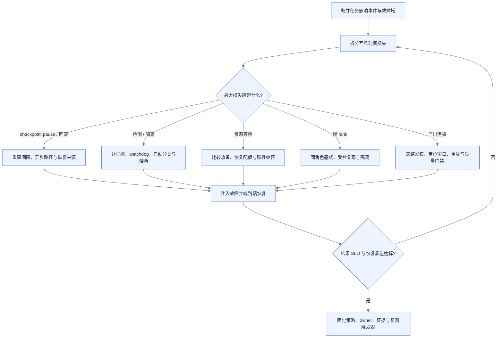

# 第 20 章 稳定性与容错

<ChapterContext
  track="主线 A 的训练运行守护、状态恢复与故障治理"
  question="长周期训练中，怎样从任务受影响事件和时间损失出发，选择检测、checkpoint、恢复、热备与弹性机制？"
  upstream="第 7 章互联域；第 14 章 checkpoint 完成语义；第 16 章并行网格；第 19 章训练编排"
  downstream="第 21 章后训练状态；第 29 章可观测性；第 31 章容量、成本与 SLO"
  inputs="任务事件日志、故障域、任务影响面、检测/隔离/排队/恢复时间、checkpoint pause、回滚量、有效 step 与质量门禁"
  outputs="风险模型、时间损失账、checkpoint 间隔初筛、故障分类矩阵、恢复状态机、演练计划与 SLO"
/>

## 20.1 稳定性的分母是有效训练进度

训练“稳定”不是进程存活，而是在承诺窗口内持续提交可接受的训练进度。崩溃、hang、慢 rank、数据污染、checkpoint 不可恢复、资源重新排队都会减少有效产出，只看节点可用率会遗漏其中大部分。

本章从两个可核算对象出发：任务在统计期内遇到多少个受影响事件，以及每类事件吃掉多少墙钟时间和已完成工作。容错机制只有在减少的期望损失大于自身写入、预留、复杂度和数值风险时才成立。

## 20.2 风险模型必须接上恢复与拓扑事实

[§14.4](../第三部分-数据底座/第14章-存储与Checkpoint-IO.md#144-原理与量化模型) 定义 checkpoint 的容量、关键路径与可恢复提交，[§16.4.5](./第16章-并行策略.md#1645-超节点如何改写并行选型本章重点) 给出逻辑并行组到互联域的映射，[§19.3](./第19章-训练工程层与编排.md#193-三层接口契约本章核心) 划分平台、训练工程层与运行时责任。

本章采用的 checkpoint 一阶公式源于 Young/Daly 类周期 checkpoint 模型。Daly 的模型明确假设 Poisson 单部件失效并以最小化应用运行时间为目标，见 [Daly 论文](https://graal.ens-lyon.fr/~abenoit/CR02/papers/daly.pdf)。实际存在相关故障、异步多级快照、检测延迟或非周期保存时，应使用事件回放或更完整模型。

## 20.3 问题场景:两周十七次重启

<CaseMeta
  type="synthetic-case"
  data-nature="事件数、阶段时长和原因分布均为展示时间损失账的合成输入，不代表生产可靠性基准"
  scope="长周期同步训练任务的两周运行窗口"
  assumptions="17 次重启只是现象；在事件去重、故障域归并和恢复阶段对齐前，不用于外推硬件故障率"
  reproducible="visuals/data/ch20-recovery-timeline.csv；任务侧需另导出 step、checkpoint、调度、节点与通信事件"
/>

一个任务两周内重启 17 次，团队最初把它们都记作“节点故障”。对齐事件后才发现，部分重启共享同一次机架网络事件，部分来自确定性数据错误，另有几次只是 watchdog 主动终止 hang。若把每个 rank 报错都算成独立故障，会高估事件率；若只统计进程退出，又会漏掉 hang 检测、排队和回滚造成的损失。不同统计口径甚至会对同一窗口给出相反的容错投资方向，也会把责任错误地分配给不同团队。

正确的第一张表不是故障机制清单，而是事件账：`event_id`、首次异常时间、检测时间、故障域、受影响任务、首个可信证据、处置、恢复 checkpoint、重新提交有效 step 的时间，以及是否污染既有产出。17 次重启可以对应少于、等于或多于 17 个根因事件；只有去重后的任务影响事件才进入风险模型。

<EvidencePanel
  title="重启次数不能直接充当部件故障率"
  conclusion="先按共同时间窗与故障域归并事件，再把每次损失拆成检测、隔离、资源等待、初始化、恢复和回滚；部件更换记录只用于根因与维修账。"
  source="synthetic-case；§20.4.1～§20.4.3"
>

- 已知：任务在两周窗口发生 17 次重启。
- 必须补采：是否同源、每次事件影响面、失败策略触发次数、最后一个可信 checkpoint 与恢复后质量。
- 暂不能断言：单卡 MTBF、硬件占比、自动恢复收益或下一周期中断次数。

</EvidencePanel>

## 20.4 原理与量化模型

### 20.4.1 失败率模型:故障为什么是常态

若事件相互独立、服从指数分布，且任一事件都会中断任务，任务 hazard 可近似相加：

> `λ_task = Σ_k n_k × λ_k`

在时长 `T` 内，期望中断数 `μ=λ_task×T`，至少发生一次中断的概率为：

> `P(N≥1) = 1 - exp(-μ)`

<BookFigure
  id="ch20-interruption-probability"
  src="../visuals/generated/ch20/interruption-probability.svg"
  alt="Poisson 假设下，任务期内至少一次中断的概率随期望中断次数从零点一增加到四而上升"
  title="图 20-1  先把期望事件数转换成任务中断风险"
  caption="曲线只使用 Poisson 关系，不代表任何卡型或集群的故障率；横轴必须由本地任务影响事件估计。"
  source="公式生成；visuals/data/ch20-interruption-probability.csv"
  license="CC BY 4.0"
  width="wide"
/>

该模型是初筛，不是“卡数除以单卡 MTBF”的自动答案。共享供电、交换、液冷、固件、发布和存储事件具有相关性；同一事件还可能让多个监控源同时报错。生产上应按故障域建立事件类 `k`，从目标任务窗口估计任务影响率及置信区间。样本不足时可做低/中/高情景，但必须把输入标为假设。

规模增大通常会增加暴露部件与相关故障域，却不保证 hazard 严格线性。可靠性决策至少同时保留事件率、单次影响面、检测覆盖和恢复时间。

### 20.4.2 有效训练时间占比:稳定性的唯一北极星指标

本书把“有效训练时间占比”定义为统计期内，最终被质量门禁接受的训练 step 所对应运行时间，占任务已分配墙钟时间的比例：

> `productive_share = accepted_step_time / allocated_wall_time`

它是本书核算口径，不假定等同于某个平台名为 goodput 或 availability 的指标。分母内的时间必须互斥分类：正常有效 step、checkpoint 阻塞、检测、隔离与诊断、资源等待、进程初始化、状态加载、数据回放、失败重算、慢节点拖累和其他暂停。失败后被回滚或质量门禁拒绝的 step 不进入分子。

对周期同步 checkpoint，可用一阶浪费模型初筛间隔 `τ`：

> `W(τ) ≈ C/τ + τ/(2M)`

其中 `C` 是每次阻塞保存时间，`M` 是任务影响事件的平均间隔。最小点为：

> `τ* ≈ sqrt(2CM)`

<BookFigure
  id="ch20-checkpoint-cost-curve"
  src="../visuals/generated/ch20/checkpoint-cost-curve.svg"
  alt="在事件平均间隔四十八小时、阻塞保存五分钟的合成假设下，保存开销随间隔增大而下降，期望回滚损失随间隔增大而上升，总浪费在二者交会附近最低"
  title="图 20-2  Checkpoint 间隔在写入成本与回滚损失之间取平衡"
  caption="曲线只含周期阻塞保存和均匀故障时刻；检测、排队、恢复、相关故障与异步 staging 需要另加。"
  source="合成容量示例；visuals/data/ch20-checkpoint-cost-curve.csv"
  license="CC BY 4.0"
  width="wide"
/>

图中采用 `M=48 h`、`C=5 min` 只是展示曲线结构。上线时 `C` 应取训练真正不能前进的 pause，而不是总上传时间；`M` 应取会使该任务回滚的事件间隔。异步 checkpoint、分层恢复、非指数失效与检测延迟会改变最优点，最终间隔还要满足业务 RPO 和存储突发 SLO。

### 20.4.3 故障检测:三类问题,难度递增

故障按“是否停止进程”和“产出是否仍可信”分类更利于自动处置：

| 表现 | 主证据 | 自动动作 | 转人工条件 |
|---|---|---|---|
| crash / 明确设备错误 | 退出码、设备与内核事件、节点心跳 | 冻结证据，隔离目标故障域，按策略恢复 | 同指纹重复、影响面不清、无可信 checkpoint |
| hang / 无进展 | step 心跳、collective 进度、线程栈、数据等待 | 超时后停止作业并保留各 rank 现场 | 超时反复、无法区分通信/数据/运行时 |
| 产出可疑 / SDC 假设 | loss、梯度与激活统计、已知答案校验、重算对照 | 停止发布产物，标记污染窗口，回滚验证 | 无法确定首次污染点或多次重算不一致 |

功耗、设备活动率和单条 loss 曲线只能作为旁证。NCCL 的 RAS 子系统可查询进程与 communicator 健康、发现无响应进程和 collective 计数不一致，但官方也强调诊断不能覆盖完整数据路径；应与任务心跳、系统日志和受控复现组合使用，见 [NCCL RAS 文档](https://docs.nvidia.com/deeplearning/nccl/user-guide/docs/troubleshooting/ras.html)。

<!-- source: diagrams/sources/ch20-detection-spectrum.excalidraw -->

图 20-3:越安静的异常越依赖跨层证据；自动动作应按证据强度和污染风险分级，而不是所有异常都直接重启。

### 20.4.4 慢节点:比故障更难的敌人

同步训练的 step 关键路径常由最慢并行角色决定，但“某卡慢 15% 就让全任务慢 15%”只在该卡持续位于不可隐藏的关键路径时成立。数据等待、stage 失衡、collective 排队和异构角色也会制造表面上的 rank 差异。

诊断采用同角色横向比较：按 stage、TP/DP/EP 角色和输入形状分组，比较计算段、通信暴露、数据等待、频率/温度与错误计数。健康窗口还要覆盖正常的输入长度变化、编译预热与 checkpoint 周期，避免把角色差异或阶段性抖动误报为硬件退化。告警阈值由健康基线的分布和业务最小可检测劣化确定，不使用跨集群固定百分比。

发现嫌疑对象后先做低风险证据采集；是否主动中断并换卡，要比较“继续运行的累计损失”与“误判、checkpoint 回滚、重排和恢复成本”。隔离进入检修池后用相同负载或已知答案复现，不能把一次慢 step 直接记为硬件故障。

### 20.4.5 故障域的放大:超节点改写全部容错算术【重点】

故障域是会被一个共同事件同时影响的资源集合，可能来自节点、机架、供电、网络平面、存储、控制面或互联域。超节点增加了新的共享部件和恢复约束，但不能仅凭域规模推导域故障率或维修时间。

<!-- source: diagrams/sources/ch20-failure-domain.d2 -->

图 20-4:互联域、故障域和重调度域可能重合，也可能不同；三者都应由部件依赖、并行布局和调度能力验证。

域级容量账采用事件类而不是固定热备率：

> `expected_lost_card_hours = Σ_k event_rate_k × impacted_allocated_cards_k × loss_duration_k`

其中 `loss_duration` 包括检测到再次提交有效 step；`impacted_allocated_cards` 是实际受影响的任务资源，不是域内标称卡数。checkpoint 副本需放在能够耐受声明故障域的位置；“跨域”只有在两个副本不共享目标共同故障点时才成立。

并行组优先落在高速域内，但单卡失效后是否必须整域替换，取决于 communicator 能力、备用 rank、可行并行网格和跨域性能预算。热备按期望等待损失与预留成本联合选择，可采用节点、整域、可抢占容量或预约恢复配额等形式。

### 20.4.6 断点续训与弹性训练:恢复路径的成本结构

恢复不是一个 MTTR 数字，而是一条有 owner 和完成条件的路径：

<BookFigure
  id="ch20-recovery-timeline"
  src="../visuals/generated/ch20/recovery-timeline.svg"
  alt="一次合成训练恢复依次经过检测、隔离、资源等待、进程组初始化、checkpoint 加载和数据回放，每段标出耗时与责任方"
  title="图 20-5  从异常发生到再次提交有效 step 的恢复时间线"
  caption="六段耗时均为合成输入；生产演练应保存每段开始、完成、owner、证据与超时升级条件。"
  source="合成事故；visuals/data/ch20-recovery-timeline.csv"
  license="CC BY 4.0"
  width="wide"
/>

每一段的完成语义不同：检测完成不等于根因确定，资源分配完成不等于进程组可用，checkpoint 加载完成不等于数据游标和 RNG 恢复，重新出现 step 也不等于质量门禁通过。端到端恢复完成点应定义为“连续提交经门禁接受的 step”。

弹性启动器也不会自动保存训练语义。PyTorch Elastic Agent 在 worker 失败或成员变化时会停止并重启 worker；弹性成员变化意味着 `WORLD_SIZE` 可变，应用仍需 checkpoint 和不依赖固定 world size 的代码，见 [Elastic Agent](https://docs.pytorch.org/docs/stable/elastic/agent.html) 与 [torchrun 指南](https://docs.pytorch.org/docs/stable/elastic/run)。

是否缩容续训要验证新网格合法、全局 batch/学习率契约、optimizer 与数据状态重映射、质量门禁和再次扩容成本。收益由实测资源等待时间与缩容吞吐决定，不按“分钟/小时”固定分档。

后训练任务还需声明半条轨迹和有状态环境的处置：可重放就保存策略/环境版本、轨迹前缀与幂等键；不可重放则作废并记录重采量及可能的长度偏差。模型 checkpoint 恢复成功不代表 rollout 状态恢复成功。

### 20.4.7 低精度下的可复现性:什么时候必须 bitwise 一致

不能承诺“同布局断点续训必然 bitwise 一致”。随机数状态、数据顺序、非确定性 kernel、编译器、库版本、硬件和 collective 归约顺序都可能改变结果。PyTorch 官方明确说明跨版本、提交和平台不保证完全复现，且 `use_deterministic_algorithms` 本身不足以保证应用复现，见 [Reproducibility 说明](https://docs.pytorch.org/docs/stable/notes/randomness.html)。

恢复验收分三层：

1. 状态完整：参数、optimizer、scheduler、scaler、RNG、数据游标和自定义状态均恢复。
2. 受控重放：在冻结软件、硬件、输入和并行布局下，对声明的窗口比较张量、loss 与事件序列。
3. 统计/质量等价：在允许网格变化时，用预先约定的容差、重复次数和下游评测判断。

是否要求 bitwise 由测试目的决定。定位污染或做 kernel 回归时可要求受控窗口逐位比较；日常恢复可以采用统计或质量门禁。确定性模式的性能成本必须在目标模型上测量，不能沿用固定百分比。

### 20.4.8 故障演练与 SLO

SLO 从业务容许损失倒推，不使用通用的“五分钟、90%、30 分钟”模板。至少定义：检测延迟分位数、自动处置覆盖率、恢复成功率、恢复时长分位数、回滚 step/token、恢复后质量通过率，以及统计期 productive share。

演练矩阵覆盖 crash、hang、慢 rank、checkpoint 损坏、数据游标不一致、存储不可用、控制面分区和故障域丢失。每次注入都要写明范围、停止条件、回退、owner 和禁止触碰的生产边界；成功标准是端到端恢复及产出验收，而不只是告警触发。

自动重试需要熔断：同指纹连续出现、恢复到同一 checkpoint 后重现、污染窗口不明、故障域无法隔离或资源反复抖动时转人工。首诊责任按证据源和控制权划分，不按“硬件/软件/算法”三个大筐直接甩单。

### 20.4.9 跨集群训练的故障语义

跨集群控制面必须区分 worker 内部失败与整个 worker 集群失联。前者由执行侧按作业失败策略处置；后者才由全局 manager 回收准入并考虑重派。升级条件写成可观察状态，例如租约过期、状态回同步中断、恢复预算耗尽或声明故障域不可用。每个条件都要绑定证据时间戳和负责推进状态的控制器，否则 manager 与 worker 会各自等待对方。

重派前必须有 fencing。每次派发使用单调递增 generation/lease，checkpoint 写入绑定该代次；旧执行者失去租约后不得继续提交。仅删除远端对象并不能证明旧进程停止，控制面网络分区时尤其如此。

双跑与悬挂是两种对称错误：过早重派会让两个代次同时写入，过晚回收会让已死亡作业持续占配额。恢复演练要同时注入 manager—worker 分区、worker 作业死亡和延迟状态回传，验证唯一写者、租约过期和重新排队。

## 20.5 方案对比

| 方案 | 减少的损失 | 新增成本 | 适用证据 | 失效边界 |
|---|---|---|---|---|
| 周期 checkpoint + 人工恢复 | 回滚到有限窗口 | 保存 pause、值班等待 | 事件少且人工响应仍满足结果 SLO | 夜间等待或重复故障占主要损失 |
| 自动检测与恢复 | 缩短检测、隔离与拉起 | 误判、重启风暴、自动化维护 | 故障分类稳定且恢复路径演练通过 | 污染窗口不明、同指纹确定性复现 |
| 热备/恢复配额 | 缩短资源等待 | 预留或抢占成本 | 资源等待是恢复关键路径 | 故障域不匹配或初始化/加载才是瓶颈 |
| 弹性缩扩容 | 在等待期间继续产出 | 网格重构、批量与数值语义 | 新网格合法且缩容 goodput 为正 | 状态不可重映射、质量门禁失败 |
| 冗余执行 | 缩短特定组件切换 | 持续算力与一致性协议 | 期望避免损失大于冗余全成本 | 相关故障同时击穿副本 |

选择顺序由时间损失账决定。某方案若不减少当前最大的互斥损失段，就不应仅因卡数或行业标签上线。

## 20.6 大数据对照:task 级重试与全局同步的容错哲学分野

可迁移的是事件去重、故障域、租约与 fencing、失败策略、血缘、幂等提交和混沌演练。不可直接迁移的是“任一训练 rank 都能像无状态 task 一样独立重跑”的假设。

同步训练中的参数分片、optimizer state、数据位置与 collective 顺序构成共同状态；一个 rank 失败后的恢复范围由框架和并行协议决定，可能是 worker group、某个 communicator 或整个作业，而不是无条件 100%。同样，推测执行并非概念上永远不可用，但复制有状态训练 rank 需要一致性和资源成本，不能照搬批处理的 task 副本。

大数据血缘仍适用于不可变输入、数据预处理和部分 rollout 产物；训练状态链则通常依赖一致 checkpoint。平台工程师应逐对象回答“能重算、能重放还是必须恢复”，而不是用“大数据可局部重试”或“训练只能全局回滚”覆盖所有实现。

## 20.7 选型决策树

图 20-6:容错投入由最大时间损失段驱动；所有分支最终都必须经过故障注入、状态恢复和质量验收。

## 20.8 名词解释

| 术语 | 释义 | 详见 |
|---|---|---|
| 任务影响事件 | 按共同时间窗与故障域去重后、真正让任务受损的事件;重启次数不等于事件数,更不等于部件故障率 | §20.3 |
| hazard(失效率 λ) | 单位时间的失效强度;独立指数假设下任务失效率近似各部件之和,但相关故障使线性外推失真 | §20.4.1 |
| productive share(有效训练时间占比) | 被质量门禁接受的训练 step 时间占已分配墙钟时间的比例,本书的稳定性北极星口径 | §20.4.2 |
| Young/Daly 间隔 | checkpoint 间隔初筛 τ* ≈ √(2CM):保存开销与期望回滚损失的平衡点;假设周期保存与 Poisson 故障 | §20.4.2 |
| crash / hang / SDC | 三类故障:进程崩溃(最易检测)、无进展卡死(靠超时与心跳)、静默数据损坏(产出可疑,最难,靠统计与重算对照) | §20.4.3 |
| watchdog | 监视 step 心跳、超时后主动终止并保留现场的看护机制;hang 的标准处置入口 | §20.4.3 |
| 慢 rank(straggler) | 持续处于关键路径、拖慢全组的参与者;诊断靠同角色横向比较,不靠跨集群固定阈值 | §20.4.4 |
| 故障域(failure domain) | 会被同一事件同时影响的资源集合(供电、交换、液冷、固件…);checkpoint 副本必须放在能耐受声明故障域的位置 | §20.4.5 |
| 热备(spare) | 为缩短资源等待预留的替换容量;形式可以是节点、整域、可抢占容量或预约配额,按期望等待损失定量选择 | §20.4.5 |
| 缩容续训 | 故障后以更小网格继续训练;须验证新网格合法、批量与数值语义、状态重映射和质量门禁 | §20.4.6 |
| bitwise 复现 | 逐位一致的重放;只在受控窗口用于定位污染或 kernel 回归,日常恢复用统计或质量等价验收 | §20.4.7 |
| fencing / generation / lease | 跨集群重派的防双跑机制:每次派发带单调递增代次与租约,旧执行者失去租约后不得继续提交 | §20.4.9 |
| 熔断(自动重试的) | 同指纹重复、恢复到同一 checkpoint 后重现、污染窗口不明等条件下停止自动恢复、转人工 | §20.4.8 |
| 故障演练(injection drill) | 主动注入 crash、hang、慢 rank、checkpoint 损坏等场景,以端到端恢复与产出验收为成功标准 | §20.4.8 |

<ChapterDeliverables :items="[
  '一份按共同时间窗和故障域去重的任务影响事件账',
  '一张互斥时间损失表：有效 step、保存、检测、隔离、等待、加载、回放、回滚与慢节点',
  '一份声明 Poisson/独立性边界的风险情景，以及用本地 M、C 生成的 checkpoint 间隔曲线',
  '一套 crash、hang、慢 rank、产出污染和控制面分区的分类、自动动作与熔断规则',
  '一份覆盖 checkpoint、数据游标、RNG、并行网格和质量门禁的恢复演练报告',
  '一组由业务容许损失倒推的检测、恢复、回滚和 productive-share SLO'
]" />
