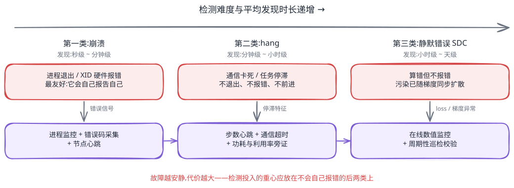
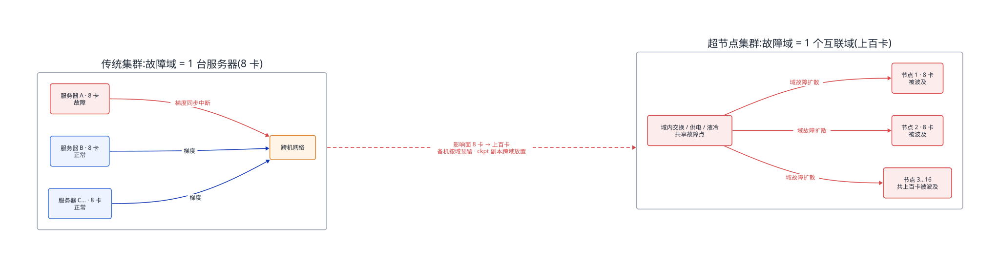
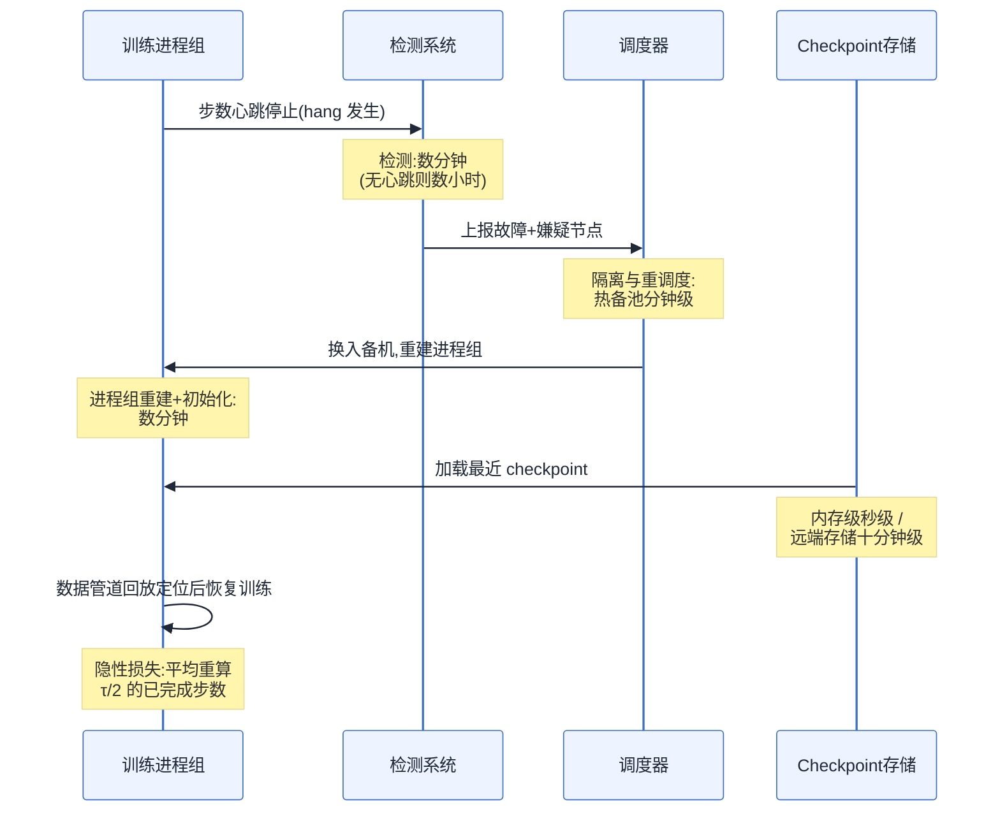
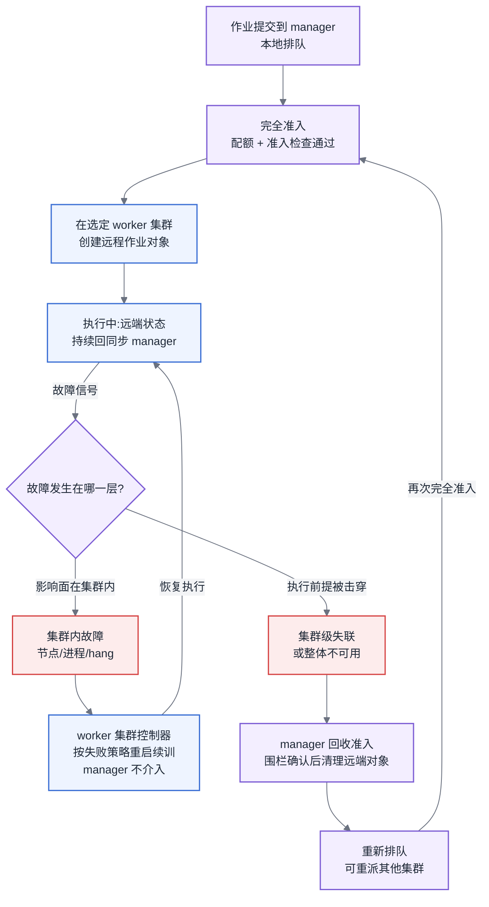
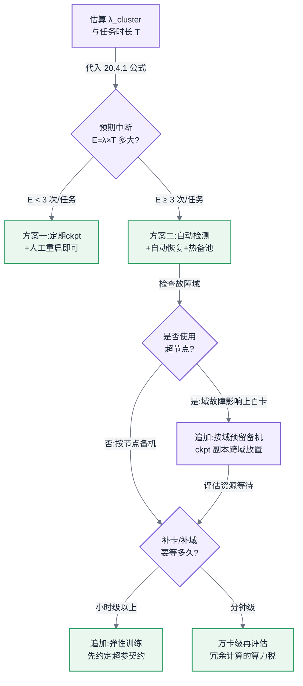

# 第 20 章 稳定性与容错

## 20.1 链路定位

本章位于主线 A"一次训练任务的生命周期"的运行守护段:任务已经由编排层(见第 19 章)拉起、并行策略(见第 16 章)已经定型、吞吐已经调到预期,接下来的问题是让它在数周乃至数月的墙钟时间里持续产出有效训练步——本章管的是"跑得稳"这最后一个字。

## 20.2 依赖声明

本章建立在三条前置结论之上:第 14 章"checkpoint 写入带宽决定了你敢多频繁地保存状态"的 I/O 结论、第 16 章"并行切分要与互联域边界对齐"的选型结论,以及第 7 章对规模层级与互联域(超节点)的定义。第 19 章三层接口契约中"谁负责重启"的职责划分,在本章会被展开成完整的检测—恢复流程。

## 20.3 问题场景:两周十七次重启

一个团队在 1024 卡集群上启动了预计 40 天的稠密模型预训练。前三天风平浪静,第四天凌晨任务第一次挂掉:一张卡 HBM 出现不可纠正 ECC 错误,整个任务崩溃,值班同事凌晨三点被叫起来,人工排除故障节点、从 checkpoint 重启,损失了约 5 小时。团队安慰自己这是运气差。然而接下来两周,任务一共重启了十七次:三次是硬件明确报错,好处理;六次是任务 hang 住——所有卡功耗掉到待机水平,日志停在某个 iteration 不再滚动,没有任何报错,平均每次 hang 要 40 分钟到 2 小时才被人发现;两次是 loss 突然飙成 NaN,回滚到更早的 checkpoint 才恢复,白跑的步数最疼;剩下的是存储抖动、网络链路闪断和一次误操作。团队复盘时算了一笔账:两周墙钟时间里,真正在产出有效训练步的时间只有 60%——四成的卡时烧在了故障检测、排障、重调度、加载 checkpoint 和重算丢失步数上。按这个集群的成本,四成卡时是一个足以让任何管理层坐不住的数字。团队的困惑很典型:"每台机器单独看都挺稳定的,为什么凑到一千张卡就成了这样?"这个困惑的答案是一个可以算出来的数字,而不是运气问题。本章先把这笔账算清楚,再讨论怎么把 60% 拉回到 90% 以上。

## 20.4 原理与量化模型

### 20.4.1 失败率模型:故障为什么是常态

单个部件的可靠性用 MTBF(Mean Time Between Failures,平均无故障时间)刻画。设单个部件的故障率为 λ(单位时间内的预期故障次数,下文统一按次/年计),在部件之间故障近似独立的假设下,N 个部件组成的系统整体故障率是简单相加:

```
λ_cluster = Σ λ_i ≈ N_gpu·λ_gpu + N_node·λ_node + N_link·λ_link + λ_storage + λ_software
```

系统级 MTBF 相应地被除以规模:

```
MTBF_cluster = 1 / λ_cluster
```

一次时长 T 的训练任务,预期中断次数为:

```
E[中断次数] = λ_cluster × T
```

代入工程上常见的量级你就能估自己的集群。经验上,一张训练卡(含 HBM ECC 错误、掉卡、驱动异常)的年故障率在 0.05–0.15 次/卡·年之间,取中间值 0.1;节点级(CPU、内存、电源、风扇)年故障率约 0.2 次/节点·年;网口与光模块按每端口 0.05 次/年计。一个 1024 卡、128 节点的集群:

```
λ_cluster ≈ 1024×0.1 + 128×0.2 + 1024×0.05 ≈ 102 + 26 + 51 ≈ 180 次/年
          ≈ 每 2 天 1 次硬件中断
```

这还只是硬件。生产统计中,硬件故障通常只占任务中断的一半左右,另一半来自软件(框架 bug、数据管道异常、存储抖动、人为误操作)。把软件因素按与硬件同量级估入,千卡任务每 1–2 天中断一次就是常态而非厄运——问题场景里两周十七次(约 0.8 天一次)完全在模型预测范围内。这个模型还揭示了一个更冷酷的推论:**故障频率随规模线性恶化,而单次故障的损失也随规模增长**(所有卡陪着一起停),所以稳定性问题的总代价对规模是超线性的。万卡任务如果照搬千卡的容错配置,预期每 4–6 小时中断一次,checkpoint 间隔若仍是 1 小时,任务几乎无法推进。

所以这对做平台的人意味着什么:容错投入不是"要不要做"的问题,而是先用上面的公式算出自己集群的 λ_cluster,再决定投入到哪一档。凡是没算过这个数字就开千卡任务的团队,都会在第一周被叫醒。

### 20.4.2 有效训练时间占比:稳定性的唯一北极星指标

把稳定性收敛为一个可考核的指标:有效训练时间占比(Effective Training Time Ratio,ETTR,业内也称 goodput 占比):

```
ETTR = 有效训练时间 / 总墙钟时间
     = (T_total − E[中断次数] × T_单次损失) / T_total

T_单次损失 = T_检测 + T_定位与踢除 + T_重调度 + T_加载恢复 + T_丢失步数重算
```

其中最后一项常被忽略却往往最大:若 checkpoint 间隔为 τ,平均每次故障丢失 τ/2 的已完成计算。checkpoint 间隔本身有一个经典的最优解(Young/Daly 公式):

```
τ_opt ≈ sqrt(2 × δ × MTBF_cluster)
```

δ 是写一次 checkpoint 的耗时(由第 14 章的 I/O 带宽决定)。这个公式把三章内容拧在了一起:集群越大(MTBF 越小),τ_opt 越小,要求 checkpoint 越频繁;而 checkpoint 越频繁,对 δ 的要求越苛刻——这正是第 14 章要把 checkpoint 写入做成分层异步的原因。举例:MTBF_cluster = 48 小时、δ = 5 分钟,则 τ_opt ≈ sqrt(2×(5/60)×48) ≈ 2.8 小时;若集群扩到万卡、MTBF 降到 5 小时,τ_opt ≈ 0.9 小时,此时若 δ 还是 5 分钟,光写 checkpoint 就吃掉约 9% 的时间——必须把 δ 压到分钟以下,内存级 checkpoint 由此成为刚需。

生产上的目标设定:千卡任务 ETTR ≥ 90% 是及格线,头部团队能做到 95% 以上;低于 85% 说明检测或恢复链路有明显短板,应先修链路再谈别的优化——ETTR 每提升 5 个百分点,等价于白得 5% 的算力,这通常比任何算子优化的收益都大且确定。

### 20.4.3 故障检测:三类问题,难度递增

任务中断的表现形式分三类,检测难度依次陡增。

**第一类:崩溃(crash)**。进程退出、XID 报错、节点失联。这是最友好的故障——它会自己报告自己。检测手段是常规的:进程监控、加速器错误码(如 NVIDIA XID、昇腾 health 状态)采集、节点心跳。平均发现时长是秒级到分钟级,难点不在检测而在后续的自动化处置。

**第二类:hang(挂起)**。任务不退出、不报错,但也不前进。最常见的根因是集合通信卡死:某张卡因为硬件降速、软件死锁或数据管道饿死没有进入集合通信,其余上千张卡在通信原语里无限等待。检测靠三层手段叠加:(1)训练心跳——iteration 日志或步数计数器超过阈值不更新即告警,这是最简单也最必要的一层;(2)集合通信超时——为每个通信操作设置 watchdog(如 NCCL 的超时机制),超时后主动让任务失败,把"无限等待"转化为第一类故障;(3)功耗与利用率旁证——全体卡功耗同时掉到待机水平是 hang 的强特征,可用于交叉确认。没有这三层的集群,hang 的平均发现时长是"下一次有人看日志的时间",生产上普遍在 30 分钟到数小时,是 ETTR 的头号杀手。

**第三类:静默数据错误(Silent Data Corruption,SDC)**。硬件在不报任何错误的情况下算错了数——某个计算单元老化、某条链路偶发翻转。任务照常推进,loss 曲线却在数千步之后才表现为异常爬升或 NaN,此时污染早已通过梯度同步扩散到所有副本,唯一的解药是回滚到污染之前的 checkpoint,损失以天计。检测手段只有两类:事前的周期性巡检(在空闲时段跑已知答案的计算校验,识别出"会算错的卡")、事中的数值监控(梯度范数、loss 突变、激活值统计的在线检测,配合第 17 章的数值发散排查路径定位)。SDC 无法完全杜绝,只能压低概率、缩短发现时间——这也是为什么 loss 曲线监控不是算法同事的私事,而是平台必须提供的基础设施。



<!-- source: diagrams/sources/ch20-detection-spectrum.excalidraw -->

图 20-1:三类故障的检测难度谱系。故障越安静代价越大,检测体系的投入重心应放在不会自己报错的后两类上。

### 20.4.4 慢节点:比故障更难的敌人

慢节点(straggler)不报错、不掉线,只是慢——散热不良导致降频、HBM 部分 bank 降级、网卡协商到低速率、甚至一块反复可纠正 ECC 的内存条。在全局同步训练里(原因见 20.6 节的对照分析),每一步的速度等于最慢那张卡的速度:一张慢 15% 的卡,让一千张卡集体慢 15%,折算成本与直接损失一整台超节点相当,但监控大盘上一片绿色。

识别手段是横向对比而非阈值告警:同构、同并行角色的卡之间,单步耗时、单卡计算耗时、通信等待时间应当高度一致,持续偏离中位数超过 3–5% 即列为嫌疑;再用第 18 章的运行时剖析工具确认是计算慢还是通信慢。处置纪律只有一条:**踢除并换卡,不在线修**。生产训练不是排障实验室,嫌疑节点先隔离进检修池,由巡检系统离线复现和定位。平台要为此准备的能力是热备资源池与快速重调度——这正好引出下一个问题:换的粒度是多大?

### 20.4.5 故障域的放大:超节点改写全部容错算术【重点】

前面所有模型隐含一个传统假设:故障域是一台 8 卡服务器。一张卡坏,踢一台机器、补一台机器,影响面是 8 卡。超节点(定义见第 7 章)打破了这个假设:当 64、128 乃至数百张卡通过统一的 scale-up 互联域紧耦合在一起,互联域本身成了新的共享故障点——域内交换芯片、共享供电与液冷回路、域控制面固件,其中任何一个出问题,整个域内所有卡同时不可用或不可信。故障域从 8 卡放大到上百卡,三笔账都要重算。

**第一笔:失败率模型加入域级项。**

```
λ_cluster = N_gpu·λ_gpu + N_node·λ_node + N_domain·λ_domain + ...
E[单次故障影响卡数] = P(卡级)×1 + P(节点级)×8 + P(域级)×D
```

D 是域规模。域级故障率 λ_domain 即使不高(交换与供电系统本身有冗余设计),乘上 D 之后对"损失卡时"的贡献也可能超过卡级故障:一次域故障 = D 卡 × 整个恢复时长,而且域级硬件(交换背板、液冷)的维修时间通常以小时到天计,远长于换一台服务器。评估超节点方案时(这也是第 12 章选型读者要带走的判据),必须向厂商索要**域级部件的 MTBF 与维修 SLA**,而不是只看单卡指标。

**第二笔:重调度粒度从节点变成域。** 第 16 章的结论是并行切分要与域边界对齐——TP/EP 通信域整块落在超节点内。这个性能上的最优解在容错上变成枷锁:域内一张卡不可用,这个域承载的 TP 组就残缺了,拓扑感知的重调度往往无法用另一个域里的零散空闲卡拼补(跨域通信性能塌方),实际的重调度单元是**整个域**。备机策略随之改变:传统集群按节点留 2–5% 热备即可;超节点集群的热备必须以域为单位预留——留一整个备用域意味着 D 卡的闲置成本,不留则域故障时任务只能降规模运行或干等维修。这是超节点 TCO 里最容易被忽略的一项。

**第三笔:checkpoint 策略重算。** 域级故障一次性打掉 D 卡,等价于 MTBF_cluster 进一步下降,代入 Young/Daly 公式,τ_opt 进一步缩短;同时域内故障可能连 D 卡上的内存级 checkpoint 副本一起带走,因此内存级快照的冗余副本必须**跨域放置**——这条约束要写进 checkpoint 系统的放置策略里,而不是默认就近。



<!-- source: diagrams/sources/ch20-failure-domain.d2 -->

图 20-2:故障域放大示意。超节点把互联域变成共享故障点,一次域故障的影响面是传统模式的一到两个数量级,备机与 checkpoint 策略必须按域重算。

所以这对做平台的人意味着什么:超节点带来的并行收益(第 16 章)和容错代价(本节)是同一枚硬币的两面,评估超节点方案时两面都要算,只算前一面的方案书是不完整的。

### 20.4.6 断点续训与弹性训练:恢复路径的成本结构

一次完整恢复的时间构成:检测 → 定位与隔离 → 重调度资源 → 进程组重建 → 加载 checkpoint → 数据管道回放定位 → 恢复训练,外加隐性的丢失步数重算。逐项压缩的杠杆各不相同:检测靠 20.4.3 的三层手段(从小时压到分钟);重调度靠热备池(从等人审批压到自动化分钟级);加载靠第 14 章的分层 checkpoint(从对象存储的十分钟级压到内存副本的秒级);丢失重算靠缩短 τ。

**弹性训练**(elastic training)更进一步:不等补卡,先用剩余的健康卡按新的并行布局继续训练,资源恢复后再扩回来。它的收益边界要算清楚:收益 = 等待补卡期间的算力 × 等待时长;代价 = 两次重构开销 + 变卡数带来的两个硬问题——全局 batch size 与学习率是否随卡数变化(这是必须与算法同事事先约定的超参契约,见第 19 章的接口契约),以及 20.4.7 要讲的可复现性破坏。工程判断:热备充足、补卡分钟级的集群,弹性训练的复杂度不值得;补卡以小时或天计(如域级故障等维修、或共享集群要重新排队)的场景,弹性训练才有正收益。**断点续训是所有集群的必修课,弹性训练是特定集群的选修课**——很多团队把顺序做反了。



图 20-3:断点续训完整时序。恢复时间由五段构成,最大的一段往往是隐性的 τ/2 丢失重算——缩短 checkpoint 间隔比优化任何单段流程的杠杆都大。

### 20.4.7 低精度下的可复现性:什么时候必须 bitwise 一致

浮点加法不满足结合律,精度越低(见 [§4.3](../第一部分-基础与心智模型/第04章-硬件第一性原理、架构范式与数值精度.md#43-数值格式与精度全书唯一定义处) 的数值格式定义)误差越大。集合通信的归约顺序取决于拓扑与分块方式,并行布局一变,同一批数据算出的梯度就在低位上不同,经数万步放大后变成肉眼可见的 loss 曲线漂移。因此:**同布局的断点续训可以做到逐位(bitwise)一致**——前提是固定随机种子、数据顺序可回放、关闭非确定性算子(如某些 atomics 实现的算子);**变卡数续训原则上无法 bitwise 一致**,归约顺序变了,漂移是数学必然而非 bug。

工程纪律由此分两档:日常训练只需**统计等价**——续训后 loss 曲线与趋势外推吻合、评测指标在噪声范围内即可,为 bitwise 一致牺牲吞吐(确定性算子通常慢 5–15%)不值得;但三种场景必须追求 bitwise 一致:排查数值发散时(不确定性会掩盖根因,配合第 17 章的排查路径)、怀疑 SDC 时(重算比对是唯一判据)、以及框架/算子升级的回归验证时。平台应把"确定性模式"做成一键开关,而不是让每次排障都从翻文档开始。变卡数弹性续训则要与算法同事事先书面约定:接受统计等价,且约定超参随卡数的换算规则——这条约定没签之前,弹性训练不要上线,否则第一次曲线漂移就会变成算法与平台之间的责任罗生门。

### 20.4.8 故障演练与 SLO

指标不演练就是装饰。参照混沌工程的做法,在预生产或低峰期主动注入故障:杀进程、断网卡、注入通信延迟、模拟慢节点,验证三个数字——检测时长、自动恢复成功率、单次恢复总时长——是否达到设计值。SLO 建议按两级设:对内的工程 SLO(检测 < 5 分钟、自动恢复成功率 > 90%、单次恢复 < 30 分钟),对业务方承诺的结果 SLO(月度 ETTR ≥ 90%)。故障分诊的协作边界必须在演练中一并验证:硬件故障归基础设施团队、框架与通信故障归平台团队、NaN 与数据问题归任务方,每一类都要有明确的首诊责任人和升级路径——边界不清的直接后果是故障发生后半小时内没有任何人开始处置,这半小时全算进 ETTR 的分母里。

### 跨集群训练的故障语义

当组织的卡分布在多个集群——多地域机房、租来的算力供给方——并用管理/执行分离的多集群准入架构统一排队(机制见第 9 章)时,本章的检测—恢复链路多出一层新的归属问题:**故障属于谁**。健康的分层是两条归属线:worker 集群内的故障(节点坏、进程崩、hang)由该集群自己的作业控制器按作业声明的失败策略处置——重启、续训或判死,manager 不感知也不该感知;而集群级的失联或整体不可用,才由 manager 出面——回收这个作业的准入,清理远端对象,让作业回到队列,可重派到另一个健康集群。<!-- claim: CLM-020-001 -->判据是影响面:故障没有击穿"这个集群还能继续执行该作业"的前提,就地处理;击穿了,升级到 manager。

归属线画不清,事故只有两种形态。**双跑**:manager 在失联超时后判定集群不可用、把作业重派到 B 集群,而 A 集群只是控制面网络分区、作业还在训练并往同一个 checkpoint 路径写状态——两份进程同时消耗配额之外的卡,更糟的是可能交错污染 checkpoint。防线是重派前的围栏(fencing):确保旧远端对象删除得到确认、或 checkpoint 路径按派发代次隔离。**悬挂**:worker 集群内作业已经死透(比如失败策略耗尽重试次数后放弃),但状态回同步断在半路,manager 视图里作业仍是"运行中"——配额被一个尸体作业占着,队列后面的作业全部空等,和 9.3 节的死锁一样在大盘上毫无异常。防线是给"运行中"状态加心跳时效:回同步中断超过阈值就按集群失联处理。两种事故的共性是**manager 的视图与 worker 的事实脱节**,所以跨集群架构的容错投入,重心不在故障本身,而在状态同步链路的时效与围栏。



图 20-4:跨集群作业的故障所有权状态流。集群内故障走左环(执行侧自愈),集群级故障走右环(准入侧回收重派)——谁执行谁负责重启,谁准入谁负责回收,两条归属线之外不应存在第三种处置路径。

## 20.5 方案对比

容错能力按投入递增分四档,每档都有明确的失效边界。

**方案一:定期 checkpoint + 人工重启。** 训练框架自带的 checkpoint 加值班响应。投入近乎为零。失效边界:MTBF_cluster 长于响应周期时够用,即**百卡以下、单任务数天**的规模;一旦故障频率进入"每两天一次"区间(按 20.4.1 估算约 500–1000 卡),人工响应的小时级延迟会把 ETTR 直接拖到 80% 以下,且值班成本随规模不可持续。

**方案二:自动检测 + 自动重启(断点续训自动化)。** 三层 hang 检测、错误码采集、嫌疑节点自动隔离、热备自动换入、自动从最近 checkpoint 拉起。这是千卡规模的标配,配合分层 checkpoint 可把 ETTR 做到 90–95%。失效边界有二:一是它假设"重启能解决问题"——对 SDC 和反复复现的软件 bug,自动重启会变成反复崩溃的循环,必须设置重启次数熔断并转人工;二是它假设备机按节点粒度可得——在超节点域级故障面前(见 20.4.5),没有备用域就无机可换,自动化流程原地空转。

**方案三:弹性训练。** 变卡数继续训练,不等资源。失效边界在 20.4.6 已给出:补卡分钟级的集群没有必要;对 bitwise 可复现有硬要求的阶段(数值排障、对照实验)不能用;并行布局受域对齐约束强的任务(大 TP/EP 域)缩容后可能根本排不出合法布局,弹性名存实亡。它真正的适用区间是:共享集群排队时间长、或超节点域级维修以天计、且任务处于对统计等价宽容的常规训练期。

**方案四:冗余计算(热备副本/冗余流水级)。** 为关键并行组配置冗余成员,故障时无缝接管,理论上把恢复时间压到近零。失效边界最清晰:冗余度 r 意味着常态化付出 r 的算力税,只有当"故障损失 > 算力税"时成立,即万卡以上、MTBF 以小时计、且单次中断损失极大的超大任务;千卡及以下规模,这笔税几乎永远算不过来。2026 年的现实判断是:绝大多数团队应该把钱花在方案二加分层 checkpoint 上,方案四只属于最头部的几个玩家。

## 20.6 大数据对照:task 级重试与全局同步的容错哲学分野

这是全书所有"大数据对照"中最重要的一处,因为它解释了为什么大数据时代最引以为傲的容错设计,在 AI 训练面前几乎整体失效。

MapReduce 与 Spark 的容错哲学建立在三块基石上:**任务无状态**——task 是纯函数,输入不可变数据,输出写到新位置,挂了在任何一台机器上重跑即可;**故障影响面局部化**——一个 task 失败只影响它自己,其余数万 task 照常推进,调度器补跑一个即可;**血缘(lineage)代替快照**——Spark 靠记录 RDD 的血缘关系按需重算丢失分区,几乎零成本地获得容错。慢节点问题也在同一哲学下优雅解决:推测执行(speculative execution)对落后 task 直接另起副本,谁先完成用谁。这套设计如此成功,以至于"故障是常态,设计要拥抱失败"成了大数据工程师的肌肉记忆——单机故障率再高,系统整体几乎无感。

同步梯度训练把三块基石全部抽走。第一,训练是**重状态**的:每张卡上的参数分片、优化器状态(见 [§3.2](../第一部分-基础与心智模型/第03章-人工智能与大模型基础.md#32-优化器与超参的-infra-含义))、进程组内的集体状态,共同构成一个不可拆分的全局状态,不存在"把这个 worker 在别处重跑"这回事——重跑必须全体一起回到同一个历史时刻。第二,BSP(Bulk Synchronous Parallel,整体同步并行)语义下每一步都有全局屏障,梯度 All-Reduce 要求所有参与者到齐,**任何一个成员失败,故障影响面就是 100%**——容错的最小单元从一个 task 膨胀为整个作业,这正是 20.4.1 中"损失随规模增长"的根源。第三,血缘重算失效:第 t 步的状态依赖第 t−1 步的全部状态,血缘链就是整个训练历史,按需重算等于从头再训,于是容错手段退回到大数据世界早已边缘化的老办法——**全局一致快照(checkpoint)**,整套 Young/Daly 算术随之回归。推测执行同样失效:训练 worker 有状态且彼此同步,不能"另起一个副本谁快用谁",慢节点只能靠横向对比识别后踢除(20.4.4),这就是慢节点在 AI 场景远比在 Spark 里难缠的原因。

值得注意的是,参数服务器时代的异步训练曾试图把大数据哲学带进来——worker 无须同步、挂了就挂了——但梯度陈旧性对收敛的伤害使它在大模型时代被同步训练全面取代:**算法对一致性的要求,反过来决定了基础设施能用哪种容错哲学**。这是两代基础设施最深的分野:大数据系统用"放松执行一致性"换来了廉价容错,AI 训练用"严格全局一致"换来了收敛质量,容错成本因此必须以另一种方式支付。真正能直接复用的是大数据时代的外围资产:心跳与健康检查体系、黑名单与隔离机制、混沌演练方法论、"故障是常态"的运维文化;而 task 级重试、血缘重算、推测执行这三件核心武器,在同步训练的世界里一件都带不进来。从 Hadoop 转型来的平台工程师最危险的直觉就是"挂了重试就好"——在这里,每一次"重试"都是全体回滚,重试的成本要用 τ/2 × 全集群卡数来计价。

## 20.7 选型决策树



图 20-5:容错投入决策树。先算预期中断次数再决定投入档位,超节点场景必须追加域级备机与跨域副本这一步,不能沿用按节点的老经验。

走读方式:先用 20.4.1 的公式代入自己的卡数、节点数与经验故障率,算出任务期内的预期中断次数 E。E 小于 3,说明你还在人工响应够用的舒适区,把钱省下来;E 上了两位数,自动检测与恢复就是必需品而非优化项。用超节点的集群无条件追加域级备机决策;资源等待时间长的共享集群再考虑弹性训练,且必须先与算法侧签下超参与统计等价的契约。冗余计算永远放在最后评估——先确认前面每一档的收益都已吃尽。

---

**读完本章,你应当能**:用失败率模型算出自己集群在给定任务时长内的预期中断次数与 MTBF,用 Young/Daly 公式定出 checkpoint 间隔,设计一套覆盖崩溃、hang、静默错误三类故障的检测与自动恢复流程,为超节点集群重算故障域、备机粒度与 checkpoint 放置策略,并给出本季度的 ETTR 目标值及其达成路径。
