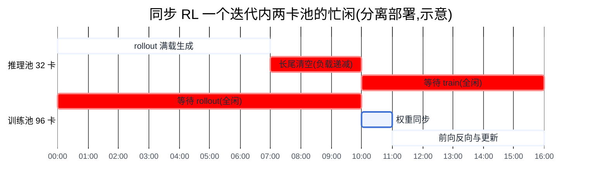
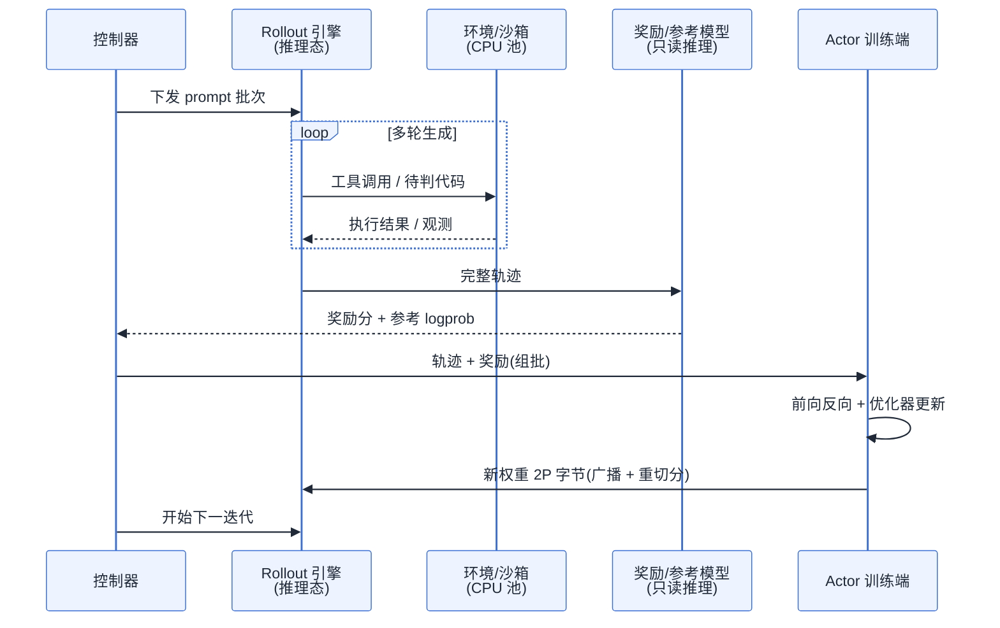
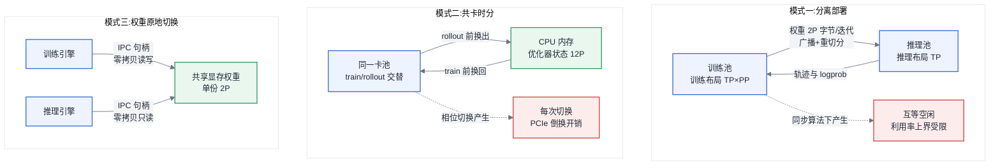
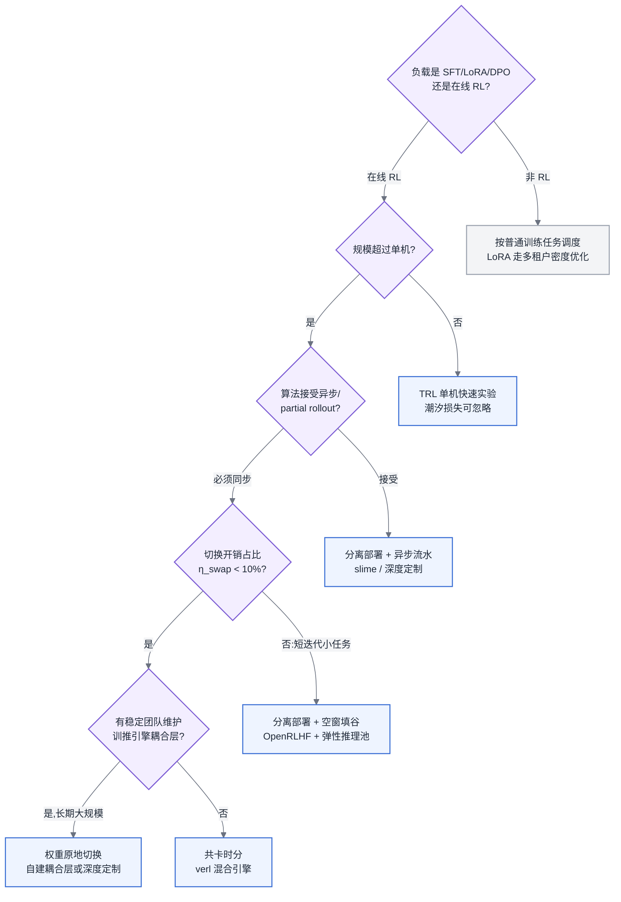

# 第 21 章 后训练基础设施

## 21.1 链路定位

本章位于主线 A"一次训练任务的生命周期"的末端:预训练交付基座模型之后的后训练(Post-training)阶段。这一段的特殊性在于,它是整条训练链路里第一次把**推理**拉进训练循环——从此"训练任务"不再是纯粹的前向-反向-同步循环,而是一个训练引擎与推理引擎交替主导、互相等待的复合系统。

## 21.2 依赖声明

本章建立在三条前置结论之上:§4.2.2 给出的"训练负载与推理负载对硬件配比的要求相反"(训练吃互联与算力,推理吃显存容量与带宽);§6.2 的显存三分与参数换算(权重、梯度、优化器状态的字节数都能从参数量 P 直接算出);以及第 16 章的结论"并行布局是按负载特征定制的,训练布局与推理布局天然不同"。后训练把这三条结论逼到了同一批卡上对撞,这正是本章要处理的核心矛盾。

## 21.3 问题场景:一半的卡永远在看另一半干活

某团队在一个 128 卡的训练集群上对一个 32B 模型做 GRPO 训练(算法概念见 §3.6)。架构是教科书式的分离部署:32 卡跑 vLLM 负责 rollout(经验生成),96 卡跑 Megatron 负责梯度更新,中间用一个 8 卡的奖励模型服务打分。单看每个组件,全都调优过:vLLM 的吞吐对齐了压测基线,Megatron 的 MFU 单测能到 42%,没有任何一个进程"慢"。

但月底账单核算时,整个集群的平均算力利用率只有 13%。挂上 profiling(方法论见 §5.4)一看,时间线上是一幅整齐的"潮汐图":每个迭代周期约 16 分钟,前 10 分钟 rollout 在生成,96 张训练卡整齐地闲着;后 6 分钟训练端在算梯度,32 张推理卡整齐地闲着。更糟的是 rollout 的最后 3 分钟,批内 90% 的样本已经生成完,只剩几条 2 万 token 的长回答在慢慢 decode——推理卡自己也只剩一两成负载。也就是说,任意时刻,集群里大约一半以上的卡在等另一半。

负责人的困惑很典型:"我们没有浪费任何一个组件的性能,为什么整体浪费了 87% 的钱?"这个问题用预训练时代的经验无法回答——预训练里所有卡做同一件事,优化局部就是优化整体;而 RL 训练里,**浪费不发生在任何组件内部,发生在组件之间的相位差上**。这个相位差,就是本章的主线:资源潮汐。

## 21.4 原理与量化模型

### 21.4.1 四种后训练负载的资源画像

后训练不是一种负载,是四种差异极大的负载。概念本身引用 §3.6,显存的定量计算引用 §6.5,本章只回答一个问题:它们各自对基础设施提出了什么**不同于预训练**的要求。

| 负载 | 显存构成 | 是否引入推理引擎 | 典型规模 | 对基础设施的新要求 |
|---|---|---|---|---|
| SFT | 与预训练完全同构(权重+梯度+优化器+激活) | 否 | 单机到数十卡,小时到天级 | 无新要求,就是一次小型预训练 |
| LoRA | 优化器状态只覆盖增量参数,骤减至 GB 级(见 §6.5) | 否 | 单卡到单机 | 任务变小变多,压力从"跑得动"转向调度密度与多租户(见第 11 章) |
| DPO | 双模型前向:policy 训练态 + reference 只读推理态 | 半个(reference 只做前向) | 与 SFT 同量级,显存约 ×1.3–1.5 | reference 可以量化、可以 offload、可以离线预算 logprob——第一次出现"训练任务里挂一个推理组件"的形态 |
| RLHF / GRPO / PPO | 多模型:actor(训练态)+ rollout 引擎(推理态)+ reference + critic/奖励模型 | 完整的推理引擎,且在关键路径上 | 数十到数千卡,天到周级 | 资源潮汐、权重同步、显存倒换——本章余下全部内容 |

这张表的读法是从上往下"推理成分"逐级加重:SFT 里没有推理,DPO 里推理是配角,RL 里推理是主角——rollout 时长通常占迭代周期的 60–80%。§4.2.2 说过训练卡与推理卡的配比逻辑相反,RL 把两种逻辑塞进同一个任务,所以那条界限在这里彻底失效:**不存在"给 RL 用的训练集群",只存在"一半时间是推理集群的训练集群"**。

对做平台的人,这意味着:接到"后训练资源需求"时第一个要问的不是要多少卡,而是四种负载里的哪一种——前两种按普通训练任务对待即可,后两种需要本章的全部机制。

### 21.4.2 资源潮汐的量化

把一个同步 on-policy 的 RL 迭代拆开:

$$T_{iter} = T_{rollout} + T_{reward} + T_{sync} + T_{train}$$

设集群 N 卡按分离部署切成推理池 N_r 与训练池 N_t。同步算法要求 train 用的必须是当前权重生成的完整一批经验,于是两池严格互斥地忙碌,整体利用率的上界是:

$$U \le \frac{N_r \cdot T_{rollout} + N_t \cdot T_{train}}{N \cdot T_{iter}}$$

代入问题场景的数字(N_r=32, N_t=96, T_rollout=10min, T_train=6min, T_iter=16min):U ≤ (32×10+96×6)/(128×16) ≈ 43.8%——这还是把 rollout 阶段推理池算作满载的乐观值。实际还要再乘一个 rollout 内部的**长尾折损**:批内样本的生成长度服从长尾分布,批完成时间由最长样本决定,而卡上的有效负载随短样本陆续完成而递减。若最长样本长度是均值的 k 倍,rollout 池自身的填充率粗略地只有 1/k 到 2/k。k=3 时,上面的 43.8% 再被打到 25% 上下——与场景里实测的 13% 已在同一量级(剩余差距来自权重同步与奖励打分的串行段)。

这组公式给出潮汐问题的完整结构:**空间维度**的浪费(两池互等)与**时间维度**的浪费(长尾拖住整批)。相应地,所有解决方案只有三条出路,后文所有框架与架构都能映射到这三条上:

1. **空间上合并**:让同一批卡在不同阶段扮演不同角色——共卡时分与权重原地切换;
2. **时间上重叠**:放松同步性,让 train 消费上一步权重生成的经验,rollout 与 train 并行——异步/off-policy;
3. **切断长尾**:partial rollout(部分轨迹生成),把未完成的长样本挂起、跨迭代续写,批完成时间不再由最长样本决定——代价是这些样本天然变成 off-policy 数据,与出路 2 殊途同归。

图 21-1:同步 RL 的资源潮汐。红色区域(互等 + 长尾)在任何单组件的 profiling 里都不可见,却吃掉了集群一半以上的算力——RL Infra 的优化对象是相位差,不是组件。

长尾折损还有一层容易漏掉的细节:rollout 引擎内部虽然有 Continuous Batching(见第 22 章)在持续回填,但 RL 的 rollout 批是**封闭批**——本迭代的 prompt 发完就没有新请求可填,调度器的回填能力在批的后半段无米下锅。这与在线推理服务"请求源源不断"的假设正好相反,所以压测在线服务得到的吞吐数字不能直接拿来估 rollout 时长,要按"批清空过程"重新建模:有效吞吐是满载吞吐对时间的积分除以批完成时间,长尾越重折损越大。缓解手段有三个层次:调度层面按预估输出长度把长短样本分桶、长样本先发(代价是需要长度预估器,且估不准时收益归零);算法层面设硬截断长度(代价是截断样本的奖励信号失真,需要算法侧同意);架构层面用 partial rollout 把长样本跨迭代续写——三个层次的侵入性递增,平台侧能独立决定的只有第一个。

对做平台的人,这一节的意味是:RL 集群的利用率指标必须按相位拆开看——rollout 段推理池填充率、train 段训练池 MFU、以及两段之间的串行空隙各是一个独立的优化对象,一个平均利用率数字什么都诊断不了。

### 21.4.3 权重同步:每个迭代搬一次模型

actor 每更新一步,rollout 引擎的权重就过期一步,同步算法要求每迭代把新权重完整推送一次。这笔账必须先算再设计:

$$t_{sync} \approx \frac{2P}{B_{eff}} + t_{reshard}$$

BF16 权重 2P 字节:32B 模型是 64 GB,每迭代一次。B_eff 取决于路径——跨节点走 RDMA/NCCL broadcast,按 50 GB/s 的有效带宽算约 1.3 秒/跳,配合分桶流水可以压进几秒;同节点跨进程走共享显存的 IPC 句柄,接近零拷贝;最差的路径是"落盘再加载",checkpoint 一写一读几分钟就没了——**任何经由文件系统的权重同步方案在 2026 年都没有理由再用**,它把秒级问题做成了分钟级问题。

t_reshard 是更隐蔽的一项:训练布局(如 TP8+PP4,见第 16 章)与推理布局(如 TP4)不同,权重必须重切分(resharding)——每个训练 rank 手里的分片要拆开、重组、发给对应的推理 rank。这是一次全对全的通信加内存重排,实现得差时开销与权重传输本身同量级。现代 RL 框架的核心工程价值之一就是把 resharding 做成自动且流水化的,这也是后面框架对比的评价维度。

工程上还有两个能把 t_sync 从关键路径上部分摘掉的手法。一是**分桶流水**:权重按层分桶,边算好边发,让传输与优化器更新的尾段重叠,而不是等全部更新完再整体广播;二是**同步-预热重叠**:推理引擎收到前几层权重就可以开始重建 KV 池、做图捕获等准备工作,不必等最后一层到齐。两者叠加后,数十 B 模型的权重同步在设计良好的系统里可以压到迭代周期的 1–2%,此时它不再是优化重点;反之,若你的时间线里权重同步占了 5% 以上,先查是不是走了落盘路径或串行 resharding,再考虑任何更花哨的方案。另外,当训练侧使用低精度或量化推理(如 rollout 用 FP8/INT8,见 §4.3)时,同步路径上还要插一步在线量化转换——这步计算不重,但它决定了 rollout 权重与训练权重之间存在系统性的数值偏差,logprob 校正是否需要、由谁负责,必须在算法与平台之间事先约定,这是又一处容易产生职责真空的边界。

### 21.4.4 显存倒换:一张卡装两个世界

若走"空间合并"路线(共卡时分),同一张卡要交替容纳两种显存布局:train 段需要权重+梯度+优化器状态+激活(混合精度下合计约 16P 字节量级,见 §6.2),rollout 段需要推理权重+尽可能大的 KV Cache(KV Cache 由来见 §3.4)。两者相加远超单卡显存,于是每次相位切换都要做**显存倒换**:进入 rollout 前把优化器状态(约 12P 字节)与梯度换出到 CPU 内存,释放的空间让给 KV Cache;进入 train 前反向换回,并让推理引擎释放 KV 与激活缓冲(即推理引擎的"休眠"能力)。

倒换的代价可以直接估:换出量 ≈ 12P 字节,经 PCIe 换出(按当代主流实现约 50 GB/s 的有效带宽估),32B 模型单向约 8 秒,一来一回近 20 秒,再加上推理引擎重建 KV 池的开销。判断是否可接受的标准是切换开销占比:

$$\eta_{swap} = \frac{2 \cdot t_{swap}}{T_{iter}}$$

迭代周期 16 分钟时 η ≈ 2%,完全值得;若做短迭代的小模型实验,迭代周期 1 分钟,η 超过 30%,共卡时分就自己变成了瓶颈。这个比值是后面选型决策树的关键分支。

倒换的工程实现有两个决定实际带宽的细节:换出目标必须是锁页内存(pinned memory),否则 PCIe 有效带宽腰斩,而每节点预留十几到几十 GB 的锁页内存本身要进节点规格——这直接呼应 §4.2.2 的结论:RL 负载对 GPU 节点的 CPU 内存配比提出了比纯训练更高的要求,老一代"GPU 显存 × 1.5 倍 CPU 内存"的采购公式在共卡时分下不够用。其次,优化器状态换出可以与 rollout 首批生成重叠(rollout 早期 KV 占用尚小,显存压力未到峰值),把 t_swap 的一半藏进相位内部——框架是否做了这层重叠,是评估其成熟度的一个快速探针。

### 21.4.5 奖励模型与环境服务:被漏算的第三块资源

预算 RL 集群时最常见的错误是只算 actor 和 rollout,漏掉两块:

**奖励模型(Reward Model)** 本身就是一个推理服务:一个 7B–70B 的模型,吃全量轨迹做前向打分。它的负载曲线与 rollout 错峰(rollout 结束才开始打分),吞吐要求是"在 train 开始前算完一整批",算不完就在关键路径上串行拖长 T_iter。经验量级是占集群 5–15% 的卡数;若同时挂 reference 模型算 KL,再加一份。这两者都是只读推理负载,可以量化(见第 23 章)、可以与其他任务共享推理池——把它们当训练任务申请整卡独占,是纯粹的浪费。

**环境服务(Environment Service)** 在可验证奖励(代码、数学、Agent 任务)的 RL 里取代或补充奖励模型:代码 RL 每个迭代要执行上万次沙箱运行——batch 1024 × 每题 16 个采样 × 若干测试用例,这是一个不折不扣的 CPU 密集型弹性负载,峰值需要数千 CPU 核,且必须隔离(不受信代码)、必须限时(死循环)、必须可横向扩容。它的形态其实是大数据平台最熟悉的无状态短任务,完全应该跑在普通 CPU 弹性资源池上,而不是挤占 GPU 节点的宿主机 CPU——后者是常见事故源:rollout 与沙箱在同一台机器上争 CPU,推理吞吐莫名下降 30%,查了一周才发现是判题进程把核吃满了。

图 21-2:一次 RL 迭代的完整时序。关键路径上串着五类组件,任何一类的吞吐缺口都直接加到 T_iter 上——RL 的容量规划必须五算,而不是只算训练卡。

对做平台的人,奖励与环境这块的意味是两条硬规则:GPU 侧的奖励/参考模型按只读推理服务对待,进共享推理池、允许量化、按吞吐 SLO 而非卡数申请;CPU 侧的沙箱按无状态短任务对待,进独立的 CPU 弹性池并与 GPU 节点物理隔离。凡是把这两类负载写进"训练任务资源单"整卡独占的申请,平台侧都应当打回重报。

## 21.5 方案对比

### 21.5.1 混合架构的三种模式

训练实例与推理实例如何共存,收敛为三种模式。评价坐标只有一个:它在资源潮汐的哪个维度上省了钱,又在哪里付出了代价。

**模式一:分离部署(Disaggregated)。** 训练池与推理池物理分开,各用各的最优并行布局,权重跨网络同步。优点是工程解耦最彻底:两侧可以独立选框架、独立容错、甚至用不同型号的卡(训练用大显存卡,rollout 用推理卡,呼应第 10 章的异构池化)。**失效边界**:在同步算法下它对潮汐无解——21.4.2 的利用率上界公式就是给它算的,两池互等是结构性的。它只在两个条件下成立:要么算法侧接受异步(两池流水线化,互等消失),要么 rollout 池在空窗期能被其他推理负载填充(要求平台有第 25 章的弹性能力)。规模越大、卡越贵,裸用同步分离部署越不可原谅。

**模式二:共卡时分(Time-sharing Colocation)。** 同一批卡交替扮演训练与推理角色,靠 21.4.4 的显存倒换完成相位切换。潮汐的空间浪费直接归零:任意时刻所有卡都在干当前相位的活。**失效边界**有三条:其一,切换开销占比 η_swap 超过 10–15% 时(短迭代、小 batch 的实验性任务),省下的潮汐又亏在了搬运上;其二,模型大到"单份训练态即使 offload 优化器也放不下"时,时分失去前提;其三,训练与推理被迫共享同一组节点,并行布局只能取折中——rollout 想要的小 TP 高并发与训练想要的大 TP+PP 无法同时最优,两边各损失一截效率。它是当前中等规模(数十到数百卡)同步 RL 的默认选择。

**模式三:权重原地切换(In-place Weight Switching)。** 共卡时分的极限形态:训练引擎与推理引擎共享同一份显存里的权重——通过 CUDA IPC 句柄或统一的参数管理层,相位切换只是"换一个引擎来读同一块显存",权重零拷贝,倒换只剩优化器状态与 KV 池的建立/释放。t_sync 中的传输项趋近于零,resharding 也被消掉(两引擎按同一布局读)。**失效边界**:代价是最深的工程耦合——要求训练框架与推理引擎在权重精度、张量布局、并行切分上严格一致,或有一个中间层实时做视图转换;推理引擎必须支持外部权重托管与休眠/唤醒。任何一侧升级版本都可能打破约定,维护成本随两侧迭代速度线性上涨。它适合有专职 Infra 团队、长期稳定跑大规模 RL 的组织,不适合"跑三个月实验就换方向"的团队。

图 21-3:三种混合架构的资源布局。从左到右,潮汐浪费递减而工程耦合递增——选择哪种不取决于哪个更先进,取决于你的切换开销占比和你养不养得起那层耦合。

### 21.5.2 RL 训练框架:四条不同的解题路线

verl、OpenRLHF、TRL、slime 的 API 差异不值得写进书里,值得写的是:面对同一个潮汐矛盾,四个框架给出了四种结构性答案。

**TRL 的答案是"不解决"。** 它把 rollout 和 train 放进同一个进程组,生成阶段直接调训练框架的权重做推理(或挂一个进程内的推理引擎)。这不是缺陷而是定位:它服务于单机到小规模的快速实验,潮汐损失绝对值小,换来的是最低的上手与调试成本。**失效边界**清晰:用训练框架的通用前向做自回归生成,吞吐比专用推理引擎差一个量级;规模一过单机、序列一变长,rollout 时长爆炸,它没有任何潮汐治理手段可用。拿 TRL 跑数百卡的生产 RL,是用错了工具,而不是调优不足。

**OpenRLHF 的答案是"用调度器管分离"。** 它基于 Ray 把 actor、critic、奖励模型、vLLM rollout 组织成独立的分布式角色组,天然是分离部署形态,也支持把角色组共卡放置。它的价值在于把多模型编排从手工脚本变成声明式的资源组装,分离形态下各组件可独立扩缩。**失效边界**:分离形态继承了模式一的全部潮汐问题,同步算法下利用率上界仍由两池时长比决定;共卡形态下的显存倒换与布局折中做得不如专门为此设计的框架深。它适合组件异构性强(比如奖励模型很大、需要独立伸缩)的场景。

**verl 的答案是"混合引擎"。** 它以单控制器统一编排,把训练后端(FSDP 或 Megatron)与推理后端(vLLM 或 SGLang)装配在同一组资源上,默认走共卡时分:框架接管显存倒换、权重同步与训练↔推理布局的自动重切分——21.4.3 里那笔 resharding 的账,verl 把它做成了内置流水。这让"模式二"从一堆手写胶水变成开箱可用,是它成为当前社区默认选项的根本原因。**失效边界**:单控制器要追踪全部数据流与资源相位,规模推到数千卡时控制面本身成为扩展瓶颈;共卡的布局折中依然存在;异步与 partial rollout 属于后补能力,做深度异步定制时框架的同步骨架会开始碍事。

**slime 的答案是"为异步和 Agent 而生的分离"。** 它把 Megatron 训练端与 SGLang rollout 端解耦为两个可独立定制的半边,中间以数据缓冲衔接,rollout 侧暴露充分的自定义接口——多轮工具调用、外部环境交互、partial rollout、异步生成都作为一等公民。它代表第三条出路(切断长尾)与第二条出路(时间重叠)的工程化:rollout 不再是"生成一批然后停下",而是持续生产、按新鲜度消费。**失效边界**:异步与 partial rollout 引入的数据陈旧性(staleness)必须由算法侧显式接受与校正,框架无法替算法背这个锅;其生态与文档成熟度尚在追赶期,团队没有 Megatron 与 SGLang 的运维经验时,两个半边的调试成本都不低。

这里有一条必须写明的**协作边界**:从同步转异步、开 partial rollout,表面上是平台侧的资源优化开关,实质上改变了训练数据的统计性质。这个开关必须由算法侧拍板,平台侧提供的是"开与不开各自的利用率与 T_iter 估算"。越界的后果是具体的:平台为了利用率报表擅自开异步,三周后训练不收敛,归因时算法侧查遍超参而平台侧认为自己只动了调度——职责真空里烧掉的是三周的千卡时。反过来,算法侧要求"绝对同步 + 分离部署"时,平台侧有义务把 21.4.2 的利用率上界算给对方看,让对方为这 50% 的浪费署名。

把四条路线放回潮汐坐标系里,对比可以压成一张表:

| 框架 | 默认架构形态 | 治理潮汐的核心手段 | 空间浪费 | 时间浪费(长尾) | 失效边界一句话 |
|---|---|---|---|---|---|
| TRL | 同进程合一 | 无(靠规模小使损失绝对值小) | 无 | 未治理 | 规模过单机、序列变长即失效 |
| OpenRLHF | 分离部署(Ray 角色组) | 组件独立扩缩,寄望空窗填谷 | 结构性存在 | 未深度治理 | 同步算法下利用率上界锁死 |
| verl | 共卡时分(混合引擎) | 显存倒换 + 自动 resharding | 归零 | 部分治理 | 超大规模控制面瓶颈;深度异步定制受限 |
| slime | 分离 + 异步缓冲 | 异步流水 + partial rollout | 靠重叠消除 | 治理最彻底 | staleness 需算法侧买单;运维门槛高 |

对做平台的人,框架选型的结论可以压缩成一句:**先按 21.5.1 选架构模式,再选原生支持该模式的框架**——顺序反过来(先选了框架再迁就它的架构),就会在潮汐上持续失血而不自知。

## 21.6 大数据对照:流批一体的旧困境

RL Infra 的潮汐矛盾,大数据工程师其实经历过一次,名字叫**流批一体**。

Lambda 架构时代,同一份业务逻辑要维护批处理(Hadoop/Spark)与流处理(Storm/早期 Flink)两套系统、两套资源池——这就是分离部署:各自最优,但两套集群按各自峰值容量规划,错峰时互相看着对方空闲。Kappa 架构主张只留流处理一套系统,批任务当作"有限的流"来跑——这对应共卡时分:一套资源交替承载两种负载形态,省掉了双集群,代价是引擎要为不该它扛的负载做妥协。最终 Flink 走向流批一体运行时:同一引擎、同一份状态、两种执行模式按需切换——精神上最接近权重原地切换:不是两个系统共享机器,而是一个系统内部切换视图。十年演进的方向清晰可辨:**从两套系统,到一套资源,到一套运行时**。RL 框架正在以快得多的速度重演这条路线,verl 的混合引擎就是训练领域的"流批一体运行时"。

可以直接复用的经验有两条。一是**错峰混部**的方法论:大数据平台早就懂得把离线批任务填进在线服务的夜间波谷,RL 的 rollout 空窗期让推理池承接线上流量、train 空窗期让训练池跑 SFT 小任务,是同一套思路,连配额与抢占机制都能沿用(见第 11 章)。二是**把 CPU 密集的弹性负载放回 CPU 池**:21.4.5 的环境沙箱本质上就是一批 YARN 时代的短任务,按无状态短任务调度即可,不需要发明新东西。

但有两条旧经验在这里失效,且失效的原因值得记住。其一,大数据混部的前提是**任务无状态、驱逐代价秒级**——MapReduce task 被抢占,重跑就是;而 RL 的相位切换要搬十几 P 字节的状态,分钟级代价意味着"随时驱逐、随时填充"的细粒度混部模型不成立,潮汐填谷必须以相位为单位整批编排,而不是以 task 为单位见缝插针。其二,大数据的弹性建立在 task 级容错上,而 RL 训练端仍是全局同步负载(见第 20 章):rollout 侧单实例挂掉可以只重采那一批,训练侧单卡故障却是整个训练组的事——**同一个任务内部,两半的容错模型完全不同**,监控与自愈策略必须分开设计,套用任何一半的模型去管另一半都会出事。

所以这对做平台的人意味着什么:面对 RL,你手里那套混部与错峰的旧兵器仍然有用,但必须把调度粒度从"task"换成"相位",把容错模型按训练半边与推理半边拆开——这两处不换,旧经验会精确地把你引向事故。

## 21.7 选型决策树

对着自己的场景走一遍:

图 21-4:RL 混合架构选型决策树。三个判据依次是算法的同步性、切换开销占比、组织的耦合维护能力——前一个是算法侧的决定,后两个才轮到平台侧做主。

几条走树时的补充判断:η_swap 用 21.4.4 的公式代入自己的模型规模与迭代周期即可,不要拍脑袋;"必须同步 + 分离部署"这条路径没有出现在推荐叶子里,因为它的利用率上界(21.4.2)使它只在推理池空窗能被其他负载填满时才成立——填不满,就回到共卡时分;奖励模型与环境服务在任何叶子下都单独规划,GPU 只读推理进共享推理池,沙箱进 CPU 弹性池,不随主架构走。

---

**读完本章,你应当能**:给定模型规模、卡数与算法同步性要求,算出分离部署的利用率上界与共卡时分的切换开销占比,据此在三种混合架构中做出选择并选定匹配的 RL 框架;能为一次 RL 训练列出全部五类资源(actor、rollout、奖励/参考模型、环境沙箱、控制面)的容量清单,并说明潮汐空窗期每一类资源的填充策略。
