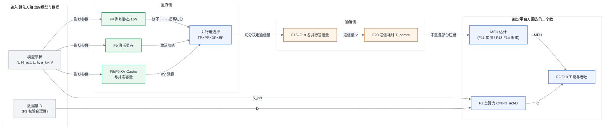

# 附录 B 估算公式速查与符号表

> 本附录汇总第 6、7、16、17 章的全部估算公式,供翻查使用;**每条公式的推导、适用条件与误差来源以正文为准**,此处只标注出处与最简用法。符号与正文完全一致(参数量一律用 N;第 17 章已与全书统一为参数量 N、数据并行度 n,本表的分片数 DP 即第 17 章的 n)。
>
> 公式不会过时,系数会:凡标注"经验值"的数字(MFU 区间、带宽折扣、预留比例),请以自己集群的实测为准。

---

## B.1 全书符号统一定义表

| 符号 | 含义 | 单位/口径 | 定义处 |
|---|---|---|---|
| N | 模型总参数量 | 个 | [§3.5](../第一部分-基础与心智模型/第03章-人工智能与大模型基础.md#35-模型谱系)、[§6.2](../第一部分-基础与心智模型/第06章-模型结构的定量分析.md#62-参数量与资源换算核心) |
| N_act | 每 token 激活参数量(稠密模型 N_act = N) | 个 | [§3.5](../第一部分-基础与心智模型/第03章-人工智能与大模型基础.md#35-模型谱系)、[§6.2](../第一部分-基础与心智模型/第06章-模型结构的定量分析.md#62-参数量与资源换算核心) |
| D | 训练 token 总数 | token | [§3.3](../第一部分-基础与心智模型/第03章-人工智能与大模型基础.md#33-从-nlp-到-llm)、[§6.2](../第一部分-基础与心智模型/第06章-模型结构的定量分析.md#62-参数量与资源换算核心) |
| C | 训练总算力 | FLOPs | [§6.2](../第一部分-基础与心智模型/第06章-模型结构的定量分析.md#62-参数量与资源换算核心) |
| T | 训练时长 | 秒 | [§6.2](../第一部分-基础与心智模型/第06章-模型结构的定量分析.md#62-参数量与资源换算核心) |
| n_卡 | 集群卡数 | 张 | [§6.2](../第一部分-基础与心智模型/第06章-模型结构的定量分析.md#62-参数量与资源换算核心) |
| P_峰值 | 单卡指定精度峰值算力(稠密口径) | FLOPS | [§4.2.1](../第一部分-基础与心智模型/第04章-硬件第一性原理、架构范式与数值精度.md#421-四类范式真正的差异在编译器)、附录 A |
| MFU | 模型算力利用率 = 有效算力 ÷ 峰值算力 | 无量纲 | 第 11 章 |
| b | micro-batch size(全局 batch 记 B_global) | 条 | [§3.1](../第一部分-基础与心智模型/第03章-人工智能与大模型基础.md#31-神经网络与训练三阶段)、[§6.2](../第一部分-基础与心智模型/第06章-模型结构的定量分析.md#62-参数量与资源换算核心) |
| s | 序列长度 | token | [§3.1](../第一部分-基础与心智模型/第03章-人工智能与大模型基础.md#31-神经网络与训练三阶段)、[§6.2](../第一部分-基础与心智模型/第06章-模型结构的定量分析.md#62-参数量与资源换算核心) |
| L | 层数 | 层 | [§6.1](../第一部分-基础与心智模型/第06章-模型结构的定量分析.md#61-算子与瓶颈归属先知道钱花在哪) |
| h | 隐藏维度 | — | [§6.1](../第一部分-基础与心智模型/第06章-模型结构的定量分析.md#61-算子与瓶颈归属先知道钱花在哪) |
| h_ff | FFN 中间维度 | — | [§6.1](../第一部分-基础与心智模型/第06章-模型结构的定量分析.md#61-算子与瓶颈归属先知道钱花在哪) |
| a / a_kv | 注意力头数 / KV 头数(GQA 下 a_kv < a) | 个 | [§6.1](../第一部分-基础与心智模型/第06章-模型结构的定量分析.md#61-算子与瓶颈归属先知道钱花在哪) |
| d_head | 每头维度(h = a · d_head) | — | [§6.1](../第一部分-基础与心智模型/第06章-模型结构的定量分析.md#61-算子与瓶颈归属先知道钱花在哪) |
| V | 词表大小 | 个 | [§6.1](../第一部分-基础与心智模型/第06章-模型结构的定量分析.md#61-算子与瓶颈归属先知道钱花在哪) |
| p | 每元素字节数(按精度取值,见 B.4) | Byte | [§4.3](../第一部分-基础与心智模型/第04章-硬件第一性原理、架构范式与数值精度.md#43-数值格式与精度全书唯一定义处) |
| k | MoE 每 token 激活专家数(top-k) | 个 | [§6.3](../第一部分-基础与心智模型/第06章-模型结构的定量分析.md#63-结构变体的定量代价) |
| ρ | MoE 专家负载比 = max/mean | 无量纲 | [§6.3](../第一部分-基础与心智模型/第06章-模型结构的定量分析.md#63-结构变体的定量代价) |
| M_x | 某类显存占用(下标注明对象) | Byte | [§6.2](../第一部分-基础与心智模型/第06章-模型结构的定量分析.md#62-参数量与资源换算核心)、[§17.4](../第四部分-训练系统/第17章-显存与训练侧精度机制.md#174-原理与量化模型) |
| S_msg | 单次集合通信的消息字节数 | Byte | [§7.4](../第一部分-基础与心智模型/第07章-互联与集合通信.md#74-原理与量化模型) |
| B_eff | 有效互联带宽(按通信组跨过的最低层级取值) | Byte/s | [§7.4](../第一部分-基础与心智模型/第07章-互联与集合通信.md#74-原理与量化模型) |
| TP / PP / DP / EP / CP / SP | 各并行维度的组内卡数(第 16 章正文简记为 t / p / d / e / c) | 张 | 第 16 章 |
| m | 流水线内 micro-batch 数 | 个 | 第 16 章 |
| R | Offload 搬运/计算时间比 | 无量纲 | [§17.4.4](../第四部分-训练系统/第17章-显存与训练侧精度机制.md#1744-offload救命稻草与自欺欺人的分界线) |
| TTFT / TPOT | 首 token 延迟 / 每 token 生成间隔 | 秒 | [§2.4](../第一部分-基础与心智模型/第02章-两条主线解剖与框架地图.md#24-原理与量化模型两条主线与一张分层地图)、[§22.1](../第五部分-推理系统/第22章-推理引擎原理.md#221-kv-cache-与显存) |
| E | 运行能耗(SCI 口径) | kWh(细粒度用 J) | [第 31 章「从电费到碳账」](../第七部分-工程化与治理/第31章-容量、成本与SLO.md#从电费到碳账功能单位与系统边界) |
| I | 电网碳强度(SCI 口径,随地区与时段变化) | gCO2e/kWh | [第 31 章「从电费到碳账」](../第七部分-工程化与治理/第31章-容量、成本与SLO.md#从电费到碳账功能单位与系统边界) |
| M | 硬件隐含排放(SCI 口径,制造与运输碳按折旧分摊) | gCO2e | [第 31 章「从电费到碳账」](../第七部分-工程化与治理/第31章-容量、成本与SLO.md#从电费到碳账功能单位与系统边界) |
| R | 功能单位(SCI 口径:请求 / token / 训练任务 / Agent 任务完成) | 按负载声明 | [第 31 章「从电费到碳账」](../第七部分-工程化与治理/第31章-容量、成本与SLO.md#从电费到碳账功能单位与系统边界) |

> 三处易混符号,全书约定如下:序列长度一律小写 s,集合通信消息大小写 S_msg(第 7 章正文简记为 S,第 16 章简记为 M);batch 一律小写 b,带宽 B_eff 带下标;每元素字节数 p 与第 16 章正文对流水线组卡数的简记 p 是两个不同符号——本表凡涉及并行组卡数一律写全称 PP,p 只表示字节数。另注意 SCI 口径的四个符号自成一组:此处的 M(隐含排放)与显存占用 M_x、通信消息 S_msg 简记无关,R(功能单位)与第 17 章 Offload 的搬运/计算时间比 R 是两个不同符号,遇到时以上下文的碳口径为准。

---

## B.2 公式速查

### B.2.1 算力与训练时长(第 6 章)

| # | 公式 | 用途 | 关键提醒 |
|---|---|---|---|
| F1 | C = 6 · N_act · D | 参数量 → 训练总算力 | MoE 用 N_act 不用 N;s ≥ 128K 时补注意力项 ≈ 每 token 12·L·s·h;重计算把系数 6 推向 7~8 |
| F2 | T = C ÷ (n_卡 · P_峰值 · MFU) | 训练工期 | MFU 是唯一必须实测的量;稠密大规模训练合理区间 35%~45%,MoE 与长上下文更低 |
| F3 | D ≈ 20N(Chinchilla 配比);过训练 D/N = 100~500 | 审视需求合理性 | D/N < 20 的训练计划大概率是数据没备够,预算评审时要问 |

### B.2.2 显存占用(第 6、17 章)

| # | 公式 | 用途 | 关键提醒 |
|---|---|---|---|
| F4 | M_训练静态 = (2 + 2 + 12) · N = 16N Byte | BF16 混合精度 + Adam 的模型状态(参数 + 梯度 + FP32 master/动量/方差) | ZeRO-1/2/3 分别把 12N、+2N、+2N 项除以 DP([§17.4.1](../第四部分-训练系统/第17章-显存与训练侧精度机制.md#1741-显存账本先算清楚再谈优化)) |
| F5 | M_激活/层 ≈ s · b · h · (34 + 5·a·s/h) Byte | 无重计算的每层激活 | FlashAttention/选择性重计算消去括号内第二项;TP 摊薄 h 维 |
| F6 | M_推理静态 = p · N Byte | 推理权重(按部署精度 p) | MoE 按总参数 N 算("装下它看总参,喂饱它看激活") |
| F7 | 工程预留:可用显存 ≈ 标称 × 90%,再留 10%~15% 给碎片与通信缓冲 | 从纸面到上机 | 扣除项明细见附录 A.2 |

### B.2.3 KV Cache(第 6 章)

| # | 公式 | 用途 | 关键提醒 |
|---|---|---|---|
| F8 | M_KV/token = 2 · L · a_kv · d_head · p Byte | 每 token KV Cache | 系数 2 = K + V;MLA 类结构可降 4~8 倍,滑动窗口封顶 |
| F9 | 最大并发 token 数 = KV 显存预算 ÷ M_KV/token | 并发容量 / 长上下文触墙点 | 上下文翻倍 ≈ 同吞吐所需显存翻倍;评估长上下文方案先问注意力结构 |

### B.2.4 吞吐与 MFU(第 6、16 章)

| # | 公式 | 用途 | 关键提醒 |
|---|---|---|---|
| F10 | 训练吞吐(token/s)= n_卡 · P_峰值 · MFU ÷ (6 · N_act) | F2 的另一写法 | 同 F2 |
| F11 | MFU = 实测吞吐 × 6 · N_act ÷ (n_卡 · P_峰值) | 从实测反算 MFU | Decode 类 memory-bound 负载不用 MFU 考核,用带宽利用率([§6.2](../第一部分-基础与心智模型/第06章-模型结构的定量分析.md#62-参数量与资源换算核心)) |
| F12 | 单请求 decode 速度上界 ≈ HBM 带宽 ÷ 每卡权重字节数 | 推理吞吐上界 | 算力再强也破不了;加大 batch 摊薄权重读取后,瓶颈移向 KV 读取 |
| F13 | 流水线气泡率 ≈ (PP − 1) ÷ (m + PP − 1) | PP 的 MFU 上限折扣 | m ≫ PP 才能压住气泡;交错调度(interleaving)可再降(第 16 章) |
| F14 | MoE 有效算力 = 理论算力 ÷ ρ | 负载不均折扣 | 工程上用容量因子 + 均衡损失把 ρ 压向 1.1~1.3([§6.3](../第一部分-基础与心智模型/第06章-模型结构的定量分析.md#63-结构变体的定量代价)) |

### B.2.5 通信量(第 7、16 章)

集合通信原语的单卡通信量(消息 S_msg,组内 K 卡,[§7.4](../第一部分-基础与心智模型/第07章-互联与集合通信.md#74-原理与量化模型)):

| 原语 | 单卡通信量 | 典型用途 |
|---|---|---|
| AllReduce | ≈ 2 · S_msg · (K−1)/K ≈ 2·S_msg | DP 梯度同步 |
| ReduceScatter | ≈ S_msg | ZeRO/FSDP 梯度分片规约 |
| AllGather | ≈ S_msg | ZeRO/FSDP 参数聚合、TP 激活拼接 |
| All2All | ≈ S_msg(但为 K² 条流,对跨域最不友好) | MoE 的 token 路由(EP) |

各并行策略每卡每步通信量([§7.5](../第一部分-基础与心智模型/第07章-互联与集合通信.md#75-方案对比通信成为瓶颈后的三条路)、第 16 章;b 处按梯度/激活精度字节数 p 取值):

| # | 策略 | 公式 | 频率 | 域约束 |
|---|---|---|---|---|
| F15 | DP 梯度 AllReduce | ≈ 2 · (N/TP/PP) · p | 每步 1 次 | 可跨域(与反向重叠) |
| F16 | ZeRO/FSDP | ≈ 3 · (N/TP/PP) · p(含前向重聚) | 每步 | 域内优先 |
| F17 | TP 激活 AllReduce | ≈ 2 · b·s·h · p × 每层 2 次(前向;反向再一遍)× L/PP | 每层每步 | 必须域内 |
| F18 | PP 边界激活 P2P | ≈ b·s·h · p × 流水段数 | 每 micro-batch | 可跨域 |
| F19 | EP All2All | ≈ 2 · k · h · p / token(dispatch + combine),反向再一遍 | 每 MoE 层每步 | 必须域内 |
| F20 | T_comm ≈ V_通信量 ÷ B_eff + 启动延迟项 | 通信耗时 | — | B_eff 按跨过的最低层级取值,并打 60%~80% 折扣;同一公式换 B_eff 结论差一个量级 |

### B.2.6 Offload 收益边界(第 17 章)

| # | 公式 | 用途 | 关键提醒 |
|---|---|---|---|
| F21 | R = (每步搬运字节数 ÷ PCIe 有效带宽) ÷ 每步纯计算时间 | offload 是否自欺欺人 | R ≪ 1 近似免费;R → 1 吞吐腰斩;NVMe 再降一个量级带宽 |

---

## B.3 公式依赖关系图

图 B-1:估算公式依赖关系。估算的正确顺序是先用显存公式定并行度、再用并行度算通信量、最后由通信折扣修正 MFU 进入工期公式——跳过中间两步直接拍 MFU,就是正文开篇那笔三倍虚高预算的来源。

---

## B.4 精度对照表

与 [§4.3](../第一部分-基础与心智模型/第04章-硬件第一性原理、架构范式与数值精度.md#43-数值格式与精度全书唯一定义处) 的格式谱系对齐,与附录 A 的分精度算力列对齐。"有效位数"指有效数字约合十进制位数(含隐含位)。

| 格式 | 每元素字节数 p | 动态范围(约) | 有效位数 | 硬件原生支持代际 | 典型用途 |
|---|---|---|---|---|---|
| FP32 | 4 | $\pm 3.4\times10^{38}$ | ~7 位 | 全部代际 | master weights、累加器、LayerNorm 等敏感算子 |
| TF32 | 4(存储)| 同 FP32(8 位指数) | ~3 位 | NVIDIA Ampere 起 | 旧 FP32 代码在 Tensor Core 上无改动加速 |
| FP16 | 2 | ±65504(5 位指数) | ~3 位 | Volta 起;各家普遍支持 | 推理;训练需 loss scaling([§17.5](../第四部分-训练系统/第17章-显存与训练侧精度机制.md#175-方案对比显存不够的三条路线)) |
| BF16 | 2 | 同 FP32(8 位指数) | ~2 位 | Ampere / TPU / 昇腾 910 系起 | 训练默认格式;免 loss scaling |
| FP8 E4M3 | 1 | ±448 | ~1 位 | Hopper / MI300 / 昇腾 910C 代起 | 前向权重与激活(W8A8 的 FP8 路线) |
| FP8 E5M2 | 1 | ±57344 | <1 位 | 同上 | 梯度(要范围不要精度);scaling 策略见 [§17.5](../第四部分-训练系统/第17章-显存与训练侧精度机制.md#175-方案对比显存不够的三条路线) |
| FP6(MX 块缩放) | 0.75 | 依块共享指数 | <1 位 | Blackwell / CDNA4 起 | 推理权重压缩的中间档 |
| FP4 / MXFP4(E2M1 + 块缩放) | 0.5 | 单元素 ±6,块内共享缩放扩展 | <1 位 | Blackwell / MI355X 起 | 推理权重(W4);2026 年训练侧仍属前沿 |
| INT8 | 1 | ±127 × per-tensor/channel scale | 依校准 | 全部代际(DP4A/IMMA 起) | 经典量化推理 W8A8(INT 路线) |
| INT4 | 0.5 | ±7 × 分组 scale | 依校准 | 硬件支持零散,多以权重打包 + 反量化实现 | W4A16(GPTQ/AWQ 系);带宽受限场景收益最大 |

读法提醒(正文结论重申):W8A8 / W4A16 / W4A8KV4 记法中三段分别指权重、激活、KV Cache 的位宽([§4.3](../第一部分-基础与心智模型/第04章-硬件第一性原理、架构范式与数值精度.md#43-数值格式与精度全书唯一定义处));**降精度省的资源各不相同**——降权重省显存与权重读带宽(利好 Decode,F12),降激活才省算力(利好 Prefill),降 KV 省的是并发容量(F9)。选格式前先用 Roofline([§4.4](../第一部分-基础与心智模型/第04章-硬件第一性原理、架构范式与数值精度.md#44-roofline-模型))判断你到底缺哪一样。

---

*公式与符号勘误见[本地勘误页](../ERRATA.md#附录-b估算公式与符号表)。*
