# 附录 G 主流大模型推理框架系统全景

> 推理技术栈的横向全景速查:引擎、服务层、集群控制面、KV Cache 基础设施、编译器与硬件后端的分层地图与选型方法。与正文的分工:机制原理见第 22 章、服务化架构见第 24 章、弹性与多模型见第 25 章、网关见第 27 章;项目版本快照见附录 C。
>
> 数据口径日期:2026-09。框架版本、支持模型、量化格式、硬件兼容性和部署接口变化很快,一律以项目官方文档与实际压测结果为准;引用前先查[勘误与更新](../ERRATA.md)。

## 一、核心结论

### 1.1 大模型推理框架不是同一个层级的产品

业界经常把 vLLM、SGLang、TensorRT-LLM、Triton、Ray Serve、KServe、llama.cpp 放在同一个表格中比较，但它们解决的问题并不相同。

一个完整的大模型推理系统通常由以下六层组成：

| 层级 | 核心职责 | 代表项目 |
|---|---|---|
| 接入与网关层 | OpenAI API、鉴权、限流、配额、租户、路由、协议转换 | Envoy、API Gateway、SGLang Model Gateway |
| 集群控制层 | 部署、扩缩容、负载均衡、多节点调度、故障恢复 | Ray Serve LLM、KServe、llm-d、NVIDIA Dynamo |
| 模型服务层 | 模型仓库、版本管理、动态批处理、通用推理协议 | Triton、BentoML、OpenVINO Model Server |
| LLM 推理引擎层 | Continuous Batching、KV Cache、解码、采样、模型并行 | vLLM、SGLang、TensorRT-LLM、LMDeploy、FastDeploy |
| KV Cache 与数据传输层 | KV 复用、分层缓存、卸载、跨节点传输、PD 解耦 | LMCache、Mooncake、KVBM、NIXL |
| 编译器与硬件执行层 | Kernel、图优化、量化、算子融合、硬件指令适配 | CUDA、Triton、CUTLASS、FlashInfer、MLC、OpenVINO、MLX |

因此，生产系统的真实选型通常不是“只选一个框架”，而是组合成：

```text
Gateway
  + Serving Control Plane
  + Inference Engine
  + KV Cache / Data Plane
  + Hardware Backend
```

典型组合包括：

```text
KServe + llm-d + vLLM + LMCache
NVIDIA Dynamo + TensorRT-LLM + KVBM
Ray Serve LLM + SGLang
Triton + TensorRT-LLM
单机 vLLM / SGLang
llama.cpp / MLX-LM 本地推理
```

### 1.2 选型的默认起点

- **通用 GPU 推理服务**：优先评估 vLLM。
- **Agent、结构化输出、高前缀复用**：重点评估 SGLang。
- **NVIDIA 固定硬件、固定模型、极致性能**：重点评估 TensorRT-LLM。
- **Kubernetes 大规模集群**：评估 KServe、llm-d。
- **Python 分布式模型应用**：评估 Ray Serve LLM。
- **NVIDIA 大型 GPU 集群与 PD 分离**：评估 NVIDIA Dynamo。
- **本地、桌面、CPU 与消费级 GPU**：优先评估 llama.cpp。
- **Apple Silicon**：优先评估 MLX-LM。
- **浏览器、移动端和多种图形后端**：评估 MLC-LLM。
- **昇腾 NPU**：评估 MindIE、FastDeploy、LMDeploy 等适配路线。

### 1.3 不存在脱离工作负载的“绝对最快框架”

一个推理系统是否适合生产，取决于：

- 模型架构与参数规模；
- GPU、NPU、CPU 和互联类型；
- 输入长度与输出长度分布；
- 请求并发与到达模型；
- TTFT、TPOT、ITL 与吞吐 SLO；
- Prefix Cache 命中率；
- 多 LoRA、多租户和模型数量；
- 是否需要结构化输出、工具调用和推测解码；
- 是否接受量化带来的质量变化；
- 运维复杂度、版本稳定性和团队能力。

正确的方法不是只看公开 Benchmark，而是基于真实流量回放，在相同条件下比较 **P95 TTFT、P95/P99 ITL、有效吞吐、GPU 利用率、显存占用、失败率、质量损失和单位成本**。

---

## 二、大模型推理技术栈分层

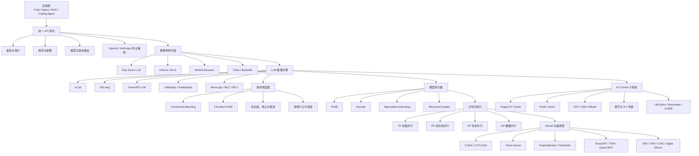

### 2.1 接入与网关层

接入层负责把外部应用请求转换为内部统一的推理请求，常见职责包括：

- OpenAI Chat Completions、Responses、Completions、Embeddings 等兼容接口；
- Anthropic、Google 或企业内部协议转换；
- API Key、JWT、OAuth、mTLS 等鉴权；
- 租户隔离、套餐、额度与配额；
- QPS、并发数、Token 数和费用限流；
- 模型别名、版本、地域和硬件路由；
- A/B 测试、灰度发布与流量镜像；
- 请求体校验、提示词安全检查和内容治理；
- 流式响应代理、超时、断开与取消传播。

对于 Agent 平台，网关层还经常承载：

- Tool Schema 规范化；
- Structured Output 约束下发；
- 会话亲和性；
- 预算和最大推理步数；
- Prompt、Tool、Memory 与 Trace 元数据注入。

### 2.2 集群控制平面

控制平面负责“把请求发到正确的 Worker”，并保证整个推理集群可扩缩、可升级和可恢复。

典型职责：

- 模型实例声明与生命周期管理；
- 模型权重下载和缓存；
- GPU、节点、NUMA 和拓扑感知调度；
- 自动扩缩容；
- 健康检查和故障转移；
- 多副本负载均衡；
- Prefix-aware / KV-aware Routing；
- Prefill Worker 与 Decode Worker 比例调整；
- 多租户资源配额；
- 滚动升级、蓝绿发布和 Canary；
- 跨地域和多集群路由。

### 2.3 模型服务层

模型服务层将模型和推理后端包装成稳定的网络服务，通常提供：

- HTTP、gRPC、SSE、WebSocket 等服务协议；
- 模型仓库和模型版本；
- 服务启动、停止和热加载；
- 动态批处理；
- 多模型编排；
- 健康检查、指标和日志；
- 请求前处理和后处理；
- Python、ONNX、TensorRT 等多后端支持。

需要区分：

> 通用模型服务器的 Dynamic Batching，与 LLM 推理引擎的 Continuous Batching 不是同一个概念。

前者主要在执行前聚合请求；后者在逐 Token 解码的每一轮动态加入、移除和重排序列。

### 2.4 LLM 推理引擎层

推理引擎是 Token 生成数据面的核心，负责：

- Tokenization 与输入准备；
- 请求排队和 Admission Control；
- Prefill 与 Decode 调度；
- Continuous Batching；
- KV Cache 分配与回收；
- Attention、MLP、MoE 等模型计算；
- 采样、Beam Search、Grammar Decoding；
- Speculative Decoding；
- LoRA Adapter 加载；
- Tensor、Pipeline、Expert 和 Data Parallel；
- 流式 Token 输出。

### 2.5 KV Cache 与数据平面

在长上下文、多轮对话和 Agent 场景中，KV Cache 往往成为决定吞吐和成本的核心资源。

该层主要负责：

- GPU KV Cache 分页分配；
- 公共前缀识别与复用；
- CPU 内存、SSD 或远端存储卸载；
- 跨实例和跨节点 KV 传输；
- Prefix-aware 路由；
- KV Cache 生命周期、版本和一致性；
- 多租户隔离、配额和加密；
- 命中率、淘汰率与传输带宽监控。

### 2.6 Kernel、编译器与硬件层

该层决定模型算子最终如何在硬件上执行，主要涉及：

- GEMM / GEMV；
- Attention Kernel；
- FlashAttention；
- Paged Attention；
- MoE Grouped GEMM；
- Quantization Kernel；
- CUDA Graph；
- Kernel Fusion；
- TensorRT 图优化；
- Triton 自定义 Kernel；
- TVM / MLC 编译；
- OpenVINO 图优化；
- Metal / MLX；
- CANN / Ascend 后端。

---

## 三、一次推理请求的完整运行链路

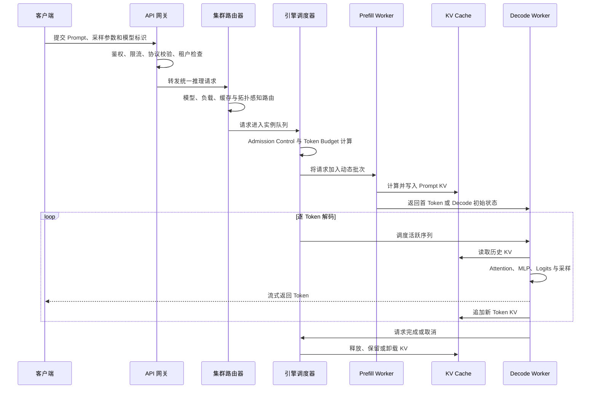

### 3.1 请求接入

客户端通常提交：

```json
{
  "model": "example-model",
  "messages": [
    {"role": "system", "content": "You are a helpful assistant."},
    {"role": "user", "content": "Explain KV cache."}
  ],
  "temperature": 0.7,
  "max_tokens": 1024,
  "stream": true
}
```

网关会完成：

1. 认证与租户识别；
2. 请求参数校验；
3. 最大上下文和预算校验；
4. 模型别名解析；
5. 限流和配额检查；
6. Trace ID 和业务元数据注入；
7. 路由到模型服务或推理集群。

### 3.2 Admission Control

Admission Control 决定请求能否进入执行队列。

常见判定维度：

- 输入 Token 数；
- 最大输出 Token 数；
- 当前可用 KV Block；
- 当前并发序列数；
- 租户配额；
- 请求优先级；
- Deadline 和超时时间；
- 是否允许抢占；
- 是否允许 CPU / SSD Offload。

一个生产系统不能只靠“所有请求都进入队列”，否则容易造成：

- 队列无限增长；
- P99 TTFT 失控；
- KV Cache 耗尽；
- 大请求拖垮小请求；
- 高优先级请求无法得到保障；
- 取消请求长期占用资源。

### 3.3 请求调度

调度器需要同时优化多个目标：

- 最大化 GPU 利用率；
- 降低 TTFT；
- 降低 ITL 抖动；
- 控制 KV Cache 使用；
- 保证租户公平性；
- 避免长 Prompt 阻塞 Decode；
- 及时处理取消和超时；
- 在吞吐与尾延迟之间平衡。

因此，现代推理调度不再只是“凑一个最大 Batch”，而是 Token 粒度的在线调度问题。

### 3.4 流式输出与取消

流式推理通常使用 SSE 或 gRPC Stream。

必须正确处理：

- 客户端主动断开；
- 上游 Gateway 超时；
- 用户点击停止生成；
- 服务端达到最大 Token；
- 内容安全策略中止；
- Worker 异常；
- Decode 超时；
- 取消传播和 KV 资源释放。

取消处理不完整会造成“请求已经消失，但 GPU 仍继续计算”，直接浪费算力。

---

## 四、Prefill 与 Decode

### 4.1 Prefill 阶段

Prefill 会一次性处理用户输入的全部 Prompt，并建立初始 KV Cache。

特征：

- 输入通常包含多个 Token；
- 矩阵计算规模较大；
- GPU 计算单元利用率相对较高；
- 更偏向 **Compute-bound**；
- 对长上下文非常敏感；
- 主要影响 **TTFT，Time to First Token**。

Prefill 的计算量通常随着输入长度增加而显著上升。对于重复系统提示词、工具定义、Few-shot 示例和固定文档，重复 Prefill 会造成大量计算浪费。

### 4.2 Decode 阶段

Decode 阶段每轮通常只为每个活跃请求生成一个或少量 Token。

特征：

- 每轮新增 Token 很少；
- 需要读取模型权重和完整历史 KV；
- 单轮计算规模相对较小；
- 更容易受显存带宽限制；
- 更偏向 **Memory-bound**；
- 主要影响 **TPOT 和 ITL**。

### 4.3 Prefill 与 Decode 的资源差异

| 维度 | Prefill | Decode |
|---|---|---|
| 输入规模 | 多 Token | 每轮通常一个 Token |
| 计算特征 | 大矩阵计算 | 小矩阵、高频迭代 |
| 主要瓶颈 | 算力、Attention 计算 | 显存带宽、KV 读取 |
| 主要指标 | TTFT | TPOT、ITL |
| 扩缩目标 | 长输入吞吐 | 并发生成吞吐 |
| 典型优化 | Chunked Prefill、Prefix Cache | Continuous Batching、推测解码 |

### 4.4 Prefill-Decode Disaggregation

Prefill-Decode Disaggregation，简称 PD 分离，是将 Prefill Worker 和 Decode Worker 拆分为不同资源池。

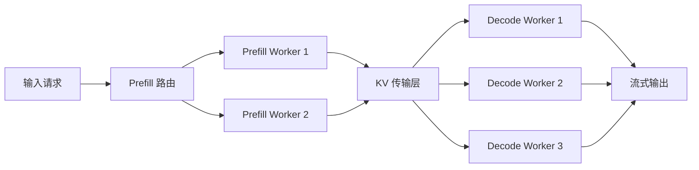

#### 优势

- Prefill 与 Decode 独立扩缩容；
- 可以针对不同阶段选择不同 GPU 或实例规格；
- 长 Prompt 不必与低延迟 Decode 竞争同一调度器；
- 更容易控制 Decode 尾延迟；
- 可根据输入输出长度动态调整 Worker 比例。

#### 代价

- KV Cache 必须跨进程、跨 GPU 或跨节点传输；
- 增加网络带宽和延迟；
- 引入传输失败、一致性和重试问题；
- 路由器和调度器复杂度显著提高；
- 低流量场景可能得不偿失。

#### 适用条件

- Prompt 较长；
- 输入输出长度差异明显；
- 请求规模足够大；
- 有 NVLink、RDMA 或其他高速互联；
- 需要分别保障 TTFT 和 ITL；
- 模型和集群规模已经超过单实例调优范围。

---

## 五、主流数据中心推理引擎

### 5.1 vLLM：通用型推理引擎的默认起点

vLLM 的定位是高吞吐、显存高效、易于部署的大模型推理与服务引擎。

#### 核心能力

- Paged KV Cache；
- Continuous Batching；
- Automatic Prefix Caching；
- Chunked Prefill；
- Tensor Parallel；
- Pipeline Parallel；
- Data Parallel；
- Speculative Decoding；
- Structured Output；
- LoRA 动态加载；
- 多 LoRA 服务；
- OpenAI 兼容 API；
- 多模型和多模态支持；
- 多 GPU 与多节点执行。

#### 关键设计

##### Paged KV Cache

将逻辑连续的 KV Cache 拆分为固定大小的物理 Block，按需分配，减少大块连续显存预留和碎片。

##### Continuous Batching

每轮 Decode 后重新组织活跃序列，请求可以动态加入和退出 Batch，而不是等待整个静态批次结束。

##### Automatic Prefix Caching

对相同前缀的 KV Cache 进行复用，适合：

- 相同系统提示词；
- 相同工具定义；
- 相同 Few-shot 示例；
- 长文档问答；
- 多轮会话；
- RAG 固定上下文。

##### Chunked Prefill

将长 Prompt 切成多个 Chunk，并与 Decode 请求共同调度，减少长 Prompt 对在线请求的阻塞。

#### 优势

- 模型生态广；
- 接入门槛较低；
- OpenAI API 兼容度高；
- 上层平台集成丰富；
- 单机、多卡和多节点路线完整；
- 适合作为 Ray Serve、KServe、llm-d、Dynamo 等系统的数据面。

#### 局限

- 不同模型和硬件组合的最优参数差异较大；
- 高级 PD 分离、跨节点 KV 管理通常需要额外控制平面；
- 默认配置不一定满足真实业务 SLO；
- 模型特定 Kernel 的性能可能与其他专用引擎存在差异；
- 大规模 MoE 仍需要结合网络拓扑和专家并行专项调优。

#### 适合场景

- 通用 OpenAI 兼容模型服务；
- 企业内部模型网关后端；
- RAG、Chat、Agent 和 Coding 模型；
- 希望快速上线，再逐步性能优化的团队；
- 需要广泛模型兼容性的推理平台。

---

### 5.2 SGLang：前缀复用、结构化生成与复杂推理

SGLang 是面向 LLM 和 VLM 的高性能推理系统，特点是对 Prefix Cache、结构化输出、复杂解码和 PD 分离进行了深入设计。

#### 核心能力

- RadixAttention；
- Prefix Cache；
- JSON、Regex、EBNF 等结构化输出；
- EAGLE、MTP、N-Gram 等推测解码；
- Prefill-Decode 分离；
- HiCache 分层缓存；
- Overlap Scheduler；
- 多种 Attention Backend；
- Model Gateway；
- Tensor Parallel；
- Expert Parallel；
- MoE 负载均衡；
- 多模态推理。

#### RadixAttention

RadixAttention 使用 Radix Tree 管理共享前缀，使不同请求能够复用公共 Prompt 对应的 KV Cache。

典型场景：

```text
系统提示词
+ 工具定义
+ Few-shot 示例
+ 用户个性化说明
+ 当前问题
```

前四部分可能在多个请求间重复。Radix Tree 可以表达“部分公共前缀”和“多分支后缀”，适合复杂 Agent 会话和树状推理。

#### Structured Output

SGLang 支持通过 JSON Schema、正则和 Grammar 约束输出，适用于：

- Tool Call；
- Agent Action；
- SQL；
- Shell 参数；
- 工作流 DSL；
- 结构化抽取；
- 严格 API 响应。

结构化输出不是简单地在生成后做 JSON 解析，而是在 Token 采样阶段限制可接受 Token，从源头提高格式有效率。

#### HiCache

HiCache 将 KV Cache 从 GPU 扩展到 CPU、本地存储或外部缓存，适合：

- 长上下文；
- 多轮聊天；
- 高 Prefix 重用；
- GPU 显存紧张；
- PD 分离和跨 Worker 复用。

#### 优势

- 高前缀复用场景能力突出；
- 结构化输出成熟；
- PD 分离路线完整；
- 对 Agent、推理模型和长上下文较友好；
- 引擎、缓存和 Gateway 能力结合较紧密；
- 复杂采样与推测解码能力丰富。

#### 局限

- 高级能力较多，配置和运行模式复杂；
- 不同 Attention Backend、模型和推测解码算法需要独立验证；
- 运维人员需要理解 Radix Cache、HiCache、PD 拓扑和缓存淘汰；
- 功能演进快，版本升级应建立回归测试。

#### 适合场景

- Agent 工具调用；
- 严格 JSON 和 Grammar 输出；
- 多轮聊天；
- 大量共享系统提示词和工具 Schema；
- 长上下文和 Prefix-heavy 工作负载；
- 需要 Prefill/Decode 分离的集群；
- 推理模型和多分支生成。

---

### 5.3 TensorRT-LLM：NVIDIA 平台深度优化路线

TensorRT-LLM 是 NVIDIA 面向大语言模型的高性能推理运行时，核心目标是在 NVIDIA GPU 上提供深度 Kernel、量化和分布式优化。

#### 核心能力

- In-flight Batching；
- Paged Attention；
- Tensor Parallel；
- Pipeline Parallel；
- Expert Parallel；
- 多节点执行；
- FP8、INT8、INT4 等量化；
- KV Cache 优化；
- Speculative Decoding；
- MoE 优化；
- CUDA Graph；
- 与 Triton、Dynamo 等 NVIDIA 组件集成。

#### 优势

- 对 NVIDIA GPU 的优化深度高；
- 固定模型和固定硬件下可进行深度调优；
- 量化、MoE、多卡和多节点能力完整；
- 与 CUDA、NCCL、Triton Inference Server、Dynamo 生态紧密；
- 适合追求确定性性能上限的场景。

#### 局限

- 主要围绕 NVIDIA 硬件；
- 模型转换、Engine 构建和版本兼容相对复杂；
- 对模型变化频繁的团队维护成本较高；
- 不同量化和并行组合必须验证精度和稳定性；
- 升级 CUDA、驱动、TensorRT-LLM 时需要完整回归。

#### 适合场景

- NVIDIA GPU 集群；
- 固定模型、固定硬件；
- 对吞吐和尾延迟有极高要求；
- 大型 MoE 模型；
- 多机多卡推理；
- 已采用 Triton、Dynamo、NCCL 等 NVIDIA 技术栈。

---

### 5.4 Hugging Face TGI：成熟存量系统路线

Text Generation Inference 曾是 Hugging Face 生态中的主流 LLM 服务框架，提供：

- Continuous Batching；
- Paged Attention；
- Tensor Parallel；
- SSE 流式输出；
- Prometheus 指标；
- OpenTelemetry；
- Hugging Face Hub 集成。

对于已有 TGI 系统，可以继续维护并逐步评估迁移。

#### 适合场景

- 已经稳定运行的 TGI 生产系统；
- 依赖 Hugging Face 既有镜像与接口；
- 短期不希望迁移执行后端的存量平台。

#### 新项目注意事项

新项目应重点比较 vLLM、SGLang 等演进更活跃的后端，尤其是在以下需求下：

- PD 分离；
- 分层 KV Cache；
- 新型推测解码；
- Prefix-aware Routing；
- Agent 结构化输出。

---

### 5.5 LMDeploy：TurboMind 与 PyTorch 双引擎

LMDeploy 提供 TurboMind 和 PyTorch 两类推理后端，整体定位是高效部署和服务大语言模型。

#### 核心能力

- TurboMind 高性能后端；
- PyTorch 后端；
- Persistent / Continuous Batching；
- Prefix Cache；
- 权重量化；
- KV Cache 量化；
- OpenAI 兼容服务；
- 多 GPU；
- 多种国内模型适配；
- 部分非 CUDA 硬件路线。

#### 优势

- 国内模型生态覆盖较好；
- 模型转换、量化和部署能力一体化；
- TurboMind 适合高性能服务；
- 适合希望兼顾易用性与优化空间的团队。

#### 适合场景

- 国内开源大模型；
- TurboMind 高性能后端；
- 模型服务和量化一体化；
- 需要多种硬件适配的国内环境。

---

### 5.6 LightLLM：轻量、Python 化和研究友好

LightLLM 是一个以 Python 为主、轻量且可扩展的高性能 LLM 服务框架。

#### 优势

- 代码路径相对直接；
- 便于研究调度算法；
- 便于定制模型与 Kernel；
- 适合验证新的推理优化思路。

#### 局限

- 企业级控制平面和集成生态弱于头部引擎；
- 大规模多租户治理需要额外建设；
- 生产稳定性需要团队自行验证。

#### 适合场景

- 推理系统研究；
- 调度算法实验；
- 模型和 Kernel 定制；
- 对代码可读性和可修改性要求较高的团队。

---

### 5.7 RTP-LLM：阿里生产实践路线

RTP-LLM 面向生产级大模型推理，支持：

- Paged Attention；
- FlashAttention；
- 动态批处理；
- 多种量化；
- 多 LoRA；
- 多模态；
- 多节点 Tensor Parallel；
- Prefix Cache；
- Speculative Decoding。

#### 适合场景

- 阿里云或相关技术生态；
- 国内大规模在线服务；
- 需要深度定制模型和工程能力的企业；
- 对多 LoRA、量化和多模态有综合需求的系统。

---

### 5.8 FastDeploy：PaddlePaddle 与异构硬件路线

FastDeploy 面向 LLM/VLM 生产推理，重点能力包括：

- 负载感知的 Prefill-Decode 分离；
- KV Cache 传输；
- 多种量化；
- Speculative Decoding；
- MTP；
- Chunked Prefill；
- OpenAI / vLLM 兼容接口；
- 多模态；
- 多种国产硬件适配。

#### 适合场景

- PaddlePaddle 生态；
- 国产异构硬件；
- 政企环境；
- 多模态模型；
- 需要 PD 集群和 KV 传输的生产系统。

---

### 5.9 MindIE：昇腾 NPU 推理服务路线

MindIE 是围绕昇腾硬件构建的大模型推理和服务软件栈，重点解决：

- 模型执行；
- 推理服务化；
- 昇腾算力适配；
- 多卡和多节点；
- 量化和算子优化；
- 服务接口与部署治理。

对于昇腾集群，建议重点验证：

- 模型和版本是否在支持矩阵内；
- CANN、驱动和固件版本；
- 算子覆盖率；
- 量化格式；
- 多卡通信；
- 长上下文支持；
- 性能基线和稳定性；
- OpenAI API 兼容程度。

---

### 5.10 DeepSpeed-MII：DeepSpeed 生态推理服务

DeepSpeed-MII 基于 DeepSpeed-Inference，为模型提供推理服务能力。

#### 适合场景

- 已采用 DeepSpeed 进行训练或推理；
- 希望复用 DeepSpeed 并行和优化能力；
- 需要训练与推理技术栈相对统一。

#### 注意事项

其独立服务生态、OpenAI 兼容能力和上层控制面集成，应与 vLLM、SGLang、Ray Serve 等方案做实际比较。

---

## 六、本地、桌面与边缘推理框架

### 6.1 llama.cpp：本地推理的重要基础设施

llama.cpp 是轻量 C/C++ 推理引擎，覆盖 CPU、GPU、Apple Silicon 和多种本地设备。

#### 核心能力

- GGUF 模型格式；
- 多种低比特量化；
- CPU 推理；
- CUDA、Metal、Vulkan 等后端；
- 混合 CPU/GPU Offload；
- 本地 OpenAI 兼容 Server；
- Continuous Batching；
- Embeddings；
- 多模态支持；
- Grammar / JSON 结构化输出；
- 跨 Windows、Linux、macOS 部署。

#### 优势

- 部署依赖少；
- CPU 推理成熟；
- GGUF 模型生态广；
- 适合桌面、离线和隐私场景；
- 可嵌入原生应用；
- 支持消费级硬件和资源受限环境。

#### 局限

- 数据中心多节点高吞吐不是其主要目标；
- 与 vLLM、SGLang 的集群服务定位不同；
- GGUF 与服务端常用权重格式之间需要转换管理；
- 不同硬件后端的性能和算子支持有差异。

#### 适合场景

- 桌面 AI 应用；
- 本地 Coding Agent；
- 离线知识库；
- 隐私敏感环境；
- CPU 或消费级 GPU；
- Tauri、Electron 或原生客户端集成。

---

### 6.2 MLX-LM：Apple Silicon 原生路线

MLX-LM 基于 Apple MLX，面向 Apple Silicon 提供：

- 模型加载；
- 文本生成；
- 量化；
- 微调；
- 分布式执行；
- Hugging Face 模型转换与集成。

#### 优势

- 充分利用 Apple Unified Memory；
- 对 M 系列芯片友好；
- Python 开发体验较好；
- 适合 Mac 本地实验和产品原型。

#### 适合场景

- M 系列 Mac；
- macOS 原生 AI 应用；
- Apple Unified Memory；
- 本地开发、推理和轻量微调。

#### 产品架构建议

跨 Windows、Linux、macOS 的桌面产品，可以：

- 使用 llama.cpp 作为统一跨平台后端；
- 将 MLX-LM 作为 macOS 的可选高性能后端；
- 通过统一 Runtime Port 隔离不同推理实现。

---

### 6.3 MLC-LLM：编译器驱动的跨平台部署

MLC-LLM 基于机器学习编译技术，将模型部署到多种后端：

- CUDA；
- ROCm；
- Vulkan；
- OpenCL；
- Metal；
- WebGPU；
- 浏览器；
- Android；
- iOS。

#### 优势

- 跨平台和跨厂商硬件；
- 编译器驱动优化；
- 支持浏览器和移动端；
- 适合统一模型部署链路。

#### 局限

- 编译、模型转换和目标设备适配链路较复杂；
- 不同设备能力差异较大；
- 生产更新和模型分发需要专门设计。

#### 适合场景

- WebGPU；
- 浏览器本地推理；
- Android / iOS；
- 跨厂商 GPU；
- 需要统一编译与部署链路的端侧产品。

---

### 6.4 ONNX Runtime GenAI：ONNX 跨平台路线

ONNX Runtime GenAI 在 ONNX Runtime 之上封装生成式模型执行循环，覆盖：

- Tokenizer；
- Generation Loop；
- Sampling；
- Search；
- KV Cache；
- 模型执行；
- CPU、GPU 和 DirectML 等后端。

#### 适合场景

- 已大量使用 ONNX Runtime 的企业；
- Windows 与 DirectML；
- 希望传统 ONNX 模型与生成模型统一部署；
- 端侧和嵌入式推理；
- .NET、C++ 等非 Python 产品。

#### 注意事项

- 核对 API 稳定性；
- 核对模型支持矩阵；
- 核对图优化和量化格式；
- 评估与 llama.cpp、OpenVINO 的性能差异。

---

### 6.5 OpenVINO GenAI 与 OpenVINO Model Server

OpenVINO 主要面向 Intel CPU、GPU 和 NPU。

#### 核心能力

- Intel CPU / GPU / NPU 优化；
- Continuous Batching；
- Paged Attention；
- 动态 Split-Fuse；
- OpenAI 风格 API；
- 生成、Embedding 和 Rerank 服务；
- 与传统视觉、语音和 ONNX 模型统一部署。

#### 适合场景

- Intel Xeon CPU 推理；
- Intel GPU/NPU；
- 边缘服务器；
- 无 NVIDIA GPU 环境；
- 希望生成模型和传统模型共用 OpenVINO 技术栈的企业。

---

## 七、模型服务层与集群控制平面

### 7.1 Triton Inference Server：通用模型服务器

Triton 提供：

- 模型仓库；
- 模型版本；
- HTTP / gRPC；
- Dynamic Batching；
- Concurrent Model Execution；
- Ensemble；
- TensorRT、ONNX、Python 等多后端；
- 指标、健康检查和模型管理。

#### 关键认识

Triton 本身不是一种专门的自回归 LLM 执行算法。

典型组合：

```text
Client
  ↓
Triton Inference Server
  ↓
TensorRT-LLM Backend
  ↓
NVIDIA GPU
```

#### Dynamic Batching 与 Continuous Batching

| 对比项 | Triton Dynamic Batching | LLM Continuous Batching |
|---|---|---|
| 聚合时机 | 模型执行前 | 每个 Token 迭代 |
| 请求退出 | 通常等待单次执行结束 | 序列完成后立即退出 |
| 主要对象 | 通用推理请求 | 自回归生成序列 |
| 目标 | 提高单次执行批量 | 提高整个生成过程利用率 |

#### 适合场景

- 多种模型类型共存；
- TensorRT-LLM 服务；
- 传统模型和 LLM 共用服务基础设施；
- NVIDIA 企业技术栈。

---

### 7.2 Ray Serve LLM：Python 原生分布式服务平台

Ray Serve LLM 将 vLLM、SGLang 等推理引擎组织成分布式服务。

#### 核心能力

- OpenAI API；
- 多模型；
- 多节点部署；
- 自动扩缩容；
- 负载均衡；
- Prefix-aware Routing；
- Multi-LoRA；
- Python 业务 DAG；
- 与 RAG、预处理和后处理组合；
- 故障恢复和副本管理。

#### 典型架构

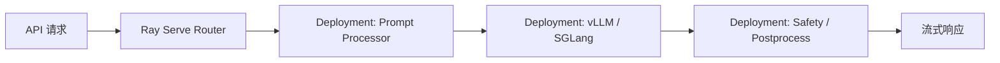

#### 优势

- Python 原生；
- 易于表达复杂模型应用 DAG；
- 可将数据处理、RAG 和推理放在同一运行平台；
- 适合多模型和异构业务；
- 与 Ray Data、Ray Core 生态结合。

#### 局限

- Ray 集群本身需要运维；
- Kubernetes 团队可能同时面临 Ray 与 K8s 两层调度；
- 大规模 GPU 拓扑、KV 路由和网络性能仍需专项治理。

#### 适合场景

- Python 技术栈；
- 多模型、多节点；
- RAG 与模型推理一体化；
- 自定义业务编排；
- 需要自动扩缩容的 AI 服务平台。

---

### 7.3 KServe：Kubernetes 原生模型服务控制面

KServe 提供 Kubernetes 原生的模型部署与治理抽象。

#### 核心能力

- CRD 声明式部署；
- 自动扩缩容；
- 流量管理；
- 模型存储；
- InferenceService；
- 多模型服务；
- 灰度和版本治理；
- 与 Istio、Gateway API、Prometheus 集成；
- 面向生成式模型的 LLM 服务能力。

#### 优势

- Kubernetes 原生；
- 便于 GitOps；
- 适合统一管理传统模型与生成模型；
- 与企业租户、网络、安全和监控体系容易对接；
- 适合作为 AI 平台的控制面。

#### 局限

- Kubernetes 运维门槛较高；
- LLM 的 KV Cache、Token 调度和 PD 分离不能只依赖传统无状态服务抽象；
- 仍需选择实际推理引擎和 KV 数据面。

#### 适合场景

- 已有 Kubernetes 平台；
- 强调 GitOps 和 CRD；
- 多租户企业 AI 平台；
- 同时管理传统模型、Embedding、Rerank 和 LLM。

---

### 7.4 llm-d：Kubernetes 原生分布式 LLM 推理栈

llm-d 聚焦 Kubernetes 上的分布式 LLM 服务，通常将 vLLM 或 SGLang 作为模型执行引擎。

#### 核心组件

- Gateway / Router；
- InferencePool；
- Model Server；
- Prefix-aware Scheduling；
- KV-aware Routing；
- 多节点资源管理；
- Prefill-Decode 资源编排；
- 可观测性与扩缩容。

#### Prefix-aware Routing

当请求包含与历史请求相同的前缀时，路由器尽量将其发送到已经持有对应 KV Cache 的 Worker。

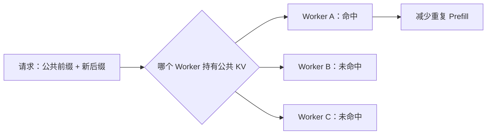

#### 适合场景

- Kubernetes 大规模推理集群；
- 多副本 Prefix Cache 复用；
- 需要云原生控制面；
- 需要 PD 分离、KV-aware Routing 和多节点管理。

---

### 7.5 NVIDIA Dynamo：GPU 集群级推理编排

NVIDIA Dynamo 面向大规模生成式 AI 推理集群，重点处理：

- Prefill-Decode 分离；
- KV-aware Routing；
- KV Cache Offloading；
- Worker 生命周期；
- GPU 集群调度；
- 高速互联与跨节点传输；
- 动态 Prefill / Decode 配比；
- 多种推理引擎后端。

可对接的执行后端通常包括：

- TensorRT-LLM；
- vLLM；
- SGLang。

#### 适合场景

- NVIDIA GPU 大规模集群；
- 长上下文与高 QPS；
- MoE；
- PD 分离；
- 对吞吐、尾延迟和 GPU 利用率有严格要求；
- 具备高速网络与较强 Infra 团队。

---

### 7.6 BentoML：模型打包与应用服务工程化

BentoML 偏向模型应用工程平台，负责：

- 模型打包；
- Python API 定义；
- 依赖和镜像管理；
- 服务部署；
- 扩缩容；
- 预处理和后处理；
- 对接 vLLM 等推理后端。

#### 适合场景

- 快速将 Python 模型代码封装为服务；
- 推理前后包含较多业务逻辑；
- 中小规模 AI 服务平台；
- 不希望直接建设复杂 Kubernetes CRD 的团队。

---

## 八、KV Cache 与分离式推理基础设施

### 8.1 KV Cache 为什么重要

Transformer 自回归生成时，每生成一个新 Token，都需要关注历史 Token。

如果每次都重新计算历史 Key 和 Value，成本会非常高。因此，推理引擎将历史 Attention 的 Key、Value 保存在 KV Cache 中。

对于多轮 Agent 和 RAG，请求经常包含：

```text
系统提示词
+ 工具定义
+ Few-shot 示例
+ 固定知识库文档
+ 历史会话
+ 当前问题
```

其中前五部分可能重复。如果每次都重新 Prefill，会浪费大量 GPU 计算。

因此，现代推理系统正在从“只管理模型权重”演进为：

> 模型权重、KV Cache 和请求路由共同驱动的分布式推理系统。

### 8.2 Prefix Cache

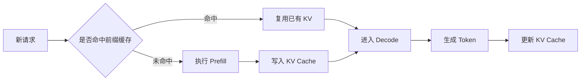

Prefix Cache 的关键问题包括：

- 如何判断前缀完全一致；
- Tokenizer 和模型版本如何参与 Cache Key；
- LoRA、Prompt Adapter 和采样配置是否影响复用；
- 多租户之间能否共享；
- 如何淘汰；
- 如何跨实例发现；
- 如何避免数据泄露；
- 如何统计命中收益。

### 8.3 LMCache

LMCache 是相对独立于具体推理引擎的 KV Cache 管理层，可以将 KV 扩展到：

- CPU 内存；
- 本地 SSD；
- 远程存储；
- 其他 Worker；
- 独立缓存服务。

适合：

- 长上下文；
- 多轮会话；
- RAG 文档复用；
- Prefill-Decode 分离；
- GPU 显存有限但主机内存和本地盘充足的场景。

### 8.4 Mooncake

Mooncake 采用以 KV Cache 为中心的分离式架构，将 Prefill 和 Decode 解耦，并利用 CPU DRAM、SSD 等资源构建缓存池。

关键思想：

- 将 KV Cache 视为可管理的数据资产；
- 尽量避免重复 Prefill；
- 用存储和网络换取 GPU 计算；
- 将计算节点与缓存节点解耦；
- 对 KV 传输、放置和复用进行统一调度。

### 8.5 KVBM 与 NIXL

在 NVIDIA 大规模推理体系中，KV Block Manager 和高速数据传输层负责：

- KV Block 分配；
- Worker 间传输；
- CPU / GPU / 远端内存层级；
- 异步传输；
- 与 PD 分离协同；
- 利用 RDMA、GPU Direct 等能力降低传输开销。

### 8.6 KV Cache 生产治理问题

生产系统必须额外考虑：

#### 一致性

Cache Key 应至少考虑：

- 模型 ID；
- 模型版本或权重 Hash；
- Tokenizer 版本；
- Prompt Token 序列；
- RoPE、Position Encoding 参数；
- LoRA / Adapter；
- 多模态输入特征；
- 并行和精度配置。

#### 安全

- 租户之间默认隔离；
- 敏感 Prompt 不应被其他租户复用；
- 缓存数据需要访问控制；
- SSD 或远端存储需要加密；
- 淘汰后应符合数据保留策略。

#### 容量

- GPU KV 使用率；
- CPU Cache 容量；
- SSD 容量；
- 命中率；
- 淘汰率；
- KV 传输带宽；
- 平均对象大小；
- 热点前缀分布。

---

## 九、决定推理性能的核心技术

### 9.1 Continuous Batching

传统静态批处理：

```text
请求 A：████████████████
请求 B：██████
请求 C：██████████
```

即使请求 B 先完成，其 Batch Slot 也可能无法立即被新请求使用。

Continuous Batching：

```text
Iteration 1：[A, B]
Iteration 2：[A, B, C]
Iteration 3：[A, C, D]
Iteration 4：[A, C, D, E]
```

每轮生成后，调度器重新选择活跃序列，从而提高 GPU 利用率。

#### 核心挑战

- 不同请求长度差异；
- 不同租户优先级；
- 大量短请求和少量超长请求混合；
- KV Cache 不足；
- 取消和超时；
- Prefill 与 Decode 竞争；
- 多模态输入的额外 Encoder 开销。

---

### 9.2 Paged KV Cache

传统方案可能按最大长度连续预留：

```text
请求实际长度：  2K
预留最大长度： 32K
浪费：         30K 对应空间
```

Paged KV Cache 将 KV 拆成 Block：

```text
逻辑 KV：
[Block 1] -> [Block 2] -> [Block 3]

物理显存：
[Block 3] [其他请求] [Block 1] [空闲] [Block 2]
```

#### 收益

- 降低显存碎片；
- 按需分配；
- 支持动态序列长度；
- 更容易回收完成请求的资源；
- 为 Prefix Sharing、Copy-on-Write 等机制提供基础。

#### 代价

- Block Table 管理开销；
- Kernel 需要支持非连续物理布局；
- Block Size 需要调优；
- 小 Block 管理开销高，大 Block 内部浪费大。

---

### 9.3 Prefix Cache

多个请求共享相同前缀：

```text
请求 A = 系统提示词 + 工具定义 + 用户问题 A
请求 B = 系统提示词 + 工具定义 + 用户问题 B
请求 C = 系统提示词 + 工具定义 + 用户问题 C
```

可以只计算一次：

```text
共享 KV = 系统提示词 + 工具定义
```

然后分别追加后缀。

#### 最适合的负载

- 企业统一系统提示词；
- Agent 工具列表；
- 固定 Few-shot；
- 多轮聊天；
- RAG 固定文档；
- 推理树中的公共根节点；
- 批量评估中重复 Rubric。

---

### 9.4 Chunked Prefill

长 Prompt 的 Prefill 可能长时间占用 GPU：

```text
长 Prompt：
[P1][P2][P3][P4][P5][P6]
```

Chunked Prefill 将其分段，与 Decode 混合：

```text
Decode Batch + P1
Decode Batch + P2
Decode Batch + P3
Decode Batch + P4
```

#### 收益

- 降低长 Prompt 对 Decode 的阻塞；
- 改善 P95/P99 ITL；
- 更好地平衡 Compute-bound 和 Memory-bound 工作；
- 允许基于 Token Budget 调度。

#### 调优点

- Chunk 大小；
- 单轮最大 Batched Tokens；
- Prefill 和 Decode 优先级；
- TTFT 与 ITL 的权衡；
- 长请求公平性。

---

### 9.5 Speculative Decoding

推测解码使用较小 Draft Model、额外预测头或 N-Gram，一次提出多个候选 Token，再由 Target Model 并行验证。

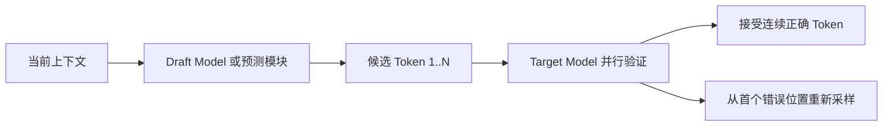

#### 常见路线

- Draft Model；
- Medusa；
- EAGLE-2 / EAGLE-3；
- MTP；
- N-Gram；
- Prompt Lookup。

#### 适合场景

- 单请求或中低并发；
- 输出较长；
- Draft 与 Target 的预测一致率较高；
- Decode 串行步数是主要瓶颈。

#### 不一定有效的场景

- 高并发下 GPU 已被充分利用；
- Draft Model 额外开销过大；
- 接受率低；
- 内存带宽成为瓶颈；
- 结构化输出限制候选空间；
- Target Model 很小。

因此，不能只开启功能就假设加速，必须测量：

- Acceptance Rate；
- Effective Tokens per Verification；
- TTFT；
- TPOT；
- GPU 利用率；
- 额外显存；
- 质量一致性。

---

### 9.6 量化

量化可以作用于：

- 模型权重；
- Activation；
- KV Cache；
- MoE Expert；
- Draft Model。

常见精度：

- FP16 / BF16；
- FP8；
- INT8；
- INT4；
- GPTQ；
- AWQ；
- SmoothQuant；
- GGUF 多种低比特格式。

#### 量化收益

- 减少显存占用；
- 提高有效内存带宽；
- 容纳更大 Batch；
- 容纳更长 KV Cache；
- 减少跨节点通信量；
- 允许更大模型部署到较小硬件。

#### 必须验证

- 模型质量；
- 工具调用准确率；
- 结构化输出有效率；
- 首 Token 延迟；
- Decode 吞吐；
- Kernel 是否原生支持该格式；
- 是否发生运行时反量化；
- 量化格式与硬件是否匹配；
- 长上下文和极端输入下的数值稳定性。

---

### 9.7 FlashAttention、FlashInfer 与融合 Kernel

这些技术通过减少 HBM 访问、优化分块和算子融合，提高 Attention 与生成阶段效率。

优化方向包括：

- FlashAttention；
- Paged Attention；
- Decode Attention；
- Fused RMSNorm；
- Fused RoPE；
- Fused Sampling；
- Fused MoE；
- Grouped GEMM；
- CUDA Graph；
- Triton Kernel；
- CUTLASS Template。

不同模型和硬件的最佳 Kernel 可能不同，因此现代推理引擎通常会提供多个 Backend，并根据设备和模型自动或手动选择。

---

### 9.8 Structured Output 与 Grammar Decoding

Agent 推理不仅生成自然语言，还需要生成：

- Tool Call；
- JSON；
- SQL；
- Shell Command；
- DSL；
- Workflow Action；
- 代码补丁结构。

Grammar Decoding 在每个 Token 步骤限制可接受 Token，使结果符合指定语法。

#### 价值

- 提高 JSON 有效率；
- 减少重试；
- 降低应用层解析失败；
- 提高 Tool Calling 稳定性；
- 降低安全风险；
- 有利于 Agent Runtime 进行确定性状态转换。

#### 代价

- Grammar 状态机维护成本；
- Token Mask 计算；
- 复杂 Schema 可能影响吞吐；
- 与 Speculative Decoding 结合更复杂；
- 不能替代语义正确性校验。

---

## 十、分布式并行与扩展方式

### 10.1 Tensor Parallel，TP

将单层矩阵拆分到多张 GPU。

#### 优势

- 单卡放不下模型时仍可部署；
- 每层计算可并行。

#### 代价

- 每层通常需要集合通信；
- 对 NVLink、PCIe 和网络延迟敏感；
- TP 跨节点的成本通常较高。

### 10.2 Pipeline Parallel，PP

将模型层按阶段拆分到不同 GPU 或节点。

#### 优势

- 适合超大模型；
- 跨节点时通信频率可能低于大规模 TP。

#### 代价

- Pipeline Bubble；
- 微批调度复杂；
- Decode 阶段的流水线效率需要专项优化。

### 10.3 Data Parallel，DP

复制完整模型副本，不同副本处理不同请求。

#### 优势

- 扩展并发直接；
- 副本之间耦合较低；
- 适合大量独立请求。

#### 代价

- 每个副本都占用完整模型权重；
- Prefix Cache 分散在不同副本；
- 需要请求路由与负载均衡。

### 10.4 Expert Parallel，EP

用于 Mixture-of-Experts 模型，将不同 Expert 分布到不同 GPU。

#### 关键挑战

- Token 到 Expert 的 All-to-All 通信；
- Expert 负载不均衡；
- Hot Expert；
- 网络拓扑；
- Expert 容量和丢弃策略；
- Prefill 与 Decode 的负载差异。

### 10.5 Context Parallel 与 Sequence Parallel

用于超长上下文或特定模型结构，将序列维度或上下文计算拆分到多个设备。

适合：

- 超长 Prompt；
- 单设备无法容纳 Attention 中间状态；
- 需要在多设备间分摊 Context 计算。

### 10.6 Prefill-Decode 分离

不是传统的模型参数并行，而是按推理阶段拆分资源池。

| 并行方式 | 拆分对象 | 主要用途 | 主要代价 |
|---|---|---|---|
| TP | 单层矩阵 | 单卡装不下模型 | 高频集合通信 |
| PP | 模型层 | 跨设备部署超大模型 | Pipeline Bubble |
| DP | 模型副本 | 提高并发吞吐 | 权重复制、缓存分散 |
| EP | MoE Expert | 扩展 MoE | All-to-All 通信 |
| Context Parallel | 序列或上下文 | 超长上下文 | 上下文通信复杂 |
| PD 分离 | Prefill / Decode | 独立扩缩、匹配资源特征 | KV 传输成本 |

---

## 十一、主流框架横向对比

### 11.1 数据中心推理引擎

| 框架 | 主要定位 | 核心优势 | 主要限制 | 推荐场景 |
|---|---|---|---|---|
| **vLLM** | 通用 GPU 推理引擎 | 生态广、OpenAI API、Paged KV、Chunked Prefill | 高级集群能力通常需要上层组件 | 通用首选、快速生产化 |
| **SGLang** | 高性能 LLM/VLM 推理系统 | RadixAttention、结构化输出、HiCache、PD | 高级模式和参数较多 | Agent、长上下文、高前缀复用 |
| **TensorRT-LLM** | NVIDIA 优化运行时 | Kernel、量化、MoE、多机并行 | 构建和版本管理复杂，硬件绑定强 | NVIDIA 极致性能 |
| **TGI** | Hugging Face 服务框架 | 历史成熟、HF 集成 | 新能力演进相对有限 | 存量系统维护 |
| **LMDeploy** | TurboMind / PyTorch 部署 | TurboMind、量化、国内模型生态 | 国际上层集成相对少 | 国内模型、高性能部署 |
| **LightLLM** | 轻量 Python 引擎 | 易读、易扩展、研究友好 | 企业控制面较弱 | 研究、定制执行器 |
| **RTP-LLM** | 生产级在线推理 | 动态批处理、多 LoRA、量化、多模态 | 生态相对集中 | 国内大规模在线服务 |
| **FastDeploy** | 异构硬件推理 | PD、KV 传输、量化、多硬件 | 技术栈较庞大 | Paddle 与国产硬件生态 |
| **MindIE** | 昇腾推理服务 | 昇腾软硬件协同 | 硬件和版本绑定明显 | 昇腾 NPU 集群 |
| **DeepSpeed-MII** | DeepSpeed 推理服务 | 与 DeepSpeed-Inference 集成 | 独立服务生态相对弱 | 已采用 DeepSpeed 的团队 |

### 11.2 本地与边缘推理引擎

| 框架 | 主要硬件 | 优势 | 推荐场景 |
|---|---|---|---|
| **llama.cpp** | CPU、CUDA、Metal、Vulkan 等 | GGUF、低依赖、多量化、跨平台 | 桌面、本地 Agent、离线应用 |
| **MLX-LM** | Apple Silicon | Unified Memory 原生优化 | macOS 本地 AI 应用 |
| **MLC-LLM** | CUDA、ROCm、Vulkan、WebGPU 等 | 编译器驱动、浏览器和移动端 | WebGPU、移动端、跨厂商硬件 |
| **ONNX Runtime GenAI** | CPU、GPU、DirectML 等 | ONNX 生态、跨语言 | Windows、端侧、ONNX 企业生态 |
| **OpenVINO GenAI** | Intel CPU/GPU/NPU | Intel 平台优化 | Intel 服务器和边缘设备 |

### 11.3 集群服务平台

| 平台 | 定位 | 典型后端 | 推荐场景 |
|---|---|---|---|
| **Ray Serve LLM** | Python 分布式服务 | vLLM、SGLang | Python AI 平台、多模型、多节点 |
| **KServe** | Kubernetes 模型服务控制面 | vLLM、Triton 等 | 云原生统一模型平台 |
| **llm-d** | Kubernetes 分布式 LLM 栈 | vLLM、SGLang | Prefix-aware、PD、大规模集群 |
| **NVIDIA Dynamo** | GPU 集群推理编排 | vLLM、SGLang、TensorRT-LLM | NVIDIA 大规模推理集群 |
| **Triton** | 通用模型服务器 | TensorRT-LLM、ONNX、Python 等 | 多模型、多后端、NVIDIA 企业栈 |
| **BentoML** | 模型打包与应用服务 | vLLM、Python 模型 | 快速工程化和应用服务 |

### 11.4 核心能力对比

> 下表用于建立概念地图，具体支持情况会随版本变化，部署前需查阅官方文档。

| 能力 | vLLM | SGLang | TensorRT-LLM | llama.cpp | Ray Serve | KServe / llm-d |
|---|---|---|---|---|---|---|
| OpenAI API | 强 | 强 | 通常通过服务层 | 有 | 强 | 通过后端与网关 |
| Continuous Batching | 有 | 有 | 有 | 有 | 依赖后端 | 依赖后端 |
| Paged KV | 有 | 有 | 有 | 有类似机制 | 依赖后端 | 依赖后端 |
| Prefix Cache | 有 | RadixAttention | 有相关能力 | 有 | 可做缓存感知路由 | llm-d 强调缓存感知 |
| Structured Output | 有 | 强 | 依具体集成 | 有 Grammar | 依赖后端 | 依赖后端 |
| Speculative Decoding | 有 | 多种 | 多种 | 部分路线 | 依赖后端 | 依赖后端 |
| Multi-LoRA | 有 | 有 | 有相关能力 | 生态方式不同 | 强调服务治理 | 依赖后端 |
| 多节点 | 有 | 有 | 强 | 非主要方向 | 强 | 强 |
| PD 分离 | 可集成 | 强 | 可集成 | 非主要方向 | 可编排 | llm-d / Dynamo 重点 |
| 自动扩缩容 | 不是核心 | Gateway 有部分能力 | 不是核心 | 否 | 强 | 强 |
| 本地 CPU | 非主要方向 | 非主要方向 | 否 | 强 | 否 | 否 |

---

## 十二、典型生产架构

### 12.1 单机或单节点模型服务

适合：

- 7B～70B 级别模型；
- 单机多卡；
- 中等流量；
- 平台初期；
- 单模型或少量模型。

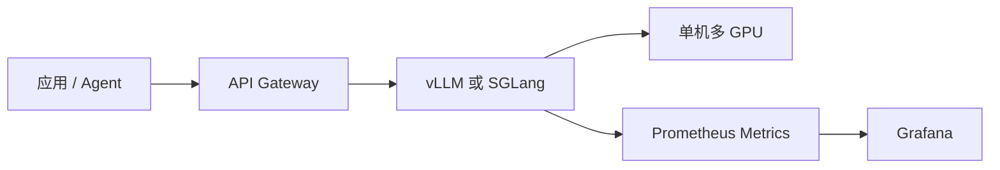

#### 推荐策略

- 默认先使用 vLLM 建立性能基线；
- Agent、结构化输出和高 Prefix 复用场景增加 SGLang 对照测试；
- NVIDIA 固定模型并追求极致性能时增加 TensorRT-LLM；
- 建立真实流量回放，而不是只测固定并发。

---

### 12.2 Kubernetes 多副本推理架构

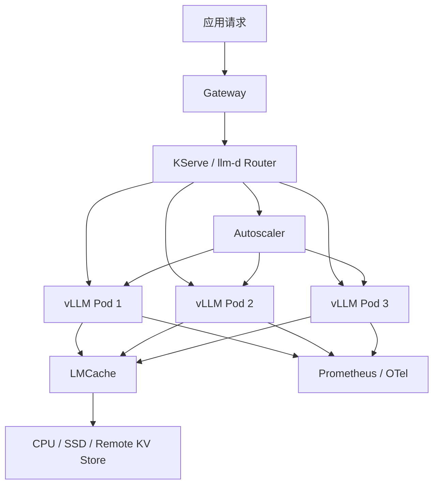

#### 适合场景

- 多租户；
- 多模型；
- Kubernetes 平台；
- 弹性扩缩；
- 滚动升级；
- Prefix-aware Routing；
- 统一安全、网络和观测治理。

#### 关键设计

- 模型权重预热与本地缓存；
- GPU 节点调度和拓扑；
- 冷启动时间；
- 最大排队时间；
- 缓存亲和路由；
- Pod 驱逐与请求排空；
- 灰度版本间 KV 不共享；
- 请求取消和连接断开传播。

---

### 12.3 Prefill-Decode 分离架构

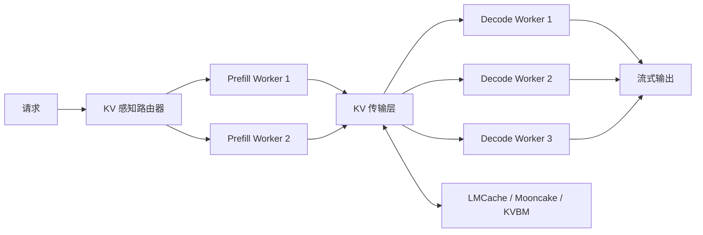

#### 适合场景

- 长 Prompt；
- 大量 RAG 文档；
- 输入输出长度差异显著；
- Prefill 与 Decode 需要独立扩缩；
- 高速互联；
- 高并发和大规模集群。

#### 不适合场景

- 流量较低；
- 网络带宽不足；
- 单机已经能够满足 SLO；
- KV 传输时间接近或超过节省的计算时间；
- 团队不具备复杂分布式系统运维能力。

---

### 12.4 多模型、多租户平台架构

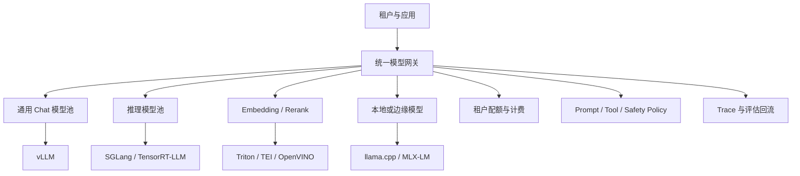

#### 平台治理重点

- 模型别名与版本；
- 租户级并发和 Token 配额；
- 请求优先级；
- 多模型 fallback；
- 成本路由；
- 数据隐私；
- 统一 Trace；
- 质量评估；
- 灰度发布；
- 配额与计费对账。

---

### 12.5 桌面本地推理架构

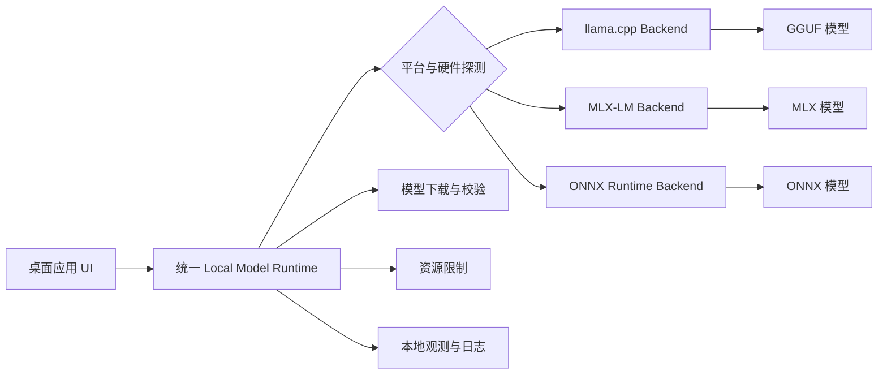

#### 设计原则

- Runtime 接口与具体后端解耦；
- 模型文件校验和版本管理；
- CPU、GPU 和内存探测；
- 本地服务端口和权限控制；
- 子进程生命周期；
- 崩溃重启；
- 空闲卸载；
- 会话取消；
- 敏感数据不上传。

---

## 十三、框架选型矩阵

### 13.1 按业务场景选择

| 业务场景 | 优先选择 | 备选 |
|---|---|---|
| 通用 OpenAI 兼容服务 | **vLLM** | SGLang |
| Agent、工具调用、严格 JSON | **SGLang** | vLLM |
| 大量共享系统提示词 | **SGLang / vLLM Prefix Cache** | LMCache |
| NVIDIA 极致性能 | **TensorRT-LLM** | vLLM、SGLang |
| Kubernetes 大规模服务 | **llm-d / KServe** | Ray Serve |
| NVIDIA 大规模 GPU 集群 | **Dynamo** | llm-d、Ray Serve |
| Python 业务 DAG | **Ray Serve LLM** | BentoML |
| 传统模型和 LLM 共存 | **Triton / KServe** | BentoML |
| 桌面与本地推理 | **llama.cpp** | ONNX Runtime GenAI |
| Apple Silicon | **MLX-LM** | llama.cpp |
| 浏览器与移动端 | **MLC-LLM** | ONNX Runtime |
| Intel CPU/GPU/NPU | **OpenVINO** | ONNX Runtime |
| 昇腾集群 | **MindIE** | FastDeploy、LMDeploy |
| 国内异构硬件 | **FastDeploy** | LMDeploy |
| TGI 存量系统 | 继续维护或逐步迁移 | vLLM、SGLang |

### 13.2 按工作负载选择

| 工作负载特征 | 关键能力 | 推荐关注 |
|---|---|---|
| 长输入、短输出 | Chunked Prefill、Prefix Cache、PD 分离 | TTFT、Prefill 吞吐 |
| 短输入、长输出 | Decode 吞吐、Speculative Decoding、KV 量化 | TPOT、ITL |
| 高并发聊天 | Continuous Batching、Paged KV | P95/P99 延迟、并发序列数 |
| 多轮 Agent | Prefix Cache、Session Affinity、KV-aware Routing | 工具 Schema 前缀命中 |
| RAG 固定文档 | Prefix Cache、外部 KV Cache | 文档复用率、缓存容量 |
| 严格工具调用 | Structured Output、Grammar Decoding | Schema 有效率、语义准确率 |
| MoE 模型 | Expert Parallel、负载均衡、高速 All-to-All | Expert 热点、网络利用率 |
| 多 LoRA 租户 | Multi-LoRA、Adapter Cache、租户隔离 | 切换开销、显存碎片 |
| 超长上下文 | Hierarchical KV Cache、CPU/SSD Offload | KV 容量、传输延迟 |
| 多模态 | Encoder Cache、图像 Token 调度 | Encoder 利用率、显存 |
| 推理模型 | 长输出、取消、预算和推测解码 | 请求驻留时间、尾延迟 |

### 13.3 按团队能力选择

| 团队条件 | 更适合的路线 |
|---|---|
| 小团队、需要快速上线 | 单机 vLLM 或 SGLang |
| Python 平台团队 | Ray Serve LLM + vLLM/SGLang |
| Kubernetes 平台团队 | KServe / llm-d + vLLM/SGLang |
| NVIDIA 深度优化团队 | TensorRT-LLM + Triton / Dynamo |
| 国产硬件团队 | MindIE / FastDeploy / LMDeploy |
| 桌面应用团队 | llama.cpp + 可选 MLX-LM |
| 编译器与端侧团队 | MLC-LLM / ONNX Runtime / OpenVINO |

### 13.4 按规模选择

| 规模 | 推荐架构 |
|---|---|
| 开发与 PoC | 单进程 llama.cpp、vLLM 或 SGLang |
| 单机生产 | Gateway + vLLM/SGLang + Prometheus |
| 多副本 | Gateway + 负载均衡 + 多个推理实例 |
| Kubernetes 中型集群 | KServe/Ray Serve + vLLM/SGLang |
| 大规模长上下文 | llm-d/Dynamo + PD 分离 + KV 数据面 |
| 超大 MoE | TensorRT-LLM/SGLang/vLLM + EP + 高速网络 |

---

## 十四、如何正确压测推理框架

### 14.1 不能只比较 tokens/s

推理系统至少需要同时观察：

- TTFT；
- TPOT；
- ITL；
- End-to-End Latency；
- Requests/s；
- Output Tokens/s；
- Total Tokens/s；
- 每 GPU Tokens/s；
- GPU 利用率；
- HBM 使用率；
- KV Cache 使用率；
- Prefix Cache 命中率；
- 失败率和超时率；
- SLO 达标率；
- 单位 Token 成本。

### 14.2 TTFT

首 Token 延迟：

```text
TTFT = 首个输出 Token 时间 - 请求到达时间
```

包含：

- 网关时间；
- 排队时间；
- 路由时间；
- Tokenization；
- Prompt Prefill；
- Prefix Cache 查找；
- 首次采样；
- 流式连接传输。

### 14.3 TPOT

首 Token 后平均每个 Token 的生成时间：

```text
TPOT = (请求完成时间 - 首 Token 时间) / (输出 Token 数 - 1)
```

TPOT 主要用于衡量 Decode 性能。

### 14.4 ITL

相邻 Token 之间的延迟：

```text
ITL(i) = Token(i) 时间 - Token(i-1) 时间
```

平均 ITL 可能看起来正常，但 P99 ITL 抖动会直接影响用户阅读体验和 Agent 交互响应。

### 14.5 必须报告分位数

至少报告：

- P50；
- P90；
- P95；
- P99；
- Max。

重点关注：

- P95 TTFT；
- P95 / P99 ITL；
- SLO 达标比例；
- 超时率；
- OOM 率；
- 取消后的资源回收时间。

### 14.6 公平压测条件

比较两个框架时必须保持：

1. 相同模型和模型版本；
2. 相同权重格式；
3. 相同量化精度；
4. 相同 GPU、驱动和通信环境；
5. 相同输入长度分布；
6. 相同输出长度分布；
7. 相同请求到达模型；
8. 相同并发或 QPS；
9. 相同最大上下文；
10. 相同采样参数；
11. 相同 Prefix Cache 冷热状态；
12. 相同预热流程；
13. 相同超时和失败判定；
14. 相同质量要求；
15. 相同流式与非流式模式。

### 14.7 真实负载模型

不要只测试固定并发。建议覆盖：

#### Closed-loop

客户端等待请求完成后再发送下一次请求。

适合测：

- 最大稳定吞吐；
- 固定并发下的性能。

#### Open-loop

按固定 QPS 或 Poisson 分布持续发送请求。

适合测：

- 真实在线到达；
- 排队和尾延迟；
- 系统过载点；
- SLO 达标吞吐。

#### Trace Replay

回放真实流量的：

- 输入长度；
- 输出长度；
- 时间间隔；
- 模型分布；
- 租户优先级；
- Prefix 重复情况；
- 取消比例。

真实流量回放通常比合成固定长度更有决策价值。

### 14.8 建议压测矩阵

| 维度 | 建议取值 |
|---|---|
| 输入长度 | 128、512、2K、8K、32K 或真实分布 |
| 输出长度 | 32、128、512、2K 或真实分布 |
| 并发 | 1、4、16、64、128、容量上限 |
| QPS | 从低负载逐步递增到 SLO 失效点 |
| Prefix Cache | 冷缓存、热缓存、混合命中率 |
| 精度 | BF16/FP16、FP8、INT8、INT4 |
| 并行 | 单卡、TP、PP、DP、EP |
| 调度 | 默认、Chunked Prefill、优先级调度 |
| 推测解码 | 关闭、不同 Draft 与 Token 数 |

### 14.9 质量与性能必须联合评估

量化、推测解码、结构化输出和不同 Kernel 可能影响结果质量。

建议同时评估：

- 通用任务准确率；
- Agent 工具选择准确率；
- Tool Arguments 有效率；
- JSON Schema 有效率；
- 代码生成通过率；
- 长上下文召回；
- 多语言能力；
- 安全策略一致性。

---

## 十五、可观测性、容量与可靠性治理

### 15.1 请求级 Trace

建议为每个请求记录：

- Trace ID；
- Tenant ID；
- Model ID 和版本；
- Adapter / LoRA；
- 输入和输出 Token 数；
- Queue Time；
- TTFT；
- TPOT；
- P50/P95 ITL；
- Cache Hit；
- Worker ID；
- GPU ID；
- 终止原因；
- 重试次数；
- 错误码；
- 成本和计费信息。

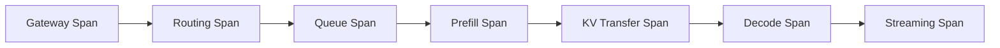

### 15.2 引擎指标

#### 调度指标

- Waiting Requests；
- Running Requests；
- Swapped / Preempted Requests；
- Batched Tokens；
- Active Sequences；
- Queue Time；
- Admission Reject；
- Cancellation Count。

#### KV Cache 指标

- GPU KV Usage；
- CPU KV Usage；
- Block Allocation Failures；
- Prefix Cache Hit Rate；
- Cache Evictions；
- KV Transfer Bytes；
- KV Transfer Latency。

#### GPU 指标

- GPU Utilization；
- HBM Usage；
- HBM Bandwidth；
- SM Occupancy；
- Power；
- Temperature；
- ECC Error；
- NVLink / PCIe / RDMA 带宽。

#### 模型指标

- Input Tokens/s；
- Output Tokens/s；
- Requests/s；
- TTFT 分布；
- ITL 分布；
- Finish Reason；
- Structured Output Failure；
- Tool Call Parse Failure。

### 15.3 容量规划

容量规划至少需要估算：

```text
所需 GPU 数量
≈ 峰值有效 Output Tokens/s / 单 GPU 可持续 Output Tokens/s
```

但真实规划还需要考虑：

- 输入 Token Prefill 成本；
- 输出长度波动；
- P95/P99 SLO；
- 冗余和故障容量；
- 模型副本最小数；
- 灰度发布额外容量；
- Cache 冷启动；
- 租户突发流量；
- GPU 碎片和拓扑约束；
- 模型切换与加载时间。

### 15.4 自动扩缩容信号

仅使用 GPU Utilization 往往不够。更合理的信号包括：

- Queue Length；
- Queue Time；
- Pending Tokens；
- KV Cache 使用率；
- Active Sequences；
- TTFT SLO；
- 每副本请求数；
- Prefill 和 Decode 独立负载。

#### 为什么 GPU Utilization 不足

- Decode 可能显存带宽受限，但 GPU Core 利用率不高；
- 队列已经增长，GPU Utilization 才出现滞后；
- 长 Prompt 会造成短时间高利用，未必需要扩容；
- KV Cache 已接近满载，但算力利用率仍不高。

### 15.5 可靠性机制

生产系统应具备：

- Readiness 与 Liveness；
- 模型加载超时；
- Worker 自动重启；
- 请求排空；
- Graceful Shutdown；
- 请求取消传播；
- OOM 防护；
- 队列上限；
- Circuit Breaker；
- Retry Budget；
- 模型版本回滚；
- 降级与 Fallback；
- 节点故障和网络分区处理。

### 15.6 常见故障模式

| 故障 | 常见原因 | 排查方向 |
|---|---|---|
| TTFT 突增 | 排队、长 Prefill、缓存未命中 | Queue、Batched Tokens、Prefix Hit |
| ITL 抖动 | Prefill 干扰、抢占、GPU 争用 | Chunked Prefill、调度策略、GPU 指标 |
| OOM | KV Cache 过大、模型配置错误、碎片 | KV 使用率、最大序列、显存比例 |
| 吞吐下降 | Batch 太小、Kernel 退化、网络瓶颈 | Batch、Backend、通信带宽 |
| 多节点卡死 | NCCL、网络、拓扑或进程异常 | NCCL 日志、RDMA、节点健康 |
| 结构化输出失败 | Schema 过复杂、后端不支持 | Grammar 配置、Token Mask、回退策略 |
| 取消不生效 | 网关未传播、Worker 未检查 | Abort API、连接状态、资源回收 |
| 冷启动过长 | 权重下载、编译、Engine 构建 | 本地缓存、预热、镜像与存储 |

---

## 十六、主要演进方向

### 16.1 从单机 Kernel 优化转向集群级优化

早期重点：

- FlashAttention；
- Kernel Fusion；
- Quantization；
- CUDA Graph；
- Paged Attention。

当前进一步转向：

- KV-aware Routing；
- Prefill-Decode 分离；
- 分层 KV Cache；
- 跨节点 KV 传输；
- 动态 Worker 配比；
- 多租户调度；
- 大规模 MoE 通信；
- 集群级成本优化。

### 16.2 KV Cache 成为独立数据平面

KV Cache 正从单进程内部对象演进为：

- 独立生命周期；
- 跨请求复用；
- 跨实例共享；
- GPU、CPU、SSD 分层；
- 跨节点迁移；
- 缓存命中路由；
- 租户隔离与配额；
- 可观测、可治理的数据平面。

### 16.3 推理模型改变调度方式

推理模型通常输出更长，运行时间更难预测，带来：

- 更高 KV Cache 占用；
- 更长请求驻留时间；
- Head-of-Line Blocking；
- 更复杂的优先级与抢占；
- 更强的取消与预算需求；
- 对 Speculative Decoding 的需求；
- 对分阶段或阶段性结果输出的需求。

### 16.4 Agent 推动结构化生成成为基础能力

Agent Runtime 需要稳定产生：

- Tool Name；
- Tool Arguments；
- JSON Schema；
- SQL；
- Shell Command；
- Workflow State Transition。

因此，Structured Output、Grammar Decoding、Token-level Validation 会逐步从可选功能变成推理服务的基础能力。

### 16.5 多 LoRA 与模型个性化

企业场景希望在共享 Base Model 上为多个租户加载不同 Adapter。

关键问题：

- Adapter 热加载；
- Adapter Cache；
- 多 Adapter 批处理；
- 租户隔离；
- Adapter 版本；
- 显存碎片；
- 请求路由；
- Base Model 与 Adapter 兼容性。

### 16.6 MoE 成为大模型推理重点

MoE 模型需要：

- Expert Parallel；
- Token Dispatch；
- All-to-All 优化；
- Expert Load Balancing；
- Hot Expert 治理；
- Grouped GEMM；
- 通信与计算重叠。

MoE 的瓶颈不只是矩阵计算，而是网络、负载不均和拓扑。

### 16.7 异构硬件与可插拔后端

企业可能同时拥有：

- NVIDIA GPU；
- AMD GPU；
- 昇腾 NPU；
- Intel CPU/GPU/NPU；
- Apple Silicon；
- 消费级 GPU；
- 边缘设备。

平台会逐步采用统一 Gateway 与可插拔 Runtime：

```text
统一 Gateway
      ↓
可插拔 Control Plane
      ↓
可替换 Inference Engine
      ↓
共享 KV Cache / Transport
      ↓
异构 GPU / NPU / CPU
```

### 16.8 推理成本与 FinOps

未来推理平台不仅关注性能，还需要追踪：

- 每请求成本；
- 每千 Token 成本；
- 每租户 GPU 时间；
- Cache 命中节省；
- 量化收益；
- Spot / On-demand 资源组合；
- 模型路由的质量成本比；
- 空闲 GPU 和过度预留。

---

## 十七、最终选型建议

### 17.1 第一梯队：通用数据中心推理

#### vLLM

适合作为多数新项目的默认起点：

- 快速部署；
- OpenAI API；
- 广泛模型支持；
- 通用生产负载；
- 易于与上层控制面集成。

#### SGLang

适合：

- Agent；
- 结构化输出；
- 复杂解码；
- 长上下文；
- 高 Prefix 复用；
- PD 分离。

#### TensorRT-LLM

适合：

- NVIDIA 固定硬件；
- 固定模型；
- 深度量化与 Kernel 调优；
- 追求性能上限；
- 大型 MoE 和多机多卡。

### 17.2 第二梯队：特定生态与硬件

- **LMDeploy**：TurboMind 与国内模型生态；
- **FastDeploy**：Paddle 和异构硬件；
- **RTP-LLM**：国内生产级在线推理；
- **MindIE**：昇腾；
- **OpenVINO**：Intel；
- **ONNX Runtime GenAI**：ONNX 与 Windows 生态；
- **DeepSpeed-MII**：DeepSpeed 技术栈。

### 17.3 本地与端侧

- 跨平台桌面和 CPU：**llama.cpp**；
- Apple Silicon：**MLX-LM**；
- 浏览器、移动端和 WebGPU：**MLC-LLM**；
- Windows / ONNX：**ONNX Runtime GenAI**；
- Intel 边缘设备：**OpenVINO**。

### 17.4 大规模控制平面

- Python 分布式平台：**Ray Serve LLM**；
- Kubernetes 原生平台：**KServe + llm-d**；
- NVIDIA 大型 GPU 集群：**Dynamo**；
- 通用多模型服务器：**Triton**；
- 快速应用工程化：**BentoML**。

### 17.5 KV Cache 基础设施

- 通用 KV Offload 与复用：**LMCache**；
- KV-centric 分离式架构：**Mooncake**；
- SGLang 体系：**HiCache**；
- NVIDIA Dynamo 体系：**KVBM / 高速传输层**。

### 17.6 推荐落地顺序

对于从零建设推理平台的团队，建议按以下顺序推进：

1. 使用 vLLM 或 SGLang 建立单机性能基线；
2. 定义真实业务 SLO：P95 TTFT、P99 ITL、吞吐和成本；
3. 建立真实流量回放与质量评估；
4. 引入统一 Gateway、鉴权、限流与 Trace；
5. 扩展为多副本并增加自动扩缩容；
6. 根据 Prefix 命中情况引入缓存感知路由；
7. 长上下文和大规模场景再评估外部 KV Cache；
8. 只有在收益明确时引入 PD 分离；
9. 固定 NVIDIA 模型再评估 TensorRT-LLM 深度优化；
10. 持续以单位成本和 SLO 达标率作为最终决策指标。

---

## 十八、一句话决策树

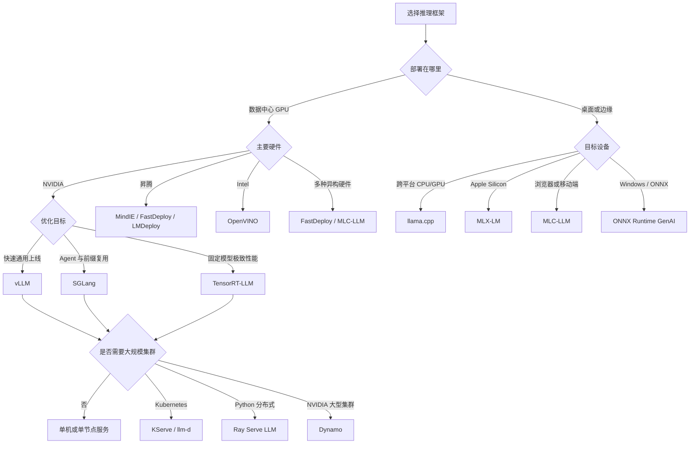

可以归纳为：

> 一般项目先评估 vLLM；Agent、结构化生成和 Prefix-heavy 场景重点评估 SGLang；NVIDIA 极致优化选择 TensorRT-LLM；集群规模扩大后再引入 Ray Serve、KServe/llm-d 或 Dynamo；本地推理优先 llama.cpp、MLX-LM 和 MLC-LLM。

---

## 术语解释

### Admission Control

请求准入控制。根据当前队列、KV Cache、Token 预算、优先级和租户配额，决定请求是进入执行、排队、降级还是拒绝。

### Continuous Batching

连续批处理。在每轮 Token 解码后动态加入和移除请求，区别于一次性固定 Batch。

### Dynamic Batching

动态批处理。通常指模型执行前在短时间窗口内聚合多个请求，常见于通用模型服务器。

### Prefill

处理完整输入 Prompt，计算首轮隐藏状态和 KV Cache 的阶段。主要影响 TTFT。

### Decode

基于历史 KV Cache 逐步生成后续 Token 的阶段。主要影响 TPOT 和 ITL。

### TTFT

Time to First Token，从请求到达到返回首个 Token 的时间。

### TPOT

Time per Output Token，首 Token 后平均每个输出 Token 的生成时间。

### ITL

Inter-Token Latency，相邻两个输出 Token 的时间间隔。

### KV Cache

缓存历史 Token Attention Key 和 Value 的数据结构，避免每轮生成重新计算全部历史。

### Paged KV Cache

将 KV Cache 拆分为固定大小 Block，按需映射和分配，降低连续显存预留与碎片。

### Prefix Cache

缓存公共 Prompt 前缀对应的 KV，供后续请求复用。

### RadixAttention

SGLang 中利用 Radix Tree 管理公共前缀和 KV Cache 复用的机制。

### Chunked Prefill

将长 Prompt 的 Prefill 拆分为多个 Chunk，并与 Decode 共同调度。

### Speculative Decoding

由 Draft Model 或预测模块生成多个候选 Token，再由 Target Model 并行验证，以减少串行解码步数。

### Structured Output

通过 JSON Schema、正则或 Grammar 约束模型生成结果的结构。

### Grammar Decoding

在 Token 采样阶段使用语法状态机限制可生成 Token，从而保证输出符合指定语法。

### Tensor Parallel

将模型单层矩阵计算拆分到多个设备。

### Pipeline Parallel

将不同模型层拆分到不同设备或节点，形成流水线。

### Expert Parallel

将 MoE 模型中的不同 Expert 分布到不同设备。

### Data Parallel

复制完整模型副本，不同副本处理不同请求。

### PD 分离

Prefill-Decode Disaggregation，将 Prefill 和 Decode 部署到不同 Worker 池。

### KV-aware Routing

根据 Worker 当前持有的 KV Cache，将请求路由到最可能命中缓存的实例。

### Multi-LoRA

在同一个 Base Model 服务中动态加载并服务多个 LoRA Adapter。

### MoE

Mixture-of-Experts，混合专家模型。每个 Token 只路由到部分 Expert，以扩大模型容量但控制单 Token 计算量。

### CUDA Graph

预先捕获一系列 GPU 操作并重复执行，降低 CPU Launch 开销。

### Kernel Fusion

将多个相邻算子融合为一个 Kernel，减少中间数据读写和启动开销。

### HBM

High Bandwidth Memory，高带宽显存。Decode 往往对 HBM 带宽非常敏感。

### SLO

Service Level Objective，服务级目标，例如 P95 TTFT 小于 2 秒、P99 ITL 小于 100 毫秒。

---

## 官方资料

### 推理引擎

- [vLLM 官方文档](https://docs.vllm.ai/)
- [SGLang 官方文档](https://docs.sglang.ai/)
- [TensorRT-LLM 官方文档](https://nvidia.github.io/TensorRT-LLM/)
- [Hugging Face TGI 文档](https://huggingface.co/docs/text-generation-inference/)
- [LMDeploy 官方文档](https://lmdeploy.readthedocs.io/)
- [LightLLM 官方文档](https://lightllm-en.readthedocs.io/)
- [RTP-LLM GitHub](https://github.com/alibaba/rtp-llm)
- [FastDeploy GitHub](https://github.com/PaddlePaddle/FastDeploy)
- [DeepSpeed-MII GitHub](https://github.com/deepspeedai/DeepSpeed-MII)
- [MindIE 官方页面](https://www.hiascend.com/en/developer/software/mindie)

### 本地与端侧

- [llama.cpp GitHub](https://github.com/ggml-org/llama.cpp)
- [MLX-LM GitHub](https://github.com/ml-explore/mlx-lm)
- [MLC-LLM GitHub](https://github.com/mlc-ai/mlc-llm)
- [ONNX Runtime GenAI](https://onnxruntime.ai/docs/genai/)
- [OpenVINO 官方文档](https://docs.openvino.ai/)

### 服务与控制平面

- [Triton Inference Server](https://docs.nvidia.com/deeplearning/triton-inference-server/)
- [Ray Serve LLM](https://docs.ray.io/en/latest/serve/llm/)
- [KServe 官方文档](https://kserve.github.io/website/)
- [llm-d 官方网站](https://llm-d.ai/)
- [NVIDIA Dynamo 文档](https://docs.nvidia.com/dynamo/)
- [BentoML 官方文档](https://docs.bentoml.com/)

### KV Cache 与分离式推理

- [LMCache 官方文档](https://docs.lmcache.ai/)
- [Mooncake 项目页面](https://kvcache-ai.github.io/Mooncake/)
- [SGLang PD Disaggregation](https://docs.sglang.ai/advanced_features/pd_disaggregation.html)
- [vLLM Prefix Caching](https://docs.vllm.ai/en/latest/design/prefix_caching/)

### 性能测试

- [NVIDIA GenAI-Perf](https://docs.nvidia.com/deeplearning/triton-inference-server/user-guide/docs/perf_analyzer/genai-perf/README.html)
- [MLPerf Client / Server Benchmarks](https://mlcommons.org/benchmarks/)

---

## 结语

大模型推理系统的竞争，已经从单个 Kernel 或单个推理引擎的竞争，扩展为包含 **请求路由、Token 调度、KV Cache、分布式通信、模型并行、异构硬件、可观测性、成本治理和质量评估** 的系统工程。

在工程实践中，应避免先决定框架、再寻找场景。更合理的顺序是：

```text
明确业务负载
  ↓
定义质量与性能 SLO
  ↓
建立真实压测数据集
  ↓
比较推理引擎
  ↓
设计服务与控制平面
  ↓
根据瓶颈引入 KV Cache、PD 分离和深度优化
```

最终选型应以真实业务下的 **SLO 达标率、质量、可靠性、运维复杂度和单位成本** 为准，而不是单一吞吐数字。
