# 附录 H 主流大模型训练框架系统全景

> 训练技术栈的横向全景速查:基础计算框架、分布式并行引擎、完整训练栈、高层微调入口、RLHF/RLVR 后训练框架、集群调度与编排的分层地图与选型方法。与正文的分工:并行机制见第 16 章、显存与精度见第 17 章、运行时剖析见第 18 章、工程层与编排见第 19 章、后训练基础设施见第 21 章、批调度见第 9 章;项目版本快照见附录 C。
>
> 数据口径日期:2026-09。框架版本、并行能力、硬件支持与接口变化很快,一律以项目官方文档与实际基准测试为准;引用前先查[勘误与更新](../ERRATA.md)。

## 1. 核心结论

“大模型训练框架”不是单一软件类别，而是一个由多层组件共同组成的系统栈。

- **PyTorch、JAX、TensorFlow、PaddlePaddle、MindSpore**：基础计算、自动微分、设备执行与编译框架。
- **FSDP、DeepSpeed、Megatron Core、Colossal-AI**：分布式执行、模型切分、显存优化与通信优化引擎。
- **TorchTitan、NeMo、MaxText、PaddleNLP、MindSpore Transformers**：面向大模型的完整训练栈或参考实现。
- **Transformers Trainer、Accelerate、LLaMA-Factory、Axolotl**：高层训练入口、配置驱动微调与实验工作流。
- **TRL、verl、OpenRLHF、NeMo RL**：偏好优化、RLHF、RLVR、在线采样与大规模后训练框架。
- **Slurm、Ray、Kubeflow Trainer、Kueue、Volcano**：任务提交、集群调度、队列、配额、资源治理和故障恢复。

因此，下面这些组件并不是同一层的竞争产品：

```text
PyTorch ≠ DeepSpeed ≠ Megatron Core ≠ Hugging Face ≠ Ray
```

一个典型生产组合可能是：

```text
Transformers + PyTorch + FSDP2 + NCCL + Slurm
```

或者：

```text
NeMo + Megatron Core + Transformer Engine + Slurm/Kubernetes
```

又或者在强化学习后训练中：

```text
verl + Megatron/FSDP2 + vLLM/SGLang + Ray
```

训练框架选型的真正核心不是“哪个框架名气最大”，而是以下问题：

1. 模型参数、激活、梯度和优化器状态如何切分。
2. 张量、流水线、上下文和专家并行如何组合。
3. 通信模式如何映射到 GPU 拓扑和网络结构。
4. Checkpoint 是否支持大规模保存、恢复和拓扑变化。
5. 训练、数据、Rollout、评估和集群控制能否形成闭环。

---

## 2. 大模型训练技术栈全景

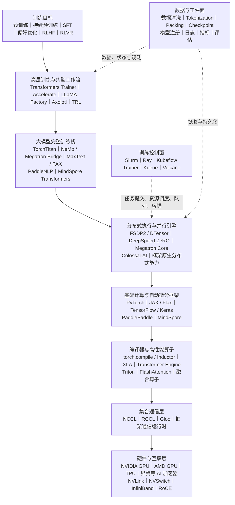

### 2.1 框架之间的典型调用关系

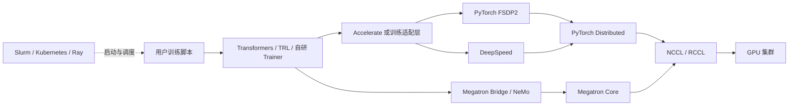

---

## 3. 三个系统平面

企业级大模型训练系统可以抽象为三个平面。

| 平面 | 核心职责 | 典型组件 |
|---|---|---|
| **训练数据面** | 前向、反向、梯度同步、优化器更新、模型并行、状态分片 | PyTorch、JAX、FSDP、DeepSpeed、Megatron Core |
| **训练控制面** | Job、队列、配额、调度、启动、重试、抢占恢复、Gang Scheduling | Slurm、Ray、Kubeflow Trainer、Kueue、Volcano |
| **数据与工件面** | 数据集、Tokenizer、Checkpoint、实验指标、模型版本、评估结果 | 对象存储、分布式文件系统、模型仓库、实验平台 |

### 3.1 训练数据面

训练数据面位于执行链路中心，负责真正的模型计算：

```text
批次加载
  → 前向传播
  → Loss 计算
  → 反向传播
  → 梯度通信
  → 梯度裁剪
  → 优化器更新
  → 学习率调度
  → Checkpoint 保存
```

### 3.2 训练控制面

训练控制面不直接计算模型，而是决定：

- 哪个作业何时运行。
- 占用多少 GPU、CPU、内存和网络资源。
- 多节点是否必须同时启动。
- 作业失败后是否重试。
- 抢占后如何恢复。
- 多租户如何进行公平调度和配额隔离。

### 3.3 数据与工件面

数据与工件面管理训练输入和训练产物，包括：

- 原始数据、清洗数据、Tokenized 数据。
- 数据版本、数据血缘和去重记录。
- Tokenizer、配置、代码版本和环境镜像。
- 模型参数、优化器状态和随机数状态。
- 日志、指标、Profiler Trace 和评估报告。
- 模型注册、审批、发布和回滚记录。

---

## 4. 主流框架分层

| 层级 | 代表框架 | 核心定位 |
|---|---|---|
| 高层训练与实验层 | Transformers Trainer、Accelerate、TRL、LLaMA-Factory、Axolotl | 降低训练、微调和后训练使用门槛 |
| 完整大模型训练栈 | TorchTitan、NeMo、MaxText、PAX、PaddleNLP、MindSpore Transformers | 提供模型、并行、训练循环、Checkpoint 和参考配方 |
| 分布式训练引擎 | FSDP2、DeepSpeed、Megatron Core、Colossal-AI | 状态分片、多维并行、显存与通信优化 |
| 基础计算框架 | PyTorch、JAX、TensorFlow、PaddlePaddle、MindSpore | 自动微分、算子执行、编译、设备抽象 |
| 通信与算子层 | NCCL、RCCL、Triton、FlashAttention、Transformer Engine | 集合通信、融合算子、低精度和高性能 Kernel |
| 集群调度层 | Slurm、Ray、Kubeflow Trainer、Kueue、Volcano | 资源调度、队列、配额、任务编排和容错 |

---

## 5. 基础计算框架

## 5.1 PyTorch

PyTorch 是当前开源大模型训练生态中最常见的基础框架。其主要能力包括：

- 动态计算图和自动微分。
- `torch.distributed` 多机多卡通信。
- DDP、FSDP2、DTensor、DeviceMesh。
- Tensor Parallel、Pipeline Parallel、Context Parallel。
- Distributed Checkpoint。
- `torch.compile`、TorchInductor 和 Triton Kernel。
- 与 Hugging Face、DeepSpeed、Megatron、Ray 等生态集成。

### 优势

- 模型和算法生态最完整。
- 调试方式接近普通 Python 程序。
- 适合自定义模型、Loss、优化器和训练循环。
- 可从单卡逐步扩展到多机多维并行。

### 局限

- 大规模训练需要团队自行理解通信、拓扑和状态生命周期。
- 不同分布式组件仍可能处于快速演进阶段。
- 同时组合 FSDP、TP、PP、CP 后，系统复杂度明显上升。

### 适用场景

- 通用 GPU 训练平台。
- 开源模型预训练、持续预训练和 SFT。
- 自研大模型训练框架。
- 需要灵活算法创新的团队。

---

## 5.2 JAX / Flax

JAX 提供函数式自动微分、JIT 编译、向量化和显式分片能力，常与 Flax、MaxText、PAX 配合使用。

### 核心能力

- `jit`：将 Python 数值函数编译为 XLA 计算图。
- `grad`：自动微分。
- `vmap`：自动向量化。
- `pmap`、`pjit` 和显式 Sharding。
- Mesh 与 PartitionSpec。
- TPU、GPU 和 CPU 执行。

### 优势

- 与 TPU 和 XLA 集成紧密。
- 显式 Sharding 更利于表达大规模并行策略。
- 编译器可以执行算子融合、布局和通信优化。
- 对规则、稳定的大规模训练任务具有较强可预测性。

### 局限

- 编程范式与 PyTorch 差异较大。
- JIT 编译时间、静态形状和重编译需要治理。
- 调试编译后图和分片规则门槛较高。
- 第三方模型和训练工具数量通常少于 PyTorch 生态。

### 适用场景

- TPU 集群。
- 已采用 Google Cloud、JAX 或 XLA 的组织。
- 追求编译器级全局优化的大规模训练。

---

## 5.3 TensorFlow / Keras

TensorFlow 通过 `tf.distribute` 支持单机多 GPU、多机多 GPU 和 TPU 训练，并可结合 Keras 高层训练接口或自定义训练循环。

### 优势

- 企业生产工具链成熟。
- 与 TFX、TensorFlow Serving 等系统集成稳定。
- 对已有 TensorFlow 模型和数据流水线迁移成本低。

### 局限

- 新的大模型开源训练项目通常优先支持 PyTorch。
- 部分新型低精度算子、后训练算法和社区配方的支持可能滞后。

### 适用场景

- 已有大量 TensorFlow 资产的企业。
- 与 TFX、TensorFlow Serving 深度绑定的平台。
- 使用 TPU 但暂不采用 JAX 的团队。

---

## 5.4 PaddlePaddle

PaddlePaddle 是百度开源的深度学习框架，在中文大模型、国产训练环境和 PaddleNLP 生态中具有完整工具链。

主要能力包括：

- 数据并行和参数分片。
- 张量并行、流水线并行。
- 动静统一执行与高性能算子。
- 与 PaddleNLP 大模型训练套件集成。

适合：

- 已采用 Paddle 生态的组织。
- 中文模型训练和产业化平台。
- 需要统一训练、压缩、推理和部署的场景。

---

## 5.5 MindSpore

MindSpore 面向 AI 加速器和大规模分布式训练，通常与 MindSpore Transformers 等组件配合。

适合：

- 昇腾硬件环境。
- 已采用 MindSpore 技术栈的组织。
- 需要结合国产算力基础设施建设训练平台的场景。

---

## 6. 分布式训练与并行引擎

## 6.1 PyTorch FSDP2 + DTensor

FSDP 的核心思想是将训练状态分片到多个设备，而不是让每张卡都保存完整模型状态。

训练状态主要包括：

```text
模型参数
梯度
优化器状态
```

FSDP2 基于更细粒度的参数分片和 DTensor 抽象，能够与 DeviceMesh、多维并行和 Distributed Checkpoint 组合。

### 执行过程简化示意

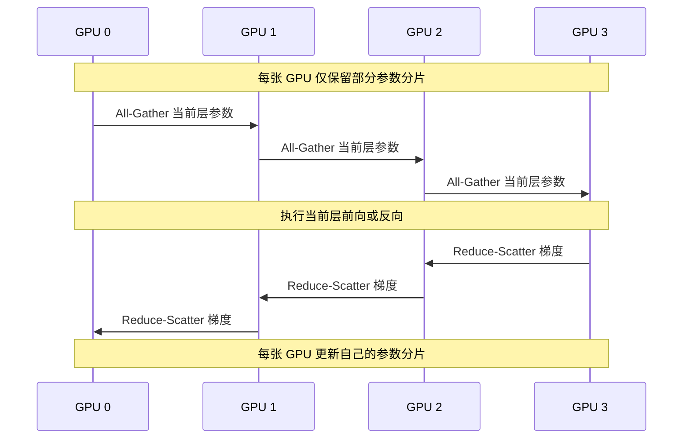

### 优势

- PyTorch 原生集成。
- 适合模型状态显存优化。
- 可与 TP、CP、PP 和 DeviceMesh 组合。
- 适合建设自主可控的训练平台。

### 局限

- All-Gather 和 Reduce-Scatter 会增加通信。
- 参数生命周期、预取和重分片策略会影响性能。
- 错误包裹粒度可能导致显存或通信效率下降。
- 与激活检查点、混合精度和编译组合时需要系统测试。

### 适用场景

- PyTorch 原生中大型预训练。
- 持续预训练和全参数微调。
- 不希望引入额外大型训练引擎的团队。

---

## 6.2 DeepSpeed

DeepSpeed 是建立在 PyTorch 之上的分布式训练优化库，最核心的能力是 ZeRO。

### ZeRO 三个阶段

| 阶段 | 分片对象 | 主要作用 |
|---|---|---|
| **ZeRO-1** | 优化器状态 | 降低 Adam 等优化器状态的显存占用 |
| **ZeRO-2** | 优化器状态、梯度 | 进一步减少反向传播阶段的显存 |
| **ZeRO-3** | 优化器状态、梯度、模型参数 | 支持单卡无法容纳的超大模型 |

### 其他能力

- CPU Offload。
- NVMe Offload。
- Pipeline Parallel。
- Tensor Parallel 集成。
- MoE 支持。
- Activation Checkpointing。
- 大规模 Checkpoint。

### 优势

- ZeRO 显存优化成熟。
- 与 Transformers Trainer、Accelerate 集成广泛。
- 适合对已有 PyTorch 脚本进行相对有限的改造。
- CPU 和 NVMe Offload 可以进一步突破显存限制。

### 局限

- 配置项较多，JSON 配置复杂。
- ZeRO、TP、PP、Offload 和激活重计算组合后排障困难。
- 高层抽象可能隐藏参数何时聚合、释放和更新。
- Checkpoint 与其他训练框架之间可能需要格式转换。

### 适用场景

- 首要目标是解决显存不足。
- 已有 Hugging Face 或 PyTorch 训练脚本。
- 中大型继续预训练和微调。
- 需要 CPU/NVMe 卸载。

---

## 6.3 Megatron Core

Megatron Core 是 NVIDIA 面向大规模 Transformer 训练提供的核心并行组件库。

### 核心并行能力

- Data Parallel。
- Tensor Parallel。
- Pipeline Parallel。
- Sequence Parallel。
- Context Parallel。
- Expert Parallel。
- Distributed Optimizer。
- Distributed Checkpoint。
- Transformer Engine 集成。

### 多维并行示意

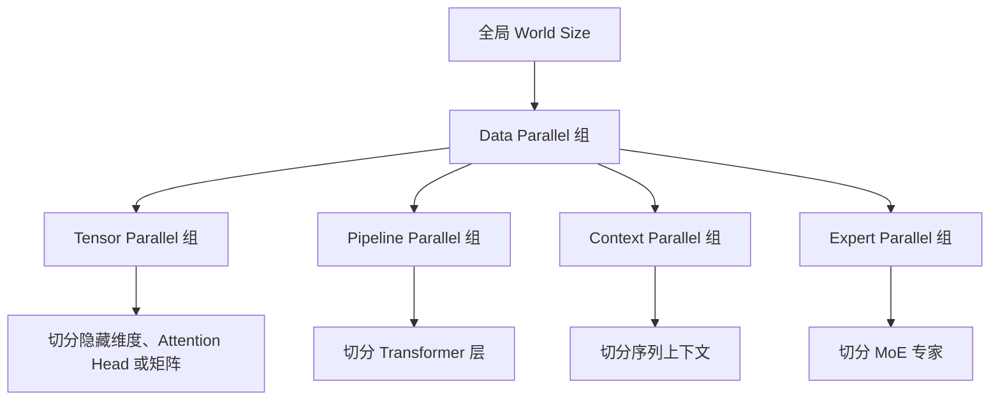

### 优势

- 多维并行能力完整。
- 对 Transformer 和 MoE 具有大量专用优化。
- 适合长上下文和超大规模模型。
- 容易结合 BF16、FP8 和 Transformer Engine。
- 能针对 NVLink、NVSwitch 和跨节点网络进行拓扑映射。

### 局限

- 学习和运维成本高。
- 模型结构通常需要适配 Megatron 内部抽象。
- 数据格式、并行配置和 Checkpoint 转换较复杂。
- 更依赖高质量 NVIDIA GPU 集群和高速互联。

### 适用场景

- 超大规模密集模型预训练。
- 大型 MoE 模型。
- 长上下文训练。
- 数十至数百节点的高吞吐训练。

---

## 6.4 Colossal-AI

Colossal-AI 建立在 PyTorch 之上，提供多种并行策略、异构内存管理、自动并行和大模型训练优化。

### 典型能力

- ZeRO 类状态分片。
- Tensor Parallel。
- Pipeline Parallel。
- Sequence Parallel。
- Hybrid Parallel。
- 异构内存管理。
- 大模型微调和推理工具。

### 适用场景

- 希望探索 DeepSpeed 和 PyTorch 原生路线之外的替代方案。
- 需要快速实验混合并行策略。
- 采用 Colossal-AI 生态的研究与工程团队。

---

## 7. 大模型完整训练栈

## 7.1 TorchTitan

TorchTitan 是 PyTorch 原生的大模型训练平台和参考实现，通常组合：

```text
PyTorch
  ├── FSDP2
  ├── DTensor / DeviceMesh
  ├── Tensor Parallel
  ├── Pipeline Parallel
  ├── Context Parallel
  ├── Distributed Checkpoint
  ├── torch.compile
  └── 低精度训练
```

### 优势

- PyTorch 原生能力组合示范。
- 便于理解现代 PyTorch 大模型训练栈。
- 适合企业自研训练底座参考。
- 可以避免过重的第三方训练引擎侵入。

### 局限

- 项目持续快速演进。
- 对模型扩展和生产稳定性仍需要团队自行验证。
- 超大规模 MoE 场景下，Megatron Core 仍可能更成熟。

---

## 7.2 NVIDIA NeMo + Megatron Bridge

NeMo 在 Megatron Core 之上提供更完整的训练系统，包括：

- 模型配方。
- 数据加载。
- 训练循环。
- 多维并行配置。
- 低精度训练。
- Checkpoint 管理。
- Hugging Face 与 Megatron 格式转换。
- 后训练和部署生态连接。

### 适用场景

- NVIDIA GPU 大规模训练平台。
- 需要统一预训练、微调、后训练和部署的企业。
- 大规模密集模型、MoE 和长上下文训练。

---

## 7.3 MaxText

MaxText 是基于 JAX 的高性能大模型训练参考实现，面向 TPU 和 GPU。

### 典型能力

- Mesh 和显式 Sharding。
- 多种 Transformer 模型配方。
- XLA 编译。
- 大规模 Checkpoint。
- TPU Pod 训练。
- GPU 多节点训练。

### 适用场景

- TPU 集群。
- JAX/XLA 技术体系。
- 需要高性能、可复现训练配方的团队。

---

## 7.4 PAX

PAX 是面向 JAX 大规模模型实验和训练的通用框架，适合复杂模型和实验系统。

适合：

- 大型研究组织。
- 需要高度可配置实验系统。
- 已积累 JAX、Praxis 或相关技术栈的团队。

---

## 7.5 PaddleNLP 大模型训练套件

PaddleNLP 提供：

- 预训练和持续预训练。
- SFT、DPO、RLHF。
- LoRA、Prefix Tuning 等 PEFT 能力。
- 数据并行、Sharding、TP 和 PP。
- 统一 Checkpoint 和弹性恢复。

适合 PaddlePaddle 生态和中文大模型产业化场景。

---

## 7.6 MindSpore Transformers

MindSpore Transformers 提供预训练、微调、推理和部署等能力，适合：

- MindSpore 技术栈。
- 昇腾集群。
- 国产算力环境下的大模型平台。

---

## 8. 高层训练与微调框架

## 8.1 Hugging Face Transformers

Transformers 主要提供：

- 主流模型结构。
- Tokenizer。
- 配置和 Checkpoint 加载。
- Trainer 训练循环。
- Generation 和模型导出。
- 与 Accelerate、PEFT、TRL 的集成。

Transformers 不是底层分布式训练引擎，而是模型和训练工作流入口。

---

## 8.2 Accelerate

Accelerate 对设备和分布式环境进行统一封装，可连接：

- 单卡。
- DDP。
- FSDP。
- DeepSpeed。
- TPU。
- 混合精度训练。

### 核心价值

同一份训练代码可以通过配置切换不同执行后端，降低实验脚本和集群运行方式之间的耦合。

---

## 8.3 PEFT

PEFT 用于参数高效微调，常见方法包括：

- LoRA。
- QLoRA。
- Prefix Tuning。
- Prompt Tuning。
- IA3。
- Adapter 类方法。

### 适用场景

- GPU 资源有限。
- 多租户或多任务需要保存大量轻量适配器。
- 需要快速迭代垂直领域模型。

---

## 8.4 TRL

TRL 面向大模型后训练，覆盖：

- SFT。
- Reward Modeling。
- DPO。
- PPO。
- GRPO。
- 其他偏好优化和强化学习算法。

适合快速研究、原型验证和中等规模后训练。

---

## 8.5 LLaMA-Factory

LLaMA-Factory 是配置驱动的大模型训练和微调工作台，通常封装：

```text
Transformers
Accelerate
PEFT
TRL
DeepSpeed
量化与推理组件
```

### 典型能力

- 预训练。
- SFT。
- Reward Model。
- PPO、DPO、KTO、ORPO、SimPO 等。
- 全量微调、冻结微调、LoRA、QLoRA。
- Web UI 和命令行配置。

### 定位

它不是新的底层分布式算法，而是对多个训练组件的统一产品化封装。

---

## 8.6 Axolotl

Axolotl 同样采用配置驱动方式，重点封装：

- 数据模板和数据预处理。
- 模型加载。
- LoRA、QLoRA 和全量微调。
- Packing。
- 分布式训练。
- Checkpoint 和模型导出。

适合需要较强可配置性，又不希望自行维护完整训练循环的团队。

---

## 9. RLHF、RLVR 与后训练框架

传统 SFT 的训练链路相对集中，而在线 RL 后训练需要协调多个模型角色和推理服务。

### 9.1 在线后训练主链路

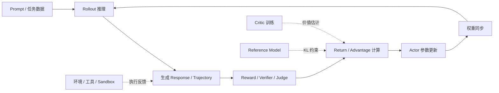

### 9.2 TRL

定位：研究和快速原型。

特点：

- 与 Transformers 和 Accelerate 集成紧密。
- 适合快速验证 SFT、DPO、GRPO 等算法。
- 使用门槛相对较低。

局限：

- 极大规模在线 RL 的资源编排和异构执行能力有限。
- 多模型、多角色、推理训练解耦场景可能需要更专门的框架。

---

## 9.3 verl

verl 面向分布式、生产级大模型强化学习后训练。

### 核心能力

- FSDP/FSDP2 或 Megatron 训练后端。
- vLLM/SGLang 等 Rollout 后端。
- 训练与推理解耦。
- 多节点资源编排。
- 权重同步。
- 多轮工具调用、Agent 和多模态场景扩展。

### 适用场景

- 大规模 RLHF、RLVR、GRPO。
- 高吞吐 Rollout。
- 需要将训练引擎与推理引擎组合的系统。

---

## 9.4 OpenRLHF

OpenRLHF 通常基于 Ray 组织 Actor、Critic、Reward、Reference 和 Rollout 组件。

### 优势

- 对多模型角色进行资源编排。
- 可结合 vLLM 等推理引擎提高采样吞吐。
- 适合大规模 PPO、DPO 和其他 RLHF 工作负载。

---

## 9.5 NeMo RL

NeMo RL 面向 NVIDIA 大规模后训练栈，通常与 Megatron Core、Ray 和 NVIDIA 训练生态结合。

适合：

- 已使用 NeMo/Megatron 的组织。
- NVIDIA GPU 多节点后训练。
- 需要统一预训练、SFT 和 RL 阶段的企业平台。

---

## 9.6 vLLM 和 SGLang 的定位

需要明确：

> vLLM 和 SGLang 主要是推理与 Rollout 引擎，不是预训练框架。

在 RL 系统中：

- vLLM/SGLang 负责高吞吐生成样本。
- FSDP、DeepSpeed 或 Megatron 负责反向传播和参数更新。
- verl、OpenRLHF、NeMo RL 等负责资源编排、权重同步和训练闭环。

---

## 10. 并行策略全景

训练框架的核心价值最终落在并行策略及其组合上。

| 并行策略 | 核心思想 | 主要解决的问题 | 主要代价 |
|---|---|---|---|
| **数据并行 DP/DDP** | 每张卡保存完整模型，处理不同数据 | 提高吞吐 | 梯度同步开销，单卡必须容纳完整模型 |
| **FSDP / ZeRO** | 分片参数、梯度和优化器状态 | 降低模型状态显存 | All-Gather、Reduce-Scatter 通信 |
| **张量并行 TP** | 沿矩阵、隐藏维度或 Attention Head 切分单层 | 单层无法放入单卡 | 层内通信频繁，对高速互联敏感 |
| **流水线并行 PP** | 将不同层放到不同 Stage | 模型层数和参数规模过大 | 流水线气泡和 Micro Batch 调度 |
| **上下文并行 CP** | 沿序列维度切分输入与激活 | 超长上下文激活显存过高 | Attention 通信增加 |
| **序列并行 SP** | 在部分算子中沿序列维度切分中间激活 | 降低 TP 区域激活显存 | 通常与 TP 绑定，调试复杂 |
| **专家并行 EP** | 将 MoE 专家切分到不同设备 | 专家参数规模巨大 | Token Dispatch 依赖 All-to-All |

### 10.1 数据并行

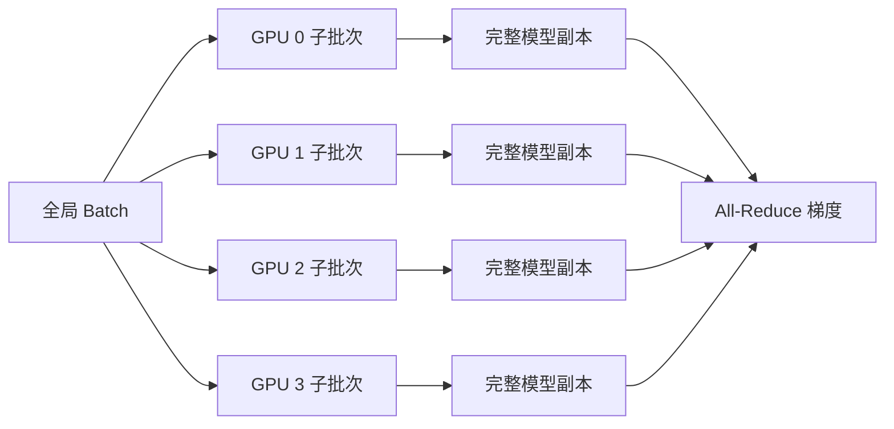

数据并行适合模型可以放入单卡，但需要提高全局吞吐的场景。

### 10.2 张量并行

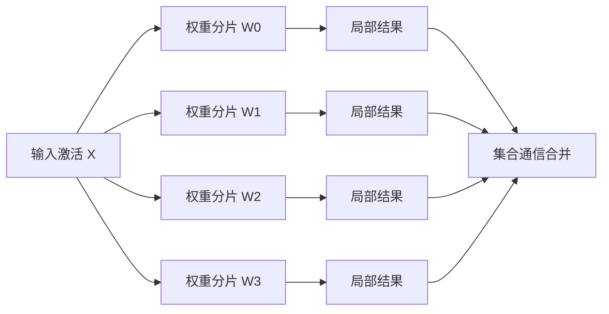

张量并行通信频率高，应尽可能放在同一 NVLink/NVSwitch 域内。

### 10.3 流水线并行

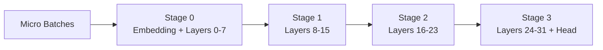

流水线并行通过 Micro Batch 填充不同 Stage，但会产生流水线气泡。

### 10.4 上下文并行

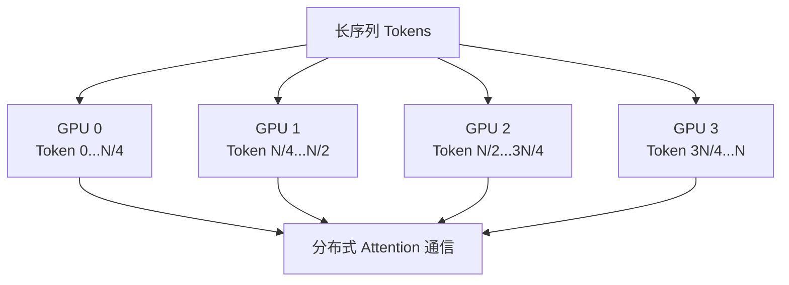

上下文并行主要用于解决长上下文训练中的激活显存问题。

### 10.5 专家并行

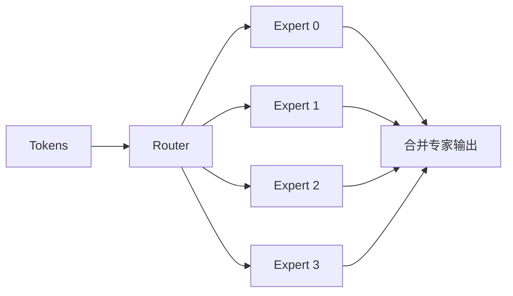

MoE 的关键瓶颈通常不是专家计算本身，而是 Token Dispatch、负载均衡和 All-to-All 通信。

### 10.6 多维并行关系

概念上可近似写成：

```text
World Size ≈ DP × TP × PP × CP × EP
```

但真实框架中部分并行维度可能共享、嵌套或仅作用于特定模块，因此不能机械相乘。

### 10.7 常见组合

#### 小中型密集模型

```text
FSDP/ZeRO + Activation Checkpointing
```

#### 大型密集模型

```text
DP/FSDP + TP + PP
```

#### 长上下文大型模型

```text
DP/FSDP + TP + PP + CP
```

#### 大型 MoE 模型

```text
DP/FSDP + TP + PP + EP
```

#### 长上下文 MoE 模型

```text
DP/FSDP + TP + PP + CP + EP
```

---

## 11. 显存构成与优化方法

### 11.1 训练显存构成

大模型训练显存通常由以下部分组成：

```text
模型参数
+ 梯度
+ 优化器状态
+ 激活值
+ 临时 Workspace
+ 通信 Buffer
+ 内存碎片与框架开销
```

以混合精度 Adam 训练为例，单个参数可能同时存在：

- BF16/FP16 参数。
- FP32 Master Weight。
- 梯度。
- Adam 一阶矩状态。
- Adam 二阶矩状态。

因此，模型参数规模并不等于真实训练显存占用。

### 11.2 主要优化手段

| 优化手段 | 主要作用 | 代价 |
|---|---|---|
| BF16/FP16 | 降低参数和激活显存，提高 Tensor Core 吞吐 | 数值稳定性风险 |
| FP8 | 进一步提高吞吐并降低显存 | 需要硬件、算子和缩放策略支持 |
| Activation Checkpointing | 不保存部分激活，反向时重新计算 | 增加计算量 |
| FSDP / ZeRO | 分片模型状态 | 增加集合通信 |
| CPU Offload | 将部分状态放到 CPU 内存 | PCIe/NVLink Host 通信开销 |
| NVMe Offload | 将状态放到本地磁盘 | 延迟更高，对 I/O 敏感 |
| FlashAttention | 降低 Attention 中间显存和访存 | 依赖算子支持和形状条件 |
| Sequence/Context Parallel | 分片长序列激活 | 增加通信 |
| Gradient Accumulation | 用多个 Micro Batch 模拟大 Batch | 每次参数更新耗时增加 |
| LoRA/QLoRA | 只训练少量参数 | 表达能力和适配范围受限 |

### 11.3 显存优化决策顺序

通常建议按以下顺序处理：

```text
选择 BF16
  → 开启 FlashAttention 或高效 Attention
  → 启用 Activation Checkpointing
  → 调整 Micro Batch 和梯度累积
  → 使用 FSDP/ZeRO
  → 必要时增加 TP/PP/CP
  → 最后评估 CPU/NVMe Offload
```

Offload 通常应作为容量兜底方案，而不是性能优先方案。

---

## 12. 集群调度与训练编排

## 12.1 Slurm

Slurm 是裸金属和 HPC 集群中常见的资源管理与批处理调度系统。

主要职责：

- 节点和 GPU 分配。
- 队列和优先级。
- Job 启动、终止和重排队。
- 多节点环境变量注入。
- 作业依赖和资源配额。

适合：

- 固定规模 GPU 集群。
- 训练作业以批处理为主。
- 已有 HPC 运维体系。
- 追求稳定、简单和较低控制面开销。

---

## 12.2 Ray

Ray 提供分布式 Task、Actor 和资源调度能力。

在大模型训练中常用于：

- 启动和管理训练 Worker。
- 数据并行任务编排。
- RLHF 多角色调度。
- Rollout、Reward、Actor、Critic 的异构部署。
- 弹性 Actor 生命周期管理。

需要注意：

> Ray 负责资源和进程编排，但通常不代替 FSDP、DeepSpeed 或 Megatron 完成底层梯度并行。

---

## 12.3 Kubernetes 训练平台

典型组合：

```text
Kubernetes
  ├── Kubeflow Trainer：声明和管理训练 Job
  ├── Kueue：队列、配额和准入控制
  ├── Volcano：Gang、Fair Share、Binpack、拓扑调度
  ├── Ray Operator：Ray 集群和任务生命周期
  └── GPU Operator：GPU 驱动、设备插件和监控组件
```

### Kubeflow Trainer

负责定义和管理分布式训练作业。

### Kueue

负责：

- Workload Queue。
- 多租户配额。
- 准入控制。
- Cluster Queue。
- 优先级和资源借用。

### Volcano

负责：

- Gang Scheduling。
- Fair Share。
- Binpack。
- 队列调度。
- 拓扑感知调度。

### Kubernetes 路线适用场景

- 云原生多租户训练平台。
- 需要统一训练、推理和数据作业。
- 需要配额、审批、审计和租户隔离。
- 已有 Kubernetes 平台团队。

---

## 12.4 Gang Scheduling

分布式训练通常要求多个 Worker 同时启动。若只启动部分 Worker，作业无法运行，但资源已经被占用。

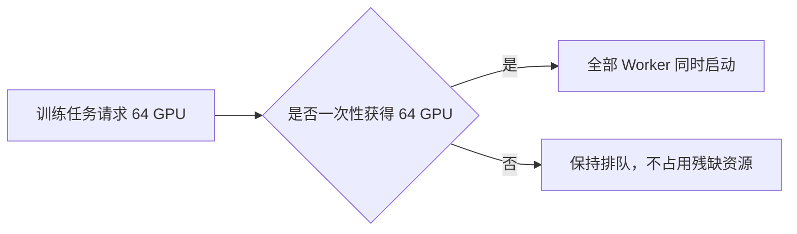

Gang Scheduling 能避免资源死锁和碎片化。

---

## 13. 数据、Checkpoint 与工件系统

## 13.1 训练数据链路


### 数据系统需要解决的问题

- 大规模数据读取吞吐。
- 全局 Shuffle。
- 数据分片和 Epoch 一致性。
- 断点恢复后的样本位置恢复。
- 文档边界和 EOS 处理。
- Sequence Packing。
- 多数据源采样权重。
- 数据版本和血缘。
- 数据泄漏与评测集污染。

---

## 13.2 Checkpoint 内容

完整训练恢复通常不仅需要模型参数，还需要：

- 模型参数。
- 优化器状态。
- 学习率调度器状态。
- GradScaler 状态。
- 随机数生成器状态。
- 当前 Step、Epoch 和 Token 数。
- DataLoader 或数据游标状态。
- 并行拓扑和 Sharding 元数据。
- 训练配置、代码版本和环境信息。

### 13.3 分布式 Checkpoint

大规模训练中，不应由单个 Rank 汇总全部参数再写盘，否则会产生：

- 单机内存峰值。
- 网络汇聚瓶颈。
- 保存时间过长。
- 单点故障。

更合理的方式是：

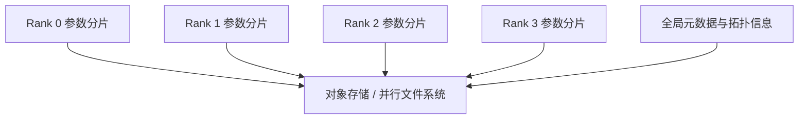

### 13.4 Checkpoint 关键能力

| 能力 | 说明 |
|---|---|
| 分布式写入 | 多 Rank 并行保存，避免单点汇总 |
| 异步保存 | 计算与 I/O 重叠，降低停顿时间 |
| 原子提交 | 避免使用未完成或损坏的 Checkpoint |
| 完整性校验 | 校验分片数量、哈希和元数据 |
| 拓扑变化恢复 | 不同 World Size 或并行配置下恢复 |
| 格式转换 | FSDP、Megatron、Hugging Face 格式互转 |
| 保留策略 | 保留最近、最优和关键里程碑版本 |

---

## 14. 训练可观测性与性能分析

### 14.1 训练指标

训练质量指标：

- Loss。
- Perplexity。
- Accuracy 或任务指标。
- Gradient Norm。
- Learning Rate。
- Token 数和有效样本数。
- 数据源采样比例。

系统性能指标：

- Step Time。
- Tokens/s。
- Samples/s。
- Model FLOPs Utilization，MFU。
- Hardware FLOPs Utilization，HFU。
- GPU Utilization。
- HBM 使用量。
- 通信时间占比。
- DataLoader 等待时间。
- Checkpoint 保存时间。

稳定性指标：

- NaN/Inf。
- Loss Spike。
- OOM。
- NCCL Timeout。
- Worker 重启次数。
- Checkpoint 恢复成功率。
- 数据读取错误和坏样本数量。

### 14.2 Step Time 分解

```text
Step Time
  = Data Loading
  + Forward
  + Backward
  + Communication
  + Optimizer Step
  + Checkpoint/Logging Stall
```

### 14.3 常见性能瓶颈

| 现象 | 可能原因 |
|---|---|
| GPU 利用率低 | DataLoader 慢、CPU 瓶颈、同步等待、Batch 太小 |
| 通信占比高 | TP 跨节点、FSDP 粒度不合理、网络拥塞 |
| 显存充足但吞吐低 | Activation Checkpoint 过多、Kernel 碎片化、编译未生效 |
| 周期性长尾 | Checkpoint、日志、数据换片或网络抖动 |
| MoE 吞吐不稳定 | Router 负载不均、Token Dispatch 拥塞、专家热点 |
| 长上下文 OOM | 激活占用过高、Attention 算子不高效、CP 配置不足 |

### 14.4 常用分析工具

- PyTorch Profiler。
- Nsight Systems。
- Nsight Compute。
- NCCL Debug 日志。
- TensorBoard。
- Weights & Biases。
- MLflow。
- Prometheus + Grafana。
- OpenTelemetry。
- 自研训练 Trace 和 Step Breakdown。

---

## 15. 不同训练阶段的推荐组合

## 15.1 预训练和持续预训练

典型选择：

| 环境 | 推荐路线 |
|---|---|
| 通用 PyTorch GPU 集群 | PyTorch FSDP2、TorchTitan、DeepSpeed |
| 超大规模 NVIDIA 集群 | Megatron Core、NeMo |
| TPU 集群 | JAX、MaxText |
| Paddle 生态 | PaddleNLP |
| 昇腾/MindSpore 生态 | MindSpore Transformers |

预训练最关注：

- 数据吞吐和样本质量。
- 多维并行。
- 低精度稳定性。
- 分布式 Checkpoint。
- 长时间作业容错。
- 集群 MFU 和网络效率。

---

## 15.2 SFT 和参数高效微调

典型选择：

```text
Transformers + Accelerate + PEFT
LLaMA-Factory
Axolotl
TRL SFTTrainer
```

SFT 更关注：

- 对话模板。
- 数据清洗和格式一致性。
- Packing。
- Loss Mask。
- LoRA 目标层。
- 量化配置。
- 模型导出和合并。
- 评估和过拟合控制。

---

## 15.3 偏好优化

常见算法：

```text
DPO
IPO
KTO
ORPO
SimPO
Reward Modeling
```

小中规模快速实验优先考虑 TRL 或 LLaMA-Factory；更大规模或更复杂的多模型训练可采用专门后训练框架。

---

## 15.4 在线 RLHF / RLVR

典型组合：

```text
verl / OpenRLHF / NeMo RL
  + FSDP2 或 Megatron
  + vLLM 或 SGLang
  + Ray
```

在线后训练重点关注：

- Rollout 吞吐。
- Actor 和 Rollout 权重一致性。
- Reward 计算延迟。
- 多模型资源共置或解耦。
- 轨迹存储和回放。
- 工具调用与沙箱执行。
- 训练与推理的数值一致性。

---

## 16. 场景化选型矩阵

以下是工程选型建议，不代表框架的硬性规模上限。

| 场景 | 优先选择 | 原因 |
|---|---|---|
| 单机或少量 GPU 进行 LoRA/SFT | Transformers + Accelerate + PEFT，或 LLaMA-Factory/Axolotl | 配置简单、模型兼容性强、开发成本低 |
| 常规多机持续预训练 | PyTorch FSDP2 或 DeepSpeed | 易与现有 PyTorch 代码结合，显存优化成熟 |
| 建设 PyTorch 原生训练底座 | FSDP2 + DTensor + TorchTitan | 框架原生、可控性强、适合平台化 |
| 大规模密集模型预训练 | Megatron Core + NeMo | TP、PP、CP 等多维并行完整 |
| 大规模 MoE 训练 | Megatron Core/NeMo，或 DeepSpeed MoE | EP 和专家通信是核心能力 |
| TPU 集群 | JAX + MaxText | XLA、Mesh 和 TPU 支持完整 |
| 快速完成 DPO/GRPO 实验 | TRL | 算法集成快，Hugging Face 生态完整 |
| 大规模在线 RL/RLVR | verl、OpenRLHF、NeMo RL | 可协调训练引擎与高吞吐 Rollout 引擎 |
| Paddle 体系 | PaddleNLP | 训练、微调、并行和 Checkpoint 能力完整 |
| 昇腾/MindSpore 体系 | MindSpore Transformers | 与 MindSpore 及硬件生态结合 |
| 裸金属训练集群 | Slurm + PyTorch/Megatron/DeepSpeed | 简洁稳定，适合批处理训练 |
| Kubernetes 多租户平台 | Kubeflow Trainer + Kueue/Volcano | 支持队列、配额、Gang 和资源治理 |

### 16.1 框架综合对比

| 框架/训练栈 | 易用性 | 可扩展规模 | 多维并行 | 显存优化 | MoE | TPU | RL 后训练 | 主要生态 |
|---|---:|---:|---:|---:|---:|---:|---:|---|
| PyTorch FSDP2 | 中 | 高 | 中高 | 高 | 中 | 低 | 中 | PyTorch |
| DeepSpeed | 中 | 高 | 高 | 很高 | 高 | 低 | 中 | PyTorch/HF |
| Megatron Core | 低 | 很高 | 很高 | 高 | 很高 | 低 | 中高 | NVIDIA |
| TorchTitan | 中 | 高 | 高 | 高 | 中高 | 低 | 中 | PyTorch 原生 |
| NeMo | 中低 | 很高 | 很高 | 高 | 很高 | 低 | 高 | NVIDIA |
| JAX + MaxText | 中低 | 很高 | 很高 | 高 | 高 | 很高 | 中 | JAX/XLA |
| Transformers + Accelerate | 高 | 中高 | 中 | 中高 | 中 | 中 | 高 | Hugging Face |
| LLaMA-Factory | 很高 | 中 | 依赖后端 | 依赖后端 | 中 | 低 | 中高 | Hugging Face |
| Axolotl | 高 | 中高 | 依赖后端 | 依赖后端 | 中 | 低 | 中 | Hugging Face |
| verl | 中低 | 很高 | 依赖训练后端 | 依赖训练后端 | 高 | 低 | 很高 | RL/Rollout |
| OpenRLHF | 中低 | 高 | 依赖训练后端 | 依赖训练后端 | 中高 | 低 | 很高 | Ray/vLLM |
| PaddleNLP | 中 | 高 | 高 | 高 | 高 | 低 | 高 | Paddle |
| MindSpore Transformers | 中 | 高 | 高 | 高 | 高 | 低 | 中高 | MindSpore/昇腾 |

---

## 17. 常见框架关系与误区

## 17.1 DeepSpeed 和 PyTorch 不是二选一

DeepSpeed 通常运行在 PyTorch 之上，封装或替换部分：

- 参数管理。
- 优化器。
- 分布式执行。
- 状态分片。
- Offload。
- Checkpoint。

---

## 17.2 FSDP 和 Transformers 不是二选一

Transformers 提供模型和 Trainer，Accelerate 可以使用 PyTorch FSDP 作为底层分布式后端。

```text
Transformers Trainer
  → Accelerate
    → PyTorch FSDP
```

---

## 17.3 Megatron 和 Hugging Face 不是完全割裂

Megatron Bridge 等组件可以在 Hugging Face 模型格式与 Megatron Core 训练格式之间转换。

---

## 17.4 Ray 和 Megatron 不在同一层

- Megatron：负责模型计算和多维并行。
- Ray：负责进程、Actor、资源和任务编排。

两者可以同时存在于一个后训练系统中。

---

## 17.5 LLaMA-Factory 不是新的底层计算框架

LLaMA-Factory 是对 Transformers、PEFT、TRL、Accelerate、DeepSpeed 等组件的统一封装。

---

## 17.6 vLLM/SGLang 不是预训练框架

它们主要承担推理和 Rollout 生成，不负责标准预训练中的反向传播和优化器更新。

---

## 17.7 并行度并非越多越好

增加 TP、PP、CP 或 EP 会降低单卡容量压力，但也会增加：

- 通信量。
- 同步点。
- 配置复杂度。
- 故障域。
- Checkpoint 和恢复难度。

应优先使用最少的并行维度满足容量约束，再对吞吐进行优化。

---

## 18. 企业级参考架构

## 18.1 通用 PyTorch 训练平台

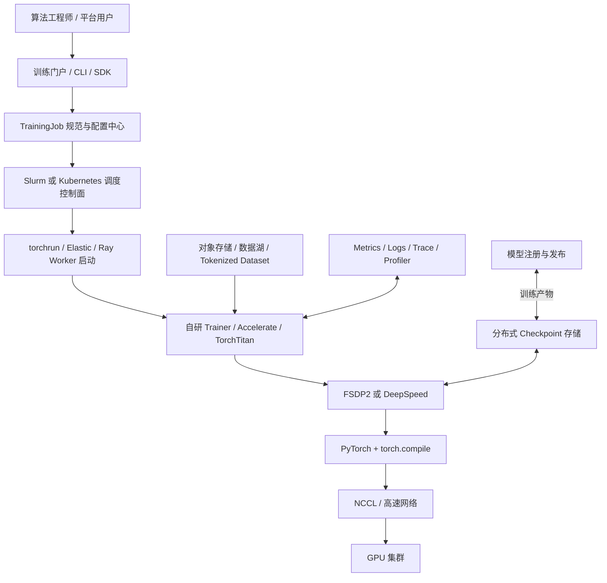

### 推荐组件

```text
模型层：Transformers 或自研模型
训练层：自研 Trainer / Accelerate / TorchTitan
执行层：FSDP2 或 DeepSpeed
编译层：torch.compile / Inductor / Triton
通信层：NCCL
控制面：Slurm 或 Kubernetes
数据面：对象存储 + 高吞吐数据缓存
工件面：Distributed Checkpoint + Model Registry
观测面：Metrics + Logs + Trace + Profiler
```

---

## 18.2 超大规模 NVIDIA 训练平台

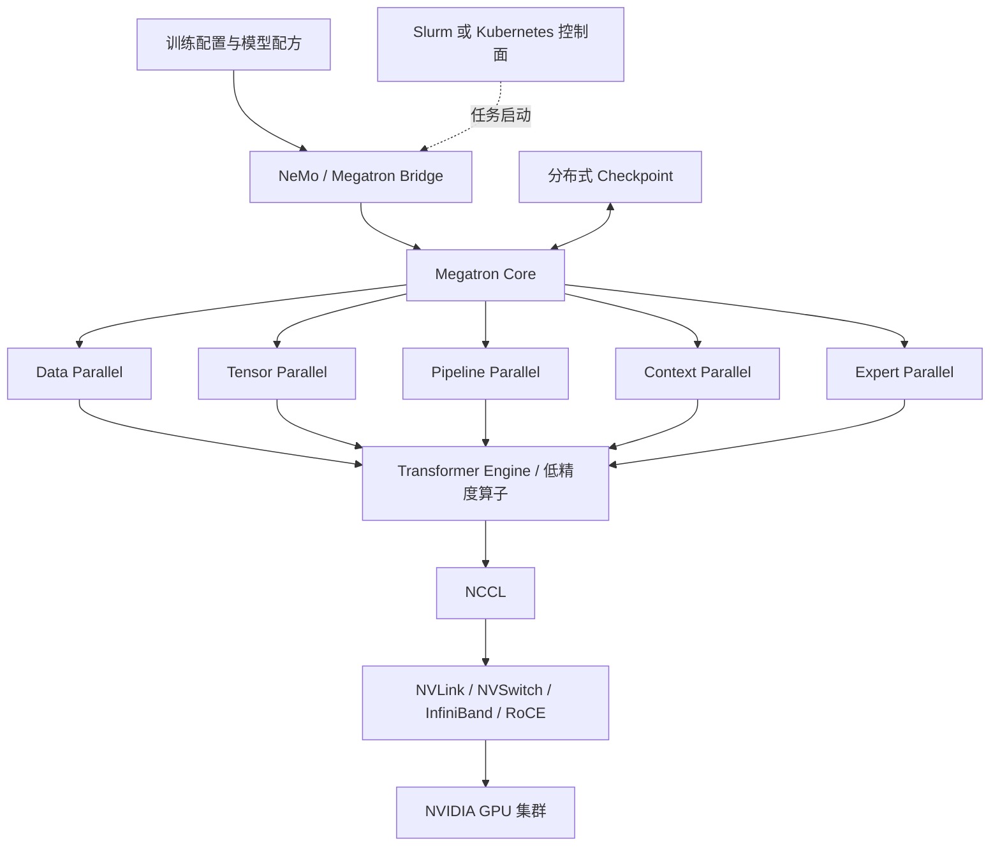

---

## 18.3 大模型 RL 后训练平台

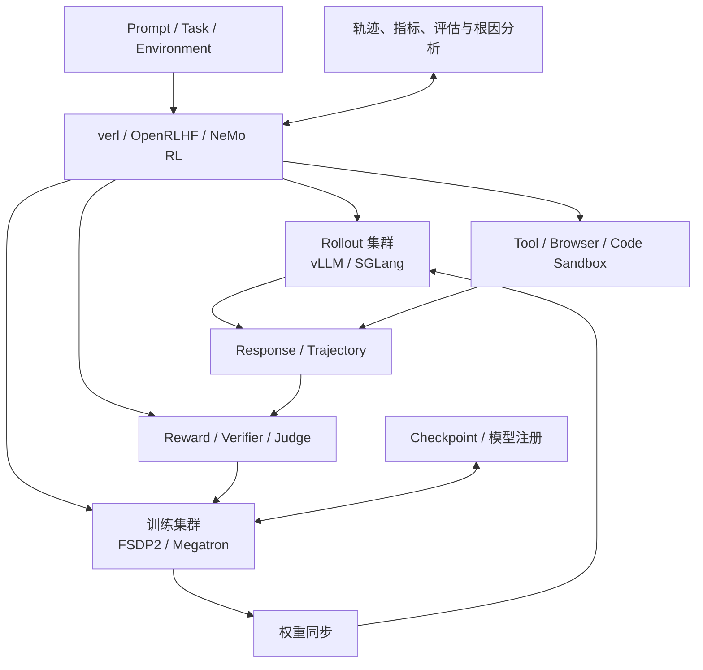

---

## 18.4 Kubernetes 多租户训练平台

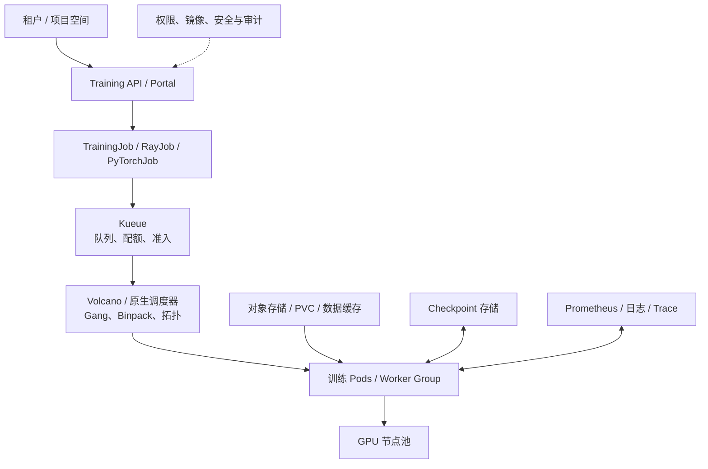

---

## 19. 技术选型决策流程

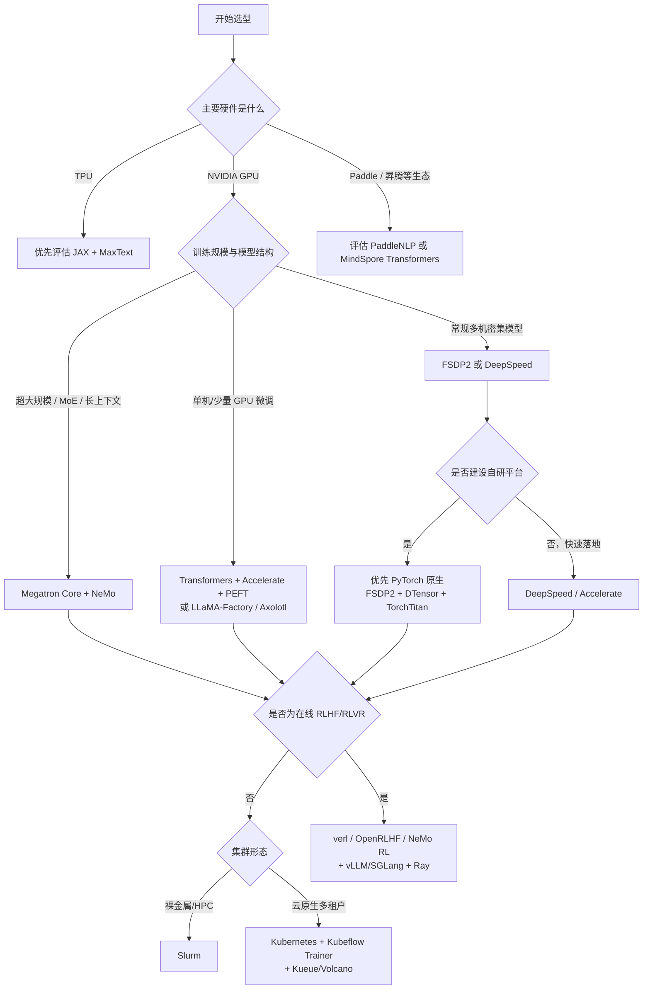

### 19.1 决策问题清单

| 维度 | 需要回答的问题 |
|---|---|
| 模型规模 | 单卡能否容纳参数、梯度、优化器状态和激活？ |
| 序列长度 | 是否需要 Context Parallel 或 Sequence Parallel？ |
| 模型结构 | 密集模型还是 MoE？是否需要 Expert Parallel？ |
| 硬件拓扑 | 单机互联、跨机网络、TPU 或其他加速器如何组织？ |
| 显存优化 | FSDP、ZeRO、Offload 和激活重计算如何组合？ |
| 计算效率 | 是否支持 BF16、FP8、融合算子和编译优化？ |
| 通信效率 | TP、EP 等高频通信能否限制在高速互联域？ |
| Checkpoint | 是否支持分布式、异步、原子保存和拓扑变化恢复？ |
| 故障恢复 | 节点故障、抢占和训练中断后能否可靠续训？ |
| 数据系统 | Tokenization、Packing、Shuffle 和数据读取是否成为瓶颈？ |
| 生态兼容 | 模型、Tokenizer、Checkpoint 和推理格式能否顺利转换？ |
| 后训练能力 | 是否需要 DPO、GRPO、在线 Rollout、工具调用和 Agent 环境？ |
| 平台治理 | 是否需要租户、队列、配额、成本、审计与权限隔离？ |

---

## 20. 发展趋势

## 20.1 PyTorch 原生分布式能力持续增强

FSDP2、DTensor、DeviceMesh、Context Parallel、Distributed Checkpoint 和 TorchTitan 正在形成更完整的 PyTorch 原生大模型训练栈。

趋势包括：

- 使用统一 DeviceMesh 表达多维并行拓扑。
- 使用 DTensor 表达参数和激活的分布式布局。
- FSDP 与 TP、CP、PP 更紧密组合。
- 训练与 `torch.compile` 进一步融合。
- Checkpoint 从框架附属能力升级为独立基础设施。

---

## 20.2 Megatron Core 继续主导超大规模 GPU 性能路线

在超大规模密集模型、MoE、长上下文和多维并行场景中，Megatron Core 仍是重要方案。

其竞争力主要来自：

- 专用 Transformer 并行实现。
- 成熟的 TP、PP、CP、EP 组合。
- Transformer Engine 和 FP8 支持。
- 对 NVIDIA GPU 拓扑的深入优化。

---

## 20.3 DeepSpeed 继续承担实用显存优化角色

对于已有 PyTorch 或 Transformers 脚本，希望快速引入 ZeRO 和 Offload 的团队，DeepSpeed 仍具有较低迁移门槛。

---

## 20.4 后训练成为独立基础设施

在线 RL 不只是“更换一个 Loss”，而是包含：

```text
数据生成
  → Rollout 推理
  → 环境执行
  → 奖励计算
  → Advantage 计算
  → Actor/Critic 训练
  → 权重同步
  → 新一轮采样
```

后训练平台需要同时解决训练系统、推理系统和分布式任务编排问题。

---

## 20.5 训练和推理边界逐渐融合

传统架构中，训练与推理是两个独立系统；在 RLHF、RLVR、蒸馏和在线数据生成中，两者开始形成循环：

```text
训练模型
  → 部署 Rollout
  → 生成数据与轨迹
  → 评估和筛选
  → 更新训练模型
  → 再次部署
```

由此带来的新需求包括：

- 权重快速同步。
- 推理格式与训练格式转换。
- 参数版本管理。
- Rollout 与训练资源动态切换。
- 轨迹和环境状态可重放。

---

## 20.6 低精度训练进一步下沉到硬件和算子层

发展方向包括：

- BF16 成为通用训练基线。
- FP8 在新硬件和 Transformer Engine 中扩大使用。
- 更低精度训练依赖新的数值缩放、累加和误差控制策略。
- 低精度能力从 Trainer 配置下沉到编译器、Kernel 和硬件协同设计。

---

## 20.7 数据质量成为训练系统核心竞争力

随着模型和并行框架逐渐成熟，训练效果越来越依赖：

- 高质量数据筛选。
- 文档去重。
- 数据配比。
- 合成数据。
- 课程学习。
- 评测集污染检测。
- 数据版本与可追溯性。

训练平台将从“提交 GPU 作业的平台”演进为“数据、训练、评估和发布闭环平台”。

---

## 21. 最终选型建议

### 21.1 通用企业默认路线

```text
Transformers 模型生态
  + PyTorch
  + FSDP2 或 DeepSpeed
  + Slurm 或 Kubernetes
```

适合大多数预训练、持续预训练和全参数微调平台。

### 21.2 PyTorch 原生平台路线

```text
PyTorch
  + FSDP2
  + DTensor / DeviceMesh
  + TorchTitan
  + Distributed Checkpoint
```

适合希望提高可控性、减少第三方引擎侵入并建设长期训练底座的团队。

### 21.3 超大规模 NVIDIA 路线

```text
NeMo
  + Megatron Core
  + Transformer Engine
  + NCCL
  + Slurm/Kubernetes
```

适合大规模密集模型、MoE 和长上下文预训练。

### 21.4 TPU 路线

```text
JAX
  + MaxText
  + XLA
```

适合 TPU 集群和 JAX 技术体系。

### 21.5 快速微调路线

```text
Transformers
  + Accelerate
  + PEFT / TRL
```

或者：

```text
LLaMA-Factory / Axolotl
```

适合 SFT、LoRA、QLoRA 和偏好优化实验。

### 21.6 大规模 RLHF/RLVR 路线

```text
verl / OpenRLHF / NeMo RL
  + FSDP2 或 Megatron
  + vLLM 或 SGLang
  + Ray
```

### 21.7 最终判断原则

真正需要优先回答的是：

1. **模型状态和激活如何放入现有硬件。**
2. **并行策略是否匹配网络拓扑。**
3. **框架能否达到目标吞吐与 MFU。**
4. **Checkpoint 能否在真实故障下可靠恢复。**
5. **数据、训练、评估和发布是否形成闭环。**
6. **团队能否长期维护该技术栈，而不只是完成一次实验。**

---

## 22. 参考资料

### PyTorch

- [PyTorch FSDP Tutorial](https://docs.pytorch.org/tutorials/intermediate/FSDP_tutorial.html)
- [PyTorch Tensor Parallel Tutorial](https://docs.pytorch.org/tutorials/intermediate/TP_tutorial.html)
- [PyTorch Context Parallel Tutorial](https://docs.pytorch.org/tutorials/unstable/context_parallel.html)
- [TorchTitan GitHub](https://github.com/pytorch/torchtitan)

### DeepSpeed

- [DeepSpeed 官网](https://www.deepspeed.ai/)
- [DeepSpeed GitHub](https://github.com/microsoft/DeepSpeed)

### Megatron 与 NeMo

- [Megatron-LM GitHub](https://github.com/NVIDIA/Megatron-LM)
- [Megatron Core MoE 文档](https://github.com/NVIDIA/Megatron-LM/blob/main/megatron/core/transformer/moe/README.md)
- [NeMo Framework 文档](https://docs.nvidia.com/nemo-framework/)
- [Megatron Bridge 文档](https://docs.nvidia.com/nemo/megatron-bridge/)

### Hugging Face

- [Transformers Trainer](https://huggingface.co/docs/transformers/main_classes/trainer)
- [Accelerate](https://huggingface.co/docs/accelerate/)
- [PEFT](https://huggingface.co/docs/peft/)
- [TRL](https://huggingface.co/docs/trl/)

### 微调框架

- [LLaMA-Factory GitHub](https://github.com/hiyouga/LLaMA-Factory)
- [Axolotl GitHub](https://github.com/axolotl-ai-cloud/axolotl)

### JAX

- [JAX 文档](https://jax.readthedocs.io/)
- [MaxText GitHub](https://github.com/AI-Hypercomputer/maxtext)

### 后训练与 RL

- [verl GitHub](https://github.com/volcengine/verl)
- [OpenRLHF GitHub](https://github.com/OpenRLHF/OpenRLHF)
- [NeMo RL 文档](https://docs.nvidia.com/nemo/rl/)

### 调度与集群

- [Slurm Overview](https://slurm.schedmd.com/overview.html)
- [Ray Train](https://docs.ray.io/en/latest/train/train.html)
- [Kubeflow Trainer](https://www.kubeflow.org/docs/components/trainer/)
- [Kueue](https://kueue.sigs.k8s.io/)
- [Volcano](https://volcano.sh/)

### 其他框架

- [PaddleNLP](https://github.com/PaddlePaddle/PaddleNLP)
- [MindSpore Transformers](https://www.mindspore.cn/mindformers/)
- [Colossal-AI GitHub](https://github.com/hpcaitech/ColossalAI)

---

> 本文中的推荐组合属于工程选型参考。实际方案应通过目标模型、目标序列长度、集群拓扑、故障恢复要求和性能基准测试共同确定。
