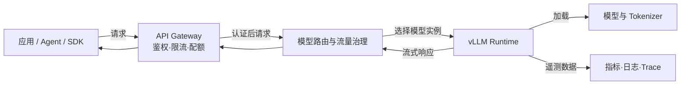
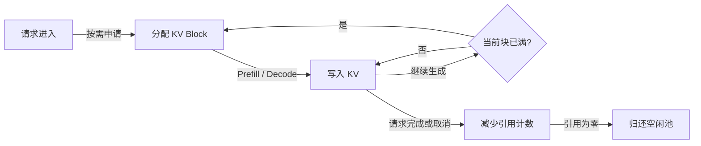
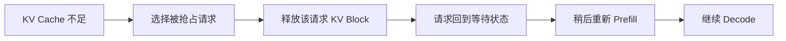
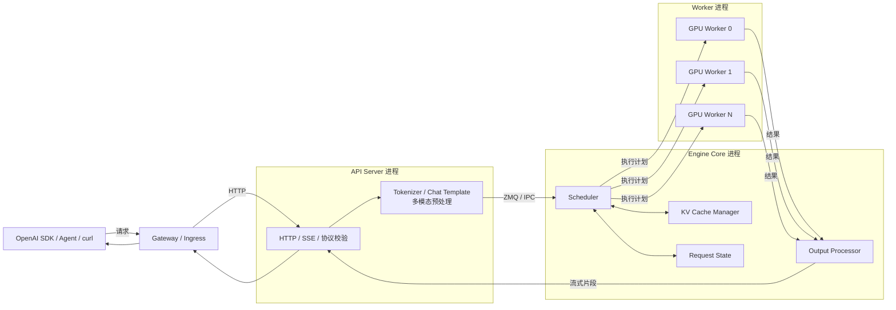
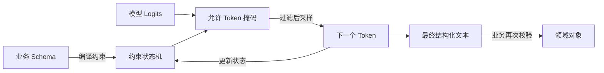
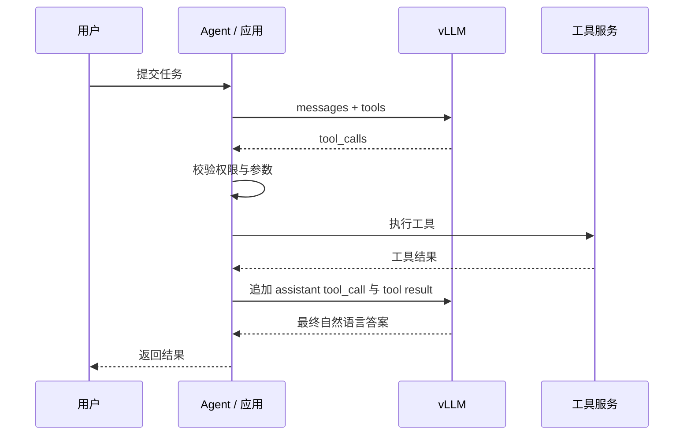
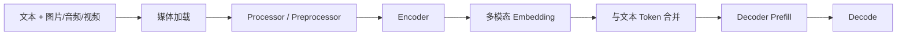
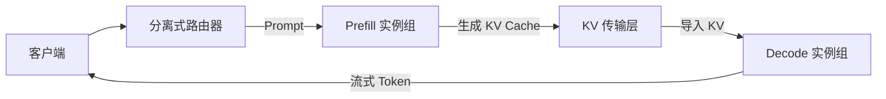
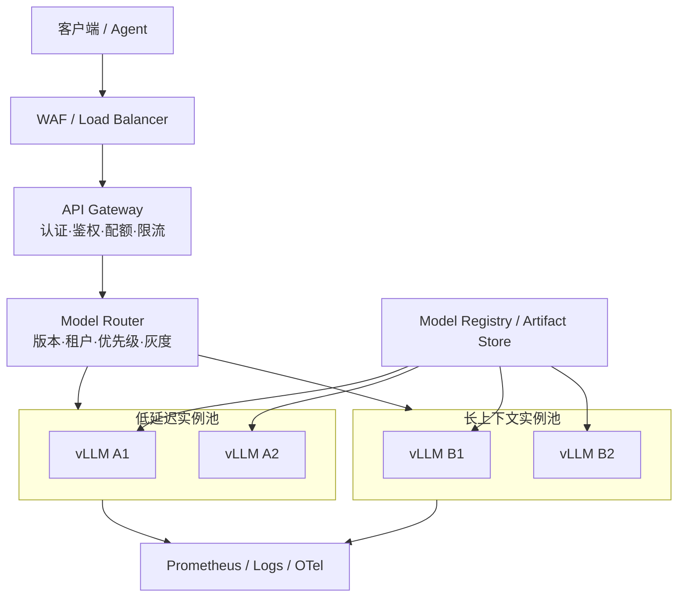
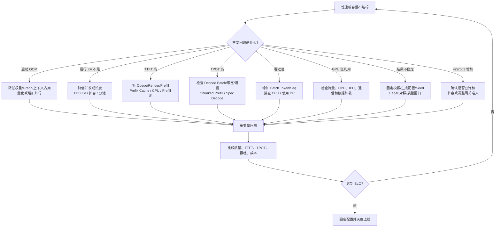

# 附录 I vLLM 详细教程:从推理原理、V1 架构到生产部署

> vLLM 的端到端实践教程:KV Cache 与 PagedAttention、Continuous Batching 与调度、V1 架构、安装部署、结构化输出 / Tool Calling / 多模态 / LoRA / 量化、并行与 PD 分离、容量规划、调优、压测、可观测性与生产治理。与正文的分工:机制原理见第 22、24、25 章,本附录是绑定具体版本的操作层;技术栈全景见附录 G。
>
> 文档基线:vLLM v0.28.0,核查日期 2026-09-02。vLLM 迭代很快,命令上线前应执行 `vllm serve --help` 并以当前安装版本的 CLI 输出为准;引用前先查[勘误与更新](../ERRATA.md)。

## 1. 核查结论与本次补充

上一版教程的核心方向基本正确，但仍有若干版本化信息需要修订，也缺少一些决定生产效果的关键机制。

### 1.1 已核实的版本信息

截至 **2026-09-02**：

- vLLM 最新稳定版本是 **`v0.28.0`**，发布日期为 **2026-08-26**。
- PyPI 元数据声明 Python 范围为 `>=3.10,<3.15`，即支持 Python 3.10～3.14。
- NVIDIA GPU 安装页的常用验证范围仍写为 Python 3.10～3.13；为减少依赖兼容风险，本文示例优先推荐 **Python 3.12**。
- NVIDIA 预编译 GPU 包通常要求 Compute Capability 不低于 7.5。
- 原生 Windows 不是主支持路径；Windows 用户通常应使用 WSL2、Linux 容器或远端 Linux GPU 主机。

### 1.2 对上一版内容的重要修正

#### 修正一：V1 不是单一 Python 进程

在线服务通常由以下进程组成：

```text
API Server
+ 每个 Data Parallel Rank 一个 Engine Core
+ 每块参与执行的 GPU 一个 Worker
+ DP > 1 时的协调进程
```

因此，CPU 核数、进程数、NUMA、IPC 和共享内存不足，都会使 GPU 等待 CPU，不能只关注显存。

#### 修正二：执行优化不只有 CUDA Graph

V1 默认执行链路包含：

```text
PyTorch / 自定义算子
        ↓
torch.compile 图捕获与编译
        ↓
Inductor 与 vLLM 编译 Pass
        ↓
Piecewise / Full CUDA Graph 捕获
        ↓
运行时按 Batch 形态选择重放或回退
```

`--enforce-eager` 适合兼容性诊断，不应作为常规生产默认值。

#### 修正三：调度参数必须分层理解

以下参数解决的是不同问题：

| 参数 | 控制对象 | 主要目的 |
|---|---|---|
| `--max-model-len` | 单序列最大上下文 | 模型能力与单请求上限 |
| `--max-num-batched-tokens` | 单次调度迭代的预算上限 | 吞吐、TTFT、ITL 平衡 |
| `--max-num-scheduled-tokens` | 单次迭代实际允许下发的 Token 上限 | 推测解码等场景下可小于 Batch Token 上限 |
| `--max-num-seqs` | 单次迭代最大序列数 | 并发 Batch 上限 |
| `--scheduler-reserve-full-isl` | 准入时按完整输入长度预留容量 | 减少 Chunked Prefill 过度准入和 KV 抖动 |
| `--watermark` | 为调度器保留一部分 KV Block 余量 | 降低反复抢占风险 |

在 `v0.28.0` 中，常规 Serving 场景的有效 `max_num_batched_tokens` 默认值由 8192 提升到 16384，但默认值只是通用起点，不代表适合所有模型和 SLO。

> **版本边界**：`max_num_queued_reqs` 与 `max_num_queued_tokens` 已出现在 `v0.28.0` 之后的主分支代码中，但不属于 `v0.28.0` Tag 的稳定 CLI。固定使用 `v0.28.0` 时，应在 API Gateway、Ingress 或独立 Admission Controller 中实施队列、并发和 Token 级背压。

#### 修正四：V1 抢占默认采用重计算

KV Cache 紧张时，请求可能被抢占。V1 默认倾向于 **RECOMPUTE**：释放请求占用的 KV Block，稍后重新计算其 Prompt，而不是把 KV Cache 交换到 CPU。抢占次数持续升高，通常说明容量或调度参数已经不健康。

#### 修正五：API Key 不是完整安全边界

`--api-key` 主要保护部分 `/v1`、`/v2` 与推理路由，并不等价于“所有 HTTP 端点均受保护”。生产部署仍需反向代理或 API Gateway，统一实现 TLS、认证、授权、限流、配额和审计。

#### 修正六：量化生态发生版本变化

`v0.28.0` 中 BitsAndBytes 已转向独立的 out-of-tree 插件路径。GGUF 支持也应视为实验性、非首选生产路径，不能把 llama.cpp 生态下的 GGUF 性能预期直接套用到 vLLM。

### 1.3 本次新增的核心内容

本版新增或显著扩展了：

1. V1 API Server、Engine Core、Worker、DP Coordinator 的精确职责与进程数计算。
2. Token 级调度、Chunked Prefill、Decode 优先、抢占和队列准入控制。
3. `torch.compile`、优化等级、编译缓存、Full/Piecewise CUDA Graph。
4. Hybrid KV Cache Manager、Prefix Cache 安全隔离和多模态处理缓存。
5. OpenAI Responses、结构化输出、Tool Calling、Reasoning Parser。
6. Data、Tensor、Pipeline、Expert、Context Parallel 的选型逻辑。
7. 推测解码、分离式 Prefill/Decode、KV Cache 传输与分层卸载。
8. CPU、GPU、显存、队列、吞吐和延迟的联合容量规划。
9. Prometheus、OpenTelemetry、每请求指标、成本计量和根因诊断。
10. 生产安全、过载保护、灰度、模型版本治理和故障排查。

---

## 2. vLLM 的定位

### 2.1 vLLM 是什么

vLLM 是面向大模型的高性能推理与服务框架。它的重点不是“把模型跑起来”这么简单，而是在真实并发流量下，提高：

- GPU 计算利用率；
- 显存利用率；
- 请求吞吐量；
- 首 Token 响应速度；
- Token 连续输出稳定性；
- 多 GPU、多节点扩展能力；
- OpenAI 兼容接入能力；
- 模型、LoRA、多模态和结构化生成的可服务性。

其代表性机制包括：

- PagedAttention；
- Continuous Batching；
- Chunked Prefill；
- Automatic Prefix Caching；
- `torch.compile` 与 CUDA Graph；
- TP、PP、DP、EP、Context Parallel；
- 多种权重与 KV Cache 量化；
- OpenAI、Anthropic 风格及其他兼容 API；
- Tool Calling、Reasoning、Structured Output；
- 推测解码与分离式服务。

### 2.2 vLLM 不是什么

vLLM 主要是**推理运行时与服务引擎**，不是完整的：

- 预训练框架；
- SFT/RLHF 训练平台；
- RAG 系统；
- Agent 编排框架；
- API Gateway；
- 租户计费平台；
- 模型注册中心；
- Kubernetes 控制面。

生产系统通常是：



### 2.3 vLLM 与相邻框架的关系

| 层次 | 常见组件 | vLLM 的关系 |
|---|---|---|
| 模型训练 | PyTorch、Megatron、DeepSpeed | 消费训练后的模型权重 |
| 模型格式 | Hugging Face Transformers、Safetensors | 读取配置、Tokenizer、权重和模板 |
| 推理引擎 | vLLM、TensorRT-LLM、SGLang、TGI | vLLM 位于这一层 |
| 服务网关 | Envoy、Nginx、Kong、API Gateway | 位于 vLLM 前方 |
| 编排与路由 | KServe、Ray Serve、Kubernetes、专用控制面 | 管理 vLLM 实例和流量 |
| Agent/RAG | LangGraph、LangChain、自研 Agent Runtime | 通过兼容 API 调用 vLLM |
| 可观测性 | Prometheus、Grafana、OpenTelemetry | 采集 vLLM 指标与 Trace |

---

## 3. 大模型推理基础

### 3.1 自回归生成

Decoder-only LLM 按 Token 逐步生成：

\[
P(y_1,\ldots,y_T \mid x)
= \prod_{t=1}^{T} P(y_t \mid x,y_{<t})
\]

其中：

- `x` 是输入 Prompt；
- `y_t` 是第 `t` 个输出 Token；
- 每一步都依赖输入和此前已生成 Token。

一次请求可分为 Prefill 与 Decode 两个阶段。

### 3.2 Prefill 阶段

Prefill 一次处理输入 Prompt 中的多个 Token，构建各层的 KV Cache。

特点：

- 大矩阵计算多；
- 并行度高；
- 通常更偏 Compute-bound；
- Prompt 越长，计算量越大；
- 直接影响 TTFT。

```text
Prompt Tokens
      ↓
Embedding
      ↓
多层 Transformer 前向
      ↓
写入各层 K/V
      ↓
得到第一个输出 Token 的概率
```

### 3.3 Decode 阶段

Decode 每轮通常只为每个活动序列生成一个新 Token：

```text
已有 KV Cache + 新 Token
          ↓
      一次前向
          ↓
     采样下一个 Token
          ↓
      追加新的 K/V
```

特点：

- 单步矩阵规模通常较小；
- 需要重复读取模型权重与 KV Cache；
- 往往更偏 Memory-bandwidth-bound；
- 直接影响 ITL 与 TPOT。

### 3.4 采样不是模型前向的一部分

模型前向返回 Logits，随后才进行：

```text
Logits
  ↓
温度缩放
  ↓
Top-K / Top-P / Min-P 等过滤
  ↓
重复惩罚 / 停止规则
  ↓
采样或贪心选择
  ↓
新 Token
```

因此，相同权重下输出不一致，未必是模型 Kernel 错误，也可能来自：

- Sampling 参数；
- 随机种子；
- Chat Template；
- Tokenizer；
- `generation_config.json`；
- Batch 形态变化造成的浮点误差；
- 量化误差；
- 不同 Attention Backend。

### 3.5 核心延迟指标

#### TTFT：Time To First Token

\[
TTFT = T_{first\ token} - T_{request\ accepted}
\]

包含：

- 网关和网络延迟；
- 队列等待；
- Tokenization；
- 多模态预处理；
- Prefill；
- 第一次采样与流式发送。

#### ITL：Inter-Token Latency

相邻输出 Token 之间的时间间隔：

\[
ITL_i = T_{i+1} - T_i
\]

ITL 的尾延迟比平均值更影响流式体验。

#### TPOT：Time Per Output Token

常见近似计算：

\[
TPOT = \frac{E2E - TTFT}{N_{output}-1}
\]

#### E2E Latency

从请求进入服务到完整响应结束的时间。

#### 吞吐

需要区分：

- Requests/s；
- Prompt Tokens/s；
- Generation Tokens/s；
- Total Tokens/s；
- 每 GPU Token/s；
- 每美元 Token/s。

---

## 4. KV Cache 与显存模型

### 4.1 为什么需要 KV Cache

若没有 KV Cache，生成第 `t` 个 Token 时，模型需要重新计算此前全部 Token 的 Key 和 Value。KV Cache 保存已经计算出的 K/V，使后续 Decode 只计算新增 Token。

### 4.2 单 Token KV Cache 估算

对于常见 MHA/GQA 模型，每个序列、每个 Token 的 KV Cache 可近似为：

\[
KV_{token}
= 2 \times L \times H_{kv} \times D_{head} \times B
\]

其中：

- `2`：Key 和 Value 两份；
- `L`：Transformer 层数；
- `H_kv`：KV Head 数量；
- `D_head`：Head Dimension；
- `B`：每个元素的字节数。

示例：

```text
L = 32
H_kv = 8
D_head = 128
BF16 = 2 Byte
```

则：

```text
2 × 32 × 8 × 128 × 2
= 131072 Byte
= 128 KiB / Token / Sequence
```

8192 Token 约为：

```text
128 KiB × 8192 ≈ 1 GiB
```

### 4.3 GQA 为什么显著节省 KV Cache

若 Query Head 数是 32，而 KV Head 只有 8：

```text
Query Heads = 32
KV Heads    = 8
```

KV Cache 按 KV Head 数计算，因此 GQA 相比完整 MHA 可以显著减少缓存占用。

### 4.4 总显存构成

实际 GPU 显存近似为：

\[
M_{total}
= M_{weights}
+ M_{KV}
+ M_{activation/workspace}
+ M_{CUDA\ graph}
+ M_{communication}
+ M_{runtime}
\]

不能只计算权重。

#### 权重粗略估算

| 精度 | 原始权重字节/参数 | 7B 理论权重 |
|---|---:|---:|
| FP32 | 4 | 28 GB |
| BF16/FP16 | 2 | 14 GB |
| FP8/INT8 | 1 | 7 GB |
| INT4 | 0.5 | 3.5 GB |

量化模型还包含 Scale、Zero Point、元数据、未量化层和 Workspace，因此实际显存通常高于理论值。

### 4.5 最可信的容量信息来自启动日志

手工公式适合预估，最终应以 vLLM 启动时报告的以下信息为准：

- 可用于 KV Cache 的显存；
- GPU KV Cache Token Capacity；
- 在指定 `max_model_len` 下估算的最大并发；
- CUDA Graph 捕获显存；
- 各 Rank 的显存分配。

---

## 5. PagedAttention

> **v0.28.0 术语说明**：vLLM 在 `v0.25.0` 删除了名为 PagedAttention 的旧版 Attention 实现，当前 V1/Model Runner V2 使用新的 Attention Backend 与执行路径；但“把 KV Cache 划分为固定 Block、用 Block Table 建立逻辑到物理映射”的分页式 KV 管理仍然存在。因此，本章重点讲 **Paged KV Cache 的内存模型与调度价值**，不要把早期论文中的具体 Kernel 实现等同于 `v0.28.0` 源码。

### 5.1 连续 KV Cache 分配的问题

传统做法可能按请求最大长度分配连续显存：

```text
请求 A：预留 8192，实际使用 400
请求 B：预留 8192，实际使用 3100
请求 C：预留 8192，实际使用 1200
```

产生：

- 预留浪费；
- 内部碎片；
- 外部碎片；
- 连续大块分配失败；
- 并发能力下降。

### 5.2 分页思想

PagedAttention 把逻辑 KV Cache 切为固定 Token 数的 Block：

```text
请求 A 的逻辑块
┌─────┬─────┬─────┬─────┐
│ L0  │ L1  │ L2  │ L3  │
└─────┴─────┴─────┴─────┘
   │     │     │     │
   ▼     ▼     ▼     ▼
┌─────┐┌─────┐┌─────┐┌─────┐
│ P7  ││ P2  ││ P9  ││ P4  │  物理 Block
└─────┘└─────┘└─────┘└─────┘
```

逻辑连续不再要求物理连续。

### 5.3 关键数据结构

概念上包含：

- **Block Pool**：可用物理 KV Block；
- **Block Table**：逻辑块到物理块的映射；
- **Reference Count**：共享块引用计数；
- **Block Hash**：Prefix Cache 的内容标识；
- **Free Queue**：空闲块管理；
- **Request Block State**：每个请求已分配的块序列。

### 5.4 Block 生命周期



### 5.5 PagedAttention 的真正收益

- KV Cache 按需增长；
- 减少碎片和预留浪费；
- 允许更多请求共享 GPU；
- 支持 Prefix Block 共享；
- 支持更灵活的抢占、释放和恢复；
- 为 Continuous Batching 提供内存基础。

### 5.6 需要避免的误解

#### 误解一：PagedAttention 减少了模型计算量

它主要优化 KV Cache 的组织和使用，并不直接减少所有 Attention 计算。

#### 误解二：PagedAttention 让 KV Cache 完全没有浪费

最后一个 Block 仍可能未填满，且 Block 元数据、对齐与缓存策略也有成本。

#### 误解三：旧版 Kernel 设计文档就是当前实现

官方的部分 PagedAttention Kernel 设计页已经明确标为历史说明。理解概念可参考论文，分析 `v0.28.0` 实现时应以当前源码和版本化文档为准。

---

## 6. Continuous Batching 与 Token 级调度

### 6.1 静态批处理的问题

静态 Batch 通常要求一组请求一起开始、按最慢请求结束：

```text
A: ████████████████
B: ████............
C: ███████.........
```

B、C 完成后留下的执行槽无法及时装入新请求。

### 6.2 Continuous Batching

vLLM 会在调度迭代之间动态更新活动请求集合：

```text
T0：A B C
T1：A C D      B 完成，D 加入
T2：A D E      C 完成，E 加入
T3：D E F      A 完成，F 加入
```

这使 GPU 持续拥有可执行工作。

### 6.3 为什么称为 Token 级调度

传统 Batch 以完整请求为粒度。vLLM 调度器关心的是本轮给每个请求处理多少 Token：

- Decode 请求通常是 1 个新 Token；
- 新请求可能执行全部或部分 Prefill；
- 长 Prompt 可分多个 Chunk；
- 本轮所有请求的 Token 数不能超过调度预算。

简化模型：

\[
\sum_{r \in running} tokens_r
\leq max\_num\_batched\_tokens
\]

同时：

\[
|running| \leq max\_num\_seqs
\]

### 6.4 调度器的输入与输出

#### 输入

- Waiting Queue；
- Running Queue；
- 每个请求的 Prompt/Output 进度；
- KV Block 可用量；
- 最大 Batch Token 数；
- 最大序列数；
- 优先级与到达时间；
- 多模态 Encoder Budget；
- Speculative Token 状态。

#### 输出

- 本轮执行的请求集合；
- 每个请求本轮计算的 Token 数；
- 需要分配、释放或复用的 KV Block；
- Prefill、Decode 或混合执行描述；
- Worker 执行元数据。

### 6.5 调度策略

常见策略包括：

- `fcfs`：先到先服务；
- `priority`：优先处理**数值更小**的优先级；优先级相同时，再按到达顺序处理。

启用 Priority Scheduling 时，还需要在请求中传递优先级，并设计取值范围、防饥饿与租户隔离规则。不要允许外部租户不受限制地填写极小数值，否则会破坏公平性。仅设置优先级字段，而不配置对应调度策略，也不会自然形成完整 QoS。

---

## 7. Chunked Prefill、抢占与准入控制

### 7.1 为什么长 Prefill 会干扰 Decode

假设：

```text
A：32K Prompt，等待 Prefill
B：正在 Decode
C：正在 Decode
```

若 A 一次性执行完整 Prefill，B、C 的下一 Token 可能长时间得不到调度，引起 ITL 抖动。

### 7.2 Chunked Prefill

把长 Prompt 切成多个调度片段：

```text
32K Prompt
  ↓
4K + 4K + 4K + 4K + 4K + 4K + 4K + 4K
```

调度可以变成：

```text
A Prefill Chunk 1
B/C Decode
A Prefill Chunk 2
B/C Decode
……
```

V1 的 Chunked Prefill 会优先安排 Decode，再利用剩余 Token Budget 填入 Prefill，从而把偏 Memory-bound 的 Decode 与偏 Compute-bound 的 Prefill 混合起来。

### 7.3 关键参数

| 参数 | 含义 |
|---|---|
| `--max-num-batched-tokens` | 一次调度迭代允许考虑的总 Token 预算 |
| `--max-num-scheduled-tokens` | 一次迭代实际允许下发执行的 Token 上限；推测解码场景可能小于前者 |
| `--max-num-seqs` | 一次迭代最多调度的序列数 |
| `--enable-chunked-prefill` | 是否允许将长 Prefill 切分到多个调度轮次 |
| `--long-prefill-token-threshold` | 判定长 Prefill 的 Token 阈值 |
| `--scheduler-reserve-full-isl` | 准入时按完整 Input Sequence Length 检查 KV 容量；`v0.28.0` 默认开启 |
| `--watermark` | 保留的 KV Block 水位比例，为调度和抢占留出安全余量 |
| `--prefill-schedule-interval` | Data Parallel 场景中 Prefill 调度间隔 |
| `--async-scheduling` | 使用异步调度降低 CPU 调度造成的 GPU 空洞 |
| `--stream-interval` | 每隔多少步聚合一次流式输出；`1` 最平滑，更大值可降低 Host 开销 |

`--scheduler-reserve-full-isl` 对 Chunked Prefill 尤其重要：它可以减少“只看当前 Chunk 能放下、却无法容纳完整输入”导致的过度准入和 KV Cache 抖动。上述参数仍可能随版本变化，应通过本机 `vllm serve --help` 核对。

### 7.4 Token Budget 的调优方向

#### 较大预算

优点：

- Prefill 吞吐通常更高；
- 大矩阵利用率更高；
- 高吞吐离线任务更有利。

代价：

- 单轮执行更长；
- Decode 调度间隔可能增大；
- TTFT/ITL 尾延迟可能变差；
- 临时显存可能增加。

#### 较小预算

优点：

- 调度粒度更细；
- 交互请求更公平；
- ITL 更容易控制。

代价：

- Prefill 被切得更碎；
- Kernel 与调度开销占比增加；
- 总吞吐可能下降。

### 7.5 KV Cache 不足与抢占

当新一轮执行需要 KV Block，但可用 Block 不足时，调度器可能抢占一个或多个请求。

V1 默认常见路径是：



这就是 **RECOMPUTE**。

### 7.6 抢占的代价

- 已经完成的 Prefill 需要重算；
- TTFT/E2E 增加；
- GPU 计算被重复消耗；
- 多个长请求之间可能形成抖动；
- 高并发时出现吞吐下降和尾延迟恶化。

持续出现抢占时，应考虑：

1. 降低 `max_num_seqs`；
2. 降低最大上下文或输出上限；
3. 增加 KV Cache 空间；
4. 使用更低精度 KV Cache；
5. 增加实例或 GPU；
6. 按长短请求分池；
7. 加强入口准入控制。

### 7.7 准入控制与背压

无界排队只会把“拒绝请求”变成“延迟失控”。生产服务应限制：

```text
在途请求数量
等待 Prefill 的 Prompt Token 总量
单请求最大输入长度
单请求最大输出长度
租户并发
租户 Token 配额
```

`v0.28.0` 的稳定 CLI **没有**内置 `--max-num-queued-reqs` 或 `--max-num-queued-tokens`。因此，队列请求数、租户并发和等待 Prompt Token 总量应由 API Gateway、Ingress、服务网格或独立 Admission Controller 控制。

一种用于规划网关 Token 队列上限的初始思路是：

\[
GatewayQueuedPromptTokenLimit
\approx TargetQueueDelay \times MeasuredPrefillTokensPerSecond
\]

这只是容量起点，不是严格保证。真实 TTFT 还受请求长度分布、Prefix Cache、Decode 干扰、Worker 饱和度和 CPU 预处理影响。

> 后续主分支已经出现 `max_num_queued_reqs`、`max_num_queued_tokens` 配置字段；不要把主分支文档中的参数直接复制到 `v0.28.0` 部署。


---

## 8. Prefix Caching 与 Hybrid KV Cache

### 8.1 Automatic Prefix Caching

多个请求可能共享完全相同的前缀：

```text
系统提示词
+ 安全规则
+ 工具定义
+ 公共知识
+ 用户问题 A
```

```text
系统提示词
+ 安全规则
+ 工具定义
+ 公共知识
+ 用户问题 B
```

Prefix Caching 复用公共部分已经计算好的 KV Block：

```text
请求 A：[共享前缀 KV][问题 A KV]
请求 B：[共享前缀 KV][问题 B KV]
                    ↑
              前缀部分不再重算
```

启用：

```bash
vllm serve "$MODEL" \
  --enable-prefix-caching
```

离线：

```python
from vllm import LLM

llm = LLM(
    model="Qwen/Qwen3-0.6B",
    enable_prefix_caching=True,
)
```

### 8.2 Prefix Cache 的命中条件

复用发生在 Token 与 Block 层面。以下变化都可能降低命中率：

- System Prompt 中加入动态时间；
- 工具定义顺序变化；
- JSON 序列化不稳定；
- RAG 文档顺序变化；
- 空格、换行、模板变化；
- Tokenizer 或 Tokenizer Revision 变化；
- Chat Template 变化；
- 动态用户信息出现在公共前缀前部。

推荐组织：

```text
稳定内容：
系统角色 → 安全规范 → 工具协议 → 公共知识

动态内容：
租户/用户信息 → 时间 → 检索结果 → 当前问题
```

### 8.3 Prefix Cache 不会优化什么

Prefix Cache 只复用已有前缀的 Prefill 结果：

- 不减少新后缀的 Prefill；
- 不减少后续 Decode 的模型计算；
- 不保证首个请求更快；
- 不适合前缀变化频繁的随机请求；
- 不应把缓存命中误判为模型本身吞吐提升。

### 8.4 Prefix Cache 的安全隔离

共享前缀缓存可能形成时间侧信道：攻击者通过响应时间推测某个前缀是否已经被其他请求计算过。

对于互不信任的租户，可使用请求级 `cache_salt` 建立缓存共享域：

```text
Tenant A：salt-A + prefix hash
Tenant B：salt-B + prefix hash
```

同一 Salt 内允许共享，不同 Salt 不能命中同一缓存条目。生产上应把 Salt 视为租户级或信任域级秘密，而不是直接使用可猜测的租户名称。

### 8.5 Hybrid KV Cache Manager

并非所有模型的每一层都使用相同 Attention 类型。现代模型可能混合：

- Full Attention；
- Sliding Window Attention；
- Local Attention；
- Mamba/SSM；
- 不同窗口和状态大小的混合层。

Hybrid KV Cache Manager 需要处理不同层类型的缓存布局和复用规则。其目标是：

```text
不同层拥有不同缓存需求
          ↓
按层类型分组
          ↓
协调 Page Size / Block 分配
          ↓
为每组提供正确的槽位与映射
```

这部分仍属于快速演进区域。使用混合 Attention 或 SSM 模型时，应重点观察：

- 启动时的 KV Cache 配置日志；
- 实际 Token Capacity；
- Prefix Cache 是否支持该模型布局；
- 不同 Backend 的兼容性；
- 长上下文场景下的缓存利用率。

### 8.6 多模态处理缓存不是 KV Cache

多模态请求可能包含图像、音频或视频。vLLM 还可能缓存：

- 多模态 Processor 输出；
- Encoder 输入；
- 跨进程媒体预处理结果；
- 共享内存中的多模态缓存。

这与文本 Decoder 的 KV Cache 是两类资源。调优时应分别观察：

```text
GPU KV Cache
CPU 多模态 Processor Cache
IPC / Shared Memory Cache
媒体下载与解码缓存
```

---

## 9. vLLM V1 多进程架构

### 9.1 总体架构



### 9.2 API Server

负责：

- HTTP 路由；
- OpenAI/兼容协议解析；
- 请求参数校验；
- Tokenization；
- Chat Template 渲染；
- 多模态输入加载与预处理；
- SSE 流式响应；
- 请求取消；
- 请求 ID；
- 与 Engine Core 的 IPC。

API Server 不应承担模型前向计算。

### 9.3 Renderer 与 CPU 线程池

在线服务可通过 Renderer Worker 并行处理：

- Tokenization；
- Chat Template；
- 多模态 Processor；
- 并发输入渲染。

`--renderer-num-workers` 在 `v0.28.0` 中默认值为 `1`。它作用于异步在线服务的输入渲染路径；同步离线 `LLM` 接口不会因此获得并行渲染收益。

高 QPS、小模型场景中，GPU 可能很快，而 Tokenizer/模板渲染成为瓶颈。此时应观察：

- API 进程 CPU 利用率；
- 请求进入 Engine 前的时间；
- Renderer 队列；
- Python GIL 与线程池；
- 多模态解码时间。

### 9.4 Engine Core

Engine Core 负责：

- 接收已预处理请求；
- 管理 Waiting/Running 状态；
- 执行 Token 级调度；
- 管理 KV Cache Block；
- 下发 Worker 执行计划；
- 推进请求状态；
- 处理取消和完成；
- 汇总模型输出。

在 Data Parallel 场景中，通常每个 DP Rank 有一个 Engine Core。

### 9.5 GPU Worker 与 Model Runner

每个 Worker 通常绑定一块 GPU，负责：

- 模型权重加载；
- Device、Stream 和通信组初始化；
- 模型前向；
- Attention Kernel；
- KV Cache 读写；
- `torch.compile` 产物执行；
- CUDA Graph 捕获与重放；
- TP/PP/EP 通信；
- Sampling 或相关执行步骤。

若：

```text
Tensor Parallel = TP
Pipeline Parallel = PP
```

则每个 Engine Core 通常需要：

\[
WorkerCount = TP \times PP
\]

### 9.6 Data Parallel Coordinator

当 `DP > 1` 时，不同 Engine Core/Rank 需要协调：

- 请求负载；
- MoE Rank 是否需要执行空前向；
- 全局同步条件；
- Elastic Expert Parallel 状态；
- Rank 健康与路由。

### 9.7 进程数估算

设：

- `A`：API Server 数；
- `D`：Data Parallel Rank 数；
- `N`：总 GPU Worker 数；

则最小主要进程数近似为：

\[
P = A + D + N + I(D>1)
\]

其中 `I(D>1)` 表示 DP 大于 1 时增加协调进程。

示例：

```text
API Server = 2
DP = 2
每个 DP Rank 使用 TP=4
总 Worker = 2 × 4 = 8
DP Coordinator = 1

主要进程数 = 2 + 2 + 8 + 1 = 13
```

这还没有计算：

- Gateway；
- Prometheus Exporter；
- Ray 组件；
- 日志采集器；
- Sidecar；
- 多模态处理线程；
- 容器运行时开销。

### 9.8 CPU 配额原则

至少应保证主要进程不会长期争抢同一个物理核。对开启超线程的主机，不能简单把 vCPU 数等同于物理核心能力。

实践中还应给以下工作留余量：

- Tokenization；
- JSON 编解码；
- SSE 推送；
- 指标采集；
- NCCL/Ray 后台线程；
- 多模态图片与音视频解码；
- 操作系统与网络中断。

CPU 不足的常见表现：

- GPU 利用率呈锯齿；
- GPU 经常等待下一批元数据；
- 短 Prompt 的 TTFT 仍很高；
- API Server CPU 达到 100%；
- 增加 GPU 后吞吐不升反降；
- Tokenizer 时间显著增加。

### 9.9 多 API Server

可通过 `--api-server-count` 增加 API 进程，以扩展。在普通的内部 Data Parallel 负载均衡模式下，未显式设置时会按 `data_parallel_size` 推导 API Server 数量；External LB、Multi-port、Hybrid LB 和 Rust Frontend 等模式有不同默认逻辑，应以启动日志和对应部署文档为准：

- Tokenization；
- 请求解析；
- Chat Template 渲染；
- 多模态预处理；
- 流式连接处理。

但 API 进程增加也会提高：

- CPU 与内存占用；
- IPC 连接数；
- 指标聚合复杂度；
- 请求路由与粘性问题。

---

## 10. 执行优化：torch.compile、CUDA Graph 与 Attention Backend

### 10.1 三层优化视角

可将 Worker 内部优化拆为三层：

```text
模型表达层：PyTorch Module / Transformers Model
              ↓
图优化层：torch.compile + Inductor + vLLM Pass
              ↓
运行时重放层：CUDA Graph
              ↓
底层算子层：FlashAttention / FlashInfer / Triton / 自定义 Kernel
```

### 10.2 torch.compile

V1 默认启用 `torch.compile`，用于：

- 捕获可编译计算图；
- 算子融合；
- 降低 Python 调度；
- 调用 Inductor 生成更合适的执行代码；
- 应用 vLLM 自定义 Compilation Pass；
- 为 CUDA Graph 划分可捕获区域。

编译会增加启动时间，但目标是改善稳态性能。

### 10.3 编译优化等级

当前 V1 可按优化等级理解：

| 等级 | 含义 | 使用建议 |
|---|---|---|
| `-O0` | 关闭大部分编译优化 | 最小化变量、排查兼容性 |
| `-O1` | 快速编译与基础 Piecewise CUDA Graph | 启动时间敏感、需要折中 |
| `-O2` | 默认，更多编译/Fusion，并结合 Full/Piecewise Graph | 常规生产起点 |
| `-O3` | 当前可能接近 O2，预留更激进优化 | 只在版本验证后使用 |

示意：

```bash
vllm serve "$MODEL" -O2
```

也可使用完整编译配置：

```bash
vllm serve "$MODEL" \
  --compilation-config '{"mode": 2}'
```

具体 JSON 字段应以 `vllm serve --help` 和版本化 API 文档为准。

### 10.4 编译缓存

编译产物通常会缓存到 vLLM 缓存目录，以减少后续相同配置的启动开销。

需要注意缓存键可能受以下因素影响：

- vLLM 版本；
- PyTorch/Inductor 版本；
- GPU 架构；
- 模型结构；
- 编译参数；
- 自定义算子；
- 驱动和 CUDA 组合。

不要在异构 GPU、不同镜像或不同版本之间盲目共享编译缓存。

可通过环境变量设置缓存根目录：

```bash
export VLLM_CACHE_ROOT=/var/cache/vllm
```

诊断缓存问题时可临时禁用：

```bash
export VLLM_DISABLE_COMPILE_CACHE=1
```

### 10.5 CUDA Graph 解决什么问题

Eager 执行每轮产生：

- Python 调度；
- CPU Kernel Launch；
- 参数准备；
- 多个小算子启动开销。

CUDA Graph 把一组 GPU 工作捕获后重放：

```text
第一次：准备 → 捕获 → 执行
后续：根据 Batch Key → 命中 Graph → 重放
```

Decode 的执行形态重复度高，因此往往受益明显。

### 10.6 Full 与 Piecewise CUDA Graph

#### Full CUDA Graph

捕获更完整的执行路径，潜在收益更高，但要求：

- 输入形态可表示；
- Attention Backend 支持；
- 无不兼容动态操作；
- Batch Descriptor 命中可捕获范围。

#### Piecewise CUDA Graph

把模型图按不适合编译或捕获的算子切分，在可捕获片段上使用 CUDA Graph。

优点：

- 兼容性更好；
- 能覆盖更多模型；
- 动态部分可回退执行。

### 10.7 常见 CUDA Graph 模式

当前模式可概括为：

- `NONE`；
- `PIECEWISE`；
- `FULL`；
- `FULL_DECODE_ONLY`；
- `FULL_AND_PIECEWISE`。

运行时会根据：

- Batch 中是 Prefill 还是 Decode；
- Token 数；
- Attention Backend 能力；
- 模型特性；
- 已捕获尺寸；

选择 Full、Piecewise 或回退路径。

### 10.8 CUDA Graph 的显存成本

Graph 捕获可能保留额外 Buffer。因此存在：

```text
更低 Kernel Launch 开销
        vs
更多启动时间与显存占用
```

显存紧张时不能只调 `gpu_memory_utilization`，还应观察 Graph 捕获后的实际 KV Cache Capacity。

### 10.9 `--enforce-eager`

```bash
vllm serve "$MODEL" --enforce-eager
```

适用：

- 判断错误是否由 Compile/CUDA Graph 引起；
- 自定义模型兼容性验证；
- 快速获得更清晰的异常栈；
- 对比数值差异。

不适用：

- 未压测就作为生产默认；
- 用它掩盖可修复的 Backend 问题；
- 直接拿 Eager 性能代表 vLLM 正常性能。

### 10.10 Attention Backend

vLLM 会按硬件、模型和功能自动选择 Attention Backend，也允许显式覆盖。Backend 影响：

- 支持的模型结构；
- Sliding Window/MLA 支持；
- CUDA Graph 能力；
- FP8 KV Cache；
- 长上下文性能；
- 数值差异；
- 显存 Workspace。

调优时不要只看 Backend 名称，应在同一工作负载下比较：

```text
TTFT、TPOT、吞吐、P99、显存、输出质量、稳定性
```

---

## 11. 安装与环境准备

### 11.1 推荐环境

生产优先组合：

```text
Linux
Python 3.12
独立虚拟环境
固定 vLLM 版本
固定 GPU Driver / CUDA Runtime
固定模型 Revision
```

### 11.2 NVIDIA GPU 检查

```bash
nvidia-smi
```

检查：

- Driver 版本；
- GPU 型号；
- 显存；
- 是否有残留进程；
- MIG 配置；
- GPU 是否被容器正确暴露。

查询 Compute Capability 可参考 NVIDIA 官方规格；预编译 GPU 包通常要求至少 7.5。

### 11.3 使用 uv 创建环境

```bash
uv venv --python 3.12 .venv
source .venv/bin/activate

uv pip install "vllm==0.28.0" --torch-backend=auto
```

传统 `venv + pip`：

```bash
python3.12 -m venv .venv
source .venv/bin/activate
python -m pip install --upgrade pip
python -m pip install "vllm==0.28.0"
```

官方更推荐新环境，因为 vLLM 的编译 Kernel 与 PyTorch/CUDA 存在二进制兼容约束。

### 11.4 验证安装

```bash
python - <<'PY'
import platform
import torch
import vllm

print("Python:", platform.python_version())
print("vLLM:", vllm.__version__)
print("PyTorch:", torch.__version__)
print("CUDA available:", torch.cuda.is_available())

if torch.cuda.is_available():
    print("GPU count:", torch.cuda.device_count())
    for i in range(torch.cuda.device_count()):
        print(i, torch.cuda.get_device_name(i))
PY
```

再检查 CLI：

```bash
vllm --help
vllm serve --help
vllm bench --help
```

### 11.5 CUDA、ROCm、CPU、XPU 和 Apple Silicon

vLLM 支持多类硬件后端，但能力矩阵并不完全一致：

| 平台 | 说明 |
|---|---|
| NVIDIA CUDA | 主要生产路径，功能覆盖最完整 |
| AMD ROCm | 官方支持，但模型、量化和 Kernel 需按矩阵验证 |
| Intel XPU | 有独立安装要求与兼容矩阵 |
| CPU | 适合特定模型、验证和 CPU 推理场景 |
| Apple Silicon | 通常通过独立的 vLLM-Metal 插件生态 |
| Google TPU / 其他加速器 | 按对应平台文档和插件支持检查 |

不要把 CUDA 参数无条件复制到其他平台。

### 11.6 Windows

原生 Windows 不是首选安装路径。推荐：

1. WSL2 + NVIDIA GPU；
2. Linux GPU 服务器；
3. Linux 容器运行；
4. 客户端仅通过 OpenAI SDK 调用远端 vLLM。

### 11.7 Docker

```bash
docker run --rm \
  --runtime nvidia \
  --gpus all \
  --ipc=host \
  -p 8000:8000 \
  -v "$HOME/.cache/huggingface:/root/.cache/huggingface" \
  vllm/vllm-openai:v0.28.0 \
  --model Qwen/Qwen3-0.6B \
  --served-model-name qwen3-local \
  --max-model-len 4096
```

多进程和 TP 会使用共享内存，因此应使用：

```text
--ipc=host
```

或配置足够大的：

```text
--shm-size
```

生产不要使用浮动 `latest` 标签。

### 11.8 模型下载与缓存

建议显式配置缓存：

```bash
export HF_HOME=/models/huggingface-cache
```

生产镜像或启动流程应固定：

- 模型仓库；
- Model Revision；
- Tokenizer Revision；
- Code Revision；
- Chat Template；
- 量化配置；
- LoRA Revision。

---

## 12. 模型、Tokenizer 与 Chat Template

### 12.1 三者必须成套治理

```text
Model Weights
+ config.json
+ Tokenizer Files
+ Chat Template
+ Generation Config
```

任意一项漂移都可能改变输出。

### 12.2 Base Model 与 Instruct Model

- **Base Model**：主要完成续写，不一定理解角色消息和指令格式。
- **Instruct/Chat Model**：经过指令微调，通常带 Chat Template。

不要因为 API 支持 `/v1/chat/completions`，就假定任意 Base Model 都能正确对话。

### 12.3 Chat Template 的职责

输入：

```json
[
  {"role": "system", "content": "你是助手"},
  {"role": "user", "content": "你好"}
]
```

转换为模型实际看到的 Token 序列，例如：

```text
<|system|>
你是助手
<|user|>
你好
<|assistant|>
```

Chat Template 还可能负责：

- 工具定义注入；
- Assistant Generation Prompt；
- 多模态占位符；
- Reasoning 开关；
- Tool Result 格式；
- BOS/EOS；
- 多轮消息边界。

### 12.4 模板错误

常见报错：

```text
The model does not have a chat template
```

可以显式指定：

```bash
vllm serve "$MODEL" \
  --chat-template ./chat_template.jinja
```

简化示例：

```jinja2

<|{{ message['role'] }}|>
{{ message['content'] }}

<|assistant|>
```

真实模型必须使用与其训练格式匹配的模板，不能机械复制上述示例。

### 12.5 generation_config.json

模型仓库中的 `generation_config.json` 可能覆盖服务默认采样行为，例如：

- Temperature；
- Top-P；
- Top-K；
- Repetition Penalty；
- EOS/Stop。

为了建立可比较基线，可使用：

```bash
vllm serve "$MODEL" \
  --generation-config vllm
```

并在请求中显式传入采样参数。

### 12.6 Remote Code

某些模型要求：

```bash
--trust-remote-code
```

这意味着模型仓库代码将在服务进程中执行。生产必须：

- 审计代码；
- 固定 Code Revision；
- 使用只读模型目录；
- 限制网络和文件权限；
- 在隔离容器中运行；
- 不自动追踪仓库主分支。

---

## 13. 离线推理

### 13.1 最小生成示例

```python
from vllm import LLM, SamplingParams

MODEL = "Qwen/Qwen3-0.6B"

llm = LLM(
    model=MODEL,
    dtype="auto",
    max_model_len=4096,
    gpu_memory_utilization=0.85,
)

sampling = SamplingParams(
    temperature=0.7,
    top_p=0.9,
    max_tokens=128,
)

prompts = [
    "解释 Continuous Batching。",
    "解释 KV Cache。",
    "解释 PagedAttention。",
]

outputs = llm.generate(prompts, sampling)

for result in outputs:
    print("=" * 80)
    print("Prompt:", result.prompt)
    print("Output:", result.outputs[0].text)
```

### 13.2 Chat 推理

```python
from vllm import LLM, SamplingParams

llm = LLM(
    model="Qwen/Qwen3-0.6B",
    max_model_len=4096,
)

conversations = [
    [
        {"role": "system", "content": "你是大模型推理工程师。"},
        {"role": "user", "content": "解释 PagedAttention。"},
    ],
    [
        {"role": "system", "content": "你是 Python 教师。"},
        {"role": "user", "content": "解释生成器。"},
    ],
]

outputs = llm.chat(
    conversations,
    sampling_params=SamplingParams(
        temperature=0.6,
        max_tokens=256,
    ),
)

for result in outputs:
    print(result.outputs[0].text)
```

### 13.3 多候选输出

```python
sampling = SamplingParams(
    n=3,
    temperature=0.8,
    top_p=0.95,
    max_tokens=128,
)
```

`n` 增大会同时增加 Decode 计算和 KV Cache 占用，不能只看请求数。

### 13.4 停止条件

```python
sampling = SamplingParams(
    max_tokens=256,
    stop=["</answer>", "<|eot_id|>"],
)
```

Stop String 与 Stop Token 的行为不同。调试异常截断时应检查：

- 模型 EOS；
- Chat Template；
- Stop Token IDs；
- Stop String；
- `max_tokens`；
- 模型仓库 Generation Config。

### 13.5 离线任务的批量组织

不要逐条调用：

```python
for prompt in prompts:
    llm.generate([prompt], sampling)
```

更好的做法是一次传入请求集合，让引擎调度：

```python
outputs = llm.generate(prompts, sampling)
```

对于超大数据集，应：

- 分片读取；
- 记录输入 ID；
- 支持断点续跑；
- 结果及时落盘；
- 统计失败与超长输入；
- 固定 Seed 与版本；
- 避免一次把全部文本加载进内存。

### 13.6 JSONL 批处理

vLLM 提供批量执行命令，可读取 OpenAI 风格 JSONL。实际命令参数以版本帮助为准：

```bash
vllm run-batch --help
```

批量任务适合：

- 数据标注；
- 合成数据；
- 离线评估；
- Embedding 生成；
- 批量摘要；
- 模型回归测试。

---

## 14. OpenAI 兼容在线服务

### 14.1 最小启动

```bash
vllm serve Qwen/Qwen3-0.6B
```

默认地址通常为：

```text
http://127.0.0.1:8000
```

### 14.2 推荐基础配置

```bash
export VLLM_API_KEY='replace-with-secret'

vllm serve Qwen/Qwen3-0.6B \
  --host 0.0.0.0 \
  --port 8000 \
  --served-model-name qwen3-local \
  --api-key "$VLLM_API_KEY" \
  --generation-config vllm \
  --max-model-len 8192 \
  --gpu-memory-utilization 0.90 \
  --enable-prefix-caching
```

### 14.3 curl 调用

```bash
curl http://127.0.0.1:8000/v1/chat/completions \
  -H 'Authorization: Bearer replace-with-secret' \
  -H 'Content-Type: application/json' \
  -d '{
    "model": "qwen3-local",
    "messages": [
      {"role": "system", "content": "你是推理系统专家。"},
      {"role": "user", "content": "解释 KV Cache。"}
    ],
    "temperature": 0.6,
    "max_tokens": 256
  }'
```

### 14.4 流式响应

```bash
curl -N http://127.0.0.1:8000/v1/chat/completions \
  -H 'Authorization: Bearer replace-with-secret' \
  -H 'Content-Type: application/json' \
  -d '{
    "model": "qwen3-local",
    "messages": [
      {"role": "user", "content": "详细解释 vLLM 调度器。"}
    ],
    "stream": true,
    "max_tokens": 512
  }'
```

### 14.5 OpenAI Python SDK

```bash
python -m pip install openai
```

```python
from openai import OpenAI

client = OpenAI(
    base_url="http://127.0.0.1:8000/v1",
    api_key="replace-with-secret",
)

response = client.chat.completions.create(
    model="qwen3-local",
    messages=[
        {"role": "system", "content": "你是推理系统专家。"},
        {"role": "user", "content": "比较 Prefill 与 Decode。"},
    ],
    temperature=0.6,
    max_tokens=256,
)

print(response.choices[0].message.content)
```

流式：

```python
stream = client.chat.completions.create(
    model="qwen3-local",
    messages=[
        {"role": "user", "content": "解释 Continuous Batching。"}
    ],
    max_tokens=512,
    stream=True,
)

for chunk in stream:
    delta = chunk.choices[0].delta.content
    if delta:
        print(delta, end="", flush=True)
```

### 14.6 API 能力范围

能力取决于模型类型和启动配置，当前服务体系可覆盖：

- Completions；
- Chat Completions；
- Responses；
- Embeddings；
- Transcriptions；
- Translations；
- Rerank/Score/Classify；
- 部分 Anthropic Messages 兼容路由；
- 部分 Cohere 风格路由；
- 多模态 Chat；
- Tool Calling；
- Reasoning Output。

不要假设“一个生成模型启动后就支持所有端点”。服务会根据模型 Runner、Task 和模型配置决定能力。

### 14.7 vLLM 扩展参数

OpenAI SDK 没有定义的 vLLM 参数，可通过 `extra_body` 传递：

```python
response = client.chat.completions.create(
    model="qwen3-local",
    messages=[{"role": "user", "content": "你好"}],
    extra_body={
        "top_k": 40,
    },
)
```

### 14.8 Request ID

可启用请求 ID Header：

```bash
vllm serve "$MODEL" \
  --enable-request-id-headers
```

网关应生成全链路 Request ID，并将其关联到：

```text
Gateway Log
→ vLLM Request
→ Prometheus Metrics
→ OpenTelemetry Trace
→ 计费记录
→ 用户侧错误响应
```

### 14.9 Priority 请求

启用 `--scheduling-policy priority` 后，可通过请求字段或支持的 Header 传递优先级。`v0.28.0` 的规则是：**数值越小，越早处理；数值相同则按到达时间排序**。生产设计还应明确：

- 对外暴露的优先级取值范围；
- 管理请求是否拥有独立高优先级通道；
- 长请求与短请求如何避免互相垄断；
- 租户是否可自行声明最高优先级；
- 如何避免低优先级饥饿；
- 网关优先级如何映射为 vLLM 的整数值。

### 14.10 超时和取消

客户端断开并不意味着服务端所有阶段都必然立即停止。生产应验证：

- SSE 断开后的取消传播；
- Gateway 超时与 vLLM 超时关系；
- 已排队请求是否移除；
- 已运行请求何时释放 KV Block；
- 工具调用上游是否正确取消；
- 计费是否只计算实际 Token。


---

## 15. 结构化输出

### 15.1 为什么不能只靠 Prompt 生成 JSON

仅提示模型“请输出 JSON”仍可能产生：

- Markdown 代码块；
- 多余解释；
- 缺少字段；
- 字段类型错误；
- 非法转义；
- 枚举值越界；
- 截断后的残缺 JSON。

结构化输出在解码阶段限制可选 Token，使生成序列满足约束。

### 15.2 支持的约束类型

当前 `structured_outputs` 可用于：

- `choice`：候选枚举；
- `regex`：正则约束；
- `json`：JSON Schema；
- `grammar`：形式文法；
- `structural_tag`：结构标签约束。

旧版 `guided_json`、`guided_regex` 等字段已经退出当前主路径，新代码应优先使用 `structured_outputs`。

### 15.3 Choice 示例

```python
from openai import OpenAI

client = OpenAI(
    base_url="http://127.0.0.1:8000/v1",
    api_key="replace-with-secret",
)

response = client.chat.completions.create(
    model="qwen3-local",
    messages=[
        {
            "role": "user",
            "content": "判断情感：这个产品很好用。只返回标签。",
        }
    ],
    temperature=0,
    max_tokens=8,
    extra_body={
        "structured_outputs": {
            "choice": ["positive", "negative", "neutral"]
        }
    },
)

print(response.choices[0].message.content)
```

### 15.4 JSON Schema 示例

```python
from typing import Literal

from openai import OpenAI
from pydantic import BaseModel, Field


class SentimentResult(BaseModel):
    label: Literal["positive", "negative", "neutral"]
    confidence: float = Field(ge=0.0, le=1.0)
    reason: str


client = OpenAI(
    base_url="http://127.0.0.1:8000/v1",
    api_key="replace-with-secret",
)

schema = SentimentResult.model_json_schema()

response = client.chat.completions.create(
    model="qwen3-local",
    messages=[
        {
            "role": "user",
            "content": "分析情感：服务很好，但价格偏高。",
        }
    ],
    temperature=0,
    max_tokens=128,
    extra_body={
        "structured_outputs": {
            "json": schema,
        }
    },
)

result = SentimentResult.model_validate_json(
    response.choices[0].message.content
)
print(result)
```

### 15.5 结构化输出的完整链路



### 15.6 约束不等于业务正确

结构化输出能保证“格式更合法”，不能保证：

- 数值符合业务事实；
- ID 在数据库中存在；
- 用户拥有操作权限；
- SQL 没有注入；
- 工具参数不会产生副作用；
- 枚举选择符合真实意图。

因此仍需：

```text
Schema Validation
→ Domain Validation
→ Authorization
→ Policy Check
→ Tool Execution
```

### 15.7 性能注意事项

复杂 Schema 会增加：

- Grammar 编译时间；
- 状态机内存；
- 每 Token 掩码计算；
- 首请求冷启动延迟；
- Schema 多样性导致的缓存压力。

应避免为每个请求生成结构完全不同的大型 Schema。

---

## 16. Tool Calling

### 16.1 vLLM 在工具调用中的职责

标准链路是：



通常 vLLM 负责：

- 将工具定义通过模板呈现给模型；
- 解析模型输出中的 Tool Call；
- 返回结构化 `tool_calls`；
- 支持流式 Tool Call Delta。

Agent Runtime 负责：

- 工具注册；
- 参数校验；
- 鉴权和审批；
- 实际执行；
- 超时、重试和幂等；
- 将结果回填对话。

### 16.2 启动工具解析

自动工具选择通常需要：

```bash
vllm serve "$MODEL" \
  --enable-auto-tool-choice \
  --tool-call-parser <与模型匹配的解析器>
```

部分模型还需要专用 Chat Template：

```bash
vllm serve "$MODEL" \
  --enable-auto-tool-choice \
  --tool-call-parser <parser> \
  --chat-template ./tool_chat_template.jinja
```

解析器必须与模型训练格式匹配。不能因为两个模型都输出 JSON，就共用同一个 Parser。

### 16.3 工具定义示例

```python
TOOLS = [
    {
        "type": "function",
        "function": {
            "name": "get_weather",
            "description": "查询指定城市的天气",
            "parameters": {
                "type": "object",
                "properties": {
                    "city": {
                        "type": "string",
                        "description": "城市名称",
                    },
                    "unit": {
                        "type": "string",
                        "enum": ["celsius", "fahrenheit"],
                    },
                },
                "required": ["city"],
                "additionalProperties": False,
            },
        },
    }
]
```

### 16.4 第一轮：让模型决定工具

```python
from openai import OpenAI

client = OpenAI(
    base_url="http://127.0.0.1:8000/v1",
    api_key="replace-with-secret",
)

messages = [
    {"role": "user", "content": "新加坡今天适合穿外套吗？"}
]

first = client.chat.completions.create(
    model="tool-model",
    messages=messages,
    tools=TOOLS,
    tool_choice="auto",
)

assistant_message = first.choices[0].message
print(assistant_message.tool_calls)
```

### 16.5 第二轮：执行并回填工具结果

```python
import json

## 业务代码必须校验 tool name、参数、权限、租户和副作用。
tool_call = assistant_message.tool_calls[0]
args = json.loads(tool_call.function.arguments)

## 示例结果，真实系统应调用受控工具。
tool_result = {
    "city": args["city"],
    "temperature_c": 30,
    "condition": "rain",
}

messages.append(assistant_message)
messages.append(
    {
        "role": "tool",
        "tool_call_id": tool_call.id,
        "content": json.dumps(tool_result, ensure_ascii=False),
    }
)

final = client.chat.completions.create(
    model="tool-model",
    messages=messages,
    tools=TOOLS,
)

print(final.choices[0].message.content)
```

### 16.6 tool_choice

常见模式：

| 值 | 含义 |
|---|---|
| `none` | 禁止调用工具 |
| `auto` | 模型决定是否调用 |
| `required` | 必须调用至少一个工具 |
| 指定函数 | 强制调用某个命名工具 |

是否支持全部模式取决于模型、Parser、模板和当前 API 路径。

### 16.7 Parallel Tool Calls

`parallel_tool_calls=true` 表示允许模型在一轮返回多个调用，不代表模型一定会这么做。

Agent Runtime 执行并行调用前必须判断：

- 工具之间是否有依赖；
- 是否共享可变状态；
- 是否存在调用顺序要求；
- 是否可并行审批；
- 任一调用失败时如何回滚；
- 结果返回顺序如何与 `tool_call_id` 对齐。

### 16.8 工具调用常见故障

#### 模型输出了文本 JSON，没有 `tool_calls`

可能原因：

- 未启用自动工具选择；
- Parser 不匹配；
- Chat Template 不支持工具；
- 模型本身未针对 Tool Calling 训练；
- Prompt 指示模型直接输出 JSON。

#### Arguments 不是合法 JSON

结构化 Tool Parser 能减少问题，但业务端仍应做：

- JSON 解析；
- JSON Schema 校验；
- 字段白名单；
- 长度和范围限制；
- 权限验证。

#### 工具被反复调用

这通常是 Agent Loop 的问题，不只属于 vLLM：

- 工具结果消息格式错误；
- 模型看不到成功结果；
- 工具结果不包含关键字段；
- Assistant Tool Call 未完整回填；
- 缺少最大步骤数和重复调用检测。

### 16.9 外部 Tool Server

当前版本还提供连接外部 Tool Server 的高级能力。该能力会扩大信任边界，生产中应额外限制：

- 可连接地址；
- DNS 与网络出口；
- 工具发现权限；
- 参数和响应大小；
- 凭据注入；
- 调用超时；
- SSRF 与横向移动风险。

---

## 17. Reasoning Output 与交错思考

### 17.1 Reasoning Parser

某些推理模型会把“推理文本”和“最终答案”用特殊 Token 或格式分隔。vLLM 可通过模型特定 Parser 将其拆为：

```json
{
  "reasoning": "模型输出的推理部分",
  "content": "最终答案"
}
```

启动方式：

```bash
vllm serve "$MODEL" \
  --reasoning-parser <与模型匹配的解析器>
```

当前字段主路径是 `reasoning`。旧资料中的 `reasoning_content` 可能已经过时。

### 17.2 流式 Reasoning

流式响应中，推理和最终答案可能分不同 Delta 返回。客户端不能假定：

- 每个 Chunk 都有 `content`；
- Reasoning 一定先完整结束；
- 所有 SDK 都原生认识扩展字段；
- 不启用展示就不会生成推理 Token。

### 17.3 隐藏 Reasoning 的语义

`include_reasoning=false` 一类请求选项通常表示“不把推理字段返回给客户端”，并不一定意味着模型没有生成这些 Token。

因此：

- Token 用量可能没有下降；
- 延迟可能没有下降；
- 只是响应层抑制输出；
- 计费和监控仍应统计实际生成 Token。

### 17.4 Thinking Token Budget

部分模型支持通过 Chat Template 参数或 Reasoning 配置限制思考预算。实际支持方式取决于模型：

```text
模型原生参数
Chat Template kwargs
vLLM reasoning config
请求级扩展参数
```

不能把某个模型的 `thinking_token_budget` 参数复制到所有 Reasoning Model。

### 17.5 Interleaved Thinking

普通 Tool Calling：

```text
思考 → 工具调用 → 工具结果 → 最终答案
```

交错思考：

```text
思考 → 工具 1 → 再思考 → 工具 2 → 再思考 → 最终答案
```

它适合多步骤 Agent，但会增加：

- Token 消耗；
- E2E 延迟；
- Tool Loop 复杂度；
- Trace 和安全审计难度。

只有同时兼容 Reasoning Parser、Tool Parser 和 Chat Template 的模型，才能稳定使用。

### 17.6 Reasoning 数据治理

推理字段可能包含：

- Prompt 中的敏感数据；
- 工具参数；
- 中间假设；
- 用户身份信息；
- 不应暴露的系统提示词片段。

生产建议：

- 默认不持久化完整 Reasoning；
- 日志做脱敏和采样；
- 将 Reasoning 与最终答案分字段治理；
- 明确访问权限和保存期限；
- 不把 Reasoning 当作可验证事实；
- 评估时重点使用可观察轨迹和结果，而非盲信自述推理。

---

## 18. Embedding、Rerank、分类与 ASR

### 18.1 Pooling Model

生成模型输出下一个 Token，而 Pooling Model 从隐藏状态得到固定维度向量或分数。常见任务：

- Embedding；
- Rerank；
- Classification；
- Score；
- Reward Model；
- Sequence Pooling。

### 18.2 Embedding 服务

启动与模型兼容的 Embedding 模型：

```bash
vllm serve BAAI/bge-small-en-v1.5 \
  --served-model-name bge-small
```

调用：

```python
from openai import OpenAI

client = OpenAI(
    base_url="http://127.0.0.1:8000/v1",
    api_key="EMPTY",
)

response = client.embeddings.create(
    model="bge-small",
    input=[
        "vLLM 是高性能推理框架。",
        "PagedAttention 管理 KV Cache。",
    ],
)

for item in response.data:
    print(item.index, len(item.embedding))
```

### 18.3 Embedding 生产注意事项

- 查询与文档是否需要不同 Prompt 前缀；
- 是否归一化向量；
- 向量维度；
- 最大输入长度；
- 截断策略；
- Batch Size；
- 模型版本与向量库索引版本一致性；
- 重新建索引成本；
- 空字符串和异常 Unicode 处理。

### 18.4 Rerank 与 Score

Rerank 输入通常是：

```text
Query + Candidate Document List
```

输出每个候选的相关性分数。生产应控制候选数量，因为 Cross-Encoder 类模型的成本通常随候选数增长。

### 18.5 Classification

分类端点适合：

- 内容安全；
- 意图识别；
- 路由；
- 主题分类；
- 质量评估；
- Reward/Preference 评分。

仍需校准阈值，不要直接用未校准分数做高风险决策。

### 18.6 ASR

对于兼容的语音模型，服务可提供转写和翻译类 API。资源瓶颈与纯文本不同：

- 音频下载；
- 解码与重采样；
- 音频时长；
- Encoder 计算；
- 文件大小；
- 并发长音频。

应同时限制文件字节数和音频时长。

---

## 19. 多模态推理

### 19.1 执行链路



### 19.2 OpenAI 风格图片请求

```python
from openai import OpenAI

client = OpenAI(
    base_url="http://127.0.0.1:8000/v1",
    api_key="replace-with-secret",
)

response = client.chat.completions.create(
    model="vision-model",
    messages=[
        {
            "role": "user",
            "content": [
                {
                    "type": "text",
                    "text": "描述图片并列出三个关键对象。",
                },
                {
                    "type": "image_url",
                    "image_url": {
                        "url": "https://cdn.example.com/image.png"
                    },
                },
            ],
        }
    ],
)

print(response.choices[0].message.content)
```

### 19.3 多模态预算

需要同时管理：

- 每个 Prompt 最大图片数；
- 图片像素和分辨率；
- 视频帧数；
- 音频时长；
- Encoder Token Budget；
- 多模态 Processor Cache；
- API Server CPU；
- Encoder CUDA Graph；
- Decoder KV Cache。

### 19.4 多模态缓存

`--mm-processor-cache-gb` 在 `v0.28.0` 中默认是每个缓存实例 `4 GiB`。由于 API Server 与 Engine Core/DP Rank 都可能持有缓存，主机内存应按下式估算：

\[
MMProcessorCacheHostMemory
\approx mm\_processor\_cache\_gb
\times (api\_server\_count + data\_parallel\_size)
\]

缓存类型可选 `lru` 或 `shm`：`lru` 实现简单，但多个进程可能保留重复数据；`shm` 使用共享内存减少重复副本，但需要正确配置 `/dev/shm`、对象大小和生命周期。

同一媒体被重复使用时，可考虑复用预处理或 Encoder 结果，但必须把以下因素纳入缓存键：

- 媒体内容哈希；
- Processor 版本；
- Resize/Crop 参数；
- 模型和 Revision；
- 模态特定配置；
- 租户/安全域；
- Adapter；
- Prompt 中的媒体顺序。

### 19.5 URL 安全

允许模型服务主动下载任意 URL 会产生 SSRF 风险。生产建议：

```bash
export VLLM_MEDIA_URL_ALLOW_REDIRECTS=0
```

并设置允许的媒体域名：

```bash
vllm serve "$MODEL" \
  --allowed-media-domains cdn.example.com images.example.com
```

还应阻断：

- `localhost`；
- 私网 IP；
- 云元数据地址；
- 非 HTTP(S) 协议；
- 重定向到内网；
- 超大文件和压缩炸弹。

### 19.6 本地路径安全

不要把文件系统根目录暴露给服务：

```text
危险：--allowed-local-media-path /
```

只允许专用只读目录，并确保目录中不包含：

- 密钥；
- 容器 Socket；
- 日志；
- 模型凭据；
- 用户私有文件。

---

## 20. LoRA Serving

### 20.1 基本原理

LoRA 把任务增量参数与基础模型分离：

\[
W' = W + \Delta W
\]

其中低秩增量常写为：

\[
\Delta W = BA
\]

一个基础模型可以服务多个 Adapter：

```text
Base Model
├── sql-assistant
├── code-review
├── customer-service
└── finance-analysis
```

### 20.2 静态加载

```bash
vllm serve "$BASE_MODEL" \
  --enable-lora \
  --lora-modules \
    sql=/models/lora/sql \
    code-review=/models/lora/code-review
```

客户端通过模型名选择：

```python
response = client.chat.completions.create(
    model="sql",
    messages=[
        {"role": "user", "content": "生成查询订单状态的 SQL。"}
    ],
)
```

### 20.3 Multi-LoRA 的调度成本

并发请求使用不同 LoRA 时，系统要管理：

- Adapter 权重加载；
- GPU/CPU Adapter Cache；
- 每个 Batch 中的 Adapter 映射；
- 最大活动 Adapter 数；
- LoRA Rank；
- Adapter 切换与冷启动；
- 基础模型与 Adapter 兼容性。

请求数量相同，不同 LoRA 分布也会产生不同性能。

### 20.4 版本治理

LoRA 必须绑定：

```text
Base Model ID + Base Revision
Tokenizer Revision
Target Modules
LoRA Rank
Adapter Revision
训练配置与精度
```

不能只按 `sql-v2` 这类可变名称治理。

### 20.5 动态加载

当前服务提供动态加载 Adapter 的相关端点和能力，但生产必须默认视为高风险管理操作：

- 不暴露到公网；
- 使用独立管理员认证；
- 只允许受信目录或注册中心；
- 校验 Base Model 兼容性；
- 校验文件大小与格式；
- 限制并发加载；
- 记录审计日志；
- 防止路径穿越与任意文件读取。

---

## 21. 量化

### 21.1 量化对象

应区分：

| 对象 | 示例 | 主要收益 |
|---|---|---|
| 权重量化 | W8A16、W4A16 | 减少模型权重显存 |
| 权重+激活量化 | W8A8、FP8 | 减少带宽并可能加速计算 |
| KV Cache 量化 | FP8 KV | 增加可缓存 Token 数 |
| 通信量化 | 特定并行或插件能力 | 降低通信流量 |

### 21.2 BF16/FP16

优点：

- 兼容性通常最好；
- 质量基线稳定；
- Kernel 覆盖广；
- 排查问题容易。

缺点：权重和 KV Cache 占用较高。

生产调优应先建立 BF16/FP16 基线，再引入量化。

### 21.3 FP8

FP8 可用于权重、激活或 KV Cache。是否加速取决于：

- GPU 是否有原生高效 FP8；
- 模型结构；
- Kernel；
- Batch Size；
- 校准质量；
- 是否存在反量化开销。

### 21.4 INT8 W8A8

W8A8 同时量化权重与激活，适合部分 NVIDIA 架构。硬件支持并不完全一致，例如某些新架构可能推荐 FP8 而非当前 INT8 路径。上线前必须核对版本化硬件矩阵。

### 21.5 INT4、AWQ 与 GPTQ

适合：

- 权重无法装入目标 GPU；
- 希望提高单机可部署模型规模；
- 可接受一定质量和 Kernel 约束。

不应预设 INT4 一定更快。小 Batch、反量化开销、Kernel 覆盖和内存访问模式都可能使它只“省显存”而不“增吞吐”。

### 21.6 BitsAndBytes

在 `v0.28.0` 中，BitsAndBytes 已转向 out-of-tree 插件方式。旧教程中的内置安装命令可能不再适用。应按当前插件文档安装，并把：

```text
vLLM 版本 + 插件版本 + PyTorch + GPU 架构
```

作为兼容组合锁定。

### 21.7 GGUF

GGUF 更常见于 llama.cpp 和本地 CPU/桌面生态。在 vLLM 中：

- 属于实验性或插件化路径；
- Kernel 优化程度可能不足；
- Tokenizer/量化元数据兼容需验证；
- 不应直接推断其性能等同于 llama.cpp；
- 不建议作为首次生产选型。

### 21.8 FP8 KV Cache

```bash
vllm serve "$MODEL" \
  --kv-cache-dtype fp8
```

潜在收益：

- 相同显存缓存更多 Token；
- 增加并发；
- 支持更长上下文；
- 降低抢占概率；
- 增大 Prefix Cache 容量。

风险：

- 长上下文质量变化；
- Scale 不合适；
- 模型特定层敏感；
- Backend 与 GPU 不支持；
- 数值误差积累。

### 21.9 KV Scale 校准

若不加载校准 Scale，某些路径可能使用默认 Scale。追求质量时应：

1. 准备代表性校准数据；
2. 使用官方推荐压缩/校准工具；
3. 生成 Scale；
4. 对短、中、长上下文分别评估；
5. 检查困惑度、任务准确率、工具调用和结构化输出；
6. 对敏感层按能力选择跳过量化。

### 21.10 量化评估矩阵

| 维度 | 必测内容 |
|---|---|
| 质量 | 通用任务、领域任务、长上下文、Tool Calling |
| 性能 | TTFT、TPOT、吞吐、P99 |
| 资源 | 权重显存、KV Capacity、CPU 内存 |
| 稳定性 | 长时间压测、OOM、Kernel 异常 |
| 兼容性 | TP/PP、CUDA Graph、Prefix Cache、LoRA |

---

## 22. 多 GPU 与多节点并行

### 22.1 先判断是否需要分布式

若模型和目标 KV Cache 能装入一张 GPU，单卡通常具有：

- 架构最简单；
- 无跨卡通信；
- 故障域更小；
- 延迟更可预测；
- 运维成本更低。

不要为了“使用更多 GPU”而开启并行。

### 22.2 Tensor Parallel

按张量维度切分同一层：

```bash
vllm serve "$MODEL" \
  --tensor-parallel-size 4
```

特点：

- 单个请求同时使用多卡；
- 每层可能有 AllReduce/AllGather；
- 适合节点内 NVLink/NVSwitch；
- 可以让大模型装入单节点多卡。

### 22.3 Pipeline Parallel

按层切分模型：

```bash
vllm serve "$MODEL" \
  --pipeline-parallel-size 4
```

示意：

```text
GPU 0：Layer 0-7
GPU 1：Layer 8-15
GPU 2：Layer 16-23
GPU 3：Layer 24-31
```

特点：

- 层间传递激活；
- 通信模式不同于 TP；
- GPU 划分不均或无 NVLink 时可能更合适；
- 小 Batch 可能出现 Pipeline Bubble。

### 22.4 TP + PP

```bash
vllm serve "$MODEL" \
  --tensor-parallel-size 4 \
  --pipeline-parallel-size 2
```

总 Worker：

\[
4 \times 2 = 8
\]

常见多节点策略：

```text
节点内做 TP
节点间做 PP
```

但这只是起点，最终取决于网络和模型。

### 22.5 Data Parallel

```bash
vllm serve "$MODEL" \
  --data-parallel-size 4
```

每个 DP Rank 拥有模型副本或相应分片组，主要目标是把不同请求分配到不同 Rank，提高总体吞吐。

适合：

- 单个副本已经能满足单请求延迟；
- 需要增加 QPS；
- 请求之间独立；
- 有足够 GPU 容纳多个副本。

### 22.6 Expert Parallel

MoE 模型将不同 Expert 分布到不同 GPU：

```bash
vllm serve "$MOE_MODEL" \
  --data-parallel-size 4 \
  --enable-expert-parallel
```

主要开销：

- Token Routing；
- All-to-All；
- Expert 负载不均；
- 热 Expert；
- Rank 间同步；
- EP 与 DP/TP 的组合。

### 22.7 Context Parallel

Context Parallel 面向长上下文，把一个序列的上下文计算或 KV 负载分到多个设备。

可区分：

- Prefill Context Parallel：重点改善超长 Prompt 的 TTFT 或可计算性；
- Decode Context Parallel：重点扩展 KV 容量和 Decode Batch。

该能力对模型、Backend 和通信拓扑要求较高，应按版本化文档验证。

### 22.8 选型矩阵

| 场景 | 首选方向 |
|---|---|
| 模型单卡可放下，QPS 不高 | 单卡 |
| 模型权重单卡放不下 | TP 或 PP |
| 节点内有 NVLink/NVSwitch | 优先测试 TP |
| GPU 间只有 PCIe、切分不均 | 对比 PP |
| 单副本够快，但总体 QPS 不足 | DP |
| MoE Expert 计算占主导 | EP + DP/TP 组合 |
| 超长上下文 KV 压力大 | Context Parallel 或 KV 扩展方案 |
| 跨节点 | 节点内 TP，节点间 PP/DP 起步测试 |

### 22.9 Multiprocessing 与 Ray

- 单节点通常优先 Multiprocessing；
- 多节点通常使用 Ray；
- 也可显式配置 Distributed Executor Backend。

多节点必须保证：

- 镜像一致；
- vLLM、PyTorch、CUDA 一致；
- 模型文件一致；
- 网络接口一致；
- NCCL 配置一致；
- 节点地址可解析；
- 时钟基本同步；
- 端口和防火墙正确。

Ray 集群内部通信不应暴露在不可信网络上，应运行于私网或受控网络域。

### 22.10 GPUDirect RDMA

跨节点高性能通信可能依赖 GPUDirect RDMA。容器常需要：

- 正确挂载 RDMA 设备；
- 足够共享内存；
- `IPC_LOCK` 能力；
- 正确网卡选择；
- NCCL/UCX/NIXL 等组件匹配。

仅看到“节点可互 ping”不能证明 GPU 通信路径正常。

### 22.11 并行性能判断

开启更多 GPU 后至少比较：

```text
单请求 TTFT
单请求 TPOT
总 Token/s
每 GPU Token/s
P95/P99
GPU 通信占比
GPU 显存分布
CPU 利用率
单位成本
```

若总吞吐只小幅增加，而 GPU 数翻倍，则扩展效率较低。

---

## 23. 推测解码

### 23.1 原理

普通 Decode：

```text
Target Model 每轮生成 1 Token
```

推测解码：

```text
Draft/Predictor 猜测 K 个 Token
          ↓
Target Model 一次验证
          ↓
接受连续正确前缀
          ↓
一次推进多个 Token
```

### 23.2 常见方法

当前生态包含：

- Draft Model；
- EAGLE；
- MTP；
- N-gram；
- Suffix；
- PARD；
- MLP 类预测器；
- 模型原生多 Token 预测能力。

### 23.3 启动配置示意

```bash
vllm serve "$TARGET_MODEL" \
  --speculative-config '{
    "method": "ngram",
    "num_speculative_tokens": 3
  }'
```

不同方法的字段不同，必须以当前版本文档和 `--help` 为准。

### 23.4 MTP

MTP 使用模型原生的 Multi-Token Prediction 能力，不需要额外独立 Draft Model。建议从较小值开始，例如：

```text
num_speculative_tokens = 1
```

再逐步测试接受率和端到端收益。

### 23.5 什么时候更可能有效

- 中低 QPS；
- Decode 是主要瓶颈；
- 单请求 ITL 很重要；
- Draft 成本低；
- 候选接受率高；
- GPU 仍有验证余量。

### 23.6 什么时候可能无效或变慢

- 高并发大 Batch 已充分利用 GPU；
- Draft Model 太重；
- 候选接受率低；
- 额外 KV/权重挤占显存；
- 主要瓶颈是长 Prompt Prefill；
- 验证阶段破坏已有 Batch 效率。

### 23.7 评估指标

必须同时看：

- TTFT；
- ITL/TPOT；
- E2E；
- Generation Tokens/s；
- Draft Acceptance Rate；
- Accepted Tokens/Step；
- 额外显存；
- 高并发吞吐；
- 输出与基线差异。

### 23.8 “无损”需要正确理解

推测解码算法在目标分布层面可以设计为无损，但实际系统中：

- Batch 形状变化；
- 浮点计算顺序；
- Backend；
- 随机数消耗顺序；
- 量化；

仍可能使逐 Token 输出或 Logprob 与另一种执行路径不完全逐位一致。质量评估不应只做字符串逐字比较。

---

## 24. Prefill/Decode 分离与 KV Cache 卸载

### 24.1 为什么分离

Prefill 和 Decode 的资源特征不同：

| 阶段 | 主要特征 | 优化目标 |
|---|---|---|
| Prefill | 大矩阵、Compute-bound 倾向 | TTFT、Prompt Token/s |
| Decode | 逐 Token、带宽敏感 | ITL、Generation Token/s |

共置部署中，长 Prefill 可能干扰 Decode。

### 24.2 分离式架构



可形成：

```text
1P1D、1P多D、多P1D、XP×YD
```

### 24.3 潜在收益

- Prefill 与 Decode 独立扩容；
- 长 Prompt 不直接占用 Decode 计算窗口；
- 分别选择并行策略；
- 分别选择 GPU 型号；
- 更容易对 TTFT 和 ITL 设置独立 SLO；
- 可构建跨实例 KV Cache 服务。

### 24.4 代价

- KV Cache 需要跨进程、跨卡或跨节点传输；
- 网络带宽和拓扑成为关键；
- 路由器必须维护请求状态；
- Prefill 完成但 Decode 失败时需要恢复；
- KV 生命周期、引用和清理更复杂；
- 观测和排障链路更长。

### 24.5 KV Connector

vLLM 的分离式示例通过 KV Connector 连接 Prefill Producer 与 Decode Consumer。不同 Connector 可能基于：

- GPU Direct；
- NIXL；
- RDMA；
- 共享内存；
- CPU 内存；
- 分布式 KV Store；
- Mooncake 等外部存储层。

选择时应比较：

```text
传输带宽
启动延迟
并发传输数
内存复制次数
故障恢复
缓存一致性
跨租户隔离
```

### 24.6 权重 CPU Offload

```bash
vllm serve "$MODEL" \
  --cpu-offload-gb 8
```

其本质是用 CPU 内存扩展可用空间，但模型执行时可能需要通过 PCIe/NVLink-C2C 等路径搬运数据。

适合：

- 权重略超显存；
- 有高速主机互联；
- 可接受性能损失；
- 临时验证或容量兜底。

不等价于免费增加 GPU 显存。

### 24.7 KV Cache 分层卸载

更高级的能力会把冷 KV Block 放到：

```text
GPU HBM
→ CPU DRAM
→ 本地 NVMe
→ 远端分布式存储
```

这可扩展 Prefix Cache 或长上下文容量，但每一级都增加：

- 访问延迟；
- 带宽消耗；
- 元数据管理；
- 失效和一致性问题；
- 故障恢复复杂度。

### 24.8 稳定性标记

分离式 Serving、跨实例 KV 传输、分层 KV Offload 和部分 Connector 仍属于高级或快速演进能力。上线前应完成：

- 固定版本；
- 故障注入；
- 网络抖动测试；
- KV 丢失恢复；
- Producer/Consumer 滚动升级；
- 跨版本兼容验证；
- 数据安全评估。


---

## 25. 容量规划与显存估算

### 25.1 容量规划不是只算“模型能不能装下”

完整问题是：

```text
在指定 GPU、模型、上下文分布和 SLO 下，
能够稳定承载多少并发、多少 Token/s 和多少请求/s？
```

需要同时规划：

- 模型权重；
- KV Cache；
- CUDA Graph；
- 临时 Workspace；
- 并行通信；
- API/Tokenizer CPU；
- 主机内存；
- 模型加载和缓存磁盘；
- 网络；
- 队列与过载策略。

### 25.2 权重显存

理论值：

\[
M_{weights} \approx Parameters \times BytesPerParameter
\]

实际值还应加：

- 量化 Scale 和元数据；
- Embedding/LM Head 是否共享；
- 未量化层；
- Tensor Parallel 对齐；
- Adapter；
- Kernel Workspace；
- 模型实现额外 Buffer。

### 25.3 KV Cache 显存

单个标准 Decoder 序列的近似值：

\[
M_{KV}
= ActiveTokens
\times 2L H_{kv}D_{head}B
\]

总活动 Token：

\[
ActiveTokens
= \sum_{i=1}^{N}(PromptTokens_i + GeneratedTokens_i)
\]

因此：

```text
128 个 1K Token 请求
```

与：

```text
16 个 8K Token 请求
```

可能具有接近的 KV Token 总量。

### 25.4 `max_model_len` 不等于每个请求都预占该长度

Paged KV Cache 是按需分配的。配置 `max_model_len=32768` 并不表示每个进入系统的请求立即占用 32768 Token 的 KV。

但更大的最大长度会影响：

- 单请求最坏资源边界；
- 并发容量估算；
- CUDA Graph/模型配置；
- 长请求进入系统后的风险；
- 网关与队列策略。

生产应同时限制请求级：

```text
最大输入 Token
最大输出 Token
最大总上下文
```

### 25.5 使用启动日志估算并发

假设启动日志给出：

```text
GPU KV cache size: C tokens
```

计划的请求 Token 占用分位数为：

```text
P95(prompt_tokens + generated_tokens) = T
```

粗略并发上限：

\[
Concurrency_{rough} = \frac{C}{T}
\]

再乘安全系数：

\[
Concurrency_{planned}
= Concurrency_{rough} \times S
\]

其中 `S` 可从 0.6～0.8 起步。该安全系数是工程启发式，不是 vLLM 官方固定值，用于给：

- 长尾请求；
- Prefix Cache；
- Batch 波动；
- 多模态；
- CUDA Graph；
- 输出超预期；

预留空间。

### 25.6 示例：根据工作负载估算

假设：

```text
KV Token Capacity = 300,000
P95 Prompt         = 2,000
P95 Output         = 500
P95 总 Token       = 2,500
安全系数           = 0.7
```

则：

```text
理论并发 = 300,000 / 2,500 = 120
规划并发 = 120 × 0.7 = 84
```

这只是 KV 角度的并发。实际还受：

- `max_num_seqs`；
- Token Budget；
- 计算吞吐；
- TTFT/TPOT SLO；
- CPU；
- 队列限制；

约束。

### 25.7 计算容量与缓存容量要分开

即使 KV Cache 能容纳 100 个请求，GPU 也不一定能在目标 SLO 内计算 100 个并发。

可以出现：

```text
KV 尚有空间
但 Decode Batch 太大
→ TPOT/P99 已超标
```

也可以出现：

```text
GPU 计算仍有余量
但 KV Cache 已满
→ 抢占和重计算
```

因此需要两类上限：

- **Memory-constrained concurrency**；
- **SLO-constrained concurrency**。

最终取两者较小值。

### 25.8 CPU 容量

CPU 负责：

- API 协议处理；
- Tokenization；
- Chat Template；
- 多模态解码；
- ZMQ/IPC；
- 调度；
- Sampling 的部分路径；
- 输出反 Tokenization；
- JSON/SSE；
- 指标与 Trace。

小模型、高 QPS、短 Prompt 场景最容易先打满 CPU。

规划步骤：

1. 按 V1 进程公式得到最低主要进程数；
2. 至少保证每个关键进程有可运行核心；
3. 给 API/Renderer 额外核心；
4. 在相同 CPU 配额下压测；
5. 观察 GPU 是否因 CPU 饥饿出现空洞；
6. 必要时增加 API Server 或拆分 Tokenization 层。

### 25.9 主机内存

主机内存包括：

- 模型加载暂存；
- Hugging Face Cache；
- CPU Offload；
- LoRA Cache；
- 多模态缓存；
- Ray Object Store；
- Page Cache；
- 编译缓存；
- Python 进程内存。

模型文件能放在磁盘，不代表主机内存足够完成加载。

### 25.10 磁盘

关注：

- 模型大小；
- 多 Revision 共存；
- 编译缓存；
- 容器层；
- 下载临时文件；
- KV Tiered Storage；
- 日志；
- Core Dump。

多 Pod 同时冷启动时，共享网络盘可能成为启动瓶颈。

### 25.11 网络

#### API 网络

主要承载：

- Prompt；
- 多模态媒体；
- SSE Token；
- 指标与 Trace。

#### GPU/节点间网络

主要承载：

- TP/PP/EP 通信；
- KV Cache 传输；
- Ray 控制流；
- 模型加载；
- 分布式缓存。

分离式 Prefill/Decode 中，KV 传输可能成为主要带宽项。

### 25.12 容量规划表

| 项目 | 输入 | 输出 |
|---|---|---|
| 模型 | 参数量、精度、量化 | 权重显存 |
| KV | 层数、KV Heads、Head Dim、精度 | Byte/Token |
| 工作负载 | 输入/输出长度分布 | 活动 Token 分布 |
| GPU | 数量、显存、带宽、互联 | KV Capacity、计算吞吐 |
| 调度 | Token Budget、Seq 上限 | Batch 与延迟 |
| CPU | 物理核、频率、NUMA | Tokenizer/API 能力 |
| SLO | TTFT、TPOT、P99 | 最大可承载并发 |
| 可靠性 | N+1、灰度、故障域 | 实际可售容量 |

---

## 26. 核心参数与调优方法

### 26.1 参数分类

#### 模型与长度

| 参数 | 作用 | 风险 |
|---|---|---|
| `--model` | 模型路径或仓库 ID | 模型/代码供应链 |
| `--served-model-name` | 对外暴露的模型名 | 路由和兼容性 |
| `--revision` | 固定模型 Revision | 不固定会发生漂移 |
| `--tokenizer` | 独立 Tokenizer | 不匹配会改变 Token |
| `--max-model-len` | 最大上下文 | 过大降低可规划性 |
| `--dtype` | 权重/计算精度 | 质量与硬件兼容 |
| `--trust-remote-code` | 执行模型仓库代码 | 高安全风险 |

#### 显存与缓存

| 参数 | 作用 | 调优方向 |
|---|---|---|
| `--gpu-memory-utilization` | 该实例的 GPU 显存使用比例 | 需给驱动和其他进程留余量 |
| `--kv-cache-dtype` | KV Cache 精度 | FP8 可扩大容量 |
| `--enable-prefix-caching` | 前缀 KV 复用 | 同前缀流量收益大 |
| `--cpu-offload-gb` | 权重 CPU Offload | 节省显存但增加搬运 |
| `--swap-space` | CPU 侧空间配置 | 按当前能力核对用途 |

#### 调度

| 参数 | 作用 | 影响 |
|---|---|---|
| `--max-num-batched-tokens` | 单轮可考虑的 Token Budget | 吞吐与延迟核心旋钮 |
| `--max-num-scheduled-tokens` | 单轮实际下发 Token 上限 | 推测解码时可小于 Batch Token 上限 |
| `--max-num-seqs` | 单轮序列数 | 并发与 KV 压力 |
| `--enable-chunked-prefill` | 长 Prefill 分块 | 减少长输入对 Decode 的干扰 |
| `--long-prefill-token-threshold` | 长 Prompt 阈值 | 区分长短 Prefill |
| `--scheduler-reserve-full-isl` | 按完整输入长度进行准入检查 | 防止过度准入和 KV 抖动 |
| `--watermark` | 保留 KV Block 水位 | 为抢占和突发留余量 |
| `--prefill-schedule-interval` | Prefill 调度间隔 | DP 场景下控制 Prefill 频率 |
| `--async-scheduling` | 异步调度 | 减少 CPU 调度导致的 GPU 空洞 |
| `--stream-interval` | 流式结果聚合间隔 | 平滑度与 Host 开销权衡 |
| `--scheduling-policy` | FCFS/Priority | QoS 与公平性；Priority 数值越小越优先 |

#### 并行

| 参数 | 作用 |
|---|---|
| `--tensor-parallel-size` | Tensor Parallel |
| `--pipeline-parallel-size` | Pipeline Parallel |
| `--data-parallel-size` | Data Parallel |
| `--enable-expert-parallel` | Expert Parallel |
| `--distributed-executor-backend` | 多进程或 Ray 等后端 |

#### 编译与执行

| 参数 | 作用 |
|---|---|
| `-O0`～`-O3` | 优化等级 |
| `--compilation-config` | 编译与 CUDA Graph 详细配置 |
| `--enforce-eager` | 禁用常规编译/Graph 路径用于诊断 |
| Attention Backend 相关参数 | 选择特定 Attention 实现 |

#### Serving

| 参数 | 作用 |
|---|---|
| `--host` / `--port` | 监听地址和端口 |
| `--api-key` | 基础 API Key 校验，不是完整网关 |
| `--api-server-count` | API 进程数 |
| `--chat-template` | 自定义对话模板 |
| `--generation-config vllm` | 不使用模型仓库默认生成配置 |
| `--enable-request-id-headers` | 请求 ID Header |

> `v0.28.0` 不提供稳定的 `--max-num-queued-reqs`、`--max-num-queued-tokens` CLI；队列背压应在网关侧实现。若使用开发分支或未来版本，必须先核对对应 Tag 的 `vllm serve --help`。

### 26.2 单变量调优原则

错误做法：

```text
同时修改量化、TP、Token Budget、Prefix Cache、Spec Decode
```

正确方法：

```text
固定基线
→ 修改一个变量
→ 预热
→ 重复压测
→ 比较性能与质量
→ 记录结论
→ 再修改下一个变量
```

### 26.3 建立基线

固定：

- vLLM 镜像；
- GPU 和 Driver；
- 模型、Tokenizer、Revision；
- Chat Template；
- Sampling；
- 输入/输出长度分布；
- 请求速率；
- 并发；
- Prefix Cache 状态；
- 测试持续时间。

### 26.4 面向低 TTFT

优先检查：

1. 队列是否过长；
2. Prompt 是否过长；
3. Tokenization 是否慢；
4. Prefix Cache 是否可命中；
5. Prefill Token Budget 是否过小；
6. 是否有超长请求占用资源；
7. API Server CPU 是否不足；
8. 是否需要独立 Prefill 池。

可能的策略：

- 限制队列 Token；
- 长短请求分池；
- 稳定公共前缀；
- 增加 API/Renderer CPU；
- 适度增大 Prefill Budget；
- 增加 DP 实例；
- 分离 Prefill/Decode。

### 26.5 面向低 TPOT/ITL

优先检查：

- Decode Batch 是否过大；
- 长 Prefill 是否持续干扰；
- GPU 显存带宽；
- TP 通信；
- 抢占；
- Spec Decode 是否适合；
- 功率/温度降频。

策略：

- 降低单轮 Token Budget；
- 限制并发序列；
- Chunked Prefill；
- 长短请求分池；
- 推测解码；
- 更高带宽 GPU；
- 优化 TP 拓扑。

### 26.6 面向最大吞吐

策略：

- 增大有效 Batch；
- 调大 `max_num_batched_tokens`；
- 调大 `max_num_seqs`；
- 保持请求流稳定；
- 选择高效精度和 Backend；
- 避免 CPU 饥饿；
- 增加 DP；
- 批量离线提交；
- 使用更高命中率 Prefix Cache。

吞吐优先会牺牲交互延迟，不能同时无条件最大化。

### 26.7 面向更长上下文

按优先级考虑：

1. 降低无效 Prompt；
2. Context Compression/RAG 去重；
3. 降低 KV Cache 精度；
4. 增加 GPU 显存；
5. 使用 TP/Context Parallel；
6. KV Offload；
7. 分离式架构。

### 26.8 参数交互

#### `max_num_seqs` 与 KV Cache

提高序列数可能使活动 Token 增长，导致抢占。

#### `max_num_batched_tokens` 与 TTFT/ITL

过大可能让单轮执行太久；过小会让 Prefill 过碎。

#### Prefix Cache 与压测

重复 Prompt 会获得异常高命中，不能代表随机真实流量。

#### 量化与 CUDA Graph

量化 Kernel 可能限制编译或 Graph 模式，需要重新压测。

#### TP 与 CPU

增加 GPU Worker 也增加进程和通信线程，CPU 配额不变可能造成反向退化。

#### LoRA 与 Batch

多个 Adapter 混合可能降低可融合程度或增加缓存切换，需使用真实 Adapter 分布测试。

### 26.9 三类服务池

复杂平台可拆成：

```text
低延迟池：短 Prompt、交互式、高优先级
长上下文池：大 Prompt、较低并发、独立 KV 预算
批处理池：吞吐优先、允许高延迟
```

这样比用一组参数服务所有请求更容易满足 SLO。

---

## 27. 性能测试

### 27.1 vLLM Benchmark 工具

当前 CLI 包含多类基准能力：

```bash
vllm bench serve --help
vllm bench latency --help
vllm bench throughput --help
vllm bench startup --help
```

用途：

| 命令 | 目的 |
|---|---|
| `serve` | 对在线服务发压并测量 TTFT/ITL/E2E/吞吐 |
| `latency` | 关注单机或特定路径延迟 |
| `throughput` | 关注离线吞吐 |
| `startup` | 测量模型加载和编译启动时间 |

### 27.2 在线压测示意

```bash
vllm bench serve \
  --backend vllm \
  --base-url http://127.0.0.1:8000 \
  --model qwen3-local \
  --dataset-name random \
  --num-prompts 1000 \
  --request-rate 20
```

不同版本的参数名和数据集选项可能变化，执行前先查看 `--help`。

### 27.3 Open-loop 与 Closed-loop

#### Closed-loop

固定并发用户，一个请求完成后再发下一个。

适合模拟：

- 固定会话数；
- 用户交互；
- 并发限制客户端。

#### Open-loop

按指定到达率持续发送，不等待前一个请求完成。

适合模拟：

- 真实流量到达；
- 排队；
- 服务饱和点；
- 过载和背压。

只测固定并发可能掩盖排队问题。

### 27.4 工作负载矩阵

| 维度 | 建议取值 |
|---|---|
| 输入长度 | 128、512、2K、8K、32K |
| 输出长度 | 32、128、512、2K |
| 请求率 | 1、5、10、20、50、饱和 |
| 并发 | 1、4、16、64、128 |
| 精度 | BF16、FP8、INT8/INT4 |
| 并行 | 单卡、TP2、TP4、DP |
| Prefix Cache | 关闭、冷命中、热命中 |
| KV 精度 | BF16/FP16、FP8 |
| Tool/JSON | 普通文本、工具调用、结构化输出 |
| 多模态 | 纯文本、单图、多图、视频/音频 |

### 27.5 使用真实长度分布

平均长度不足以描述工作负载。至少统计：

```text
Prompt Tokens：P50、P90、P95、P99、Max
Output Tokens：P50、P90、P95、P99、Max
总 Token：P50、P90、P95、P99、Max
```

长尾请求通常决定 KV Cache 和 P99。

### 27.6 预热

正式记录前应完成：

- 模型加载；
- `torch.compile`；
- CUDA Graph 捕获；
- Tokenizer 文件缓存；
- NCCL 连接；
- LoRA 加载；
- 首次 Grammar 编译。

冷启动和稳态性能要分别报告，不能混为一个平均值。

### 27.7 Prefix Cache 测试分组

至少拆分：

1. 完全随机前缀；
2. 共享系统 Prompt；
3. 多轮会话；
4. 重复文档 RAG；
5. 跨租户 Salt 隔离；
6. 冷缓存；
7. 热缓存。

### 27.8 质量回归

性能优化后需要重复质量集：

- 确定性或低温任务；
- 领域问答；
- 长上下文检索；
- 结构化输出合法率；
- Tool Name/Arguments 正确率；
- Reasoning 模型最终答案；
- 多模态任务；
- LoRA 任务；
- Safety Policy。

### 27.9 饱和点

逐步提高 Request Rate，观察：

```text
低负载：延迟稳定
接近饱和：队列增长、TTFT 上升
超过饱和：吞吐不再增长、P99 急剧恶化、网关 429/503 拒绝增加
```

可售容量应低于饱和点，并保留故障和灰度余量。

### 27.10 性能报告模板

```markdown
### 测试环境
- vLLM：
- 模型/Revision：
- Tokenizer/Template：
- GPU/Driver：
- CPU/内存：
- 启动参数：

### 工作负载
- Prompt Token 分布：
- Output Token 分布：
- 到达模型：Open/Closed Loop
- 请求数与持续时间：

### 结果
- Requests/s：
- Prompt Tokens/s：
- Generation Tokens/s：
- TTFT P50/P95/P99：
- TPOT P50/P95/P99：
- E2E P50/P95/P99：
- KV Cache 峰值：
- Preemption：
- Prefix Cache Hit Rate：
- 失败率/429/503：

### 质量
- 任务得分：
- JSON 合法率：
- Tool Call 正确率：

### 结论
- 当前安全容量：
- 主要瓶颈：
- 下一步变量：
```

---

## 28. 可观测性

### 28.1 Prometheus 指标

vLLM 暴露 Prometheus 格式指标：

```bash
curl http://127.0.0.1:8000/metrics
```

指标通常使用 `vllm:` 前缀。具体名称随版本变化，应从实际 `/metrics` 输出生成 Dashboard，而不是只复制旧版面板。

### 28.2 指标分层

#### 流量层

- 请求总数；
- 成功/失败；
- 每模型请求数；
- 输入/输出 Token；
- 请求取消；
- 网关 429/503/过载拒绝；
- 流式连接数。

#### 调度层

- Waiting Requests；
- Running Requests；
- Queue Time；
- Scheduler Token Budget；
- 抢占次数；
- 请求优先级分布。

#### KV Cache 层

- GPU KV Cache Usage；
- CPU KV Cache Usage；
- Prefix Cache Query；
- Prefix Cache Hit；
- Block 分配失败；
- KV Offload/Transfer。

#### 延迟层

- TTFT；
- ITL；
- E2E；
- Prefill Time；
- Decode Time；
- Tokenization/Renderer Time；
- 请求排队时间。

#### 吞吐层

- Prompt Tokens/s；
- Generation Tokens/s；
- Requests/s；
- 平均 Batch Token；
- 平均序列数。

#### 资源层

- GPU Utilization；
- HBM 使用；
- GPU 功耗与温度；
- SM/Memory Utilization；
- CPU；
- 主机内存；
- 网络；
- 磁盘与模型加载时间。

### 28.3 Prometheus 抓取示例

```yaml
scrape_configs:
  - job_name: vllm
    scrape_interval: 15s
    static_configs:
      - targets:
          - vllm-service:8000
```

高基数标签要谨慎。不要把以下值直接作为 Prometheus Label：

- User ID；
- Request ID；
- Session ID；
- 完整 Model Revision Hash；
- Tool Call ID；
- Prompt Hash。

它们更适合日志或 Trace。

### 28.4 OpenTelemetry Trace

vLLM 可向 OTLP Collector 导出 Trace。启动参数示意：

```bash
vllm serve "$MODEL" \
  --otlp-traces-endpoint http://otel-collector:4318/v1/traces \
  --collect-detailed-traces model
```

参数取值必须按当前 `--help` 验证。

Trace 适合关联：

```text
API Gateway Span
→ Agent Span
→ LLM Request Span
→ vLLM Queue/Model Span
→ Tool Span
→ Storage Span
```

### 28.5 详细 Trace 的成本

详细模型 Trace 可能增加：

- CPU 开销；
- Span 数量；
- 网络流量；
- Collector 压力；
- 存储成本；
- 敏感字段泄露风险。

生产建议：

- 采样；
- 慢请求强制采样；
- 错误请求强制采样；
- Prompt/Completion 默认不入 Span；
- Token 级事件不要全量记录；
- 为 Debug 租户临时提高采样率。

### 28.6 每请求指标

每请求指标可用于：

- 租户计费；
- SLA；
- Token 用量；
- 请求级 TTFT/TPOT；
- 成本归因；
- 评估数据回流。

但高并发下会增加 CPU 与遥测开销。应优先使用：

```text
聚合指标做运营和告警
Trace/日志做单请求诊断
计费事件做精确结算
```

### 28.7 推荐 Dashboard

#### 总览

- QPS；
- Prompt/Generation Tokens/s；
- TTFT/TPOT/E2E P50/P95/P99；
- 错误率；
- Queue Size；
- KV Usage；
- GPU 利用率。

#### 调度与缓存

- Running/Waiting；
- Preemption Rate；
- Prefix Cache Hit Rate；
- Batch Tokens；
- Active Sequences；
- Queue Time。

#### 模型与资源

- 每模型吞吐；
- GPU Rank 健康；
- GPU 显存；
- TP/PP 通信；
- CPU API/Engine/Worker；
- 主机内存。

#### 质量与业务

- Tool Call 成功率；
- JSON 合法率；
- 拒答率；
- 用户取消率；
- 平均输出长度；
- 每租户 Token；
- 单位请求成本。

### 28.8 告警建议

| 告警 | 判断思路 |
|---|---|
| TTFT 超标 | P95/P99 连续多个窗口超过 SLO |
| Queue 失控 | Waiting/Queued Tokens 持续增长 |
| KV 压力 | Usage 长期高位且出现 Preemption |
| GPU 空闲但延迟高 | 排查 CPU/Tokenizer/IPC |
| 输出吞吐下降 | 同流量下 Generation Tokens/s 明显下降 |
| Rank 异常 | 单 Rank 无进度或通信超时 |
| 错误率升高 | 5xx、CUDA OOM、NCCL Error、Parser Error |
| Prefix 命中骤降 | Template/Tokenizer/前缀发生变更 |

### 28.9 Agent 平台的关联字段

Agent 调用 vLLM 时建议透传或记录：

```text
trace_id
request_id
session_id
agent_id
model_alias
model_revision
provider
tenant_id
prompt_tokens
completion_tokens
tool_call_count
finish_reason
queue_time
ttft
tpot
```

敏感标识可哈希或映射，不应直接暴露给指标系统。


---

## 29. 生产部署、安全与可靠性

### 29.1 推荐部署分层



### 29.2 不要直接暴露 vLLM

即使配置了 `--api-key`，生产仍需要 Gateway：

- TLS；
- JWT/OAuth/mTLS；
- RBAC；
- 租户配额；
- RPM/TPM/并发限制；
- 请求体限制；
- Prompt/Output 策略；
- 审计；
- 超时；
- 重试；
- 熔断；
- 计费。

### 29.3 API Key 的边界

vLLM 的 API Key 校验并非完整覆盖所有 HTTP 路由。必须：

- 在网络层只允许 Gateway 访问；
- 使用 NetworkPolicy/Security Group；
- 不把管理、指标、健康端点直接暴露公网；
- 对 `/metrics` 单独鉴权或仅内网开放；
- 对动态 LoRA、Tool Server 等高级端点单独隔离。

### 29.4 请求限制

Gateway 和 vLLM 两层都应设置：

| 限制 | 防止的问题 |
|---|---|
| 最大请求字节数 | 超大 JSON/媒体耗尽内存 |
| 最大 Prompt Token | 超长 Prefill 垄断 GPU |
| 最大输出 Token | 无界 Decode 占用 KV |
| 最大并发 | 单租户挤占 |
| RPM/TPM | 突发与成本失控 |
| 队列请求数 | 无界等待 |
| 队列 Token 数 | TTFT 失控 |
| 媒体数量/大小 | 图片视频炸弹 |
| Schema 大小 | 结构化约束编译压力 |
| Tool 数量 | 超长工具 Prompt |

### 29.5 重试策略

#### 可以重试

- 连接建立失败；
- 请求尚未进入模型执行、由网关返回的临时 429/503；
- 明确可重试的网关错误；
- 幂等 Embedding 请求。

#### 谨慎重试

- 已开始流式输出；
- Tool Call 已产生副作用；
- 非确定性生成；
- 超长请求；
- 计费已记录。

建议：

```text
指数退避 + 抖动
限制最大次数
使用请求幂等键
区分连接错误、过载和模型错误
```

### 29.6 健康检查

应区分：

- **Liveness**：进程是否存活；
- **Readiness**：模型是否加载完成、Worker 是否可服务；
- **Startup Probe**：允许首次模型下载、加载、编译和 Graph 捕获。

可先检查当前版本提供的 `/health`、`/ping`、`/version` 等端点，再由 Gateway/Kubernetes 配置对应探针。

模型进程刚启动并不代表已经 Ready。预热完成前不要接入生产流量。

### 29.7 预热

预热请求应覆盖实际关键路径：

- 短 Prompt Decode；
- 典型长度 Prefill；
- 主要 CUDA Graph 尺寸；
- 常用 LoRA；
- Tool Calling；
- 结构化输出；
- 多模态 Encoder；
- TP/PP 通信。

不要只发送一个“你好”就认为所有路径已预热。

### 29.8 优雅停止

滚动升级时应：

```text
从负载均衡摘除
→ 停止接收新请求
→ 等待队列和运行请求完成
→ 超时后取消剩余请求
→ 释放 Worker 和通信组
→ 退出进程
```

超时时间至少考虑最大允许输出长度与实际 TPOT。

### 29.9 滚动升级与灰度

模型服务的变更对象包括：

- vLLM 版本；
- 容器镜像；
- 模型 Revision；
- Tokenizer；
- Chat Template；
- Quantization；
- Tool/Reasoning Parser；
- 启动参数；
- GPU Driver。

灰度时按以下维度比较：

```text
质量 + 错误率 + TTFT + TPOT + 吞吐 + KV + 成本
```

不能只验证 HTTP 200。

### 29.10 多租户隔离

#### 控制面隔离

- 模型访问权限；
- Adapter 权限；
- Tool 权限；
- 配额；
- 日志访问；
- 管理 API。

#### 数据面隔离

- Prefix Cache Salt；
- 媒体缓存；
- 请求日志；
- Trace；
- Prompt/Completion；
- LoRA 权重；
- KV 外部存储命名空间。

### 29.11 模型供应链

上线前应保存：

```text
Model ID
Revision Commit
Tokenizer Revision
Code Revision
文件哈希
License
来源
扫描报告
Chat Template Hash
Quantization Config
```

对于 `trust_remote_code`：

- 必须审计；
- 固定提交；
- 禁止运行时联网更新；
- 使用最小权限容器；
- 禁止挂载宿主机敏感目录。

### 29.12 容器安全

建议：

- 非 Root 运行；
- Root Filesystem 尽量只读；
- 模型目录只读；
- 不挂 Docker Socket；
- 不使用 Privileged；
- 仅授予 GPU/RDMA 必需 Capability；
- 限制网络出口；
- Secret 通过 Secret Manager 注入；
- 禁止把 Token 写入命令行或日志。

### 29.13 多模态安全

除 SSRF 外，还需防范：

- 图像解码漏洞；
- 超大像素；
- 压缩炸弹；
- 恶意视频容器；
- 音频时长伪造；
- MIME 与真实格式不一致；
- EXIF/元数据泄露。

建议先在独立媒体服务中完成下载、扫描、标准化和对象存储，再给 vLLM 传递受控 URL。

### 29.14 自动扩缩容

不要仅用 GPU Utilization。更有效的信号组合：

```text
Queued Requests
Queued Prompt Tokens
TTFT P95/P99
Running Requests
KV Cache Usage
Preemption Rate
Generation Tokens/s
429/503 Reject Rate
```

缩容还必须考虑：

- 模型冷启动时间；
- 编译和 Graph 捕获；
- 模型下载；
- 正在进行的长请求；
- 最小冗余副本。

### 29.15 故障域

大型 TP/PP 实例中，一块 GPU 故障可能使整个并行组不可用。应比较：

```text
单个 8-GPU 大实例
vs
多个 2-GPU 或 4-GPU 实例
```

前者可承载更大模型，后者故障域更小、灰度更灵活。

### 29.16 Kubernetes 资源原则

一个常见 Pod 需要：

- 整数 GPU 资源；
- 足够 CPU；
- 足够 Memory；
- 较大 `/dev/shm`；
- 模型缓存卷；
- Startup/Readiness/Liveness Probe；
- Pod Anti-Affinity；
- 节点 GPU 标签与污点容忍；
- 优雅终止时间。

简化示意：

```yaml
apiVersion: apps/v1
kind: Deployment
metadata:
  name: vllm-qwen
spec:
  replicas: 1
  selector:
    matchLabels:
      app: vllm-qwen
  template:
    metadata:
      labels:
        app: vllm-qwen
    spec:
      terminationGracePeriodSeconds: 300
      containers:
        - name: vllm
          image: vllm/vllm-openai:v0.28.0
          args:
            - --model
            - Qwen/Qwen3-0.6B
            - --served-model-name
            - qwen3-local
            - --max-model-len
            - "8192"
            - --generation-config
            - vllm
          ports:
            - containerPort: 8000
          resources:
            requests:
              cpu: "8"
              memory: 32Gi
              nvidia.com/gpu: "1"
            limits:
              cpu: "8"
              memory: 32Gi
              nvidia.com/gpu: "1"
          readinessProbe:
            httpGet:
              path: /health
              port: 8000
            periodSeconds: 10
          startupProbe:
            httpGet:
              path: /health
              port: 8000
            periodSeconds: 10
            failureThreshold: 120
          volumeMounts:
            - name: dshm
              mountPath: /dev/shm
      volumes:
        - name: dshm
          emptyDir:
            medium: Memory
            sizeLimit: 8Gi
```

这只是结构示意，CPU、内存、共享内存和探针必须按模型实测调整。

### 29.17 生产就绪检查

#### 功能

- Chat/Completion；
- Streaming；
- Cancel；
- Tool Calling；
- Structured Output；
- Reasoning；
- LoRA；
- 多模态；
- Embedding/Rerank。

#### 性能

- 真实长度分布；
- P50/P95/P99；
- 饱和点；
- 冷启动；
- 热缓存与冷缓存；
- 长时间稳定性。

#### 可靠性

- Worker 崩溃；
- GPU Xid；
- NCCL 超时；
- 节点重启；
- 网络抖动；
- Gateway 重试；
- 滚动升级；
- 队列过载。

#### 安全

- API 不直连公网；
- 模型代码审计；
- 媒体 URL 白名单；
- Prefix Cache 隔离；
- 动态管理端点隔离；
- Prompt/Output 脱敏；
- 私网 Ray/RDMA。

---

## 30. 常见故障排查

### 30.1 安装后无法导入 vLLM

检查：

```bash
which python
which pip
python -m pip show vllm
python -c "import vllm; print(vllm.__version__)"
```

常见原因：

- `pip` 和 `python` 不属于同一环境；
- PyTorch/CUDA Wheel 不匹配；
- 旧包残留；
- Python 版本不兼容；
- 直接在已有复杂环境中覆盖安装。

建议重建独立虚拟环境，而不是持续修补污染环境。

### 30.2 启动时 CUDA OOM

排查顺序：

1. `nvidia-smi` 检查其他进程；
2. 降低 `--gpu-memory-utilization`；
3. 降低 `--max-model-len`；
4. 使用权重量化；
5. 使用 TP/PP；
6. 减少 LoRA/多模态缓存；
7. 检查 CUDA Graph 捕获显存；
8. 使用 Eager 判断 Graph 是否是主要增量；
9. 换更大显存 GPU。

### 30.3 运行一段时间后 OOM 或频繁抢占

检查：

- 实际 Prompt/Output 长尾；
- `max_num_seqs` 是否过高；
- KV Cache Usage；
- Prefix Cache 是否占用大量 Block；
- 多个 LoRA；
- 多模态 Encoder；
- 请求取消是否及时释放；
- 输出上限是否过大。

优先通过准入和工作负载隔离解决，不要仅重启实例。

### 30.4 GPU 利用率低

可能原因：

- 请求量不足；
- Batch 太小；
- CPU Tokenization 饥饿；
- API Server 单核打满；
- 模型过小而 CPU 成为瓶颈；
- TP 通信等待；
- 数据加载慢；
- 频繁同步或日志；
- 客户端 Closed-loop 并发不足。

诊断时对齐：

```text
GPU Timeline
CPU Profile
Queue/Running Requests
Batch Tokens
Network
```

### 30.5 TTFT 高

按组成拆解：

```text
TTFT = Gateway + Queue + Render + Prefill + First Sample + Network
```

分别检查：

- Gateway Queue；
- vLLM Queue Time；
- Prompt Tokens；
- Prefix Cache 命中；
- API CPU；
- Prefill Token/s；
- 多模态预处理；
- 长请求干扰。

### 30.6 ITL/TPOT 抖动

检查：

- 长 Prefill；
- Token Budget 过大；
- Decode Batch 波动；
- Preemption；
- TP/NCCL 抖动；
- GPU 降频；
- CUDA Graph 命中率变化；
- Spec Decode 接受率波动；
- 邻居进程干扰。

### 30.7 Chat Template 错误

症状：

- 直接报没有模板；
- 模型复述 Prompt；
- 角色混乱；
- 不停止；
- Tool Calling 失效；
- Reasoning 标签泄露。

检查：

```text
模型是否为 Instruct
Tokenizer Revision
Tokenizer 内模板
显式 --chat-template
add_generation_prompt
工具模板
EOS/Stop Token
```

### 30.8 Tool Calling 不工作

检查链：

```text
模型是否支持工具
→ Chat Template 是否支持 tools
→ 是否启用 auto tool choice
→ Parser 是否匹配
→ 请求 tools Schema 是否合法
→ tool_choice 是否受支持
→ Tool Result 消息是否正确回填
```

### 30.9 Reasoning 字段为空或格式错误

检查：

- 模型是否真的输出特殊 Reasoning 格式；
- `--reasoning-parser` 是否匹配；
- Chat Template 是否启用 Thinking；
- 客户端 SDK 是否保留扩展字段；
- 是否设置 `include_reasoning=false`；
- 字段是否从旧的 `reasoning_content` 更新为 `reasoning`。

### 30.10 结构化输出失败

可能原因：

- 使用了旧 `guided_*` 字段；
- Schema 不受支持；
- Schema 过大或递归复杂；
- 模型最大输出太小导致无法闭合结构；
- SDK 序列化错误；
- 响应虽符合 Schema，但业务二次验证失败。

### 30.11 输出与 Transformers 不一致

对齐：

- 模型/Tokenizer Revision；
- Chat Template；
- `generation_config.json`；
- Temperature/Top-P/Top-K；
- Seed；
- EOS/Stop；
- Dtype；
- Quantization；
- Attention Backend；
- Batch Size。

可先：

```bash
--generation-config vllm
--enforce-eager
```

缩小变量，再逐项恢复优化。

### 30.12 相同 Seed 仍不逐字一致

可能来自：

- 动态 Batch；
- 并行归约顺序；
- 浮点非结合性；
- CUDA Kernel；
- Spec Decode；
- 不同并发请求改变随机数消耗；
- Batch Invariance 尚未覆盖该路径。

需要区分：

- 统计质量一致；
- 单请求可复现；
- 并发下 Batch-invariant；
- Bitwise Deterministic。

这四者不是同一要求。

### 30.13 Prefix Cache 命中率低

检查 Token 级差异：

- 动态时间；
- 工具顺序；
- JSON 字段顺序；
- RAG 文档排序；
- 用户信息位置；
- 模板换行；
- Tokenizer Revision；
- Salt 是否不同。

### 30.14 Prefix Cache 命中异常高

压测数据可能重复，导致结果失真。解决：

- 使用随机后缀；
- 分离冷/热缓存测试；
- 关闭 Prefix Cache 建基线；
- 重启或控制缓存生命周期；
- 使用真实流量回放。

### 30.15 Docker 多卡卡住

检查：

- `--gpus all`；
- `--ipc=host` 或足够 `/dev/shm`；
- 容器内 `nvidia-smi`；
- NCCL 网卡；
- GPU P2P；
- 驱动与容器 Runtime；
- 模型目录权限；
- 端口；
- 容器 Capability。

### 30.16 多节点 NCCL/Ray 卡住

检查：

- 节点镜像是否一致；
- 主机名解析；
- `NCCL_SOCKET_IFNAME`；
- 防火墙；
- RDMA 设备；
- MTU；
- GPU/NIC 拓扑；
- Ray 地址；
- 时钟；
- 端口范围；
- 各 Rank 是否加载同一 Revision。

先用 NCCL Tests 验证网络，不要直接把所有问题归因于 vLLM。

### 30.17 编译或 CUDA Graph 报错

定位顺序：

1. 使用 `--enforce-eager` 判断是否由优化路径引起；
2. 降低编译优化等级；
3. 清理或禁用编译缓存；
4. 更换/自动选择 Attention Backend；
5. 检查自定义模型代码；
6. 检查动态 Shape、LoRA、多模态路径；
7. 固定 PyTorch/vLLM/GPU Driver 组合。

### 30.18 启动很慢

拆解：

```text
模型下载
→ 权重读取
→ 权重分发
→ GPU 初始化
→ torch.compile
→ CUDA Graph 捕获
→ 通信组初始化
→ 预热
```

解决方向：

- 本地模型缓存；
- 更快磁盘；
- 预构建镜像或节点预热；
- 持久化兼容编译缓存；
- 减少不必要 Graph Size；
- 保持 Warm Pool；
- 使用 Startup Probe 而非反复重启。

### 30.19 Gateway 429/503 过载拒绝

429/503 可以是健康的背压信号。`v0.28.0` 本身没有稳定的请求数/排队 Token 上限 CLI，因此优先检查网关、Ingress 或 Admission Controller：

- 队列上限是否符合 SLO；
- 上游是否指数退避并带抖动；
- 是否需要扩容；
- 长请求是否进入错误服务池；
- 请求率是否超过饱和点；
- 单租户是否突发；
- 拒绝码是网关产生，还是后端实例真正异常。

不要简单取消入口队列上限让请求无限等待，也不要把所有 503 都误判为 GPU 故障。

### 30.20 多模态请求失败

检查：

- 模型是否支持该模态；
- 请求消息格式；
- 媒体域名白名单；
- 重定向；
- MIME；
- 文件大小；
- 图片数量；
- 视频帧数；
- Processor 依赖；
- API Server CPU/内存；
- Encoder Budget。

---

## 31. 推荐配置模板

> 以下数值仅是起点，不是通用最优值。每套配置都必须用目标模型、硬件和流量压测。

### 31.1 单卡开发验证

```bash
vllm serve Qwen/Qwen3-0.6B \
  --served-model-name qwen3-local \
  --host 127.0.0.1 \
  --port 8000 \
  --max-model-len 4096 \
  --gpu-memory-utilization 0.80 \
  --generation-config vllm
```

特点：

- 只监听本机；
- 保留较多显存余量；
- 参数简单；
- 适合功能验证。

### 31.2 单卡低延迟交互服务

```bash
vllm serve "$MODEL" \
  --served-model-name production-model \
  --host 0.0.0.0 \
  --port 8000 \
  --api-key "$VLLM_API_KEY" \
  --generation-config vllm \
  --max-model-len 8192 \
  --gpu-memory-utilization 0.90 \
  --max-num-seqs 64 \
  --max-num-batched-tokens 4096 \
  --enable-prefix-caching
```

调优重点：TTFT、ITL、Queue Time、CPU。建议在网关侧从“单实例最大在途请求 256”作为压测起点，并同时设置请求字节、Prompt Token、输出 Token 和租户并发上限；它不是 `v0.28.0` 的 vLLM CLI 参数。

### 31.3 单卡吞吐优先

```bash
vllm serve "$MODEL" \
  --served-model-name batch-model \
  --host 0.0.0.0 \
  --port 8000 \
  --generation-config vllm \
  --max-model-len 8192 \
  --gpu-memory-utilization 0.92 \
  --max-num-seqs 256 \
  --max-num-batched-tokens 16384 \
  --enable-prefix-caching
```

调优重点：Total Tokens/s、Generation Tokens/s、KV Usage、P99。

### 31.4 四卡 Tensor Parallel

```bash
vllm serve "$MODEL" \
  --served-model-name large-model \
  --tensor-parallel-size 4 \
  --max-model-len 16384 \
  --gpu-memory-utilization 0.90 \
  --generation-config vllm \
  --enable-prefix-caching
```

要求：优先检查节点内 GPU 拓扑和高速互联。

### 31.5 四卡 Pipeline Parallel 对照组

```bash
vllm serve "$MODEL" \
  --served-model-name large-model \
  --pipeline-parallel-size 4 \
  --max-model-len 16384 \
  --gpu-memory-utilization 0.90 \
  --generation-config vllm
```

用同一数据集与 TP4 比较，不凭经验直接选择。

### 31.6 八卡：DP2 × TP4

```bash
vllm serve "$MODEL" \
  --served-model-name scaled-model \
  --data-parallel-size 2 \
  --tensor-parallel-size 4 \
  --max-model-len 16384 \
  --gpu-memory-utilization 0.90 \
  --generation-config vllm
```

总 Worker 数：

```text
DP 2 × TP 4 = 8 GPU Workers
```

### 31.7 Tool Calling 服务

```bash
vllm serve "$TOOL_MODEL" \
  --served-model-name tool-model \
  --enable-auto-tool-choice \
  --tool-call-parser <model-parser> \
  --generation-config vllm
```

若模型要求专用模板，再增加：

```bash
--chat-template ./tool_chat_template.jinja
```

### 31.8 Reasoning 服务

```bash
vllm serve "$REASONING_MODEL" \
  --served-model-name reasoning-model \
  --reasoning-parser <model-parser> \
  --generation-config vllm
```

Tool + Reasoning 同时启用：

```bash
vllm serve "$MODEL" \
  --served-model-name agent-model \
  --enable-auto-tool-choice \
  --tool-call-parser <tool-parser> \
  --reasoning-parser <reasoning-parser> \
  --generation-config vllm
```

必须验证该模型是否支持二者组合。

### 31.9 FP8 KV Cache

```bash
vllm serve "$MODEL" \
  --served-model-name long-context-model \
  --kv-cache-dtype fp8 \
  --max-model-len 32768 \
  --gpu-memory-utilization 0.92
```

上线前必须进行长上下文质量回归。

### 31.10 Docker Compose 示意

```yaml
services:
  vllm:
    image: vllm/vllm-openai:v0.28.0
    ipc: host
    ports:
      - "127.0.0.1:8000:8000"
    volumes:
      - ${HOME}/.cache/huggingface:/root/.cache/huggingface
    environment:
      VLLM_API_KEY: ${VLLM_API_KEY}
    command:
      - --model
      - Qwen/Qwen3-0.6B
      - --served-model-name
      - qwen3-local
      - --api-key
      - ${VLLM_API_KEY}
      - --generation-config
      - vllm
      - --max-model-len
      - "8192"
    deploy:
      resources:
        reservations:
          devices:
            - driver: nvidia
              count: all
              capabilities: [gpu]
```

生产仍应在其前方部署 Gateway，不要把 8000 端口直接暴露到公网。


---

## 32. 实战学习路径

### 32.1 阶段一：跑通单卡文本生成

目标：理解最小闭环。

任务：

1. 安装固定版本 vLLM；
2. 运行 `LLM.generate()`；
3. 运行 `LLM.chat()`；
4. 启动 OpenAI 兼容服务；
5. 用 curl 和 OpenAI SDK 调用；
6. 观察 `/metrics`；
7. 记录启动日志中的 KV Token Capacity。

验收：

- 可批量生成；
- 可流式返回；
- 能解释 Prefill 与 Decode；
- 能区分模型权重和 KV Cache。

### 32.2 阶段二：理解调度与缓存

任务：

1. 构造长短 Prompt 混合流量；
2. 改变 `max_num_batched_tokens`；
3. 改变 `max_num_seqs`；
4. 观察 TTFT/TPOT；
5. 开关 Prefix Cache；
6. 构造相同公共前缀；
7. 触发高并发并观察 Preemption。

验收：

- 能解释 Token Budget；
- 能识别抢占；
- 能说明 Prefix Cache 只优化 Prefill；
- 能选择队列上限。

### 32.3 阶段三：执行优化

任务：

1. 比较默认模式与 `--enforce-eager`；
2. 比较 O0/O1/O2；
3. 观察首次编译与二次启动；
4. 清理编译缓存后重测；
5. 比较不同 Attention Backend；
6. 记录 Graph 捕获后的显存。

验收：

- 能解释 Compile 和 CUDA Graph 的分工；
- 能判断问题是否来自优化路径；
- 不把 Eager 当作默认生产性能。

### 32.4 阶段四：API 高级能力

任务：

1. JSON Schema Structured Output；
2. Tool Calling 两轮闭环；
3. Tool Parser 错配实验；
4. Reasoning Parser；
5. Embedding；
6. LoRA；
7. 多模态请求。

验收：

- 结构化结果仍做业务校验；
- Agent Runtime 负责工具权限与执行；
- 能区分 Parser、Template 和模型能力。

### 32.5 阶段五：量化与并行

任务：

1. 建立 BF16 基线；
2. 比较权重量化；
3. 测试 FP8 KV；
4. 单卡与 TP2/TP4 对比；
5. TP 与 PP 对比；
6. 多副本 DP；
7. 查看 NCCL 与 GPU 拓扑。

验收：

- 同时提交性能和质量报告；
- 能解释为何更多 GPU 不一定线性加速；
- 能根据拓扑选择 TP/PP。

### 32.6 阶段六：生产化

任务：

1. Gateway 鉴权；
2. 队列背压；
3. Prometheus/Grafana；
4. OpenTelemetry；
5. Kubernetes 探针；
6. 灰度升级；
7. 故障注入；
8. 容量和成本模型。

验收：

- 达到指定 TTFT/TPOT SLO；
- 过载时由网关可预测地返回 429/503；
- Worker 故障可恢复；
- 模型、模板、Parser 和镜像可回滚；
- 可从 Trace 定位 Agent 到模型的完整链路。

### 32.7 推荐实验清单

| 实验 | 变量 | 观察指标 |
|---|---|---|
| Token Budget | 2048/4096/8192/16384 | TTFT、TPOT、吞吐 |
| 序列并发 | 16/32/64/128 | KV、P99、Preemption |
| Prefix Cache | On/Off | Cached Tokens、TTFT |
| KV 精度 | BF16/FP8 | Capacity、质量、P99 |
| Compile | Eager/O1/O2 | 启动时间、稳态性能 |
| 并行 | 1 GPU/TP2/TP4/PP | 扩展效率、通信 |
| Spec Decode | On/Off | Acceptance、ITL、吞吐 |
| CPU | 不同 CPU 配额 | GPU 空洞、Renderer 延迟 |
| Gateway Admission | 不同并发/请求/Token 上限 | TTFT、429/503、稳定性 |
| 长短分池 | 混合/隔离 | 两类请求 P99 |

---

## 33. 源码阅读路线

> vLLM 源码目录会快速演进。应优先按类名和职责搜索，不要只记文件路径。

### 33.1 第一层：入口与配置

建议搜索：

- `LLM`；
- `AsyncLLM`；
- `EngineArgs`；
- `VllmConfig`；
- `CompilationConfig`；
- `CacheConfig`；
- `SchedulerConfig`；
- OpenAI API Server 入口。

要回答的问题：

1. CLI 参数如何转换为配置对象？
2. 模型配置何时读取？
3. Platform 如何决定设备 Backend？
4. V1 何时创建 API、Core 和 Worker？

### 33.2 第二层：请求进入 Engine

搜索：

- `EngineCoreClient`；
- `AsyncMPClient`；
- `DPAsyncMPClient`；
- `EngineCoreRequest`；
- Request Processor/Renderer；
- ZMQ Socket 初始化。

关注：

```text
HTTP Request
→ Tokenized Request
→ IPC Message
→ Engine Request State
```

### 33.3 第三层：Scheduler

搜索：

- `Scheduler`；
- Waiting/Running Request；
- `schedule()`；
- `max_num_batched_tokens`；
- Preemption；
- Partial Prefill；
- Priority Policy。

阅读目标：

- Decode 为什么优先；
- 本轮 Token Budget 如何扣减；
- 新请求如何进入 Running；
- KV 不足时如何选择抢占对象；
- 完成和取消如何释放状态。

### 33.4 第四层：KV Cache Manager

搜索：

- `KVCacheManager`；
- `BlockPool`；
- `KVCacheBlock`；
- Block Table；
- Prefix Cache Hash；
- Reference Count；
- Hybrid KV Cache Group。

阅读目标：

```text
Block 分配
Block 追加
Prefix 命中
引用计数
释放
Reset
Cache Salt
```

### 33.5 第五层：Worker 与 Model Runner

搜索：

- `WorkerBase`；
- `GPUWorker`；
- `GPUModelRunner`；
- `execute_model`；
- Input Batch；
- Sampling Metadata；
- KV Cache 初始化。

关注：

- Scheduler Output 如何转换为 GPU 输入；
- Prefill/Decode 是否混在一个 Batch；
- KV Slot Mapping 如何生成；
- Sampling 在何处执行；
- 输出如何复制回 Engine Core。

### 33.6 第六层：Compilation 与 CUDA Graph

搜索：

- `CompilationConfig`；
- `VllmBackend`；
- `CUDAGraphMode`；
- `CudagraphDispatcher`；
- `CUDAGraphWrapper`；
- Compilation Pass；
- Piecewise Graph。

阅读目标：

- 图在哪里切分；
- 哪些算子不进入 Inductor；
- Capture Size 如何确定；
- 运行时如何选择 Full/Piecewise/Eager；
- Cache Key 如何构造。

### 33.7 第七层：Attention

搜索：

- Attention Layer；
- Attention Backend Selector；
- Paged Attention；
- FlashAttention；
- FlashInfer；
- MLA；
- Sliding Window；
- KV Cache Dtype。

不要只读历史 PagedAttention Kernel 页面，应直接跟踪当前 Backend 实现。

### 33.8 第八层：Serving 扩展

搜索：

- `OpenAIServingChat`；
- Responses Serving；
- `ToolParser`；
- `ReasoningParser`；
- Structured Output Manager；
- LoRA Manager；
- Multimodal Registry；
- Pooling Runner。

重点理解：

```text
模型输出文本
→ Parser
→ OpenAI 响应对象
```

### 33.9 第九层：分布式

搜索：

- Multiprocessing Executor；
- Ray Executor；
- Tensor Parallel Group；
- Pipeline Parallel Group；
- Data Parallel Coordinator；
- Expert Parallel；
- KV Connector。

画出 Rank 拓扑和进程拓扑，比逐文件阅读更有效。

### 33.10 第十层：指标与 Trace

搜索：

- Metrics Logger；
- Prometheus Collector；
- Request Metrics；
- OpenTelemetry；
- KV Events；
- Scheduler Stats。

对每个指标追踪：

```text
在哪里产生
何时更新
Label 是什么
是否 Counter/Histogram/Gauge
多进程如何聚合
```

---

## 34. 术语表

| 术语 | 含义 |
|---|---|
| Prefill | 一次处理输入 Prompt 并构建 KV Cache 的阶段 |
| Decode | 逐 Token 生成输出的阶段 |
| KV Cache | 保存历史 Token 的 Key/Value，避免重复计算 |
| PagedAttention | 以固定 Block 管理非连续物理 KV Cache |
| Block Table | 逻辑 KV Block 到物理 Block 的映射 |
| Continuous Batching | 在调度迭代之间动态加入和移除请求 |
| Token Budget | 单轮调度允许执行的 Token 总数 |
| Chunked Prefill | 将长 Prompt 切成多个调度片段 |
| Preemption | KV 不足时暂时移出请求并释放缓存 |
| Recompute | 被抢占请求稍后重新计算 Prompt |
| Prefix Caching | 复用完全相同前缀的 KV Block |
| Cache Salt | 隔离 Prefix Cache 共享信任域的请求盐值 |
| Hybrid KV Cache | 为混合 Attention/SSM 层管理不同缓存需求 |
| TTFT | 请求到首 Token 的延迟 |
| ITL | 相邻输出 Token 的间隔 |
| TPOT | 平均每个输出 Token 的耗时 |
| E2E | 请求到完整响应的端到端延迟 |
| TP | Tensor Parallel，按张量切分层内计算 |
| PP | Pipeline Parallel，按层切分模型 |
| DP | Data Parallel，多执行副本承载不同请求 |
| EP | Expert Parallel，将 MoE Expert 分布到设备 |
| CP | Context Parallel，切分长上下文计算或缓存 |
| MoE | Mixture of Experts，按 Token 路由部分 Expert |
| CUDA Graph | 捕获并重放 GPU 执行图，减少 Launch 开销 |
| torch.compile | PyTorch 图捕获、编译和优化入口 |
| Attention Backend | 实际执行 Attention 的 Kernel/实现后端 |
| Structured Output | 解码阶段施加 Choice/Regex/JSON/Grammar 约束 |
| Tool Parser | 将模型特定工具文本解析为标准 Tool Call |
| Reasoning Parser | 将模型特定推理格式拆分为 reasoning/content |
| Multi-LoRA | 一个基础模型并发服务多个 LoRA Adapter |
| Speculative Decoding | 先预测多个 Token，再由目标模型批量验证 |
| MTP | 模型原生 Multi-Token Prediction |
| Disaggregated Prefill | Prefill 与 Decode 由不同实例执行 |
| KV Connector | 在 Prefill、Decode 或缓存层之间传输 KV |
| Backpressure | 通过队列和拒绝机制阻止过载扩散 |
| Batch Invariance | 输出不因其他并发 Batch 成员变化而改变的性质 |
| OTLP | OpenTelemetry Protocol |
| SSE | Server-Sent Events，常用于流式 Token 返回 |

---

## 35. 官方参考资料

以下资料以官方文档、官方仓库和原始论文为主。版本化页面优先使用 `v0.28.0`。

### 35.1 版本与安装

1. [vLLM v0.28.0 Release Notes](https://github.com/vllm-project/vllm/releases/tag/v0.28.0)
2. [vLLM PyPI](https://pypi.org/project/vllm/)
3. [vLLM Installation](https://docs.vllm.ai/en/v0.28.0/getting_started/installation/)
4. [NVIDIA CUDA Installation](https://docs.vllm.ai/en/v0.28.0/getting_started/installation/gpu/)
5. [Docker Deployment](https://docs.vllm.ai/en/v0.28.0/deployment/docker/)

### 35.2 架构与优化

6. [Architecture Overview](https://docs.vllm.ai/en/v0.28.0/design/arch_overview/)
7. [vLLM V1 Guide](https://docs.vllm.ai/en/v0.28.0/usage/v1_guide/)
8. [Optimization and Tuning](https://docs.vllm.ai/en/v0.28.0/configuration/optimization/)
9. [Compilation Configuration API](https://docs.vllm.ai/en/v0.28.0/api/vllm/config/compilation/)
10. [CUDA Graph Design](https://docs.vllm.ai/en/v0.28.0/design/cuda_graphs/)
11. [Hybrid KV Cache Manager](https://docs.vllm.ai/en/v0.28.0/design/hybrid_kv_cache_manager/)

### 35.3 缓存与调度

12. [Automatic Prefix Caching](https://docs.vllm.ai/en/v0.28.0/features/automatic_prefix_caching/)
13. [Serve CLI Reference](https://docs.vllm.ai/en/v0.28.0/cli/serve/)
14. [Scheduler Configuration API](https://docs.vllm.ai/en/v0.28.0/api/vllm/config/scheduler/)
15. [PagedAttention Paper: Efficient Memory Management for Large Language Model Serving with PagedAttention](https://arxiv.org/abs/2309.06180)

### 35.4 API 与模型能力

16. [OpenAI-Compatible Server](https://docs.vllm.ai/en/v0.28.0/serving/openai_compatible_server/)
17. [Online Serving](https://docs.vllm.ai/en/v0.28.0/serving/online_serving/)
18. [Structured Outputs](https://docs.vllm.ai/en/v0.28.0/features/structured_outputs/)
19. [Tool Calling](https://docs.vllm.ai/en/v0.28.0/features/tool_calling/)
20. [Reasoning Outputs](https://docs.vllm.ai/en/v0.28.0/features/reasoning_outputs/)
21. [LoRA](https://docs.vllm.ai/en/v0.28.0/features/lora/)
22. [Multimodal Inputs](https://docs.vllm.ai/en/v0.28.0/features/multimodal_inputs/)
23. [Pooling Models](https://docs.vllm.ai/en/v0.28.0/models/pooling_models/)

### 35.5 量化、并行与高级部署

24. [Quantization](https://docs.vllm.ai/en/v0.28.0/features/quantization/)
25. [Quantized KV Cache](https://docs.vllm.ai/en/v0.28.0/features/quantization/quantized_kvcache/)
26. [Parallelism and Scaling](https://docs.vllm.ai/en/v0.28.0/serving/parallelism_scaling/)
27. [Data Parallel Deployment](https://docs.vllm.ai/en/v0.28.0/serving/data_parallel_deployment/)
28. [Expert Parallel Deployment](https://docs.vllm.ai/en/v0.28.0/serving/expert_parallel_deployment/)
29. [Speculative Decoding](https://docs.vllm.ai/en/v0.28.0/features/speculative_decoding/)
30. [Disaggregated Prefilling](https://docs.vllm.ai/en/v0.28.0/features/disagg_prefill/)
31. [Disaggregated Serving Examples](https://docs.vllm.ai/en/v0.28.0/examples/disaggregated/disaggregated_serving/)

### 35.6 基准、观测与安全

32. [Benchmark CLI](https://docs.vllm.ai/en/v0.28.0/benchmarking/cli/)
33. [Production Metrics](https://docs.vllm.ai/en/v0.28.0/usage/metrics/)
34. [OpenTelemetry Tracing](https://docs.vllm.ai/en/v0.28.0/examples/observability/opentelemetry/)
35. [Security](https://docs.vllm.ai/en/v0.28.0/usage/security/)
36. [vLLM GitHub Repository](https://github.com/vllm-project/vllm)

---

## 上线前最小核查命令

```bash
## 版本
python -c "import vllm; print(vllm.__version__)"

## GPU
nvidia-smi

## 当前版本真实参数
vllm serve --help

## Benchmark 能力
vllm bench --help
vllm bench serve --help

## 健康与指标
curl -s http://127.0.0.1:8000/health
curl -s http://127.0.0.1:8000/metrics | head

## 模型列表
curl -s \
  -H "Authorization: Bearer ${VLLM_API_KEY}" \
  http://127.0.0.1:8000/v1/models
```

## 调优决策树



## 核心结论速记

1. **vLLM 的核心不是某一个 Kernel，而是内存管理、Token 级调度、编译执行和服务协议的协同。**
2. **PagedAttention 解决 KV Cache 的分配与碎片问题；Continuous Batching 解决动态请求组合问题。**
3. **Prefill 与 Decode 的硬件特征不同，所有调优都应分别观察 TTFT 与 TPOT/ITL。**
4. **KV Cache Token Capacity 和 SLO 共同决定可承载并发，不能只看“显存没满”。**
5. **V1 是多进程架构，CPU、IPC、共享内存和网络不足都会让 GPU 空转。**
6. **默认 `torch.compile` 和 CUDA Graph 是正常性能路径，Eager 主要用于诊断。**
7. **Prefix Cache 只降低重复 Prefill，且多租户必须考虑 Salt 与时间侧信道。**
8. **量化应同时验证质量、Kernel、显存、延迟和吞吐，位宽更低不等于一定更快。**
9. **更多 GPU 不保证线性加速，TP、PP、DP、EP 和 CP 必须按拓扑与工作负载选择。**
10. **生产服务必须有网关、准入控制、可观测性、版本固定、灰度和故障恢复；`--api-key` 不能替代完整安全边界。**

---

> 本文按 vLLM `v0.28.0` 整理。对于实验性能力、插件化能力以及快速变化的 CLI 参数，实施时应再次核对对应版本的官方文档和本机 `--help`。
