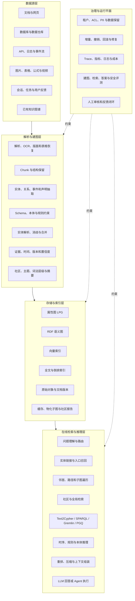
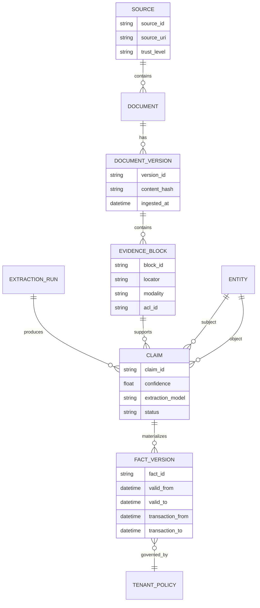
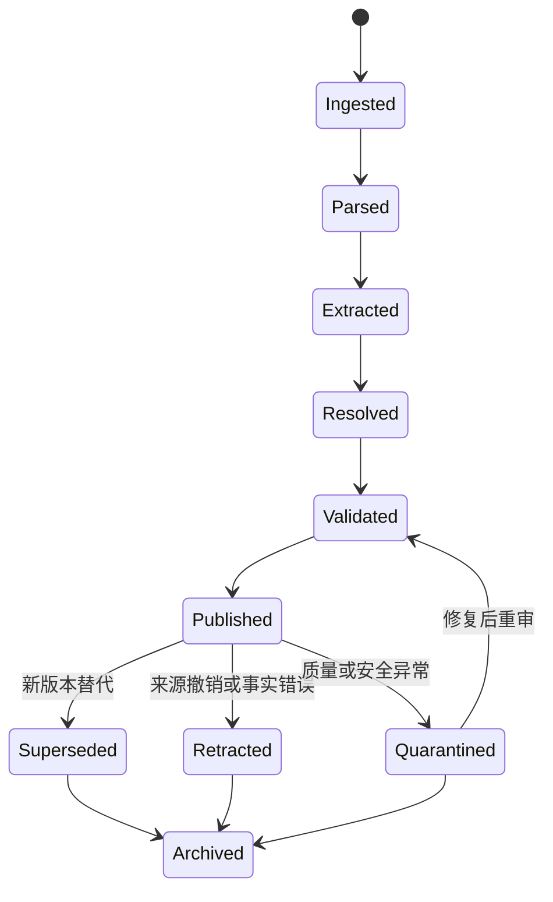
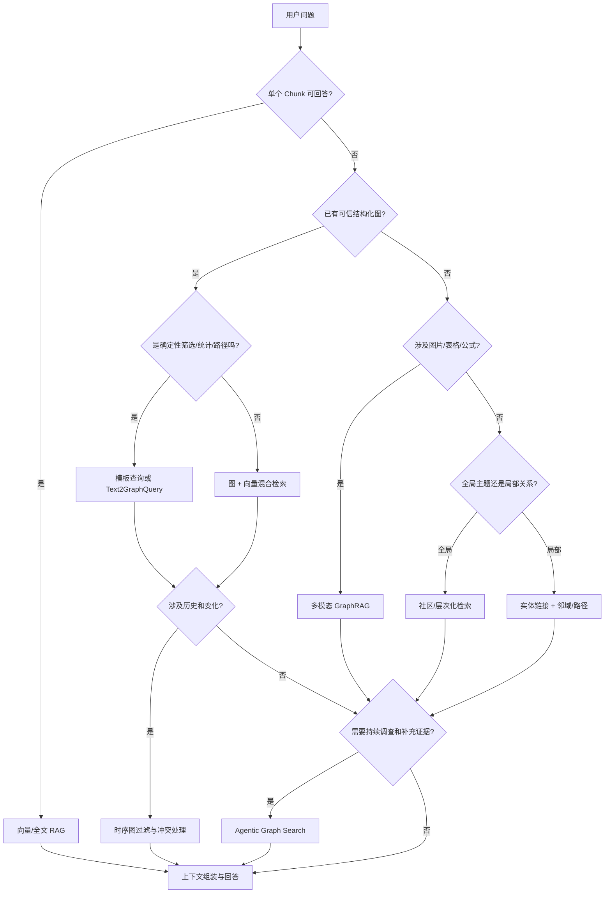

# 附录 K 主流 LLM 图谱系统全景

> LLM 图谱系统(GraphRAG、KAG、KGQA/BYOKG、Agent Graph Memory、多模态与 Agentic GraphRAG、数据库原生方案)的横向全景速查:七条技术路线、同类产品对比、关键子系统设计、增量与时序治理、查询安全、评测体系、成本容量与选型方法。与正文的分工:向量检索基础设施见第 15 章,Agent 会话状态与 RAG 的运行时视角见第 28 章;本附录是检索增强方向的图谱路线专题地图。
>
> 数据口径日期:2026-09。表格中的"支持"指产品公开提供该能力,不代表效果、成熟度或性能优劣;框架能力与接口变化很快,以官方文档与实测为准;引用前先查[勘误与更新](../ERRATA.md)。

## 1. 结论先行

“LLM 图谱”不是一个单一产品类别，而是以下多条技术路线的统称：

1. **文档自动建图型 GraphRAG**：从文档抽取实体、关系、声明和社区，用图结构增强检索。
2. **已有知识图谱问答型 KGQA / BYOKG**：直接查询企业已有属性图或 RDF 图，常配合 Text2Cypher、Text2Gremlin、Text2SPARQL、Text2PGQ。
3. **领域本体与逻辑推理型 KAG**：通过 Schema、本体、规则和逻辑形式约束检索及推理。
4. **时序化 Agent Graph Memory**：持续接收会话和事件，维护事实的生效、失效、冲突与演化。
5. **多模态 GraphRAG**：把文本、图片、表格、公式、版面和其他模态组织为跨模态知识图。
6. **Agentic GraphRAG**：由 Agent 动态规划图查询、路径探索、证据核验和补充检索。
7. **数据库原生与云托管 GraphRAG**：由图数据库或云平台统一提供图、向量、全文、模型和治理能力。

对多数企业而言，合理的默认架构不是“用图替换向量”，而是：

```text
向量检索负责发现语义入口
+ 全文检索负责精确词项
+ 图检索负责关系扩展和多跳路径
+ 结构化查询负责确定性筛选与统计
+ 原始文档负责最终证据和引用
+ 查询路由负责控制成本
```

产品选型前必须先回答四个问题：

- 图是**从文档自动生成**，还是企业已经有一张可信知识图？
- 主要问题是**局部实体关系、全局主题总结、确定性查询、规则推理、时序记忆**，还是多种问题并存？
- 知识是批量更新，还是需要实时增量、撤销、回溯和跨会话演化？
- 需要的是一个 Python 检索框架、一套图数据库、一个企业语义平台，还是全托管云服务？

---

## 2. 概念边界：这些“图”不是一回事

| 概念 | 核心对象 | 图的来源 | 主要目标 | 代表方案 |
|---|---|---|---|---|
| Vector RAG | Chunk、Embedding | 文档切分与向量化 | 语义相似召回 | 各类向量数据库与 RAG 框架 |
| 文档 GraphRAG | 实体、关系、Chunk、社区 | 从非结构化文档自动抽取 | 跨文档关系、多跳检索、全局主题 | Microsoft GraphRAG、LightRAG |
| KGQA / BYOKG | 企业已有节点、边、属性 | 业务数据库、主数据、人工建模 | 对可信结构化图进行问答 | AWS BYOKG-RAG、Neo4j Text2Cypher |
| KAG | 概念、本体、事实、规则、逻辑形式 | 领域知识工程 + 文本知识 | 专业语义对齐和规则推理 | OpenSPG/KAG |
| Agent Graph Memory | 用户、会话、任务、事件、偏好、时间 | 持续会话和业务事件 | 长期记忆、事实演化、个性化 | Graphiti、Zep、Cognee、Mem0 Platform |
| Multimodal GraphRAG | 文本、图片、表格、公式、版面元素 | 多模态文档解析 | 跨模态关系与证据检索 | RAG-Anything |
| Agentic GraphRAG | 查询计划、工具调用、证据与子图 | Agent 运行时动态生成 | 迭代探索、核验与行动 | TigerGraph GraphRAG v2、各类自建 Graph Agent |
| Graph-of-Thought | 推理步骤、候选结论 | 模型内部或外部推理编排 | 搜索更优推理路径 | 研究型推理方法 |
| LangGraph 工作流图 | 状态节点和执行边 | 应用工作流定义 | Agent 编排与状态机 | LangGraph |
| GNN 计算图 | 特征、消息传递和梯度 | 机器学习模型 | 图表示学习、分类、预测 | PyG、DGL、cuGraph 生态 |

本文主要讨论前七类，不把工作流图、模型计算图或纯 Graph-of-Thought 当作知识图谱系统。

---

## 3. LLM 图谱系统总体架构



一个生产系统通常包含四张逻辑图，而不只是一张实体关系图：

1. **领域知识图**：实体、关系、事件、规则和业务状态。
2. **证据来源图**：文档、版本、章节、Chunk、句子、表格单元格、图片区域和抽取记录。
3. **时序变更图**：事实生效、失效、修订、冲突和审计历史。
4. **运行治理图**：租户、权限、策略、模型运行、质量状态和修复任务。

---

## 4. 七条主流技术路线

### 4.1 路线总表

| 路线 | 建图方式 | 典型检索 | 主要优势 | 主要代价 | 代表方案 |
|---|---|---|---|---|---|
| 社区层次化 GraphRAG | 抽取实体关系后做社区检测和摘要 | Local、Global、DRIFT、社区 Map-Reduce | 擅长全语料主题、跨文档关系和宏观总结 | 初始索引和社区摘要成本高 | Microsoft GraphRAG、ArangoDB GraphRAG |
| 实体关系双层 GraphRAG | 实体关系图 + Chunk/向量索引 | Local、Global、Hybrid | 工程轻量，兼顾语义和关系召回 | 图质量依赖抽取、消歧与合并 | LightRAG、FastGraphRAG |
| 层次化词法图 | 词、短语、主题、Chunk 和文档形成层级 | 词法入口 + 图扩展 + 组合问答 | 不必预先拥有完整领域本体，适合多跳文本检索 | 语义粒度与领域实体图不同 | AWS GraphRAG Toolkit Lexical Graph |
| BYOKG / KGQA | 使用已有业务图或语义图 | Text2Query、模板查询、路径查询 | 可利用可信结构化数据，回答确定性问题 | 依赖图 Schema、查询治理和数据质量 | Neo4j、AWS BYOKG-RAG、Stardog、GraphDB、Oracle |
| 本体与逻辑推理 KAG | 领域模型、规则、事实和文本互相索引 | 逻辑形式、符号推理、混合检索 | 专业术语对齐和规则推理能力强 | 前期知识工程和专家投入大 | OpenSPG/KAG、Stardog、RDF 平台 |
| 时序上下文图 | 持续写入会话和事件，维护有效时间 | 时间过滤、事实演化、混合图检索 | 适合跨会话记忆和动态事实 | 冲突、撤销、隐私和记忆污染复杂 | Graphiti、Zep、Mem0 Platform |
| 多模态 GraphRAG | 解析文本、图像、表格、公式和版面关系 | 跨模态混合检索、VLM 回答 | 保留技术文档和报告中的非文本信息 | 解析、存储、引用和评测成本更高 | RAG-Anything、LightRAG 多模态集成 |
| Agentic GraphRAG | Agent 动态规划并调用图工具 | 计划—查询—核验—补充—停止 | 适合调查、根因分析和开放式任务 | 延迟、循环、查询安全和成本更难控制 | TigerGraph GraphRAG v2、自建 Graph Agent |

### 4.2 社区层次化 GraphRAG

典型流程：

```text
文档
→ Text Unit
→ 实体、关系和声明抽取
→ 图聚类与社区检测
→ 多层社区报告
→ Local / Global / DRIFT 查询
```

这一路线的核心不只是“多跳”，而是把大型语料压缩成多个层级的主题结构。局部问题从实体及其邻居取证；全局问题从社区报告聚合答案。它适合研究报告、历史资料、审计档案、舆情和跨文档主题发现。

需要注意：全局搜索通常比普通向量检索消耗更多 Token 和时间，不应作为所有问题的默认路径。

### 4.3 实体关系双层 GraphRAG

典型流程：

```text
Chunk 向量索引
+ 实体关系图
+ 实体/关系描述向量
→ 低层实体检索
→ 高层主题或关系检索
→ 图与文本混合上下文
```

它比完整社区摘要流水线更轻量，适合作为私有知识库和快速原型的起点。但“轻量”不等于无需治理：若实体解析和关系归一化不稳定，图会迅速形成重复节点、错误边和高噪声邻域。

### 4.4 词法图 Lexical Graph

词法图不必把所有知识都抽象成领域实体，而是建立如下层次：

```text
文档
→ 章节
→ Chunk
→ 主题
→ 关键词或词项
→ 跨文档关联
```

这种路线适合层次化文本和多跳检索，也可以与业务知识图并存。它避免把所有问题都转化为实体关系抽取问题，但在需要强领域语义和严格实体身份时，仍需补充领域图或本体。

### 4.5 BYOKG 与 Text2GraphQuery

当企业已经有供应链图、CMDB、组织图、客户主数据图、医学本体或合规知识图时，不应重新从文档生成一张低置信度图。更合理的链路是：

```text
自然语言问题
→ 意图、实体和约束识别
→ 选择查询模板或生成图查询
→ 查询校验和权限注入
→ 执行 Cypher / SPARQL / Gremlin / GQL / PGQ
→ 结果解释和证据引用
```

确定性统计、筛选和路径查询优先走结构化图查询；开放式解释再结合文档证据和向量检索。

### 4.6 KAG：本体、规则和逻辑形式

KAG 的重点不是把文本抽成三元组，而是让领域概念、事实、规则和文本片段互相对齐：

```text
问题
→ 领域概念映射
→ 逻辑形式或查询计划
→ 图知识、规则和文本混合检索
→ 多步推理
→ 证据核验
→ 答案
```

它更适合金融、法律、医疗、风控、工业运维等具有明确概念体系和规则的专业场景。代价是需要本体设计、规则维护、领域专家和更严格的知识发布流程。

### 4.7 时序上下文图

动态 Agent 记忆至少要区分：

- **事件时间**：事情实际发生的时间。
- **有效时间**：事实在现实世界中何时成立。
- **事务时间**：系统何时得知和保存该事实。
- **失效时间**：事实何时被替代、撤销或遗忘。

例如，“用户喜欢 Java”和“用户现在主要使用 Rust”不应被当作两个永远同时有效的无时间事实。记忆系统需要保留来源、时间、置信度和替代关系，查询时按当前状态或历史时点过滤。

### 4.8 多模态 GraphRAG

多模态知识图不应只把图片 OCR 成一段文本。它需要保留：

- 页面、区域和阅读顺序；
- 图片、图注和正文引用；
- 表格、行、列、单元格和表头层级；
- 公式、变量和定义；
- 图表数据、坐标轴、图例和结论；
- 跨模态实体及其证据关系。

推荐证据定位形式：

```text
DocumentVersion
  ├─ Page
  │   ├─ TextBlock
  │   ├─ FigureRegion
  │   ├─ TableRegion
  │   │   └─ Cell
  │   └─ EquationRegion
  └─ Extraction
      └─ Fact
```

### 4.9 Agentic GraphRAG

典型循环：

```text
理解任务
→ 生成检索计划
→ 解析实体
→ 选择图工具
→ 查询或路径探索
→ 检查证据缺口
→ 补充检索
→ 交叉验证
→ 生成带引用答案或执行动作
→ 满足停止条件
```

Agentic GraphRAG 必须设置硬约束：最大轮数、最大查询数、最大遍历节点数、查询超时、Token 预算、只读权限和证据充分度阈值。否则它会把一次检索问题扩展成不可控的长循环。

---

## 5. 同类产品对比

### 5.1 文档 GraphRAG 与构建框架

| 产品/项目 | 核心定位 | 建图方式 | 主要检索方式 | 默认或典型后端 | 增量能力 | 多模态 | 交付形态 | 最适合 | 主要约束 |
|---|---|---|---|---|---|---|---|---|---|
| **Microsoft GraphRAG** | 层次化文档知识发现参考实现 | LLM 抽取实体、关系、声明，社区检测与社区报告 | Basic、Local、Global、DRIFT | 表格化索引、向量索引；不强制事务型图数据库 | 提供 update 类索引流程 | 非核心 | Python/CLI | 大型报告、全局主题和跨文档分析 | 索引与 Global 查询成本较高；生产增量治理需扩展 |
| **LightRAG** | 轻量图与向量融合 RAG | 实体关系抽取，低层和高层键值/图结构 | Local、Global、Hybrid、Naive | 可替换 KV、向量和图存储 | 支持增量插入及相关维护能力 | 可通过 RAG-Anything 原生集成 | Python、Server、Web UI、REST API | 私有化知识库、快速原型、持续更新语料 | 实体合并、冲突和领域约束仍需加强 |
| **FastGraphRAG** | 轻量、可提示、可解释的图检索框架 | 动态生成和调整知识图 | PageRank 类图探索、混合检索 | 框架组件化存储 | 明确支持增量更新 | 非核心 | Python 库 | 低成本实验、需要可解释图探索的应用 | 生态和企业治理能力相对较小 |
| **Neo4j GraphRAG for Python** | Neo4j 原生 KG Builder 与 Retriever 工具包 | Schema、抽取器、实体解析、图写入流水线 | Vector、Full-text、Graph、Text2Cypher 等 | Neo4j / Aura | 可由应用和数据库事务实现 | 非核心 | Python 包 | 已采用 Neo4j、需要实时图查询和长期生产化 | 与 Neo4j 技术栈绑定；需要图建模与查询调优 |
| **FalkorDB GraphRAG-SDK** | 图数据库与 GraphRAG 一体化 SDK | Schema 引导抽取，可替换构建策略 | Vector、全文、Cypher、关系扩展 | FalkorDB | 支持按文档同步和更新 | 文本为主 | SDK、Server | 偏好 Cypher、希望一体化构建与检索 | 后端绑定；复杂知识治理需自行设计 |
| **LlamaIndex PropertyGraphIndex** | 属性图构建和检索编排抽象 | 开放或严格 Schema 抽取、隐式边和自定义转换 | 关键词、向量、同义词、Text2Cypher、自定义 Retriever | 多种 PropertyGraphStore | 取决于后端和应用实现 | 取决于外部解析器 | Python 框架组件 | 希望自由组合抽取器、图存储和检索器 | 不是完整产品；权限、运维、修复和 UI 需自建 |
| **LangChain Graph RAG 生态** | Retriever、Graph QA 和 Agent 编排集成层 | 可通过 LLMGraphTransformer 或数据库集成构图 | GraphRetriever、GraphCypherQA、Provider 专用图 QA、Agent Tool | 多种向量库和图数据库 | 取决于后端和应用 | 取决于外部解析器 | Python/JavaScript 组件 | 已使用 LangChain，希望把图检索接入现有 Agent/RAG | 不是权威图存储或完整 GraphRAG 控制面；具体能力分散在独立包和 Provider 集成 |
| **AWS GraphRAG Toolkit** | 层次化词法图与 BYOKG 工具集 | Lexical Graph 自动构建，或接入已有 KG | 词法图组合检索、BYOKG 问答 | Neptune、OpenSearch 及适配后端 | 取决于流水线与后端 | 非核心 | Python 工具集 | AWS 技术栈、词法图、多跳文本检索、已有 KG | 需要自行组装基础设施；不是一键托管服务 |
| **RAG-Anything** | 基于 LightRAG 的多模态 RAG | 文本、图片、表格、公式的跨模态知识图 | 文本与多模态混合检索、VLM 增强查询 | 沿用 LightRAG 生态 | 继承底层增量机制 | **核心能力** | Python 框架 | 论文、财报、技术手册和复杂版面文档 | 解析和 VLM 成本更高；多模态引用评测更复杂 |

**官方资料**：Microsoft GraphRAG[^ms-graphrag]、LightRAG[^lightrag]、FastGraphRAG[^fast-graphrag]、Neo4j GraphRAG[^neo4j-graphrag]、FalkorDB GraphRAG-SDK[^falkor-sdk]、LlamaIndex PropertyGraphIndex[^llama-pgi]、LangChain Graph RAG[^langchain-graphrag]、AWS GraphRAG Toolkit[^aws-toolkit]、RAG-Anything[^rag-anything]。

#### 5.1.1 框架能力矩阵

图例：**●** 表示公开文档中的核心或原生能力；**◐** 表示可通过扩展、后端或配套项目实现；**—** 表示不是该项目的主要能力。该矩阵不表示质量排名。

| 项目 | 自动文档建图 | 已有 KG | 全局主题 | 图路径/多跳 | Text2Query | 增量更新 | 多模态 | 本体/规则 | Agent/MCP | 托管服务 |
|---|---:|---:|---:|---:|---:|---:|---:|---:|---:|---:|
| Microsoft GraphRAG | ● | — | ● | ◐ | — | ● | — | ◐ | — | — |
| LightRAG | ● | ◐ | ● | ● | — | ● | ◐ | ◐ | ◐ | — |
| FastGraphRAG | ● | ◐ | ◐ | ● | — | ● | — | ◐ | ◐ | — |
| Neo4j GraphRAG | ● | ● | ◐ | ● | ● | ● | ◐ | ◐ | ● | ◐ Aura |
| FalkorDB GraphRAG-SDK | ● | ● | ◐ | ● | ● | ● | ◐ | ● Schema | ◐ | ◐ |
| LlamaIndex PropertyGraphIndex | ● | ● | ◐ | ● | ● | ◐ | ◐ | ● Schema | ● | — |
| LangChain Graph RAG 生态 | ◐ | ● | ◐ | ● | ● | ◐ | ◐ | ◐ | ● | — |
| AWS GraphRAG Toolkit | ● Lexical | ● | ◐ | ● | ◐ | ◐ | — | ◐ | ● MCP 生态 | — |
| RAG-Anything | ● | ◐ | ● | ● | — | ◐ | ● | ◐ | ◐ | — |

#### 5.1.2 LangChain 与 LlamaIndex 的正确定位

LangChain 和 LlamaIndex 更接近**应用编排与集成层**，而不是图数据库或知识权威层：

- LangChain 的 GraphRetriever 可在已有向量存储的元数据链接上执行图式遍历；Neo4j、Neptune、Memgraph、FalkorDB 等集成可提供自然语言图问答和图查询链。
- LlamaIndex PropertyGraphIndex 负责协调抽取器、PropertyGraphStore、向量上下文、关键词检索和 Text2Cypher 等组件。
- 两者都能显著降低 POC 代码量，但不会自动解决实体主数据、事实审批、删除一致性、租户隔离、备份恢复和图谱质量运营。
- 生产架构中，应把它们放在 Retriever/Agent 层，把图数据库、语义平台或自建知识服务作为权威数据层。

---

### 5.2 图数据库原生 GraphRAG 产品

| 产品 | 数据模型与查询 | 图、向量、搜索组合 | GraphRAG / AI 工具链 | 运行特征 | 最适合 | 主要关注点 |
|---|---|---|---|---|---|---|
| **Neo4j** | 属性图，Cypher | 原生图查询、向量和全文索引，可结合 GDS | 官方 GraphRAG Python、KG Builder、Retriever、Text2Cypher | 成熟生态，支持自托管和 Aura | 企业关系数据、实时路径、多跳检索、图分析 | 需要良好 Schema、索引和 Cypher 治理；社区与企业能力边界需按版本确认 |
| **ArangoDB / Arango Agentic AI Suite** | 多模型：文档、图、搜索，AQL | 在单一平台组合图、向量、文档与搜索 | Importer、Retriever、Web UI、社区构建与摘要 | API + 无代码界面，适合多模型数据 | 希望减少多数据库拼接的企业知识应用 | 产品版本和许可形态需要在采购时核对 |
| **FalkorDB** | 属性图，Cypher | 图、全文、向量和关系扩展 | GraphRAG-SDK、可替换构建/检索策略 | 偏实时和轻量部署 | Cypher 技术栈、较轻的一体化 GraphRAG | 平台生态和企业治理覆盖面小于大型综合图平台 |
| **TigerGraph** | 分布式属性图，GSQL 等 | 大规模图分析与向量能力 | GraphRAG、KG Builder、自然语言问答；v2 引入 Agentic Chat、MCP 和结构感知切分 | 强调大图和并行遍历 | 风控、供应链、电信、网络等大规模关系分析 | 建模、部署和运维复杂度较高；产品化能力与版本绑定 |
| **Apache HugeGraph + HugeGraph-AI** | 分布式属性图，Gremlin/Cypher | 图查询、向量模型和图算法 | GraphRAG、Text2Gremlin、自动建图、Graph Agent | 开源、适合国内生态和二次开发 | 希望开源自托管、Gremlin 和图算法协同 | 需要自行承担完整平台工程、HA、治理和体验建设 |
| **NebulaGraph Fusion GraphRAG** | 分布式属性图，nGQL | 图关系与原生向量混合查询 | Fusion GraphRAG、KG Builder 和 AI 应用平台方向 | 面向大规模、实时关系数据 | 大型企业关系图、知识融合、根因和风控 | 不同版本/发行形态的向量和 AI 能力需单独核对 |
| **Memgraph** | 内存优先属性图，Cypher | 图算法、向量搜索、实时更新 | GraphRAG 指南与 Atomic GraphRAG Pipelines | 低延迟、流式和实时图处理 | 实时事件图、动态推荐和低延迟图问答 | 容量、持久化和集群方案需按工作负载评估 |
| **Amazon Neptune / Neptune Analytics** | 属性图与 RDF 能力，Gremlin/SPARQL/openCypher 等按服务区分 | 图分析与向量搜索协同 | AWS GraphRAG Toolkit、Bedrock Knowledge Bases GraphRAG | 云托管，和 AWS 数据及模型服务集成 | AWS 原生、托管大规模图分析与 GraphRAG | 区域、服务边界、成本和供应商绑定 |

**官方资料**：ArangoDB GraphRAG[^arangodb-graphrag]、TigerGraph GraphRAG[^tigergraph-graphrag]、HugeGraph-AI[^hugegraph-ai]、NebulaGraph Fusion GraphRAG[^nebula-fusion]、Memgraph GraphRAG[^memgraph-graphrag]。

#### 5.2.1 数据库选型视角

| 决策条件 | 更匹配的方向 |
|---|---|
| 已经有大量 Cypher 资产和图团队 | Neo4j、FalkorDB、Memgraph |
| 需要图、文档、搜索和向量统一在一个多模型平台 | ArangoDB |
| 需要大规模并行遍历和企业级图分析 | TigerGraph、NebulaGraph |
| 偏好 Gremlin、开源和国内二次开发 | Apache HugeGraph |
| 需要实时流式图和低延迟查询 | Memgraph |
| 全部基础设施位于 AWS，优先托管 | Amazon Neptune / Neptune Analytics |
| 只需要嵌入式、小规模本地图 | SQLite 节点边表、应用层遍历或轻量 Sidecar；不必直接引入分布式图数据库 |

---

### 5.3 语义知识图谱、RDF 与 KAG 产品

| 产品/项目 | 知识模型 | 查询与推理 | LLM / Agent 能力 | 数据联邦 | 部署形态 | 最适合 | 主要限制 |
|---|---|---|---|---|---|---|---|
| **OpenSPG / KAG** | 领域 Schema、概念、事实、规则及文本互索引 | 逻辑形式引导、符号与文本混合推理 | KAG 问答和专业领域推理 | 取决于集成 | 开源自托管 | 金融、法律、医疗、风控和工业知识 | 知识工程成本高，需要领域专家参与 |
| **Stardog Voicebox** | RDF/语义知识图与企业数据映射 | SPARQL、推理、虚拟图与查询计划 | 自然语言映射本体、生成 SPARQL、结果解释；支持 Agentic 架构 | **核心能力** | Stardog Cloud 或本地 | 企业语义层、跨源数据、不搬迁数据的实时问答 | 商业产品；本体和映射质量决定效果 |
| **GraphDB Talk to Your Graph** | RDF、OWL/规则推理 | SPARQL、全文、相似度和连接器检索 | 可配置 Agent，自然语言问答并展示所用查询 | 可结合连接器 | 自托管/商业版本 | 已有 RDF、SPARQL 和语义推理资产 | GraphDB 11.5 官方文档仍将 Talk to Your Graph 标记为实验性 |
| **RDFox** | RDF 三元组与规则 | SPARQL、高性能增量推理 | 通常通过外部 LLM/Agent 集成 | 可通过数据接入构建 | 商业/本地 | 强规则推理、实时语义推断 | 不是开箱即用的 GraphRAG 应用层产品 |
| **Apache Jena / Fuseki** | RDF、OWL 等标准栈 | SPARQL、规则、RDF API | 需自行集成 LLM 和检索编排 | 可自建 | 开源自托管 | 标准化语义数据、研究和自研平台 | 缺少完整的 LLM 图谱产品体验和治理控制面 |

**官方资料**：OpenSPG/KAG[^openspg-kag]、Stardog Voicebox[^stardog-voicebox]、GraphDB Talk to Your Graph[^graphdb-talk]、Apache Jena[^jena]。

#### 5.3.1 LPG 与 RDF 的工程差异

| 维度 | LPG 属性图 | RDF 语义图 |
|---|---|---|
| 基本模型 | 带标签和属性的节点、边 | 主语—谓语—宾语三元组和全局 IRI |
| 常见查询 | Cypher、Gremlin、GSQL、nGQL、GQL/PGQ | SPARQL |
| Schema 风格 | 灵活、接近应用领域模型 | 本体、类层次、约束和语义标准更正式 |
| 推理方式 | 应用逻辑、图算法、数据库扩展 | RDFS、OWL、规则和语义推理引擎 |
| GraphRAG 开发体验 | 路径和邻居查询直接，开发者生态较强 | 适合已有本体、标准数据和跨组织互操作 |
| 典型场景 | 实时关系、推荐、风控、Agent Memory | 监管、医药、主数据、语义层和数据联邦 |

企业也可以采用双层模式：

```text
RDF / 语义图作为企业语义权威层
+ LPG 作为在线路径查询、事件关系和 Agent 上下文层
+ 统一实体 ID、证据与版本体系
```

---

### 5.4 Agent 图记忆与时序上下文产品

| 产品/项目 | 核心模型 | 时间与更新 | 检索方式 | 部署方式 | 图后端 | 最适合 | 关键区别或限制 |
|---|---|---|---|---|---|---|---|
| **Graphiti** | 实体、关系、事件和来源组成 Temporal Context Graph | 持续增量写入、事实失效、历史查询 | 向量、全文和图遍历混合 | 开源、自托管 | 自带适配的图数据库后端 | 自建 Agent 记忆、动态业务上下文 | 是框架，不是完整 SaaS 控制面；租户、审批和运维需补充 |
| **Zep** | 托管上下文图 | 面向持续会话和动态事实 | 托管混合检索与上下文组装 | SaaS/托管 | Zep 托管图引擎 | 希望直接使用托管 Context Engineering 服务 | 与 Graphiti 不是同一个交付物；供应商绑定和数据治理需评估 |
| **Cognee** | 图、向量和本体结合的 AI Memory | 支持记忆构建、更新、召回和遗忘流程 | 向量 + 图推理 + 语义结构 | 开源自托管，也有配套服务形态 | 依配置 | 多数据源长期记忆、知识处理流水线 | 需要评估各连接器、后端和企业功能的具体版本 |
| **Mem0 Platform Graph Memory** | 从 Memory 中提取实体，跨 Memory 建立关联图 | 平台自动构建和维护图，并结合时间推理 | 语义检索 + 实体图关联 + 多跳召回 | 托管平台 | 无需用户部署外部图数据库 | 快速接入个人化、客户和应用记忆 | 当前 Graph Memory 是 Platform 能力；不能把旧 OSS 外部图存储方案当作现状 |
| **HippoRAG 2** | 知识图、检索编码器和 PPR 类关联检索 | 面向知识更新和联想式检索研究 | Personalized PageRank、多跳关联 | 开源研究框架 | 研究实现 | 多跳问答、关联记忆和检索算法研究 | 不是具备租户、审批、遗忘、审计的完整记忆平台 |

**官方资料**：Graphiti[^graphiti]、Zep Context Graph[^zep-context]、Cognee[^cognee]、Mem0 Graph Memory[^mem0-graph]、Mem0 OSS v3 迁移说明[^mem0-oss]、HippoRAG[^hipporag]。

#### 5.4.1 Graphiti、Zep、Cognee、Mem0 如何选择

| 需求 | 优先考虑 |
|---|---|
| 需要开源时序图核心，并自行掌控图数据库 | Graphiti |
| 需要托管式 Context Graph，减少基础设施工作 | Zep |
| 需要更广义的数据处理、图+向量+本体记忆流水线 | Cognee |
| 已使用 Mem0 Platform，需要原生跨 Memory 实体关联 | Mem0 Platform Graph Memory |
| 研究 PPR、关联式长期记忆和多跳算法 | HippoRAG 2 |

---

### 5.5 云托管与云参考架构

| 方案 | 产品形态 | 图引擎 | 建图方式 | 在线检索 | 优势 | 当前主要约束 |
|---|---|---|---|---|---|---|
| **Amazon Bedrock Knowledge Bases GraphRAG + Neptune Analytics** | 全托管 GraphRAG 功能 | Neptune Analytics | 从 Knowledge Bases 摄取的文档自动识别实体、关系和结构元素 | 初始向量检索后执行图扩展 | AWS 原生、少量应用代码、托管运维 | 官方文档指出仅支持 S3 数据源、图构建不可定制、Neptune Analytics 图不支持自动扩缩等限制 |
| **Google Cloud Agent Platform + Spanner Graph** | 参考架构和可组合云服务 | Spanner Graph | Cloud Storage/Pub/Sub/Cloud Run + Gemini/LangChain 等自建 | 向量搜索 + 图查询 + Agent Runtime | 图、关系数据、搜索和云原生运行时协同 | 不是一键式 GraphRAG 产品；应用建图和检索逻辑由团队实现 |
| **Azure CosmosAIGraph** | 基于 Cosmos DB 的解决方案/参考实现 | Cosmos DB NoSQL、文档与向量能力组合 | 由解决方案构造 AI Knowledge Graph | 图关系与向量检索结合 | 适合 Azure/Cosmos 现有数据和应用生态 | 需区分“解决方案模式”与传统原生 LPG 图数据库产品 |
| **Oracle Select AI for Property Graphs** | 数据库原生自然语言图查询 | Oracle SQL Property Graph | 主要查询已有 SQL Property Graph；也有 LLM 抽取示例 | NL2PGQ / `GRAPH_TABLE`，执行后解释结果 | 适合已在 Oracle 中管理关系和图数据的企业 | 不是社区摘要型文档 GraphRAG；当前仅支持 SQL Property Graph，存在对象混用等限制 |
| **Neo4j Aura / TigerGraph Cloud 等** | 图数据库厂商托管服务 | 对应厂商图引擎 | 搭配其 GraphRAG SDK 或应用流水线 | 原生图、向量和查询工具 | 保留图数据库产品能力，同时降低数据库运维 | 建图、Agent、治理和模型成本仍由应用或附加产品负责 |

**官方资料**：Amazon Bedrock GraphRAG[^bedrock-graphrag]、Google Spanner Graph 参考架构[^gcp-spanner]、Azure CosmosAIGraph[^azure-cosmos]、Oracle Select AI for Property Graphs[^oracle-select-ai]。

---

### 5.6 研究算法、评测与加速组件

| 项目 | 类型 | 作用 | 是否可直接作为企业产品 |
|---|---|---|---|
| **HippoRAG 2** | 关联式检索算法/框架 | 用 PPR 和图结构增强多跳与长期记忆式检索 | 否，需要补齐平台治理 |
| **GraphRAG-Bench** | 评测基准 | 从图构建、知识检索、答案生成和推理连贯性评估 GraphRAG | 不是产品，是评测集和方法 |
| **NVIDIA cuGraph 等图加速组件** | 图计算加速 | 加速 PageRank、社区检测、路径和图算法 | 是底层组件，不提供完整 RAG 流程 |
| **LLMGraphTransformer 等抽取器** | 框架组件 | 将文本转换为节点和关系 | 只能覆盖建图的一部分 |
| **Graph Database MCP Server** | Agent 工具适配层 | 把实体解析、查询、路径和证据能力暴露给 Agent | 需要配套权限、审计和查询预算 |

GraphRAG-Bench 覆盖多学科、多种问题类型，并把评测从最终答案扩展到图构建、检索、生成和推理过程，可作为构建内部评测集的参考。[^graphrag-bench]

---

## 6. 跨产品能力总览

以下矩阵用于快速定位，不适合直接作为采购结论。

| 类别 | 代表产品 | 自动建图 | 已有 KG | 全局主题 | 确定性图查询 | 时序事实 | 多模态 | 规则/本体 | Agent 化 | 企业治理 |
|---|---|---:|---:|---:|---:|---:|---:|---:|---:|---:|
| 层次化文档 GraphRAG | Microsoft GraphRAG | ● | — | ● | — | — | — | ◐ | ◐ | ◐ 自建 |
| 轻量文档 GraphRAG | LightRAG / FastGraphRAG | ● | ◐ | ●/◐ | ◐ | — | ◐ | ◐ | ◐ | ◐ 自建 |
| 多模态 GraphRAG | RAG-Anything | ● | ◐ | ● | ◐ | — | ● | ◐ | ◐ | ◐ 自建 |
| 编排与集成层 | LangChain / LlamaIndex | ◐ | ● | ◐ | ● | 取决于后端 | 取决于解析器 | ◐ | ● | ◐ 自建 |
| 图数据库原生 | Neo4j / ArangoDB / FalkorDB | ● | ● | ◐ | ● | ◐ | ◐ | ◐ | ● | ●/◐ |
| 分布式企业图 | TigerGraph / NebulaGraph / HugeGraph | ●/◐ | ● | ◐ | ● | ◐ | ◐ | ◐ | ●/◐ | ●/◐ |
| KAG/语义平台 | OpenSPG/KAG / Stardog / GraphDB | ●/◐ | ● | ◐ | ● | ◐ | ◐ | ● | ●/◐ | ●/◐ |
| Agent 图记忆 | Graphiti / Zep / Cognee / Mem0 | ● | ◐ | — | ◐ | ● | ◐ | ◐ | ● | ●/◐ |
| 云托管 GraphRAG | Bedrock + Neptune | ● | ◐ | ◐ | ◐ | — | — | — | ●/◐ | ● |
| 云参考架构 | Spanner Graph / CosmosAIGraph | 自建 | ● | 自建 | ● | 自建 | 自建 | 自建 | ● | ● |

---

## 7. 关键子系统设计

### 7.1 数据解析与结构保留

建图前必须保留原始结构，否则后续只能给出弱引用。

建议最少保存：

```text
source_id
source_uri
content_hash
document_id
document_version
page_or_record_locator
section_path
block_id
chunk_id
char_start / char_end
parser_name / parser_version
parse_timestamp
security_label
tenant_id
```

对于表格和图片，再保存区域坐标、表头层级、行列索引、图注和相邻正文关系。

### 7.2 Schema 与本体策略

可采用三级模型：

1. **开放候选层**：允许 LLM 提议新实体和关系，但不进入权威图。
2. **受控业务层**：只允许白名单类型、属性和关系，执行约束校验。
3. **权威语义层**：经审核的核心概念、规则和主数据 ID。

不建议一开始设计数百种类型。首个生产版本可从 10～30 个核心实体类型、20～50 个核心关系类型开始，再根据评测结果演进。

### 7.3 知识抽取输出

每次抽取不应只返回三元组，至少包含：

```json
{
  "subject": {
    "mention": "原始提及",
    "canonical_name": "标准名称",
    "type": "实体类型",
    "external_ids": []
  },
  "predicate": "标准关系类型",
  "object": {
    "mention_or_value": "对象或字面量",
    "type": "实体或值类型"
  },
  "event_time": null,
  "valid_from": null,
  "valid_to": null,
  "polarity": "positive | negative",
  "modality": "asserted | possible | planned",
  "confidence": 0.0,
  "evidence_locator": "文档版本、页码和位置",
  "model_run_id": "抽取运行 ID"
}
```

### 7.4 实体解析与消歧

推荐流水线：

```text
文本规范化
→ 领域别名词典
→ 外部 ID / 主数据精确匹配
→ 名称与属性候选生成
→ 向量相似度
→ 邻域结构一致性
→ 时间和租户一致性
→ 规则或 LLM 复核
→ 自动合并 / 人工审核 / 保持分离
```

核心指标包括：错误合并率、漏合并率、重复实体率、跨租户误合并率和实体簇纯度。

### 7.5 证据与溯源模型



必须能从答案中的每条关键事实反向追溯到具体文档版本和证据区域。

### 7.6 专用领域图谱模型

LLM 图谱的 Schema 应围绕领域问题设计，而不是机械复用“实体—关系—实体”三元组。

| 专用图谱 | 典型节点 | 典型关系 | LLM/Agent 用法 |
|---|---|---|---|
| **代码知识图 Code Graph** | Repository、File、Symbol、Class、Function、Test、Commit、Issue | defines、calls、imports、implements、modifies、covers、fixes | 代码检索、影响分析、Bug 定位、变更计划和验证闭环 |
| **服务与可观测图** | Service、Instance、API、Trace、Deployment、Alert、Incident、Change | calls、depends_on、deployed_as、triggered_by、correlates_with | 根因分析、故障路径、变更关联和自动修复 |
| **安全攻击图** | Identity、Asset、Vulnerability、Permission、Credential、NetworkPath | can_access、exploits、assumes_role、connects_to | 攻击路径解释、风险优先级和安全调查 |
| **数据血缘图** | Dataset、Table、Column、Job、Model、Dashboard、Owner | reads、writes、derives、feeds、owned_by | 数据影响分析、指标解释和治理问答 |
| **身份与权限图** | User、Group、Role、Policy、Resource、Tenant | member_of、grants、denies、inherits | 授权解释、越权检测和最小权限建议 |
| **企业业务知识图** | Customer、Product、Supplier、Contract、Order、Risk、Policy | buys、supplies、governed_by、depends_on | 客户 360、供应链、合规和经营分析 |
| **科研与证据图** | Paper、Claim、Method、Dataset、Experiment、Result、Author | supports、contradicts、uses、extends | 文献综述、证据冲突、研究脉络和假设生成 |
| **用户上下文图** | User、Preference、Goal、Task、Conversation、Event | prefers、corrected、completed、changed_to | 个性化、跨会话记忆和长期任务延续 |

代码图尤其不能只依赖 LLM 抽取：AST、Tree-sitter、LSP、调用图、依赖图和版本控制记录应提供确定性结构，LLM 主要负责语义补充、意图映射和结果解释。

### 7.7 图算法层

GraphRAG 并不要求先训练 GNN。多数生产检索可以从确定性图算法开始：

| 算法类别 | 典型算法 | 在 LLM 图谱中的作用 | 主要风险 |
|---|---|---|---|
| 邻域扩展 | BFS、受约束 K-hop | 从入口实体获取局部子图 | 高出度节点导致噪声爆炸 |
| 路径搜索 | Shortest Path、K-Shortest Path、约束路径 | 构建依赖链、因果链和证据链 | 最短不等于最相关，需要语义和时间重排 |
| 相关性传播 | PageRank、Personalized PageRank | 从种子节点传播关联分数 | 对图结构、边权和枢纽节点敏感 |
| 社区检测 | Leiden、Louvain | 构建主题层级和全局摘要 | 增量变化会导致社区漂移 |
| 中心性分析 | Degree、Betweenness、Closeness | 识别关键实体、瓶颈和桥接节点 | 容易把数据偏差放大为“重要性” |
| 图相似性 | Common Neighbors、Jaccard、Node Embedding | 候选实体匹配、相似对象和推荐 | 相似不代表同一实体 |
| 链路预测 | 规则、Embedding、GNN | 提议潜在关系和缺失边 | 预测边只能进入候选图，不能直接成为事实 |
| 时序图算法 | 时间约束路径、时间衰减、事件序列 | 查询历史状态和事实演化 | 时间缺失或粒度不一致会误导结果 |

### 7.8 查询语言、标准与互操作

| 技术 | 面向模型 | 主要用途 | 在 LLM 图谱中的位置 |
|---|---|---|---|
| **Cypher / openCypher** | 属性图 | 模式匹配、路径和属性查询 | Neo4j、Memgraph、FalkorDB、Neptune 等生态的 Text2Cypher |
| **Gremlin** | 属性图遍历 | 命令式/函数式遍历 | HugeGraph、Neptune 等系统的图遍历与 Text2Gremlin |
| **SPARQL** | RDF | 三元组模式、联邦和语义查询 | Stardog、GraphDB、Jena、RDFox 的 Text2SPARQL |
| **ISO GQL** | 属性图 | 标准化创建、查询、维护和控制 | 属性图查询语言的长期互操作方向[^iso-gql] |
| **SQL/PGQ、GRAPH_TABLE** | SQL Property Graph | 在关系数据库中执行图模式匹配 | Oracle 等数据库原生图查询 |
| **GraphQL** | API 类型系统 | 客户端按字段获取 API 数据 | 名称含 Graph，但不是通用图数据库路径查询语言 |
| **MCP** | Agent 工具和上下文接口 | 向 LLM 客户端暴露图检索、查询和证据工具 | Agentic GraphRAG 的互操作层[^mcp-spec] |

---

## 8. 增量更新、删除和一致性

### 8.1 图谱生命周期



### 8.2 生产级更新规则

#### 文档与任务幂等

- `source_id + document_id + version + content_hash` 唯一。
- 抽取任务使用幂等键，重复消费不得创建重复实体和边。
- 模型、提示词、解析器和 Schema 版本必须进入运行记录。

#### 更新不是覆盖

新版本应：

1. 创建新的 DocumentVersion；
2. 生成新的 Claim；
3. 对比旧 Claim；
4. 保留、修订、替代或撤销旧 FactVersion；
5. 更新向量、全文、图和社区索引；
6. 保留完整审计记录。

#### 删除与撤销

删除源文档时不能简单删除所有关联实体。一个实体或事实可能被多个来源支持。需要：

- 证据引用计数或来源集合；
- 删除对应 Evidence 和 Claim；
- 当事实失去全部有效证据时，将其撤销或降级；
- 对孤立节点、关系和社区摘要执行清理；
- 触发受影响向量和物化子图失效。

#### 多存储一致性

图、向量、全文和对象存储难以放在同一事务中，可采用：

```text
权威元数据事务
+ Transactional Outbox
+ 异步索引事件
+ 幂等消费者
+ 对账任务
+ repair-required 状态
```

不应把“图写入成功但向量失败”静默当作成功。

#### 社区和摘要的局部重建

增量插入后不应默认全量重建全部社区。可根据受影响节点和边：

- 局部更新社区成员；
- 标记相关社区摘要过期；
- 延迟批量重算；
- 当结构变化超过阈值时再做全图聚类。

---

## 9. 时序与冲突治理

### 9.1 双时态事实模型

推荐事实记录：

```text
FactVersion {
  fact_id,
  subject_id,
  predicate,
  object_id_or_value,
  valid_from,
  valid_to,
  transaction_from,
  transaction_to,
  source_claim_ids,
  confidence,
  status,
  supersedes_fact_version_id
}
```

- `valid_*`：现实世界中事实成立的时间。
- `transaction_*`：系统数据库中该版本可见的时间。

这样既能回答“现在是什么”，也能回答“在 2025 年 6 月时系统认为是什么”。

### 9.2 冲突类型

| 冲突类型 | 示例 | 推荐处理 |
|---|---|---|
| 同时互斥 | 同一员工同时属于两个互斥岗位 | 根据主数据、来源优先级和人工审核决策 |
| 时间替代 | 用户过去用 Java，现在使用 Rust | 保留历史并关闭旧事实有效区间 |
| 来源分歧 | 两份报告给出不同收入值 | 并存 Claim，按来源可信度和日期解释冲突 |
| 语义歧义 | “Apple”是公司还是水果 | 实体链接分离，不强制合并 |
| 否定与肯定 | “未批准”与“已批准” | 保存 polarity、事件时间和证据，不丢失否定信息 |
| 计划与事实 | “计划上线”与“已经上线” | 使用 modality 区分 planned、asserted、possible |

---

## 10. 在线检索与查询路由

### 10.1 问题类型与检索方式

| 问题类型 | 首选路径 | 是否需要图 | 示例 |
|---|---|---:|---|
| 单文档简单事实 | 向量/全文 RAG | 通常否 | “安装命令是什么？” |
| 精确编号和专有名词 | 全文 + 元数据过滤 | 通常否 | “INC-1032 的状态是什么？” |
| 已知实体的关联信息 | 实体链接 + 邻域扩展 | 是 | “供应商 A 影响哪些产品？” |
| 两个实体之间的关系 | 路径搜索 | 是 | “客户 X 与故障 Y 如何关联？” |
| 多跳因果或依赖 | 子图检索 + 路径重排 | 是 | “哪个上游变更最终导致服务中断？” |
| 全语料主题和趋势 | 社区/层次化全局检索 | 是 | “过去一年事故的共同根因是什么？” |
| 确定性筛选、聚合和统计 | Text2Query 或模板图查询 | 已有图时是 | “受漏洞 V 影响且仍在线的服务数量？” |
| 专业规则与合规 | 本体 + 规则/KAG | 是 | “该交易是否违反当前规则？” |
| 历史状态和事实变化 | 时序图检索 | 是 | “用户偏好何时发生变化？” |
| 富文档问题 | 多模态检索 + 图 | 视问题而定 | “图 3 与表 5 的结论是否一致？” |
| 开放式调查 | Agentic Graph Search | 通常是 | “调查此次事故并给出证据链。” |

### 10.2 查询路由决策树



### 10.3 入口召回与图扩展

可靠链路通常是：

```text
关键词/全文精确召回
+ 实体向量召回
+ Chunk 向量召回
→ 实体链接和种子评分
→ 按关系白名单、时间、权限和跳数扩展
→ 路径/子图评分
→ 原文证据回填
→ 重排和压缩
```

图扩展必须有预算：

- 最大跳数；
- 最大节点和边数量；
- 允许的关系类型；
- 时间窗口；
- 每租户和每用户 ACL；
- 最大查询时间；
- 最大上下文 Token；
- 最低证据置信度。

### 10.4 上下文组装

不要把整个子图序列化后塞给模型。建议按以下结构组织：

```text
问题与任务约束

[结论候选 1]
- 图路径：A -> B -> C
- 事实：...
- 时间：...
- 证据：[S1][S2]
- 置信度与冲突：...

[结论候选 2]
...

[原始证据]
[S1] 文档、版本、页码、片段
[S2] 表格、单元格或图片区域
```

---

## 11. Text2Cypher、Text2SPARQL 与查询安全

LLM 生成结构化查询具有确定性强、可解释、可统计的优势，但也是重要风险入口。

### 11.1 安全执行链路

```text
自然语言
→ 查询意图分类
→ Schema 子集选择
→ 模板优先 / LLM 生成
→ 语法解析
→ AST 与策略校验
→ 自动注入 tenant / ACL / time 条件
→ EXPLAIN 或成本估算
→ 只读账户执行
→ 行数和时间限制
→ 结果校验
→ 自然语言解释
```

### 11.2 必须具备的控制

- 只允许只读语句；
- 禁止动态调用危险存储过程；
- 节点标签、边类型、属性和函数白名单；
- 最大变长路径长度；
- 禁止无界全图扫描；
- 查询超时、内存、结果行数和并发配额；
- 参数化查询，避免字符串拼接；
- 对生成查询保留审计日志；
- 返回答案时显示关键查询和证据，但隐藏敏感 Schema；
- 高风险查询转入人工确认或预定义模板。

在高安全场景中，推荐顺序为：

```text
预定义参数化模板
> 受约束的查询 DSL
> 经 AST 审核的 Text2Query
> 完全自由生成查询
```

---

## 12. Agentic GraphRAG 与 MCP 工具化

图谱能力适合封装为窄而安全的 Agent 工具，而不是只暴露一个“任意执行 Cypher”接口。

推荐工具集合：

| 工具 | 输入 | 输出 | 安全边界 |
|---|---|---|---|
| `resolve_entity` | 名称、类型、租户、时间 | 候选实体与置信度 | 限制可见实体和返回字段 |
| `search_evidence` | 查询、过滤条件 | 证据块及来源 | 强制 ACL、数量和 Token 限制 |
| `expand_neighbors` | 实体、关系白名单、跳数 | 局部子图 | 最大跳数、节点数和时间窗口 |
| `find_paths` | 起点、终点、允许关系 | 候选路径 | 禁止无界路径，限制路径数 |
| `query_graph_readonly` | 受约束查询 | 表格化结果 | AST 校验、只读、超时和配额 |
| `get_timeline` | 实体、事实类型、时间范围 | 事实版本时间线 | 隐私与历史数据保留策略 |
| `explain_fact` | fact_id | 来源、抽取运行和冲突信息 | 隐藏无权限来源 |
| `compare_claims` | 多个 claim_id | 冲突、可信度和差异 | 不替代人工高风险决策 |

MCP 可以作为把这些图工具暴露给不同 LLM 客户端和 Agent 运行时的标准接口；ISO/IEC 39075:2024 GQL 则为属性图数据管理和查询提供标准化方向。[^mcp-spec][^iso-gql]

Agent 调用图工具时还需要：

- 任务级预算和停止条件；
- 工具结果哈希和可重放 Trace；
- 防止来源文档中的提示注入影响工具参数；
- 对写操作使用独立审批和事务；
- 对同一问题避免重复查询和循环路径；
- 在证据不足时明确拒答，而不是继续无限探索。

---

## 13. 多租户、安全与合规

### 13.1 权限必须贯穿全部检索阶段

错误做法：先在全局图中召回和遍历，最后再过滤答案。

正确做法：

```text
入口向量/全文召回过滤
→ 种子实体权限过滤
→ 每一步图遍历过滤
→ 路径和子图过滤
→ 原文证据过滤
→ 上下文组装过滤
→ 输出脱敏和审计
```

图中的每个节点、边和证据块至少需要：

```text
tenant_id
workspace_id
acl_id
security_label
classification
retention_policy
source_owner
```

### 13.2 主要风险

| 风险 | 表现 | 控制措施 |
|---|---|---|
| 跨租户图泄漏 | 共享实体把两个租户的事实连在一起 | 租户隔离实体空间；合并时强制作用域；遍历注入租户条件 |
| 提示注入 | 文档内容诱导 Agent 调用危险工具 | 内容与指令分离；来源信任级别；工具参数策略校验 |
| 查询放大 | 变长路径或全图扫描消耗大量资源 | 跳数、节点数、时间、并发和成本预算 |
| 敏感 Schema 泄漏 | Text2Query 暴露内部标签或字段 | 只向模型提供最小 Schema 视图；字段别名和脱敏 |
| 错误实体合并 | 同名客户、员工或项目被合并 | 租户与主数据 ID 优先；高风险实体人工审核 |
| 被遗忘数据残留 | 文档删除后事实仍在图和缓存中 | 来源追踪、撤销流程、缓存失效和定期对账 |
| 模型抽取污染 | 低置信度关系进入权威图 | 候选图、规则校验、置信度阈值和审批 |
| Agent 写回破坏 | Agent 直接修改权威知识 | 写入提案与发布分离；审批、版本和回滚 |

---

## 14. 可观测性体系

### 14.1 建议 Trace 链路

```text
rag.request
├─ query.classify
├─ entity.resolve
├─ retrieval.vector
├─ retrieval.fulltext
├─ graph.seed.select
├─ graph.expand
│  ├─ graph.query.compile
│  ├─ graph.query.validate
│  └─ graph.query.execute
├─ path.rank
├─ evidence.fetch
├─ context.compress
├─ llm.generate
└─ citation.verify
```

离线链路：

```text
ingest.document
├─ parse.document
├─ split.document
├─ extract.entities
├─ extract.relations
├─ resolve.entities
├─ validate.schema
├─ write.claims
├─ materialize.facts
├─ index.vector
├─ index.fulltext
├─ graph.cluster
└─ community.summarize
```

### 14.2 指标分层

#### 建图指标

- 文档解析成功率；
- 每千 Token 抽取实体和关系数量；
- Schema 违规率；
- 实体候选合并率；
- 自动合并、人工审核和拒绝比例；
- 重复节点率、孤立节点率、异常高出度节点比例；
- 事实证据覆盖率；
- 增量任务延迟、失败率和积压量；
- 图、向量、全文索引不一致数量。

#### 检索指标

- 各路由使用率；
- Seed Recall@K；
- Evidence Recall@K；
- Path Recall、Path Precision；
- 子图节点/边数量；
- 平均跳数和路径长度；
- 上下文冗余率；
- 权限过滤丢弃比例；
- 图查询 P50/P95/P99 延迟；
- 查询超时和预算中止率。

#### 答案与成本指标

- 正确性、Faithfulness、完整性；
- 引用准确率和引用覆盖率；
- 冲突识别率和时序一致性；
- 无证据拒答率；
- 每次请求检索成本、LLM Token、图查询资源和总延迟；
- 相对 Vector RAG 基线的质量增益与成本增量。

---

## 15. 评测体系

### 15.1 八层评测模型

| 层级 | 核心问题 | 代表指标 |
|---|---|---|
| 文档解析 | 原始结构是否被正确恢复 | 页块顺序、表格结构、OCR、版面定位准确率 |
| 知识抽取 | 实体、关系、事件和属性是否正确 | Entity/Relation/Event Precision、Recall、F1 |
| 实体解析 | 同一实体是否合并、不同实体是否分开 | Pairwise F1、Cluster Purity、错误合并率 |
| 图结构 | 图是否完整、无异常和可检索 | 重复率、孤立率、Schema 违规、证据覆盖、连通性 |
| 检索与路径 | 是否找到回答所需的证据和关系 | Evidence Recall@K、Path Recall、Subgraph Precision |
| 生成与推理 | 是否严格依据证据得出结论 | Correctness、Faithfulness、Citation Accuracy、Reasoning Coherence |
| 时序与冲突 | 是否理解事实变化和来源分歧 | 时间点回答准确率、事实失效准确率、冲突识别率 |
| 安全与成本 | 是否越权、超预算或泄漏 | ACL 泄漏率、危险查询拦截率、延迟、Token、单位正确答案成本 |

### 15.2 测试集组成

内部测试集至少包含：

- 30% 简单事实问题，用于验证图方案不会显著劣化普通问题；
- 20% 实体关联和一跳问题；
- 20% 多跳路径和依赖问题；
- 10% 全局主题和趋势问题；
- 10% 时序、冲突和版本问题；
- 5% 无答案或证据不足问题；
- 5% 权限、提示注入和异常查询问题。

比例应按业务调整，而不是机械套用。

### 15.3 必须建立 Vector RAG 基线

同一数据集至少比较：

1. 全文检索；
2. Vector RAG；
3. Vector + Reranker；
4. GraphRAG；
5. GraphRAG + Vector + Full-text 混合；
6. 必要时增加 Text2Query 和 Agentic GraphRAG。

不能只比较最终准确率，还要比较：

```text
质量提升
÷
新增建图成本 + 在线延迟 + 运维复杂度 + 数据治理成本
```

GraphRAG-Bench 可用于研究和方法参考，但企业仍需建立包含自身 Schema、权限、时序和业务规则的测试集。[^graphrag-bench]

### 15.4 常用公开数据集的定位

| 数据集或基准 | 适合评什么 | 不能替代什么 |
|---|---|---|
| **GraphRAG-Bench** | 图构建、知识检索、生成和复杂领域推理 | 企业权限、实时更新和内部 Schema |
| **HotpotQA** | 跨文档多跳问答和支持证据 | 自动建图质量、实体解析和全局主题检索 |
| **2WikiMultiHopQA / MuSiQue** | 多跳组合、桥接实体和推理链 | 企业知识更新、查询安全和成本 |
| **LoCoMo / LongMemEval** | 长对话、跨会话记忆、时间与事实召回 | 通用文档 GraphRAG 和图数据库性能 |
| **DocVQA 类文档基准** | 表格、版面、图片和视觉问答 | 跨模态知识图的关系正确性 |
| **LDBC 等图数据库基准** | 图查询吞吐、路径和数据规模 | RAG 答案质量和 LLM 成本 |
| **企业自建黄金集** | 真实问题、Schema、ACL、时序、冲突和拒答 | 不可被任何公开数据集替代 |

公开数据集适合比较算法趋势；采购和上线结论必须以企业自建黄金集、真实流量回放和故障注入结果为准。

---

## 16. 成本、性能与容量规划

### 16.1 离线成本

主要来源：

- 文档解析和 OCR/VLM；
- 实体、关系、声明和事件抽取；
- 实体解析复核；
- Embedding；
- 社区检测和社区摘要；
- 多索引写入；
- 全量或局部重建；
- 人工审核。

粗略容量模型：

```text
总建图成本
≈ 文档解析成本
+ Chunk 数 × 抽取模型调用成本
+ 实体候选数 × 消歧成本
+ 向量数量 × Embedding 成本
+ 社区数量 × 摘要成本
+ 图/向量/全文存储与写入成本
```

### 16.2 在线成本

```text
在线成本
≈ 问题分类
+ 入口召回
+ 图查询与遍历
+ 重排和压缩
+ LLM 生成
+ Agent 多轮工具调用
```

最有效的优化往往不是更换图数据库，而是：

- 简单问题回退到普通 RAG；
- 用小模型或规则做实体抽取和路由；
- 优先查询模板，减少自由 Text2Query；
- 缩小传给模型的 Schema；
- 对高频实体、路径和社区报告缓存；
- 只重建受影响子图；
- 在图扩展前完成 ACL、时间和关系类型过滤；
- 对 Agent 设置硬预算和重复查询检测。

### 16.3 性能压测维度

- 图节点、边、Chunk 和向量规模；
- 平均与高分位节点出度；
- 路径长度和变长边范围；
- 并发查询数和写入速率；
- 热点实体和超大连通分量；
- 社区层级和摘要数量；
- 单租户与多租户隔离开销；
- 更新过程中查询一致性；
- 缓存命中与失效风暴；
- 图数据库故障、模型超时和索引滞后下的降级能力。

---

## 17. 什么时候不应该使用 GraphRAG

以下情况优先使用普通 Vector RAG、全文检索或关系数据库查询：

1. 大多数问题都能由单个 Chunk 直接回答。
2. 数据之间没有稳定、可复用的关系结构。
3. 语料很小，图构建和消歧成本高于收益。
4. 文档变化极快，但无法实现增量撤销和索引一致性。
5. 没有证据、权限和数据治理要求，却为了“架构先进”引入图数据库。
6. 主要问题是 SQL 聚合和报表，而不是关系路径和语义检索。
7. 团队没有能力维护 Schema、实体 ID、查询和图质量。
8. 多跳问题在真实业务问题中的占比很低。
9. GraphRAG 相比 Vector + Reranker 在内部基准上没有稳定质量增益。

Google Cloud 的 GraphRAG 参考架构也明确指出，当源数据缺少复杂相互关系时，普通 RAG 可能更适合。[^gcp-spanner]

---

## 18. 场景化选型建议

| 场景 | 首选方案 | 备选 | 选择理由 |
|---|---|---|---|
| 大量报告、论文、档案，需要全局主题总结 | Microsoft GraphRAG | ArangoDB GraphRAG | 社区层次和全局聚合是核心优势 |
| 快速搭建私有知识库，需要轻量增量 | LightRAG | FastGraphRAG | 轻量、图向量融合、便于自托管 |
| 富 PDF、财报、图片、表格和公式 | RAG-Anything | 自建多模态解析 + Neo4j/LightRAG | 多模态知识图和混合检索更匹配 |
| 已经有 Neo4j 和 Cypher 资产 | Neo4j GraphRAG | LlamaIndex PropertyGraphIndex | 直接复用图、索引、事务和查询生态 |
| 希望图、文档、向量和搜索统一平台 | ArangoDB | Neo4j + 外部对象/检索系统 | 降低多数据库组合复杂度 |
| 希望轻量 Cypher 图数据库与 SDK 一体化 | FalkorDB GraphRAG-SDK | Memgraph | 构建和混合检索集成紧密 |
| 大规模分布式企业关系图 | TigerGraph / NebulaGraph | HugeGraph | 强调分布式关系遍历和大图处理 |
| 开源、Gremlin、国内二次开发 | Apache HugeGraph-AI | NebulaGraph | 开源图基础设施和 AI 工具链 |
| 领域本体、规则和专业推理 | OpenSPG/KAG | Stardog、GraphDB | Schema、逻辑形式、规则和语义推理优先 |
| 已有 RDF、SPARQL 和数据联邦需求 | Stardog | GraphDB、RDFox/Jena 自建 | 语义层、联邦和本体能力更重要 |
| Agent 跨会话动态记忆 | Graphiti | Zep、Cognee、Mem0 Platform | 时序事实、持续增量和上下文图 |
| 希望托管 Agent Context Graph | Zep | Mem0 Platform | 降低图和记忆基础设施运维 |
| AWS 全托管知识库 | Bedrock KB GraphRAG + Neptune Analytics | AWS GraphRAG Toolkit 自建 | 与 S3、Bedrock、Neptune 深度集成 |
| Google Cloud 原生、自定义基础设施 | Spanner Graph 参考架构 | Neo4j Aura on GCP | 统一关系数据、图查询和 Agent Runtime |
| Oracle 数据库中已有 SQL Property Graph | Oracle Select AI | 自建 GraphRAG 层 | 直接进行 NL2PGQ 和数据库内查询 |
| 桌面端或本地优先、小规模图记忆 | SQLite 权威存储 + 本地图索引 | 轻量图 Sidecar | 降低安装、资源和跨平台运维复杂度 |

---

## 19. 五种参考架构

### 19.1 轻量文档 GraphRAG

```text
对象存储
→ Parser
→ LightRAG / FastGraphRAG
→ 可插拔图、向量、KV 后端
→ 查询路由
→ LLM
```

适合：团队小、文档型知识库、先验证 GraphRAG 增益。

### 19.2 企业属性图 GraphRAG

```text
业务数据库 + 文档 + 事件流
→ CDC / ETL / 文档抽取
→ 主数据与实体解析
→ Neo4j / ArangoDB / TigerGraph / NebulaGraph
→ 向量 + 全文 + 图查询
→ Retriever / Text2Query / Graph Agent
→ API 与业务应用
```

适合：已有关系数据、实时更新、多跳和路径查询、需要企业权限与运维。

### 19.3 企业语义层与 KAG

```text
领域本体 + 主数据 + 数据映射 + 文档
→ RDF/OpenSPG 语义层
→ 规则、推理、数据联邦
→ Text2SPARQL / 逻辑形式
→ 文本证据补充
→ 专业问答和决策支持
```

适合：监管、医药、金融、制造等专业语义和规则场景。

### 19.4 Agent 时序记忆

```text
会话 + 工具结果 + 用户反馈 + 业务事件
→ 记忆候选提取
→ 隐私和作用域过滤
→ 实体解析 + 时序事实图
→ Graphiti / Cognee / 托管平台
→ 检索、压缩和 Prompt 注入
→ Agent
```

适合：个人助理、客户服务、销售、Coding Agent 和长周期任务。

### 19.5 本地优先与边缘部署

```text
Markdown/SQLite 权威数据
+ 节点表、边表、事实版本表
+ SQLite FTS
+ 本地向量索引
+ 应用层受限图遍历
+ 后台修复与对账
```

适合：桌面端、隐私敏感、小规模图和离线运行。达到容量或查询复杂度边界后，再迁移到图数据库 Sidecar 或远程服务。

---

## 20. POC 与选型评分卡

### 20.1 POC 步骤

#### 阶段一：建立问题与基线

- 收集真实问题，不先从产品功能倒推需求；
- 标注简单事实、多跳、全局、时序、规则和权限问题；
- 建立全文、Vector RAG、Vector + Reranker 基线；
- 记录质量、成本和延迟。

#### 阶段二：验证最小图路线

- 只选择一个主路线：社区、实体关系、BYOKG、KAG、时序或多模态；
- 使用最小 Schema 和代表性数据；
- 实现事实到原始证据的追溯；
- 不要在首个 POC 同时引入多个图数据库和多个 Agent 框架。

#### 阶段三：验证生产难点

- 测试插入、修改、删除、撤销和回滚；
- 注入同名实体、冲突事实和错误关系；
- 测试租户和 ACL；
- 测试大出度节点、无界路径、查询超时和模型失败；
- 验证图、向量、全文索引的对账与修复。

#### 阶段四：比较总拥有成本

- 建图和更新的模型成本；
- 图数据库、向量、全文和对象存储成本；
- 人工审核与知识工程成本；
- 在线延迟与并发资源；
- 运维、升级、备份、容灾和供应商绑定；
- 相比基线的有效质量提升。

### 20.2 评分模板

| 维度 | 建议权重 | 评分要点 |
|---|---:|---|
| 业务问题匹配 | 15% | 是否真实提升多跳、全局、时序或规则问题 |
| 建图与数据质量 | 12% | 抽取、Schema、实体解析、证据和冲突治理 |
| 检索与推理 | 12% | 混合检索、路径、Text2Query、社区和规则能力 |
| 更新与一致性 | 10% | 增量、删除、撤销、版本、对账和修复 |
| 安全与多租户 | 12% | ACL 传播、查询安全、PII、审计和数据保留 |
| 可观测与评测 | 8% | Trace、指标、评测集、路径和引用解释 |
| 性能与扩展性 | 10% | 数据规模、并发、延迟、流式更新和高可用 |
| 开发与生态 | 8% | SDK、查询语言、框架、社区、人才和集成 |
| 部署与运维 | 6% | 云、本地、边缘、升级、备份和容灾 |
| 成本与锁定 | 7% | 模型、存储、计算、许可、人工和迁移成本 |

每项按 1～5 分评分，并记录证据。不要仅按厂商功能清单打分，必须使用内部 POC 数据。

---

## 21. 常见架构误区

### 21.1 把 LLM 抽取结果直接当作权威事实

LLM 输出只能是 Candidate Claim。需要证据、置信度、来源、模型版本、审核状态和发布流程。

### 21.2 用 GraphRAG 完全替代 Vector RAG

多数系统应保留普通 RAG 路径，并通过问题路由决定是否使用图。

### 21.3 只保存实体图，不保存证据图

没有证据图就无法可靠引用、删除来源、回溯版本、解释冲突或修复错误事实。

### 21.4 只实现插入，不实现修改和删除

演示系统通常“能建图”，生产系统的难点是数据变化后的撤销、一致性和局部重建。

### 21.5 忽视实体解析

错误合并会污染整个邻接网络，漏合并会破坏路径、社区和召回。实体解析往往比抽取提示词更决定最终质量。

### 21.6 不记录时间和模态

事实、计划、可能性、否定和历史状态必须区分；否则模型会把过期或尚未发生的信息当作当前事实。

### 21.7 让 LLM 任意执行图查询

自由 Text2Query 必须经过 Schema 最小化、AST 校验、只读执行、资源预算和权限注入。

### 21.8 查询完成后才做权限过滤

权限必须进入入口召回、实体链接、每步遍历、证据回填和上下文组装。

### 21.9 盲目扩大图遍历范围

跳数不是越大越好。大出度节点和多跳扩展会迅速引入噪声、延迟和 Token。

### 21.10 只测最终答案

答案错误可能来自解析、抽取、实体解析、图结构、入口召回、路径、上下文压缩或生成，必须分层诊断。

### 21.11 把研究算法当作完整企业平台

检索算法、Python 框架和数据库 SDK 通常不包含多租户、审批、审计、备份、修复、数据保留和运营控制面。

### 21.12 按“图规模”而不是“查询形态”选数据库

数据量大不自动意味着需要分布式图；关键还包括高分位出度、路径长度、查询并发、写入模式、实时性和容灾要求。

---

## 22. 发展趋势

### 22.1 图、向量、全文和关系数据持续融合

越来越多图数据库和多模型数据库在同一平台提供图遍历、向量召回、全文搜索和关系数据访问。未来的竞争重点会从“是否支持向量”转向混合查询计划、权限一致性、索引同步和成本优化。

### 22.2 从静态文档图转向时序 Context Graph

Agent 需要的是持续变化的上下文，而不是一次性离线生成的静态知识图。有效时间、事务时间、事实替代、记忆遗忘和隐私边界将成为基础能力。

### 22.3 多模态图成为技术文档默认路线

PDF 中的大量关键信息存在于表格、流程图、架构图和公式中。只抽取纯文本的 GraphRAG 将无法完整支撑财报、科研、制造和工程知识。

### 22.4 Agentic GraphRAG 与 MCP 工具化

图查询、路径分析、证据解释和时间线检索将以标准工具暴露给 Agent。重点将从“自然语言生成一条 Cypher”转向受预算控制的多工具计划和可审计执行。

### 22.5 Schema 约束和本体回归

完全开放式抽取适合探索，但难以长期维护。生产系统会更多采用受控 Schema、主数据 ID、规则验证和候选—审核—发布流程。

### 22.6 图谱质量运营成为独立子系统

未来系统需要可视化处理重复实体、冲突事实、异常高出度节点、失效证据、索引不一致和质量回归，而不是只提供图浏览器。

### 22.7 标准化增强互操作

ISO/IEC 39075:2024 GQL 为属性图查询和管理提供标准化基础；SPARQL 继续承担 RDF 查询；MCP 使图能力可以作为标准工具连接不同 Agent。[^iso-gql][^mcp-spec]

### 22.8 评测从回答正确率扩展到全链路

GraphRAG-Bench 等工作推动评测覆盖图构建、检索、生成和推理连贯性。企业评测还需要额外加入实体解析、时序、权限、删除一致性和单位成本。[^graphrag-bench]

---

## 23. 最终选型结论

不存在一个在所有场景都最优的“GraphRAG 产品”。更实用的选型规则是：

- **文档全局主题和社区总结**：Microsoft GraphRAG。
- **轻量、自托管和增量文档图**：LightRAG、FastGraphRAG。
- **复杂多模态文档**：RAG-Anything。
- **已有属性图和实时关系查询**：Neo4j、ArangoDB、FalkorDB、Memgraph。
- **大规模分布式关系图**：TigerGraph、NebulaGraph、HugeGraph。
- **已有企业 KG 的确定性问答**：BYOKG、Text2Cypher/Text2SPARQL/Text2PGQ 路线。
- **专业本体、规则和逻辑推理**：OpenSPG/KAG、Stardog、GraphDB 等语义平台。
- **Agent 跨会话时序记忆**：Graphiti、Zep、Cognee、Mem0 Platform。
- **AWS 全托管**：Bedrock Knowledge Bases GraphRAG + Neptune Analytics。
- **云原生自定义架构**：Spanner Graph、CosmosAIGraph、Oracle Property Graph 等现有数据平台路线。

对多数企业，推荐分阶段演进：

```text
阶段 1：全文 + Vector RAG 基线
阶段 2：为多跳问题增加实体图和证据图
阶段 3：增加查询路由、Text2Query、社区或时序能力
阶段 4：补齐增量撤销、权限、评测、可观测和修复控制面
阶段 5：仅在复杂调查任务中引入 Agentic GraphRAG
```

真正决定生产效果的通常不是“图数据库品牌”，而是：

> **实体身份是否稳定、每条事实能否追溯、时间与冲突是否被正确表示、更新删除是否一致、图遍历是否受权限和预算约束，以及 GraphRAG 是否在真实基准上优于更简单的 RAG。**

---

## 参考资料

[^ms-graphrag]: Microsoft GraphRAG 官方文档：<https://microsoft.github.io/graphrag/>
[^lightrag]: LightRAG 官方仓库：<https://github.com/HKUDS/LightRAG>
[^fast-graphrag]: FastGraphRAG 官方仓库：<https://github.com/circlemind-ai/fast-graphrag>
[^neo4j-graphrag]: Neo4j GraphRAG for Python 官方文档：<https://neo4j.com/docs/neo4j-graphrag-python/current/>
[^falkor-sdk]: FalkorDB GraphRAG-SDK 官方文档：<https://docs.falkordb.com/genai-tools/graphrag-sdk/>
[^llama-pgi]: LlamaIndex PropertyGraphIndex 官方文档：<https://developers.llamaindex.ai/python/framework/module_guides/indexing/lpg_index_guide/>
[^langchain-graphrag]: LangChain Graph RAG 官方集成文档：<https://docs.langchain.com/oss/python/integrations/retrievers/graph_rag>；Neo4j Cypher 集成：<https://docs.langchain.com/oss/python/integrations/graphs/neo4j_cypher>
[^aws-toolkit]: AWS GraphRAG Toolkit 官方仓库：<https://github.com/awslabs/graphrag-toolkit>
[^rag-anything]: RAG-Anything 官方仓库：<https://github.com/HKUDS/RAG-Anything>
[^arangodb-graphrag]: ArangoDB GraphRAG Technical Overview：<https://docs.arango.ai/agentic-ai-suite/graphrag/technical-overview/>
[^tigergraph-graphrag]: TigerGraph GraphRAG 官方仓库：<https://github.com/tigergraph/graphrag>
[^hugegraph-ai]: Apache HugeGraph-AI 官方文档：<https://hugegraph.apache.org/docs/quickstart/hugegraph-ai/>
[^nebula-fusion]: NebulaGraph Fusion GraphRAG 官方说明：<https://nebula-graph.io/solutions-fusion-graphrag>
[^memgraph-graphrag]: Memgraph GraphRAG 官方文档：<https://memgraph.com/docs/ai-ecosystem/graph-rag>
[^openspg-kag]: OpenSPG 官方仓库：<https://github.com/OpenSPG/openspg>；KAG 官方仓库：<https://github.com/OpenSPG/KAG>
[^stardog-voicebox]: Stardog Voicebox 官方文档：<https://docs.stardog.com/voicebox/>
[^graphdb-talk]: GraphDB Talk to Your Graph 官方文档：<https://graphdb.ontotext.com/documentation/11.5/talk-to-graph.html>
[^jena]: Apache Jena 官方文档：<https://jena.apache.org/documentation/>
[^graphiti]: Graphiti 官方仓库：<https://github.com/getzep/graphiti>
[^zep-context]: Zep Context Graph 官方文档：<https://help.getzep.com/graph-overview>
[^cognee]: Cognee 官方仓库：<https://github.com/topoteretes/cognee>
[^mem0-graph]: Mem0 Platform Graph Memory 官方文档：<https://docs.mem0.ai/platform/features/graph-memory>
[^mem0-oss]: Mem0 OSS v2→v3 迁移文档（Graph Memory Platform Only）：<https://docs.mem0.ai/migration/oss-v2-to-v3>
[^hipporag]: HippoRAG 官方仓库：<https://github.com/OSU-NLP-Group/HippoRAG>
[^bedrock-graphrag]: Amazon Bedrock Knowledge Bases GraphRAG 官方文档：<https://docs.aws.amazon.com/bedrock/latest/userguide/knowledge-base-build-graphs.html>
[^gcp-spanner]: Google Cloud Spanner Graph GraphRAG 参考架构：<https://docs.cloud.google.com/architecture/gen-ai-graphrag-spanner>
[^azure-cosmos]: Azure CosmosAIGraph 官方文档：<https://learn.microsoft.com/en-us/azure/cosmos-db/gen-ai/cosmos-ai-graph>
[^oracle-select-ai]: Oracle Select AI for Property Graphs 官方文档：<https://docs.oracle.com/en-us/iaas/autonomous-database-serverless/doc/select-ai-property-graphs.html>
[^graphrag-bench]: GraphRAG-Bench 论文：<https://arxiv.org/abs/2506.02404>；官方仓库：<https://github.com/GraphRAG-Bench/GraphRAG-Benchmark>
[^iso-gql]: ISO/IEC 39075:2024 Database languages — GQL：<https://www.iso.org/standard/76120.html>
[^mcp-spec]: Model Context Protocol 2026-07-28 Specification：<https://modelcontextprotocol.io/specification/2026-07-28>
